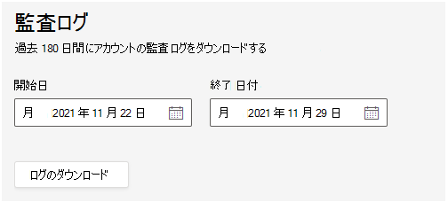

# MRT Pro Portal での監査ログ

MRT Pro Portal の監査ログを使用すると、ユーザーと管理者が実行したアクティビティの監査レコードを検索できます。 この機能は既定で有効になっています。 マネージド サービス管理者のみが、ログをエクスポートして表示する権限を持ちます。

> [!NOTE]
> MRT Pro Portal で実行されたアクションが Microsoft 365 またはOffice 365監査に記録されない 

## ログのエクスポート

監査ログ検索のすべての結果をエクスポートすると、統合監査ログの生データが、ローカル コンピューターにダウンロードされるコンマ区切り値 (CSV) ファイルにコピーされます。 

**ログをダウンロードするには** 

1. **[全般>監査ログ>設定]** に移動します。
1. 対象のログの日付範囲を定義するには、 **開始日** と終了日を入力 **します。**

   > [!NOTE]
   > ログは最大 180 日間のみ使用できます。

1. [**ログのダウンロード**] を選択します。

   

   ウィンドウの下部に表示されるメッセージで、CSV ファイルを開くか保存するかを確認するメッセージが表示されます。 

1. [**名前を付けて保存] を** > 選択し、CSV ファイルをローカル コンピューターに保存します。 

1. すべてのアクティビティを検索するとき、または広範な日付範囲で多くの検索結果をダウンロードするには、しばらく時間がかかります。 CSV ファイルのダウンロードが完了すると、ウィンドウの下部にメッセージが表示されます。

## 監査ログの詳細なプロパティ

次の表では、CSV に含まれるプロパティについて説明します。

|プロパティ|説明|
| - | - |
|activity.category|
アクションが実行されたオブジェクトのカテゴリ。 値の例は次のとおりです。

**ユーザー、割り当て、PartnerInvitation、ロール**
|
|activity.objectName|変更されたオブジェクトの名前。|
|activity.operation|実行された操作の種類。 指定できる値は、**作成、更新、削除です**。 |
|activity.resultStatus|
アクション ( **activity.operation** プロパティで指定) が成功したかどうかを示します。

値は **[成功] または [****失敗]** です。
|
|activity.tenantId|アクションが実行されたテナントの GUID|
|creationTime|ユーザーがアクティビティを実行したときの ISO 形式の協定世界時 (UTC) の日付と時刻。|
|user.userId|レコードがログに記録されたアクションを実行したユーザー。|
|user.userTenantId|アクションを実行したユーザーのテナントの GUID|

