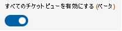

# パートナー向けマルチテナント顧客管理

Teams Rooms Managed (TRM) サービスのマルチテナント管理 (MTM) は、パートナー組織が独自のドメイン資格情報を使用して 1 つの場所で複数の顧客を管理するのに役立ちます。 パートナー ユーザーには、管理に割り当てられている顧客ルームだけが表示されます。 MTM テナント内の顧客ごとにカスタム ロールを適用して、パートナー組織が顧客のリソースに対するアクセス許可を細かく制御できます。 

MTM ポータルには、このリンク からアクセス [できます](https://partner.rooms.microsoft.com/)。

> [!Note] 
> パートナー組織は、MTM ポータルを使用して自分のルームを管理することはできません。 これらのルームは [、TRM ポータル で管理できます](https://portal.rooms.microsoft.com/)。 

## MTM エクスペリエンスを通じて顧客を管理するための前提条件

MTM ポータルにアクセスするには、TRM サービスの Elite パートナーとして組織をオンボードする必要があります。 Elite パートナーになるには、パートナーに連絡 askelite@microsoft.com。

## オンボーディングのお客様

TRM-MTM ポータルを使用して顧客を管理するには、顧客から送信された招待を通じて、パートナー組織のテナントと顧客の間にリレーションシップを確立する必要があります。 

### 顧客からの招待

パートナーは、顧客に割り当てられるプライマリ管理者になるユーザーのユーザー 原則名 (UPN) を提供します。 招待で識別されたユーザーだけが、TRM-MTM ポータルにログインするときに招待を表示して承諾できます。 

> [!Note]
> グローバル管理者などの管理者特権を持っている場合でも、明示的に追加しない限り、招待は表示されません。 

顧客への招待の詳細については、「顧客のマルチテナント [管理」を参照してください](multi-tenant-management-customer.md)。

**保留中の招待を受け入れるには**

1. 招待のユーザーの 1 人として TRM-MTM ポータルにログインします。
1. [顧客] に **移動します**。
1. 状態が "保留中" の招待状を選択します。
1. 招待の詳細を確認します。
1. [承諾 **] を** 選択して、パートナーと顧客の関係を確立します。

   [拒否 **] を選択** すると、ユーザーが拒否する招待が削除されます。 招待は、まだ行動していない他のユーザーに対して引き続き使用できます。

   > [!Note]
   > 招待は一意であり、ユーザーごとに独立しています。 最初に受け入れるユーザーは、パートナーと顧客テナントの間のリンクを確立します。 リンクを確立するユーザーとの永続的な関連付けはありません。 招待を受け入れる後続のユーザーは、プライマリ管理者として追加されます。

   > [!Note]
   > *パートナー ユーザーが誤って招待を拒否した場合は、その顧客のパートナー ロール (または他の RBAC ロール) に別のユーザーを追加する方が最適です。* 

招待を承諾すると、ユーザーは自動的にこの顧客のテナントのプライマリ管理者として追加されます。 

このテナントの構成を確認するには、[顧客] 一覧で顧客を **選択** します。

## オフボーディングのお客様

顧客をオフボードするには、[顧客] リストから顧客を削除する必要があります。

**顧客を削除するには** 

1. 削除する顧客のプライマリ管理者として TRM-MTM ポータルにログインします。
1. [顧客] に **移動します**。
1. 削除する顧客を選択します。
1. 顧客の詳細ウィンドウで、[顧客の削除] **を選択します**。
1. 確認 **プロンプトで [** 削除] を選択して、テナントと顧客テナント間の関連付けを終了します。

## パートナー ロールの管理

パートナー ロールを使用すると、追加の担当者に責任を委任できます。 これらのロールの概念は、「ロールベースのアクセス制御」で説明されているのと同じですが、各顧客のコンテキストで説明されています。 さらに、パートナー ロールは顧客のロールとは異なっている点に注意することが重要です。 パートナー ロールは、顧客が削除できます。 

プライマリ **管理者** ロールは、ボード上の各顧客に対する唯一の組み込みロールであり、TRM サービスに対するほぼすべてのアクセス許可 (顧客のコンテキスト) を持っています (表 1 を参照)。 パートナー** ロールのアクセス許可は、お客様が指定した部屋まで延長されます。 たとえば、顧客がグローバル組織であり、すべての米国の会議室を管理するパートナーを割り当てる場合、プライマリ管理者はそれらのルームのアクセス許可の管理と委任のみを実行できます。 パートナーは、顧客が他の国で持っている可能性がある他の部屋を表示する必要はありません。 

> [!Important]
> プライマリ管理者ロールには常に少なくとも **1 人のユーザーが必要** です。

**顧客のパートナー ロール **でユーザー** を管理するには**

1. [ロール]**設定 >移動します**。 
1. パートナー ロールを編集する顧客をドロップダウン リストから選択します。
1. 一覧 **から [プライマリ管理者** ] 組み込みロールを選択します。
1. [課題 **] を選択します。**
1. 一覧から [招待された管理者 **] を選択します。**
1. [メンバー] **を選択します。**
1. [編集の選択] **をクリックします。** 
1. 検索バーで、追加するユーザーまたはセキュリティ グループを検索します。
1. ユーザーまたはグループを選択します。
1. [保存] を **クリックして** 変更を確定します。

### 顧客のカスタム パートナー ロールの管理

パートナーは、運用要件に合わせてカスタム ロールを作成できます。 たとえば、インシデント管理アクセス許可のみを持つヘルプ デスク ロールを作成できます。 

**ロールを管理するには**

1. [ロール]**設定 >移動します**。 
1. パートナー ロールを編集する顧客をドロップダウンから選択します。
1. カスタム ロール [を作成します](microsoft-teams-rooms-premium-rbac.md#built-in-roles)。

|機能|権限|**MMR 管理者**|**サイト リード**|**サイト テクニカル**|**プライマリ管理者**|
| :- | :- | :- | :- | :- | :- |
|会議室|表示| &#10004;|&#10004;|&#10004;|&#10004;|
||変更|&#10004;|&#10004;|&#10004;|&#10004;|
||リセット キー|&#10004;||||
||ダウンロード キー|&#10004;|&#10004;|&#10004;||
||未登録|&#10004;|&#10004;|&#10004;||
||作成 |&#10004;|&#10004;|||
|グループの管理|表示|&#10004;|&#10004;||&#10004;|
||変更|&#10004;|&#10004;|||
||作成 |&#10004;|&#10004;|||
|リング管理の更新|表示|&#10004;|&#10004;||&#10004;|
||変更|&#10004;|&#10004;||&#10004;|
|レポート|表示|&#10004;|&#10004;||&#10004;|
||顧客インシデントの作成|&#10004;|&#10004;|&#10004;|&#10004;|
|チケット管理|表示|&#10004;|&#10004;|&#10004;|&#10004;|
||更新|&#10004;|&#10004;|&#10004;|&#10004;|
|MMR 設定|表示|&#10004;||||
||変更|&#10004;||||
|役割の管理|表示 |&#10004;|||&#10004;|
||変更|&#10004;|||&#10004;|

> [!Note]
> 顧客 A のプライマリ管理者として割り当てられたユーザーは、その顧客に対する TRM サービスの完全なアクセス許可を持っています。 顧客 A のユーザーのアクセス許可は、他の顧客に影響を与える必要はありません。

## セキュリティ

エンド カスタマーは、データへのアクセスを制御し、パートナーまたは特定のロールをいつでも完全に削除できます。

委任されたアクセス機能では、パートナーは TRM サービス ポータルの外部で他の権限を取得できません。 たとえば、この機能を使用してパートナーを招待して TRM サービスの会議室を管理すると、AAD または Teams 管理センター、その他の Microsoft 製品に対するアクセス許可は付与されません。 さらに、パートナーは、招待スコープで定義されていないルームを表示または変更するアクセス権を持つ必要があります。

パートナーと顧客の関係が確立されると(このドキュメントの「顧客のオンボード」で説明されているとおり)、パートナーは TRM サービスでルーム データを表示できます。 これには、TRM サービスに存在するが、他の Microsoft 製品から派生したデータが含まれます。 たとえば、TRM ポータルの通話品質レポートは、通話品質データTeams派生します。

データは顧客のテナントに存在し、パートナーのテナントにはコピーされません。 

MTM ポータルでは、AAD認証を使用して、パートナーのログイン資格情報を検証します。 現時点では、顧客の認証ポリシーはパートナーには適用されません。 たとえば、顧客が多要素認証ポリシーを持つ場合、パートナーに変換されるのではありません。

顧客は、パートナーアクティビティを含む TRM サービスの監査ログを取得できます。 「Teams [Rooms Managed service の監査ログ」を参照してください](multi-tenant-auditing.md)。

> [!Note]
> AAD監査と O365 監査では、TRM ポータルからログがキャプチャされません。

## MTM ポータル内を移動する

MTM ポータルには、顧客データ間を移動する 2 つの対話型モデルがあります。

- すべての顧客のデータが 1 つのリストに統合され、フィルター処理できる集計ビュー。

  > [!Note]
  > このビューは、[すべてのチケットを有効にする] ビューがオンに切り替えされている場合にのみ、[インシデント] ページでサポートされます。

  

 - ドロップダウン リストで選択した **顧客** からのデータだけが表示されるテナント切り替え。
