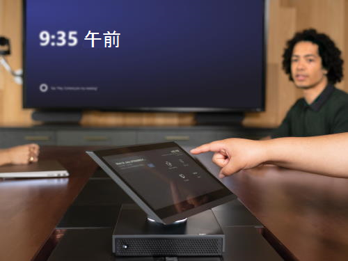

# Microsoft Teams Rooms を計画する

この記事では、全体的な会議および会議室戦略の一環として、Microsoft Teams Rooms を計画、提供、および運用に関するエンドツーエンドのアプローチを紹介します。

以下の計画情報では、推奨されるアプローチと、技術的な情報をサポートするためのリンクを含む、行う必要がある重要な決定について説明します。 既に完全にデプロイされている場合でも、計画、デプロイ、および管理の各セクションを確認することをお勧めします。

## Microsoft Teams Rooms の概要

Microsoft Teams Rooms は、HD ビデオ、オーディオ、およびコンテンツ共有を、小さな会議室から大きな会議室まで、あらゆる規模の会議に提供する完全な会議環境を提供します。

[Microsoft Teams Roomsヘルプ](https://support.office.com/article/Skype-Room-Systems-version-2-help-e667f40e-5aab-40c1-bd68-611fe0002ba2)は、Microsoft Teams Roomsの詳細と、デプロイの一部として価値を追加する方法を確認するのに役立つ優れたリソースです。

## Microsoft Teams Rooms のコンポーネント

Microsoft Teams Rooms には、優れたユーザー エクスペリエンスを実現するための主要なコンポーネントが含まれています。

- タッチスクリーン コンソール
- コンピューティング モジュール
- Microsoft Teams Rooms のアプリケーション
- 周辺機器 (カメラ、マイク、スピーカー)
- 外部画面 (最大 2 つ)
- HDMI 入力

これらのコンポーネントは、多数のベンダーからプリインストールされたバンドルとして購入できます。または、この記事に記載されている[要件](requirements.md)に従って、サポートされているコンポーネントを個別に購入できます。

## Teams Rooms ライセンス

Teams Rooms コンソール、Surface Hub、Teams パネルなどの各会議室デバイスには、Teams Rooms ライセンスが必要です。 Teams には、Teams Roomsの 2 つのライセンス (Microsoft Teams Rooms Pro と Microsoft Teams Rooms Basic) が用意されています。

Microsoft Teams Rooms Proは、会議室デバイスが 25 台以上ある組織や、最も包括的な会議とデバイス管理エクスペリエンスを求める組織に最適です。 ハイブリッド Teams の会議は、最前列、コンテンツ カメラ、AI 搭載のノイズ抑制などの機能や、Microsoft Teams Rooms Proで利用できるその他の機能により、より没入感が高くなります。 Teams Rooms管理者は、条件付きアクセス ポリシーの構成から、デバイスの正常性と会議の品質に関する豊富なテレメトリの分析まで、Teams 管理センターから認定されたすべてのTeams Rooms デバイスを一元的に管理できます。

Microsoft Teams Rooms Basic は、会議室デバイスが少数しかなく、基本的な会議と管理機能のみが必要な組織で使用できます。 Microsoft Teams Rooms Basic を使用すると、会議に参加したり、コンテンツやライブ ビデオを共有したり、直接ゲスト参加を使用して Zoom 会議や Webex 会議に参加したり、Teams 管理センターで基本的なデバイス インベントリと監視を実行したりできます。

会議室デバイスを使用するには、そのデバイスにライセンスを割り当てる必要があります。 詳細については、「[Microsoft Teams Rooms ライセンス](rooms-licensing.md)」を参照してください。

[!INCLUDE [mtr-user-licensing](../includes/mtr-user-licensing.md)]

| &nbsp;   |  &nbsp;   |
|-----------|------------|
|  判断ポイント|<ul><li>Microsoft Teams Rooms を組織に展開しますか? </li><li>Microsoft Teams Rooms システムをどのように調達しますか?</li></ul> |
|  次の手順 | <ul><li>展開全体を通して、主要な作業を引き受けるユーザーを特定します。</li><li>所有している (およびセットアップを計画している) 会議室を確認し、Microsoft Teams Rooms を展開する場所と、会議室の規模に適した周辺機器を把握します。</li></ul> |
| | |

## 展開全体を通して、主要な作業を引き受けるユーザーを特定する

次に示す方法を使用して、展開をガイドし、組織に必要に応じて提供されるサンプル出力をカスタマイズします。

まず、どのような会議室があるかを把握し、将来的にどのような会議室が最適かを想定してから、必要な機器の選択と調達、サイトの準備、サービスの設定と展開、変更とユーザー導入の管理、運用とメンテナンス手順の開発に進みます。

これらの作業は、複数のチームで調整する必要がある場合があります。 ここでは、実行すべき主な作業の概要を示します。また、会議室システムの展開と管理に通常携わるチームに対する提案も提供します。これにより、一緒に作業する相手を決定できます。

| タスク                       | タスクを引き受ける可能性があるユーザー           | 割り当て先 | このコンテンツへのリンク |
|----------------------------|----------------------------------------|-------------|-----------------------|
| 会議室のリスト化            | 施設 / AV チーム / IT プロジェクト チーム |             | [会議室のリスト化と機能の計画](#room-inventory-and-capability-planning) |
| 計画機能          | IT プロジェクト チーム                        |             | [会議室のリスト化と機能の計画](#room-inventory-and-capability-planning) |
| デバイスの選択           | IT プロジェクト チーム / AV チーム              |             | [デバイスの選択](#device-selection) |
| 調達                | IT プロジェクト チーム / AV チーム              |             | [調達](#procurement) |
| サイトの準備             | 施設 / AV チーム / IT プロジェクト チーム |             | [サービスの準備](rooms-deploy.md#site-readiness) |
| サービスの準備          | IT プロジェクト チーム                        |             | [サービスの準備](rooms-deploy.md#service-readiness) |
| 構成              | IT プロジェクト チーム                        |             | [構成および展開](rooms-deploy.md#configuration-and-deployment) |
| 展開                 | 施設 / AV チーム / IT プロジェクト チーム |             | [展開チェックリスト](console.md#microsoft-teams-rooms-deployment-checklist) |
| 導入                   | 施設 / AV チーム / IT プロジェクト チーム |             | [導入](#plan-for-adoption-and-change-management) |
| メンテナンスと操作 | AV チーム / IT プロジェクト チーム              |             | [管理の概要](rooms-manage.md) |

## 会議室のリスト化と機能の計画

最初の手順では、組織の既存の会議スペースと会議室をインベントリし、環境、部屋のサイズ、レイアウト、目的を把握します。 その後、インテリジェント カメラ、ホワイトボード、コンテンツ カメラなど、各ルームに必要な機能を特定できます。

既存の各部屋の機器と機能のリストを作成したら、その部屋の要件がデバイス選択計画に入力され、豊富な会議ソリューションが作成されます。 各部屋に必要なモダリティ (オーディオ、ビデオ) は、部屋の規模と目的に加えて、すべて各部屋に最適なソリューションを決定する際に重要な役割を果たします。

検出の一環として、部屋の音響とレイアウトを考慮することが重要です。 たとえば、部屋の椅子がカメラ ビューをブロックしないことを確認します。 部屋に過度のエコーやノイズの多い空調がなく、画面とMicrosoft Teams Roomsに十分な電力があることを確認します。 視聴覚 (AV) チームまたはパートナーがアドバイスできる要素は数多くあります。

| &nbsp;   | &nbsp;    |
|-----------|------------|
|  次の手順|<ul><li>対象の会議室を確認し、Microsoft Teams Rooms の構成を定義します。</li></ul>|

_会議のサンプルのリスト_

| サイト      | 会議室の名前 | 会議室の種類 | ユーザー数 | 範囲内ですか? | 現在の会議室の機能           | 将来の会議室の機能 |
|-----------|-----------|-----------|------------------|-----------|-------------------------------------|--------------------------|
| ロンドン HQ | Curie     | 中    | 6&ndash;12       | はい       | スピーカーフォン                        | 1 画面、音声およびビデオ、プレゼンテーション PSTN アクセス |
| シドニー HQ | Hill      | 大     | 12&ndash;16      | はい       | 従来の AV ユニット、1画面、およびカメラ | 2 画面、音声およびビデオ、プレゼンテーション PSTN アクセス |

## デバイスの選択

必要な将来の機能に基づいて、どの Microsoft Teams Rooms ソリューションが各部屋に最も適しているかを評価します。 会議室の規模やレイアウトに応じて、最適な AV 周辺機器を決定します。

会議室の種類や規模別のシステムや周辺機器の種類に関するガイダンスについては、「[Microsoft Teams Rooms の要件](requirements.md)」を参照してください。

希望するベンダーに基づいて、要件記事に記載されている情報を使用して、Microsoft Teams Roomsとサポートされる周辺機器の設定を会議室の種類ごとに定義し、これを展開用のテンプレートとして使用します。

**Pro のヒント** – 一部の会議室の種類は、展開に適用できない場合があります。

| &nbsp; | &nbsp; |
|---|---|
|   判断ポイント | <ul><li>リストから、どの種類の会議室が展開対象ですか?</li><li>各会議室の種類ごとにどのシステムを導入しますか?</li></ul> |
|  次の手順 | <ul><li>選んだシステムの重要な運用材料を収集し、調達チームと連携します。</li></ul> |

_お客様の組織に適した Microsoft Teams Rooms の展開テンプレートの例_

| 会議室の種類/規模     | ユーザー数 | Microsoft Teams Rooms システム | 周辺機器 | 表示      |
|--------------------|------------------|------------------------------|--------------------|-----------------|
| フォーカス 10' x 9'    | 2&ndash;4        |                              |                    |                 |
| 小 16 'x 16'   | 4&ndash;6        |                              |                    |                 |
| 中 18' x 20'  | 6&ndash;12       |                              |                    |                 |
| 大 15' x 32'   | 12&ndash;16      |                              |                    |                 |

**Pro ヒント –** これで、選択したMicrosoft Teams Rooms ソリューションに関する情報の収集を開始できます。

## 調達

デバイス パートナーを介して、選択したシステムをバンドルとして、または統合ソリューションとして購入できます。

[要件の記事](requirements.md)に記載されている多数のパートナーから、Microsoft Teams Rooms を入手することができます。 これらのソリューションと調達オプションの詳細については、パートナーの Web サイトを参照してください。

展開規模とアプローチによっては、Microsoft Teams Rooms およびサポート対象の周辺機器を初期設定と割り当てのために 1 つの拠点に発送することを決める場合があります。 これは、多くのサイトで段階的に展開する場合に適した方法です。 あるいは、バンドルをそのサイトに直接発送することができます。

| &nbsp; | &nbsp; |
|---|---|
|   判断ポイント|<ul><li>コンポーネントをサイトまたはステージング施設に直接発送しますか?</li><li>ステージング施設を管理するのは誰ですか (1 つを使用する場合)?</li></ul> |
|  次の手順|<ul><li>運用計画を立てます。</li><li>導入および変更管理を計画します。</li></ul> |

## 運用計画

組織は継続的に監視、管理、管理タスクを実行する必要があり、展開の早い段階で誰がこれらのタスクを実行するかに同意することが重要です。

多くの組織には、会議室やデバイスを管理する AV チームまたはパートナーがいます。 または、Microsoft Teams Rooms Proを活用してTeams Roomsを管理する Microsoft のサポートを受けることができます。 パフォーマンスを監視したり、ソフトウェアの更新プログラムや修正プログラムを展開したりするために、今後Microsoft Teams Roomsデバイスを管理するユーザーを決定します。

Microsoft Teams Rooms関連の呼び出しをルーティングするヘルプデスク キューを検討し、ヘルプデスク チームに FAQ を提供して、Microsoft Teams Roomsの使用方法と実行できる主要なトラブルシューティング手順について理解を深めることができます。 この FAQ の良い開始点は、[ユーザー ヘルプ](https://support.microsoft.com/office/microsoft-teams-rooms-help-e667f40e-5aab-40c1-bd68-611fe0002ba2)と[既知の問題](known-issues.md)です。

| &nbsp; | &nbsp; |
|---|---|
|   判断ポイント|<ul><li>Microsoft Teams Rooms の管理者を決めます。</li><li>Microsoft Teams Rooms 関連の連絡を転送するヘルプデスク キューを決めます。</li></ul> |
|  次の手順 |<ul><li>アカウントのホストを準備します。</li></ul> |

## 導入と変更の管理の計画

Microsoft Teams Rooms システムは、ユーザーに新しい機能を紹介します。 これはユーザーの変更であることを認識しておくことが重要です。また、内部マーケティング キャンペーンで、新しいシステムがユーザーに与えるメリットと、チームとの話し合いに役立つ主要な話し合いポイントを確実に特定する必要があります。

ユーザーに新しい機能を知らせるために、各サイトで見せたり説明したりするイベントとポスターをスケジュールすることを検討してください。 また、室内で "クイック スタート ガイド" を作成することもできます。 各サイトで会議のチャンピオンを見つけることを検討してください。これにより、他のユーザーがデバイスの速度を上げて使用を開始するのに役立ちます。
