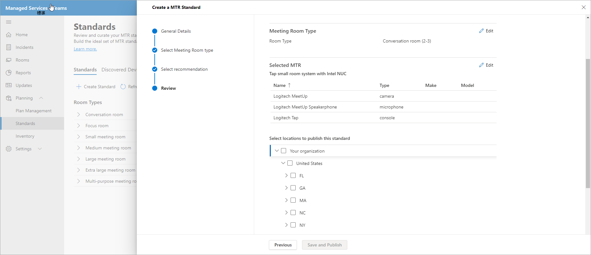

# Standards and Room Planner

環境からのスマートな推奨事項を使用して、標準を構築してキュレーションできます。 その後、標準を地域、サイト、ビル、または特定の会議室に公開して、計画された会議室をパートナーと共有して、会議室の展開を追跡できます。

## 会議室の種類を表示する

このページでは、組織内の会議室または会議スペースの種類を表示できます。 会議室の標準の数、検出された新しいデバイスの数、アクションを実行する必要があるデバイスの数を簡単に分けられます。

このページには、標準ワークフローの作成を起動するか、[検出されたデバイス]、[ログの変更]、および [アーカイブ] に移動できるコマンド バーもあります。

### 標準を作成する

[標準 **ワークフローの作成] を使用** して標準を作成します。

**ワークフローを起動するには**

1. [ **CREATE a MTR Standard]を選択** し、標準の名前や説明などの一般的な詳細を指定します。

   ![[標準] の [選択] ミーティング ルーム](../media/standards-and-room-planner-002.png)

1. この標準の会議室の種類を選択します。

   ![標準の [推奨されるデバイスの選択] のスクリーンショット](../media/standards-and-room-planner-003.png)

1. 推奨されるデバイスから選択した会議室デバイスを選択Teamsハードウェアのインベントリに認定されたデバイスを選択します。

   

1. [STANDARD] の情報を確認します。

   

1. 標準を地域、サイト、ビル、または特定の会議室に公開します。

   

ワークフローを完了すると、標準が正常に作成され、サイト、地域、建物、または会議室に発行されます。 次に、これらの標準を計画目的で使用します。

### 検出されたデバイス

[標準] で [ **検出されたデバイス] を** 選択して、組織内で検出された標準以外のすべてのデバイスを表示します。

検出されたこれらのデバイスの標準をインベントリで確認して作成するアクションを実行できます。

## 部屋の計画

会議室プランナー ウィザードを使用して、会議の拡張に関する標準 **の会議室を計画** します。

ガイド付きのエクスペリエンスで Room Planner を起動するには:

1. 左側のナビゲーションで、[インベントリ] を選択し、[会議室の計画] **を選択します**。

   

1. 場所ディレクトリからプランナーに会議室を追加します。

   

1. 標準の割り当て設定を次のように設定します。

   - レコードに計画パートナーがある場合は、[パートナーにこれらのすべてのルームに最適なソリューションを割り当てろ] **を選択できます**。 このオプションにより、パートナーは顧客に最適なローカルで見つかったソリューションを選択できます。

   - 会議の拡張を計画する場合は、[組織の管理者が組織の標準を使用してすべての会議室に最適なソリューション **を割り当てる] を選択します**。 標準は、[標準] ビューで組織によって承認および公開された基準から自動的に割り当てられます。

1. [組織 **管理者が最適なソリューションを割り当てる...] を選択します。**

   

標準を複数の会議室に一括割り当てできます。

1. [会議室名] の下にある複数の **ルームを確認します**。

   

   

場所、地域、またはサイトで複数の標準を利用できる場合は、[標準の割り当て] リストから標準を選択して、会議室名の下に表示される会議室に割り **当てる必要があります**。

標準の割り当てを確認し、計画を完了します。 プランを PDF に印刷してパートナーと共有できます。

## アクセス制御

ルーム プランナー ウィザードは、管理サービス管理者ロールに対して既定で有効になっています。 [顧客と他のすべての組み込みロール] で、[アクセス許可] タブの [インベントリ管理] のアクセス許可 **を設定** します。

