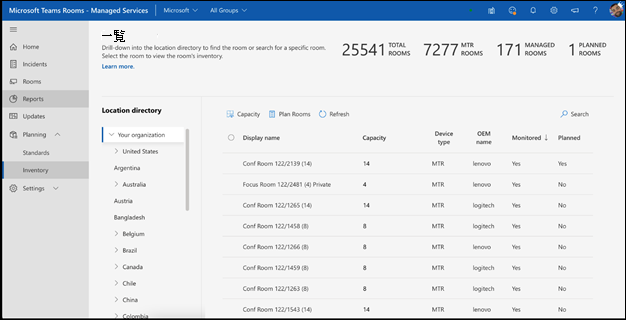
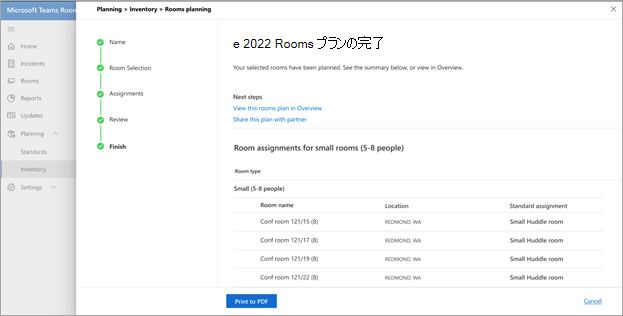

# 標準とルーム プランナー

環境のスマートな推奨事項を使用して、標準を構築してキュレーションできます。 その後、標準をリージョン、サイト、建物、または特定の会議室に公開して、計画された会議室をパートナーと共有して、会議室の展開を追跡できます。

## 会議室の種類を表示する

このページでは、組織内の会議室または会議スペースの種類を表示できます。 会議室の標準の数、検出された新しいデバイスの数、アクションを実行する必要があるデバイスの数を簡単に分解します。

このページには、標準ワークフローの  **作成** を起動したり、検出されたデバイス、変更ログ、アーカイブに移動したりできるコマンド バーもあります。

### 標準の作成

標準の **作成** ワークフローを使用して標準を作成します。

**ワークフローを起動するには**

1. [ **MRT 標準の作成**] を選択し、標準の名前や説明などの一般的な詳細を指定します。

   

1. この標準の会議室の種類を選択します。

   

1. ハードウェアのインベントリで推奨されるTeams認定ルーム テンプレートから選択します。 一覧は、前の手順で選択した部屋の種類によって異なります。

   

1. MRT Standard の情報を確認します。

   

1. 地域、サイト、建物、または特定の会議室に標準を公開します。

   

公開された標準は、計画の目的で使用されます。

### 検出されたデバイス

Standards 内で、[ **検出されたデバイス** ] を選択して、組織内のすべての標準外の検出済みデバイスを表示します。

インベントリ内で検出されたこれらのデバイスから標準を確認して作成するためのアクションを実行できます。

## 部屋の計画

会議室プランナー ウィザードを使用して、会議の拡張に関する標準を使用して **会議室を計画** します。

ガイド付きエクスペリエンスでルーム プランナーを起動するには:

1. 左側のナビゲーションで[インベントリを選択]、[ **プラン ルーム**] の順に選択します。

   

1. 場所ディレクトリからプランナーにルームを追加します。

   

1. 標準の割り当て設定を次のように設定します。

   - 計画パートナーが記録されている場合は、[パートナーが **これらのすべての部屋に最適なソリューションを割り当てる**] を選択できます。 このオプションを使用すると、パートナーが顧客に最適なローカルで見つかったソリューションを選択できるようになります。

   - 会議の展開を社内で計画している場合は、[ **組織の管理者] を選択すると、組織の標準を使用するすべての会議室に最適なソリューションが割り当てられます**。 標準は、[標準] ビューで組織によって承認および発行されたものから自動的に割り当てられます。

1. [ **組織管理者] を選択すると、最適なソリューションが割り当てられます。..**

   

複数の部屋に標準を一括割り当てることができます。

1. **[ルーム名]** の下にある複数の部屋を確認します。

   

   

場所、地域、またはサイトで使用可能な標準が複数ある場合は、 **標準割り当て** リストから標準を選択して、 **会議室名** の下に表示される会議室に割り当てます。

標準割り当てを確認し、計画を完了します。 プランを PDF に印刷して、パートナーと共有できます。

## アクセス制御

ルーム プランナー ウィザードは、マネージド サービス管理者ロールに対して既定で有効になっています。 Customer およびその他のすべての組み込みロールの場合は、[アクセス許可] タブでインベントリ管理の **アクセス許可を** 設定します。

