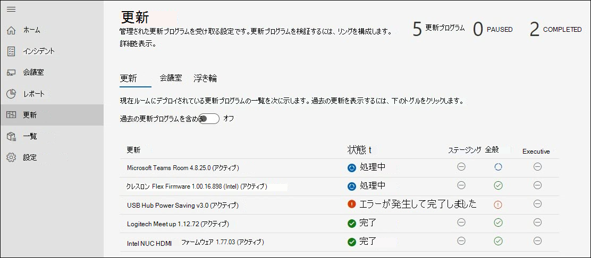

# 更新の管理 
最新の会議室には、Microsoft Teams 会議室デバイスと、カメラ、マイク、スピーカーなどのその他の周辺機器が備え付け、より多くのデバイスを使用して、包括的で効果的な会議エクスペリエンスを作成できます。 さまざまな種類の OEM の機器は、必要な正確な組織エクスペリエンスを提供します。ただし、ソフトウェアとファームウェアを使用して継続的に保守する必要があります。  

Microsoft Teams Rooms の管理されたサービスでは、常に準備が整い、適切に機能する会議室を提供するために、組織内の各ルームを推奨レベルで維持する保証が提供されます。 Microsoft の目標は、インテリジェンスと自動化を使用して、運用スタッフの複雑性と作業時間を減らすことです。 トラブルシューティングまたは診断は、可能な限り迅速に実行されます。 

## デバイスをマネージド サービスに移行する 
Managed Services にオンボードするルーム デバイスには、通常、変更管理の履歴とプラクティスがあります。これはガイダンスとは異なります。  

- Managed Services のメリットを得るには、Managed Services ポートフォリオのすべての更新プログラムの変更管理を切り替える必要があります。
- 変更管理の複数のソースは、部屋でインシデントが発生した場合に新たに再起動する検出と修復が行えるので、インシデント SLA に影響を与えます。
- Microsoft では、組織によって異なる可能性があるポリシーと、例外的な状況に介入する機能を実装するためのコントロールとチェックを実装しています。
- 最終的には、特定のハードウェア のインストールに関する問題による例外を除き、ルーム デバイスは一般的な標準に更新されます。  

## デバイスの移行: 基本的な準備チェック 
ほとんどの予期しないエラーは、変更管理の不確実な履歴を持つ基本イメージの変更によって発生します。 

次の簡単な準備チェックをお勧めします。  

- **基本イメージ**: 基本イメージは、特定の OEM からのイメージである必要があります。 デバイスが過去に再構築され、一般的なタスクで予期しないエラーや動作が表示される場合は、基本イメージを復元する必要があります。 サポートは可能ですが、ルーム デバイスをリモートでリビルドすることはできません。そのため、ローカル サイトの技術者が必要です。  
- **基本 OS、エディション:** 基本 OS とエディションは、Rooms デバイスの要件Microsoft Teams必要があります。 そうではない場合は、オンボードの一環として修正する必要があります。 Microsoft Teamsルームには、チャネルサービス オプションWindows 10 IoT EnterpriseまたはWindows 10 Enterprise SKU がSemi-Annual必要です。 詳細については、 [公式の入手方法に関するページ](rooms-lifecycle-support.md#windows-10-release-support) を参照してください。

## 準備チェック

マネージド サービスの更新プログラムを受信するには、いくつかの前提条件があります。 

|ソフトウェア |ガイダンス |
| :- | :- |
|Logitech Sync Services  |Logitech 会議室デバイスにインストールして実行する必要があります。 必須の同期サービスは、ブロックされていない限り、Windowsから自動的にインストールされます。 完全な同期パッケージもインストールできます。 |
|Windows OS の更新プログラム |有効にし、WSUS にリダイレクトしたり、ネットワークの観点からブロックしたりしない必要があります。 OS の更新を管理するために、GPO ポリシーも MDM ポリシーも使用する必要があります。 |
|Microsoft Store更新プログラム   |オフにする必要があります。 マネージド サービスでは、ストアの更新プログラムが有効な場合はオフになります。 |
|ウイルス対策ソフトウェア |これらのデバイスで AV ソフトウェアを実行している場合は、その DLL を使用するために AV が除外Teams必要Skypeがあります。 詳細については、こちらを参照してください。 |
|その他のソフトウェア |サード パーティのリモート デスクトップ表示などの追加ソフトウェアは、副作用を排除するために、Managed Services で確認する必要があります。 |
|追加の変更管理|対象となる更新プログラムに干渉する可能性があります。また、 を導入すべきではありません。 |

## 管理された更新プログラム – その動作 
更新プログラムの管理には主に 2 つの方法があります。  

- **自動管理**: 更新プログラムは、Managed Services の評価に基づいてルーム デバイスにインストールされます。 ポートフォリオで管理される更新プログラムに対する介入は必要ありません。
- **リング検証済** み: リング システムを設定して、特定のデバイスで更新プログラムをプレビューし、関連付けられた脚の動作なしでそれらを監視できます。 リングのセットアップでは、広範なロールアウトの前に、追加のデュー デリジェンスレイヤーが提供されます。  

### 自動管理

自動的に管理する場合は、自分の部分の更新に対するアクションは必要はありません。 ただし、Managed Services でサポートされている更新プログラムの現在のポートフォリオを確認する必要があります。 ポートフォリオは常に新しい追加を受け入れ、部屋の安定性を確保するために、最も頻繁でインパクトのある更新をカバーする最優先事項です。 組織に必要な追加の変更管理を計画するには、現在の一覧 (このドキュメントの 「更新管理」セクションの下) を確認します。  

**推奨事項:** マネージド サービスの対象となる更新プログラムは、ご自身の管理対象デバイスにインストールし、インストールを行う必要があります。 問題が発生した場合は、ポータルでインシデントを報告してください。

### 呼び出しの検証

リングの検証を選択する場合は、Managed Services でのリングの動作と、組織でリングをカスタマイズするために使用できるオプションについて、次のセクションを確認してください。 リング検証でも、Managed Services は、推奨される更新プログラムの期限が過ぎないルームを保証します。 状況によっては、ルームが管理されたサービスの推奨事項に準拠していることを確認するために、"追いつく" 更新プログラムを受け取る場合があります。  

 新しい種類のソフトウェアとファームウェアがポートフォリオで使用可能になったら、ポータルのホーム ページと Managed Services のドキュメント内でお知らせを確認します。 Managed Services のエキスパートは、デバイスのポートフォリオ全体で更新バージョンを毎日レビューしています。その理由は、特定の問題に対処し、必要に応じて更新プログラムをターゲットにしています。  

### スケジュール設定 
管理された更新プログラムは、会議室内の機器に基づいて、および該当するソフトウェアとファームウェアの Managed Services 標準を満たしていない場合に、会議室に対してスケジュールされます。  

- お客様が変更管理要件を満たしていることを支援するために、ステージング リングの水曜日 **に更新プログラムの** 展開を開始します。 重要な更新プログラムが必要な場合は、このスケジュールをバイパスし、利用可能な時点ですぐに更新プログラムをリリースします。 

- 更新は、特定の部屋での必要性に基づいて順序付けされます。 
- 更新プログラムを検証するためにリングを設定している場合、更新はリングの順序で進行します。 
- 新しい更新プログラムは、状況に基づいて部屋の安定性が改善されたと判断した場合に、キューに入れ込む更新に取ってかわります。  
- 更新プログラムは、通常、夜間メンテナンス期間中に適用されます。これは、中断を避けるために現地時間の午前 **12 時** から午前 5 時までです。 

## Microsoft Teams ルーム アプリの更新ライフサイクル ポリシー 
バージョンの 12 か月のライフサイクルが終了した後、またはそれ以降に 2 つ以上の更新プログラムがリリースされた場合は、すべてのサポートが終了すると、その後、すべてのサポートが終了すると、このサポート チームのサポート ポリシーが示されています。 その後は、お客様が、サポートされているバージョンに更新する必要があります。 詳細については[、「Microsoft Teams Rooms アプリバージョンのサポート - Microsoft Teams |サービスの詳細](rooms-lifecycle-support.md)な説明については、Microsoft Docs をご覧ください。

すべての管理ルームで統一された標準を維持し、トレンドの問題を効率的に特定するために、サポートおよびサブスクリプション サービスの使用条件に従って、最新の 2 つのメジャー リリースまたはマイナー リリース (N、N-1) をサポートし、展開します。 必要に応じて更新リングをバイパスして、準拠していない部屋を自動的に最新の情報に更新します。 

N-1 ポリシーは、サード パーティ製ソフトウェアにも適用されます。  

## Update Management エクスペリエンスのウォークスルー  
更新プログラムを表示するには、マネージド サービス ポータルにログインし、[更新] ページに移動します。

[更新] ウィンドウには、ルームの更新管理の概要が表示され、次のタブが表示されます。

- **更新** プログラム: Managed Services が組織を通じて調整しているソフトウェアまたはファームウェアの更新。  
- **[会議室**]: [会議室] タブには、各部屋が属する部屋とリングが表示されます。
- **リング**: [リング] タブには、組織の会議室のリングが表示されます。

### 更新プログラム  

このビューには、テナントの関連する更新プログラムと、それぞれの状態が表示されます。 アクティブでなくなった過去の更新プログラムを表示するには、[過去の更新プログラムを含める] トグルを **[オン** ] に切り替えます。  

更新は、次のいずれかの状態になります。

| 状態 | 説明 |
| :- | :- |
| スケジュール済み | 特定のリング内の部屋に対して更新がスケジュールされます。 更新では、進行状況が部屋のリングにヒットした後にのみ [スケジュール済み] と表示されます。 たとえば、新しい更新プログラムがステージング リングにある場合は、ステージング リング内の会議室のスケジュール済みだけが表示されます。 
 その他のリングは、更新がリングに進むまで "必須ではありません" 状態になります。
 |
| 進行中 | 更新が進行中で、個々のリングに状態が表示されます。 この状態は全体的なリングの状態を示します。そのため、テナントのステージング リング内の 1 つのルームに更新が適用された場合、Executive リングに達するまで、更新は "進行中" 状態になります。 |
| エラーが発生して完了しました | 更新が構成済みのすべてのリングの進行を完了し、少なくとも 1 つの部屋で失敗しました。 |
| 完了 | 更新プログラムは、構成済みのすべてのリングの進行を完了し、該当するすべてのルームに正常にインストールされました。|
| 非推奨 | 更新プログラムが非アクティブ化されました。 それ以上のデプロイは停止されます。 これは、更新プログラムが新しいバージョンに取って付け変えたため、一般的です。 |
| 一時停止 | 更新は一時停止状態です。 |
| 必須ではありません | 更新プログラムは、まだルームに対して評価されていないか、ルームに適用されません。 |

### 会議室  

[会議室] タブには、テナント内のすべてのルームと、そのルームが属しているリングが表示されます。  

ルームが属するリングを構成するには:  

1. 部屋をクリックすると、詳細なビューが表示されます。  
1. [リング **] の**[変更] **をクリックします**。  
1. ルームが属するリングを選択します。  
1. [割り当 **て] をクリックします**。  

詳細なルーム ビューには、[更新] ノードの下に関連する更新とその状態 **が表示** されます。  

### リング  

リングは、機能更新プログラムのデプロイから派生した問題のリスクを軽減するために使用されます。 これは、更新プログラムをサイト全体に段階的に展開することで行われます。 各リングには、会議室の一覧Microsoft Teams、対応するロールアウト スケジュールが必要です。 リングの定義は一般的に 1 回のイベント (または少なくともまれ) ですが、IT では、シーケンス処理が正しいと判断するために、これらのグループを再検討する必要があります。  

[ **リング]** タブには、テナント内のすべてのリングが一覧表示されます。 構成済みのリングは次の 3 つがあります。  

**ステージング**

部屋をステージング リングに割り当てる。これはテストBED です。 すべての新しい更新プログラムが最初にここでロールアウトされます。 一般に、ステージング リングが環境内のデバイスの種類が多様な会議室を表す必要があります。 一般的でない構成または問題が発生した履歴を持つ特定の種類の会議室がある場合は、ステージングでそれらを表す方法を検討してください。

**全般**

既定では、すべての部屋がこのリングに配置されます。 企業全体で使用されているほとんどのルーム デバイスは、このカテゴリに分類されます。 

**エグゼクティブ**

このグループには、中断を事前に最小限に抑える最も知名度の高いルームを含める必要があります。 良い例は、エグゼクティブ会議や大規模なチーム会議に使用される大規模な会議室です。 

### ロールアウト タイムラインの指定

すべてのリングで更新が完了するには、60 日を超えすることはできません。  

|**パラメーター** |**解説** |
| :- | :- |
|
 

延期期間 
|
最初のリングで更新が開始されると、延期期間は、このリングで更新が開始される数日前の遅延です。  

 
|
|
 

ロールアウト期間  

 
|
このリングで更新が開始された後は、このリングにデプロイします。 たとえば、期間が 5 日の場合、このリングで更新が開始されると、このリング内のルームに 5 日間以上展開されます。 

 
|
|
 

テスト期間 
|

リングに適用されたリング内の更新をテスト/検証する日数。 テスト期間はロールアウトが完了した後に開始され、完了すると、更新は次のリングに移動します。 

 
|
|
 

完了時刻 
|
 

[完了時間] 列は、このリングが完了する合計日数 (ロールアウト期間 + テスト期間) を示します。  

 
|
|
 

合計時間 
|
 

下部には [合計] 行があります。これは、最初のリングから最後のリングまで更新が完了する時間を示します。 

 

 
|

### ユーザー設定のリングを作成する

1. [リング] タブ **に移動** します。  
1. [リング **の追加] をクリックします**。  
1. このリングが更新を受け取る順序を指定します。1 が最初で、9 が最後です。  
1. このリングに名前を付けろ。  
1. 必要に応じて説明を入力します。  
1. このリングで更新プログラムがロールアウトされる日数を指定します。  
1. テスト期間を指定します。  
1. [送信] **をクリックします**。  

> [!NOTE]
> "他のリングで設定された日数" は、すべてのリングで更新が完了するためにかかる合計日数です。 [残存日数] は、このリングが完了する最大 *日数* を示します。 "ロールアウト期間 (日数)" と "テスト期間 (日数)" の合計は、この金額を超えすることはできません。  

**リングを編集する**

1. [リング] タブ **に移動** します。
1. 削除するリングをクリックします。  
1. [リング **の編集] をクリックします**。  
1. 必要に応じて、ロールアウトとテストの日数を編集します。

**リングを削除する**

1. [リング] タブ **に移動** します。  
1. 削除するリングをクリックします。  
1. [リング **の削除] をクリックします**。  

> [!NOTE]
> 既定のリングは削除できません。  

**会議室を移動する**

あるリングから別のリングに部屋を移動するには、次の 2 つの方法があります。

1. [リング] タブ **に移動** します。  
1. 会議室を移動するリングをクリックします。  
1. [会議室 **の移動] をクリックします**。  
1. [会議室の一覧] で、移動する **会議室を選択します**。  
1. 選択した会議室がドロップダウンで移動する [ターゲット] リングを選択します。  
1. [会議室 **の移動] をクリックします**。  

**または**

1. 移動する会議室の詳細を開きます ([インシデント]、[会議室]、または [更新プログラム] -[会議室>します)。
1. [更新] **タブをクリック** します。  
1. [割 **り当て済みリング] の**[変更] **をクリックします**。
1. ドロップダウンから新しいリングを選択します。  
1. [割り当 **て] をクリックします**。

## 管理された更新プログラム: 可視性と制御

マネージド サービスは、組織全体の更新を調整します。 ただし、必要に応じて介入する可視性と制御があります。 その方法を次に示します。 

- 更新エラーが発生した場合、Microsoft Managed Service Operations チームでチケットが自動的に生成されます。 オペレーション チームは、障害を修復し、必要に応じて関与するための手順を実行します。  
- 問題の原因となっている更新プログラムが表示された場合は、[一時停止] ボタンを使用して更新プログラムを **一時停止** できます。 [一時停止] ボタンを押すと、調査するオペレーション センターのチケットが作成されます。 インシデント対応の迅速化に役立つ更新プログラムを一時停止しながら、詳細を入力してください。  
- ルームで更新プログラムが失敗し、ネットワーク切断などのもっともらしい理由を修正した場合は、[失敗したすべての再試行] ボタンを使用して更新を **再試行できます。**  
- 更新プログラムを以前に利用できる場合は、緊急の状況が発生する可能性があります。 この場合は、[更新の強制] **ボタンを使用** できます。 [更新の強制] オプションを使用する場合は、更新プログラムをすぐに、または次に部屋が利用可能なときに、強制的に更新するオプションを選択できます。  

> [!NOTE]
> **一般的な更新管理戦略として "強制的な更新"** はお勧めしません。 検証パスに残っている更新プログラムをプッシュすると、既に知っている問題が発生する可能性があります。 このような場合、このような部屋のインシデント解決はベスト努力に基づいて行われます。  

- さらに、適切な変更管理プラクティスを確保するために、サービス内ですべての強制更新をログに記録します。 今後は、この情報もユーザーに表示される予定です。