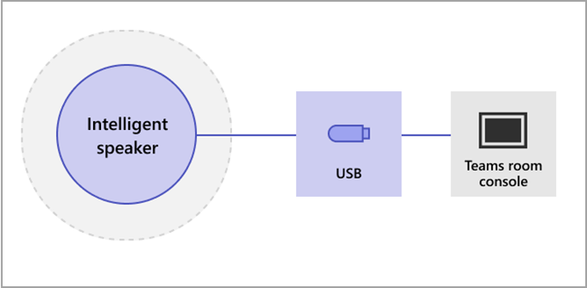

# インテリジェント スピーカーの音声認識テクノロジ コントロールを管理する

インテリジェントスピーカーは、音声プロファイル情報を使用して、ライブ文字起こしで誰が何を言ったかを認識します。 Windows 会議室のMicrosoft Teams Roomsにインテリジェント スピーカーが搭載されている場合は、会議中にライブ文字起こしを使用できます。 この記事では、テナント管理者であるユーザーが、音声認識でライブ文字起こしを生成するために使用する音声プロファイルを制御する方法について説明します。 組織が音声認識をどの程度使用しているか、および次の機能を制御できます。

- トランスクリプトで話者の名前を編集します。
- トランスクリプト内の 1 つの発話の話者を変更するか、トランスクリプト内のすべての発話の話者を変更します (今後のトランスクリプトでは変更しません)。
- 会議に一覧表示されているユーザーの話者 ID を変更します。
- すべてのトランスクリプトで、その話者として識別される 1 つ以上の発話の識別を削除します。

## インテリジェント スピーカーの要件を確認する

インテリジェント スピーカーには、特殊な 7 マイク アレイが含まれています。 システムでは、音声プロファイル情報を使用して、会議室の最大 10 人の音声を識別します。

次の項目は、インテリジェント スピーカーの要件です。

- 会議室には、最大 10 人の人が出席している必要があります。
- 会議室には、アップロードリンクが 7 Mbps 以上ある。

エポ、Sennheiser、Yealink のインテリジェントスピーカーがサポートされています。

> [!NOTE]
> インテリジェント スピーカーは、すべての国と地域で利用できます。 生体認証登録と会議中の文字起こしで現在サポートされているロケールの一覧については、「 [サポートされている](#supported-locales) ロケール」を参照してください。

## インテリジェント スピーカーを設定する

インテリジェント スピーカーは、USB を使用してTeams Rooms コンソールに直接接続します。

> [!NOTE]
> Yealink インテリジェント スピーカーは、Yealink コンソールと共に使用 **する必要があります** 。

> [!NOTE]
> Logitech Surface Pro Microsoft Teams Roomsに接続されたインテリジェント スピーカーはサポートされていません。 ドックを介してインテリジェント スピーカー Teams Rooms認識できないという既知の問題があります。

インテリジェント スピーカーは、壁やノート PC などの大きな物体から少なくとも 8 インチ (20 cm) 離れた場所に配置する必要があります。 インテリジェント スピーカー USB ケーブルがセットアップに十分な長さでない場合は、ケーブル エクステンダーを使用します。

1. 管理者としてコンソールにサインインします。
2. Teams デバイスの設定を、インテリジェント スピーカーのマイクとスピーカーと一致するように設定します。
   これは、ルーム コンソールではなく、TAC ポータルを使用して行うこともできます。

   この図は、デバイスにデータ ボックスが含まれている場合にインテリジェント スピーカーをデバイスに接続する方法を示しています。

   

   この図は、デバイスにデータ ボックスが含まれていない場合に、インテリジェント スピーカーがデバイスに接続される方法を示しています。

   

> [!NOTE]
> 「エポ」デバイスと Yealink デバイスには、"エポ"または "Yealink" プレフィックスを付け、スピーカー名に "UAC2_RENDER" を、マイク名に "UAC2_TEAMS" を含める必要があります。 ドロップダウン メニューにこれらのマイクとスピーカー名が見つからない場合は、インテリジェント スピーカー デバイスを再起動します。

## インテリジェントスピーカーのユーザー認識を有効にする

音声プロファイル データは、インテリジェント スピーカーを使用する任意の会議で使用できます。 会議の設定については、 [Teams 会議ポリシー](../meetings-policies-recording-and-transcription.md#transcription) と [PowerShell 会議コマンドレット](/powershell/module/skype/set-csteamsmeetingpolicy) を参照してください。

ユーザーの音声プロファイル データは、ポリシーが識別するように設定されているか、会議中に会議以外の招待者が歩き込むと作成されます。 音声プロファイル データは、会議の終了時に無視されます。

インテリジェントスピーカーとユーザー認識を設定するために必要なポリシーを次に示します。

|ポリシー|説明|値と動作|
|-|-|-|
|enrollUserOverride|テナントの Teams 設定で、音声プロファイルのキャプチャまたは登録を設定するために使用します。 |**無効** <ul><li> 登録したことがないユーザーは、表示、登録、または再登録できません。<li>登録フローのエントリ ポイントは非表示になります。<li>ユーザーが登録ページへのリンクを選択すると、組織でこの機能が有効になっていないことを示すメッセージが表示されます。  <li>登録したユーザーは、Teams の設定で自分の音声プロファイルを表示および削除できます。 音声プロファイルを削除すると、登録フローを表示、アクセス、または完了できなくなります。</li></ul> **有効** <ul><li> ユーザーは、登録フローを表示、アクセス、および完了できます。<li>エントリ ポイントは、[ **認識** ] タブの [Teams の設定] ページに表示されます。</li></ul>|
|roomAttributeUserOverride|会議室で音声ベースのユーザー ID を制御します。 この設定は、Teams Rooms アカウントに必要です。| **オフ** <ul><li>Teams Rooms デバイスは、音声ストリーム節約帯域幅を部屋から送信しません。 <li>会議室のユーザーは属性付けも識別も行われず、音声署名は取得または使用されません。<li>会議室のユーザーは不明です。</li></ul>  **属性** <ul><li>ルーム のユーザーは、登録状態に基づいて属性付けされます。<li>登録されているユーザーには、文字起こしに自分の名前が表示されます。  <li>登録されていないユーザーは、Speaker \<n>として表示されます。<li>Teams Roomsデバイスは、ルームから 7 つのオーディオ ストリームを送信します。</ul>  **区別**  <ul><li>会議室のユーザーは、スピーカー 1、スピーカー 2、...として区別され、分離されます。文字起こしのスピーカー \<n> 。</li><li>ユーザーの登録状態に関係なく、文字起こしに名前は表示されません。</li><li>Teams Roomsデバイスは、ルームから 7 つのオーディオ ストリームを送信します。</li></ul>
|AllowTranscription|ユーザー アカウントと Teams ルーム アカウントに必要です。|**True** と **False**|
||||

Teams 管理センターで、 **文字起こし** ポリシーを設定します。 既定では、[設定 **] は [オフ]** です。

![会議ポリシーが強調表示され、[文字起こしを許可] が選択されている管理センター。](../media/allow-transcription1.png)
  
> [!NOTE]
> ポリシーが割り当てられると、ポリシーが有効になるまでに最大 48 時間かかる場合があります。 ポリシーをより早く有効にするには、アカウントをサインアウトしてサインインし直す必要があります。

## よく寄せられる質問 (FAQ)

**音声プロファイル データはどこに保存されますか?**

音声プロファイル データは、ユーザー コンテンツOffice 365クラウドに格納されます。

**リテンション期間のタイムラインとポリシーは何ですか?**

一般的なアイテム保持ポリシーについては、 [データリテンション期間の概要](/compliance/assurance/assurance-data-retention-deletion-and-destruction-overview)に関するページを参照してください。 さらに、その 1 年間にインテリジェント スピーカーを使用した会議にユーザーが招待されなかった場合、ユーザーの音声プロファイル データは 1 年後に削除されます。 データは、既存の従業員の会議では使用されません。 従業員が退職した場合、音声プロファイル データはユーザー コンテンツと見なされ、[データ保持の概要](/compliance/assurance/assurance-data-retention-deletion-and-destruction-overview)で説明されているデータ保持ポリシー Office 365従って扱われます。

**音声プロファイル データは Microsoft サービス全体で使用されますか?**

いいえ。音声プロファイル データは、ユーザーが同意を提供した目的でのみ使用されます。 Microsoft は、Teams 音声認識シナリオ内を除き、音声プロファイル データを使用しません。

たとえば、次の状況では、Microsoft はデータを使用しません。

**自分の音声プロファイル データは、別の組織の会議に参加するときに使用されますか?**

組織内のユーザーが開催する会議でのみ使用できません。

**音声プロファイルをエクスポートするにはどうすればよいですか?**

IT 管理者はいつでもオーディオ データをエクスポートできます。

## サポートされているロケール

次の登録と会議内の文字起こしロケールは、すべての国と地域でサポートされています。

### 登録ロケール

エンド ユーザーは、認識のために自分の音声を次のロケールに登録できます。

|**言語**|**国/地域**|**カルチャ ID**|
|:-----|:-----|:-----|
|英語    |オーストラリア   |en-AU    |
|英語    |カナダ    |en-CA   |
|英語    |インド    |en-IN    |
|英語    |ニュージーランド    |en-NZ    |
|英語    |英国    |en-GB    |
|英語    |米国    |en-US    |

### 会議中の文字起こしロケール

エンド ユーザーが登録すると、会議中に音声を認識し、会議が次のいずれかのロケールに設定されている場合に文字起こしで識別できます。

|**言語**|**国/地域**|**カルチャ ID**|
|:-----|:-----|:-----|
|中国語 (簡体字)    |中国    |zh-CN    |
|英語    |オーストラリア   |en-AU    |
|英語    |カナダ    |en-CA   |
|英語    |インド    |en-IN    |
|英語    |ニュージーランド    |en-NZ    |
|英語    |英国    |en-GB    |
|英語    |米国    |en-US    |
|フランス語    |カナダ    |fr-CA    |
|フランス語    |フランス    |fr-FR    |
|ドイツ語    |ドイツ    |de-DE    |
|イタリア語    |イタリア    | it-IT   |
|日本語    |日本    |ja-JP    |
|韓国語    |韓国    |ko-KR    |
|ポルトガル語    |ブラジル    |pt-BR    |
|スペイン語    |メキシコ    |es-MX    |
|スペイン語    |スペイン    |es-ES    |

## 関連項目

[サポート記事: インテリジェント スピーカーを使用して室内参加者を特定する](https://support.microsoft.com/office/use-teams-intelligent-speakers-to-identify-in-room-participants-in-meeting-transcription-a075d6c0-30b3-44b9-b218-556a87fadc00)
