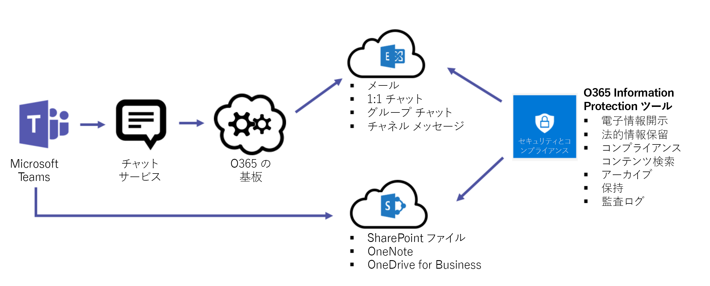
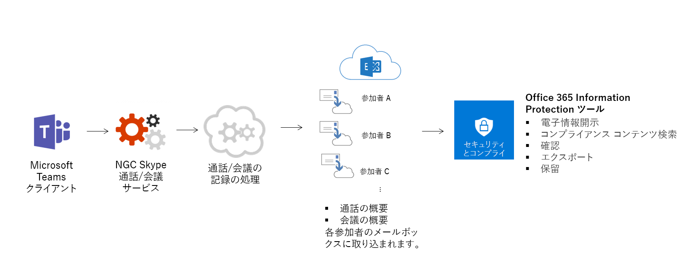
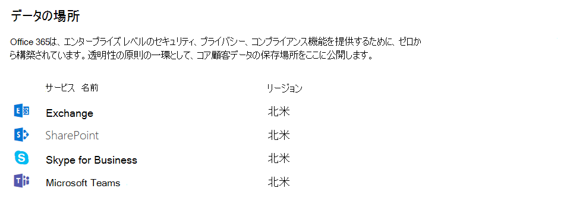

Microsoft Teams のセキュリティとコンプライアンスの概要
======================================================

Microsoft Teams は、お客様の期待に応える高度セキュリティおよびコンプライアンス能力を備えた Office 365 ハイパースケールのエンタープライズクラスのクラウド上に構築されています。

Teams は Tier D 準拠です。これにより、ISO 27001、ISO 27018、SSAE16 SOC 1 および SOC 2、HIPAA、EU モデル契約条項 (EUMC) といった標準に対応します。Microsoft コンプライアンス フレームワークにおいて、Microsoft は Office 365 のアプリケーションとサービスを 4 つのカテゴリに分類しています。各カテゴリは、そのカテゴリのリストに記載されるために Office 365 サービスや関連するマイクロソフトのサービスが満たす必要のある、特定のコンプライアンス コミットメントによって定義されます。

業界をリードするコンプライアンスへの取り組みを実施しているコンプライアンス カテゴリ C および D のサービスは、既定で有効になっています。カテゴリ A と B のサービスでは、組織全体に対してオンまたはオフにする制御が用意されています。詳細については、「[Compliance Framework for Industry Standards and Regulations (業界の規格と規制のコンプライアンス フレームワーク)](https://download.microsoft.com/download/B/2/7/B27B3EF3-8849-4C18-8BA4-5AD755728620/Compliance%20Framework_customer%20guidance.pdf)」をご覧ください。Teams はクラウド セキュリティ アライアンス (CSA) にも準拠しています。

Teams はチーム全体および組織全体の 2 要素認証、Active Directory を介したシングル サインオン、移動中および静止中のデータの暗号化も実施します。 ファイルは SharePoint に格納され、SharePoint 暗号化が適用されます。 メモは OneNote に格納され、OneNote 暗号化が適用されます。 OneNote データはチームの SharePoint サイトに格納されます。 Wiki タブを使用してノートを取ることもできます。また、その内容もチームの SharePoint サイトに格納されます。

監査ログ検索、電子情報開示、訴訟ホールド (チャネル、チャット、ファイルを対象とした)、Microsoft Intune 内でのモバイル アプリ管理のサポートを追加しました。 これらの設定を管理するには、Office 365 セキュリティ/コンプライアンス センターに移動します。 

Office 365 のセキュリティとコンプライアンスに関する詳細については、「[セキュリティ強化のために、Office 365 テナントを構成する](https://docs.microsoft.com/office365/securitycompliance/tenant-wide-setup-for-increased-security)」を参照してください。

## 監査と報告

監査ログ検索は、Office 365 セキュリティ/コンプライアンス センターに直結しています。監査イベントに関するアラートと報告の設定、管理や調査の目的で使用するワークロード固有または汎用のイベント セットのエクスポート、無制限の監査タイムラインといった機能を提供します。 すべての監査ログ データは、さらなる分析を目的としたフィルタリングやエクスポートのためにも、Office 365 セキュリティ/コンプライアンス センター内でアラートを設定するためにも利用できます。 Office 365 セキュリティ/コンプライアンス センターでの Microsoft Teams イベントについての監査ログ検索を実施する方法の詳細については、この[リンク](https://support.office.com/article/Search-the-audit-log-in-the-Office-365-Security-Compliance-Center-0d4d0f35-390b-4518-800e-0c7ec95e946c)をご覧ください。 

## コンプライアンスのコンテンツ検索

コンテンツ検索では、豊富なフィルタリング機能を使用してすべての Teams データを検索でき、検索結果をコンプライアンスや訴訟のサポート用の特定のコンテナにエクスポートできます。 この操作は電子情報開示ケースの有無に関わらず実行できます。 これにより、コンプライアンス管理者は、すべてのユーザーにわたる Teams データを収集し、そのデータをレビューして、さらに処理するためにエクスポートできるようになります。 Office 365 セキュリティ/コンプライアンス センターでの Microsoft Teams コンテンツについてのコンプライアンス コンテンツ検索を実施する方法の詳細については、この[リンク](https://support.office.com/article/content-search-in-office-365-53390468-eec6-45cb-b6cd-7511f9c909e4)先をご覧ください。 

ヒント: Microsoft Teams を使用して、Microsoft Teams 専用のコンテンツに絞り込むことができます。たとえば、チャットとチャネル メッセージ、会議、通話です。 

## 電子情報開示

電子情報開示とは、訴訟または調査における開示要求に対応するための電子保持情報 (ESI) の電子的な特定、収集、生成です。 これらの機能には、Teams データのケース管理、保持、検索、分析、エクスポートが含まれています。 チャット、メッセージング、ファイル、会議と通話の概要も含まれています。 Teams の会議と通話では、会議と通話で発生したイベントの概要が作成され、電子情報開示で利用可能な状態になります。 

セキュリティ & コンプライアンス センターで電子情報開示を実行する方法および Teams コンテンツに対するコンプライアンス コンテンツ検索を実行する方法の詳細については、下記のリンク先をご覧ください。 

[電子情報開示](https://support.office.com/article/manage-legal-investigations-in-office-365-2e5fbe9f-ee4d-4178-8ff8-4356bc1b168e) 

[コンテンツ検索](https://support.office.com/article/search-for-content-in-office-365-df2d1e0f-b476-42c9-aade-4a260b24f193)

顧客は、自身の要件に応じて、インプレース電子情報開示または [Advanced eDiscovery] を活用できます (https://support.office.com/article/Office-365-Advanced-eDiscovery-fd53438a-a760-45f6-9df4-861b50161ae4)。 次の表で、これらの 2 つの違いについて説明します。

| |インプレース電子情報開示  |Advanced eDiscovery  |
|---------|---------|---------|
|ケース管理     |X        |X         |
|アクセス制御  |X         |X         |
|コンテンツ検索     |X         | X        |
|保持   |X         | X        |
|エクスポート     |X         |X         |
|重複検出     |-         |X         |
|機会学習を使用した関連性検索    |-         |X         |
|非構造化データ分析      |-         |X         |

## 訴訟ホールド

訴訟中、裁判での証拠として使用できるように、ユーザー (管理人) または Teams に関連付けられているすべてのデータを変わることなく保存されるよう要求される場合がよくあります。 これは、ユーザー (ユーザー メールボックス) または Teams を訴訟ホールドの状況に置くことによって、達成されます。 Teams 内の任意のチームがインプレース ホールド (対象のクエリまたはフィルタされたコンテンツ経由の、メールボックスまたはサイト コレクションのサブセット)、または訴訟ホールド (メールボックスまたはサイト コレクション全体) になると、ホールドがグループのメールボックスにも適用されます。 これにより、エンド ユーザーが、グループ メールボックスに取り込まれたチャネルのメッセージを削除または編集しても、そのコンテンツの不変のコピーが維持され、電子情報開示の検索で利用できるようになります。 訴訟ホールドの場合は、通常、電子情報開示ケースのコンテキスト内に適用されます。 Office 365 セキュリティ/コンプライアンス センターでの保持およびホールドの詳細について知るには、[この](https://support.office.com/article/overview-of-preservation-policies-9c3b1d52-40ce-4ba3-a520-9ae0be15538a)ヘルプの記事をご覧ください。 

## Microsoft Teams の情報保護アーキテクチャ。 

次の図は、Teams のファイルやメッセージに対応する、Exchange と SharePoint の両方への Teams データの取り込みフローを示しています。 

次の図は、Teams 会議および通話データの Exchange への取り込みフローを示しています。

> [!IMPORTANT]
> Teams のコンテンツの開示には最大で 24 時間の遅延が発生する場合があります。

ライセンス
---------------

情報保護機能については、Office 365 サブスクリプションとそれに関連付けられたスタンドアロン ライセンスによって利用可能な機能セットが決定します。

| 情報保護機能 | Office 365 Business Essentials | Office 365 Business Premium | Office 365 Enterprise E1 | Office 365 Enterprise E3/E4 | Office 365 Enterprise E5 |
|-----------------------------------|--------------------------------|-----------------------------|--------------------------|-----------------------------|--------------------------|
|              アーカイブ              |               -                |              -              |            -             |             はい             |           はい            |
|        インプレース電子情報開示 (eDiscovery)        |               -                |              -              |            -             |             はい             |           はい            |
|        Advanced eDiscovery        |               -                |              -              |            -             |              -              |           はい            |
|            訴訟ホールド             |               -                |              -              |            -             |             はい             |           はい            |
|     コンプライアンスのコンテンツ検索     |               -                |             はい             |           はい            |             はい             |           はい            |
|      監査と報告       |              はい               |             はい             |           はい            |             はい             |           はい            |
|       条件付きアクセス\*        |              はい               |             はい             |           はい            |             はい             |           はい            |

> [!NOTE]
> \*条件付きアクセスには追加のライセンスが必要

| |  |  |
|---------|---------|---------|
|     |判断ポイント         |お客様の組織はセキュリティとコンプライアンスのビジネス要件を満たすために必要なライセンスを所有していますか?         |
|    |次のステップ         |所属する組織の現在のライセンスを調べて、コンプライアンスとセキュリティのすべてのビジネス要件を満たしていることを確認します。         |

これらの機能を有効にする前に、Microsoft 365 管理センターのセキュリティ & コンプライアンスセンターへのアクセス権があることを確認してください。 既定では、テナントの管理者がアクセス権を持っています。

コンテンツ検索と電子情報開示については、セキュリティ & コンプライアンス センター内で有効にする操作は不要です。

Teams のデータの場所
-------------------------

Teams のデータはご利用の Office 365 テナントに関連付けられている地理的領域内に存在します。 現在、Teams は、オーストラリア、カナダ、フランス、インド、日本、英国、南米、南アフリカ、南北アメリカ、APAC、および EMEA 地域をサポートしています。 

> [!IMPORTANT]
> 現在、Teams では、オーストラリア、カナダ、フランス、インド、日本、英国、韓国、南アフリカの新しいテナントのみにデータ常駐サービスを提供しています。 新しいテナントは、Teams に 1 人のユーザーもサインインさせていない任意のテナントとして定義されます。 オーストラリア、インド、日本、韓国の既存のテナントは、引き続き APAC 地域に保存されています。 カナダの既存のテナントのデータは、南北アメリカに保存され続けます。 フランス、英国、南アフリカの既存のテナントは、引き続き EMEA 地域にデータを保存します。

詳細については、「 [office](https://techcommunity.microsoft.com/t5/Microsoft-Teams-Blog/Microsoft-Teams-launches-South-Africa-Data-Residency/ba-p/776611)用の南アフリカデータ常駐データ Sagar のブログ投稿」を参照してください。

Teams の韓国データ常駐サービスの詳細については、「Sagar のブログ投稿の概要」を参照してください。 Microsoft Teams では、[韓国のデータ常駐技術を発表](https://techcommunity.microsoft.com/t5/Microsoft-Teams-Blog/Microsoft-Teams-launches-South-Korea-Data-Residency/ba-p/789171)しています。

インドおよび英国での Teams によるデータ常駐の開始の詳細については、Ansuman Acharya のブログの投稿記事「[Microsoft Teams launches India Data Residency, other geos coming soon (Microsoft Teams でのデータ常駐がインドで開始、その他の地域でも近日中に開始)](https://techcommunity.microsoft.com/t5/Microsoft-Teams-Blog/Microsoft-Teams-Launches-Australia-and-Japan-Data-Residency/ba-p/237827)」をお読みください。 

Teams でのカナダにおけるデータ常駐の詳細については、Varun Sagar (バルン・サガール) 氏のブログ投稿記事「[Microsoft Teams Launches Canada Data Residency, Australia and Japan coming soon (Microsoft Teams によるカナダでのデータ常駐が開始、オーストラリアと日本では近日中に開始)](https://techcommunity.microsoft.com/t5/Microsoft-Teams-Blog/Microsoft-Teams-Launches-Canada-Data-Residency-Australia-and/ba-p/227178)」をご覧ください。 

Teams 向けのオーストラリアおよび日本のデータ常駐サービスの発売の詳細については、「Sagar のブログ投稿を読む」を[参照してください。](https://go.microsoft.com/fwlink/?linkid=867773) 

Teams 向けのフランスデータレジデンシーの起動の詳細については、「Sagar のブログ投稿を読む」を[参照してください。](https://techcommunity.microsoft.com/t5/Microsoft-Teams-Blog/Microsoft-Teams-launches-France-Data-Residency/ba-p/364466)

テナントのデータが格納されている領域を確認するには、 [Microsoft 365 管理センター](https://portal.office.com/adminportal/home) > の**設定** > **組織プロファイル**に移動します。 下にスクロールして [**データの場所**] に移動します。 

Teams に条件付きアクセス ポリシーはどのように機能しますか?
-------------------------

Microsoft Teams は、会議、カレンダー、相互運用チャット、ファイル共有などの主要な生産性に関するシナリオについて、Exchange Online、SharePoint Online、および Skype for Business Online と強く結びついています。 これらのクラウド アプリ向けに設定された条件付きアクセス ポリシーは、任意のクライアントの Microsoft Teams にユーザーが直接サインインするときに適用されます。 

Microsoft Teams は、Azure Active Directory の条件付きアクセス ポリシーのクラウド アプリとして個別にサポートされています。 Microsoft Teams クラウド アプリ向けに設定されている条件付きアクセス ポリシーは、ユーザーがサインインするときに Microsoft Teams に適用されます。 ただし、 Exchange Online や SharePoint Online などの他のアプリにおいて適正なポリシーがなくでも、ユーザーはそれらのリソースに直接アクセスできます。 Azure ポータルでの条件付きアクセス ポリシーの設定の詳細については、こちらにアクセスしてください: (https://docs.microsoft.com/azure/active-directory/active-directory-conditional-access-azure-portal-get-started) 

Windows および Mac 版の Microsoft Teams デスクトップ クライアントは先進認証をサポートしています。 先進認証により、Azure Active Directory 認証ライブラリ (ADAL) に基づくサインインが、あらゆるプラットフォームの Microsoft Office クライアント アプリケーションに導入されています。

Microsoft Teams デスクトップ アプリケーションは、AppLocker をサポートしています。  AppLocker の前提条件の詳細については、「AppLocker を使用するための要件 (https://docs.microsoft.com/windows/security/threat-protection/windows-defender-application-control/applocker/requirements-to-use-applocker)」をご覧ください。

Teams でのプライバシー
--------------------------

Office 365 のユーザーとして、お客様はデータを所有して管理します。Microsoft が、お客様が購読しているサービスの提供以外の目的でお客様のデータを使用することはありません。Microsoft は、サービス プロバイダーとして、広告や他のサービスと無関係な目的のためにお客様のメール、ドキュメント、チームを調べることはありません。Microsoft はアップロード済みのコンテンツに対してアクセス権を持ちません。OneDrive for Business や SharePoint Online と同様に、お客様のデータはテナント内にあります。

信頼およびセキュリティに関連する情報の詳細については、[Microsoft Trust Center](https://microsoft.com/trustcenter) にアクセスしてください。 Teams は Microsoft Trust Center と同じガイダンスと原則に従っています。

関連トピック
----------------------
[Office 365 の ATP の安全なリンク機能](https://docs.microsoft.com/office365/securitycompliance/atp-safe-links#how-to-get-atp-safe-links-protection)
