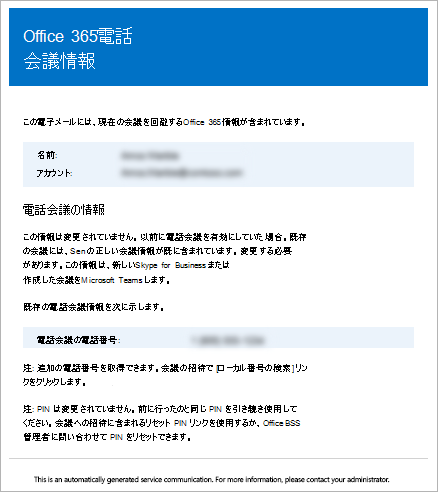

# Microsoft Teams の電話会議情報が含まれたメールをユーザーに送信する

Microsoft Teams ユーザーは、電話会議情報を送信する必要がある場合があります。 これを行うには、ユーザーのプロパティの下にある [**会議情報をメールで送信**] をクリックします。 このメールを送信すると、次のようなすべての電話会議情報が含まれます。
  
- ユーザー用の会議の電話番号またはダイヤルイン電話番号。
    
- ユーザーの会議 ID。
    
   
送信されるメールの例を次に示します。
  

> [!NOTE]
> [!INCLUDE [updating-admin-interfaces](includes/updating-admin-interfaces.md)]
  
## 電話会議の情報が含まれるメールをユーザーに送信する

###  Microsoft Teams 管理センターの使用

1. 左側のナビゲーションで、[**ユーザー**] をクリックしてから、空いているユーザーのリストからユーザーを選択します。

2. ページの上部にある [**編集**] をクリックします。

3. [**電話会議**] の [**電話会議情報をメールで送信**] をクリックします。

## このようなメールについて知っておくべきその他のこと

- 電話会議を有効にした後、組織内のユーザーに送信されるメールが複数あります。
    
  - **電話会議** のライセンスがユーザーに割り当てられた場合。
    
  - ユーザーの電話会議の PIN を手動でリセットした場合。
    
  - ユーザーの会議 ID を手動でリセットした場合。
    
  - **電話会議** のライセンスがユーザーから削除された場合。
    
  - ユーザーの電話会議プロバイダーが Microsoft から別のプロバイダーまたは **[なし**] に変更された場合。
    
  - ユーザーの電話会議プロバイダーが Microsoft に変更された場合。
  
## Windows PowerShell の詳細情報

Windows PowerShell で行うのは、ユーザーを管理し、ユーザーに何を許可して何を禁止するかを管理することです。Windows PowerShell を利用すると、Office 365 の管理を 1 か所で行うことができるので、複数のタスクを担当する管理者の日常業務を単純化できます。Windows PowerShell の使用を開始するには、次のトピックを参照してください。
    
  - [Office 365 PowerShell を使用する必要がある理由](https://go.microsoft.com/fwlink/?LinkId=525041)
    
  - [Windows PowerShell で Office 365 を管理するための最善の方法](https://go.microsoft.com/fwlink/?LinkId=525142)
    
Windows PowerShell の詳細については、「[Microsoft Teams PowerShell のリファレンス](https://docs.microsoft.com/powershell/module/teams/?view=teams-ps)」をご覧ください。
    
  
## 関連トピック

[Office 365 での電話会議を試用または購入する](/SkypeForBusiness/audio-conferencing-in-office-365/try-or-purchase-audio-conferencing-in-office-365)
