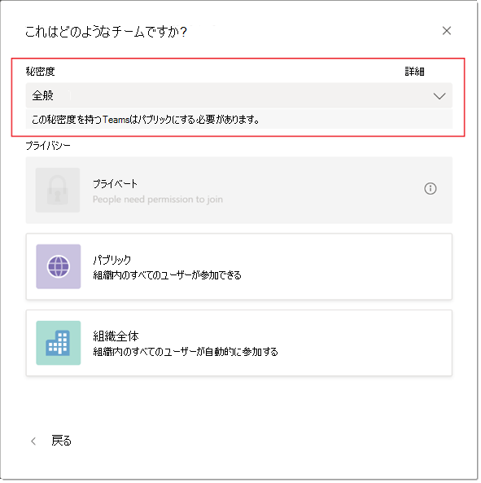

# Microsoft Teams の感度ラベルSensitivity labels for Microsoft Teams

[機密ラベルを使用](/microsoft-365/compliance/sensitivity-labels)するとTeamsチーム内の共同作業中に作成された機密性の高い組織のコンテンツへのアクセスを保護および規制できます。[Sensitivity labels](/microsoft-365/compliance/sensitivity-labels) allow Teams admins to protect and regulate access to sensitive organizational content created during collaboration within teams. [Microsoft](/microsoft-365/compliance/go-to-the-securitycompliance-center)コンプライアンス センターで、関連付けられているポリシーで感度ラベルを構成した後、これらのラベルを組織内のチームに適用できます。After you configure sensitivity labels with their associated policies in the [Microsoft compliance center](/microsoft-365/compliance/go-to-the-securitycompliance-center), these labels can be applied to teams in your organization.

現在、Teams Education SKU を使用しているお客様のクラス チームでは、感度ラベルはサポートされていません。Sensitivity labels are currently unsupported in class teams for customers using Teams Education SKUs. Teams のライセンスの詳細については、「[Microsoft Teams サービスのサービスの説明](/office365/servicedescriptions/teams-service-description)」を参照してください。To learn more about licensing, see [Microsoft Teams service description](/office365/servicedescriptions/teams-service-description).

## 感度ラベルと分類ラベルの違Teamsは何ですか?What's the difference between sensitivity labels and Teams classification labels?

感度ラベルは、分類ラベルとは異なります。分類ラベルは、Azure AD分類とも呼ばれる。Sensitivity labels are different from classification labels, also known as Azure AD group classification. 分類ラベルは、特定のグループに関連付Microsoft 365、実際のポリシーが関連付けられているものはないテキスト文字列です。Classification labels are text strings that can be associated with a Microsoft 365 group but don't have any actual policies associated with them. 分類ラベルをメタデータとして使用し、内部ツールやスクリプトなどの他の方法を使用してポリシーを適用する必要があります。You use classification labels as metadata and then must use other methods such as internal tools and scripts, to enforce policies.

感度ラベルを使用する利点は、ポリシーが Microsoft 365 Groups プラットフォーム、コンプライアンス センター、および Teams サービスの組み合わせによってエンド to エンドで自動的に適用されるという利点があります。The benefit of using sensitivity labels is that their policies are automatically enforced end-to-end through a combination of the Microsoft 365 Groups platform, the compliance center, and Teams services. 機密ラベルは、組織の機密データをセキュリティで保護し、社内のポリシーまたは規制に準拠するための強力なインフラストラクチャ サポートを提供します。Sensitivity labels provide powerful infrastructure support for securing your organization's sensitive data and ensuring compliance with your internal policies or regulations.

現在分類ラベルを使用している場合は、感度ラベルに移行する方法の詳細と手順については、次のドキュメントを参照してください。クラシック Azure AD [グループ分類](/microsoft-365/compliance/sensitivity-labels-teams-groups-sites#classic-azure-ad-group-classification)。If you currently use classification labels, see the following documentation for more information and instructions how to migrate them to sensitivity labels: [Classic Azure AD group classification](/microsoft-365/compliance/sensitivity-labels-teams-groups-sites#classic-azure-ad-group-classification).

## 感度ラベルのシナリオ例Example scenarios for sensitivity labels

組織内のユーザーと一緒に感度ラベルを使用Teamsシナリオの例を次に示します。Example scenarios for how you can use sensitivity labels with Teams in your organization:

- [チームのプライバシー レベル (パブリックまたはプライベート) を設定するSet the privacy level (public or private) for teams](#set-the-privacy-level-for-teams)
- [チームへのゲスト アクセスを制御するControl guest access to teams](#control-guest-access-to-teams)

### チームのプライバシー レベルを設定するSet the privacy level for teams

チームの作成時に適用すると、ユーザーが特定のプライバシー (パブリックまたはプライベート) 設定を持つチームを作成できる、感度ラベルを作成して構成できます。You can create and configure a sensitivity label that, when applied during team creation, allows users to create teams with a specific privacy (public or private) setting.

たとえば、"Confidential" という名前の機密ラベルを作成して発行します。このラベルには、ラベルのプライバシー オプションが Private として構成 **されています**。For example, you create and publish a sensitivity label named "Confidential" that has the label privacy option configured as **Private**. その結果、このラベルで作成されたチームは、プライベート チームである必要があります。As a result, any team that's created with this label must be a private team. 

ユーザーが新しいチームを作成し **、[Confidential]** ラベルを選択すると、ユーザーが使用できるプライバシー オプションは [プライベート] **のみです**。When a user creates a new team and selects the **Confidential** label, the only privacy option that's available to the user is **Private**. [パブリック] や [組織全体] などの他のプライバシー オプションは、ユーザーが選択できません。Other privacy options such as Public and Org-wide aren't available for the user to select:

同様に、ラベル プライバシー オプションがパブリック として構成されている "General" という名前の感度ラベルを作成して発行 **します**。Similarly, you create and publish a sensitivity label named "General" that has the label privacy option configured as **Public**. ユーザーが新しいチームを作成すると、次のラベルを選択した場合にのみ、パブリックまたは組織全体のチームを作成できます。When a user creates a new team, they can only create public or org-wide teams when they select this label:

チームが作成されると、チーム内のチャネルの右上隅に感度ラベルが表示されます。When the team is created, the sensitivity label is visible in the upper-right corner of channels in the team. 

> [!NOTE]
> "Confidential\Finance" などの階層的な親子ラベルを使用している場合は、親ラベルだけがチャネル ヘッダーに表示されます。If you are using hierarchical parent-child labels such as "Confidential\Finance", then only the parent label will be shown in the channel header.

チーム所有者は、チームにアクセスしてチームの感度ラベルとプライバシー設定をいつでも変更し、[チームの編集] を **クリックします**。A team owner can change the sensitivity label and the privacy setting of the team at any time by going to the team, and then click **Edit team**.

### チームへのゲスト アクセスを制御するControl guest access to teams

感度ラベルを使用して、チームへのゲスト アクセスを制御できます。You can use sensitivity labels to control guest access to your teams. Teamsアクセスを許可しないラベルで作成されたユーザーは、組織内のユーザーだけが使用できます。Teams created with a label that doesn't allow guest access are only available to users in your organization. 組織外のユーザーをチームに追加できない。People outside your organization can't be added to the team.

## Microsoft Teams 管理センターMicrosoft Teams admin center

管理者センターでチームを作成または編集するときに、Microsoft Teams適用できます。You can apply sensitivity labels when you create or edit a team in the Microsoft Teams admin center. 

また、チームのプロパティや、管理センターの [チームの管理]ページの [分類] Microsoft Teams表示されます。Sensitivity labels are also visible in team properties and in the **Classification** column on the **Manage teams** page of the Microsoft Teams admin center.

## 制限事項Limitations

感度ラベルを使用する前Teams、次の制限事項に注意してください。Before you use sensitivity labels for Teams, be aware of the following limitations:

- **親ラベル名がサブラベルに対して表示されない****Parent label names aren't displayed for sublabels**
    
    Teamsはサブラベルをサポートしますが、親ラベルの名前は表示されません。Teams supports sublabels but doesn't display the name of the parent label. たとえば、Confidential  \\ **All Employees は [All Employees]** **と表示されます**。For example, **Confidential** \\ **All Employees** displays as **All Employees**.

- **感度ラベルは、TEAMS GRAPH Api、PowerShell コマンドレット、およびテンプレートではサポートされていません****Sensitivity labels aren't supported by Teams Graph APIs, PowerShell cmdlets, and templates**
    
    ユーザーは、Teams Graph API、powerShell コマンドレット、Teams テンプレートを使用してチームを直接作成する際に、Teamsできません。Users won't be able to specify sensitivity labels while creating teams directly through Teams Graph APIs, Teams PowerShell cmdlets, and Teams templates. ただし、Modern Groups Graph API と PowerShell コマンドレットを使用すると、ラベル付きのグループを作成できます。However Modern Groups Graph APIs and PowerShell cmdlets do allow creation of groups with labels. そのため、ユーザーはまず Groups Graph API または PowerShell コマンドレットを使用してラベル付きグループを作成し、次にこれらのグループを Teams。So users can first create Groups with labels using Groups Graph APIs or PowerShell cmdlets and then convert these Groups in to Teams.

- **プライベート チャネルのサポート****Support for private channels**
    
    チームで作成されたプライベート チャネルは、チームに適用された感度ラベルを継承します。Private channels that are created in a team inherit the sensitivity label that was applied on a team. 同じラベルが、プライベート チャネルの SharePointに自動的に適用されます。The same label is automatically applied on the SharePoint site collection for the private channel.
    
    ただし、ユーザーがプライベート チャネルの SharePoint サイトの感度ラベルを直接変更した場合、そのラベルの変更は Teams クライアントに反映されません。However, if a user directly changes the sensitivity label on a SharePoint site for a private channel, that label change isn't reflected in the Teams client. このシナリオでは、ユーザーはプライベート チャネル ヘッダーでチームに適用された元の感度ラベルを引き続き表示します。In this scenario, users continue to see the original sensitivity label applied on the team in the private channel header.

## デバイスの感度ラベルを作成して構成するTeamsHow to create and configure sensitivity labels for Teams

次のドキュメントの手順に従ってMicrosoft 365の感度ラベルを作成して構成Teams。Use the instructions from the Microsoft 365 documentation to create and configure sensitivity labels for Teams: 

- [感度ラベルを使用して、Microsoft Teams、Microsoft 365、](/microsoft-365/compliance/sensitivity-labels-teams-groups-sites)および SharePoint サイト内のコンテンツを保護します。[Use sensitivity labels to protect content in Microsoft Teams, Microsoft 365 groups, and SharePoint sites](/microsoft-365/compliance/sensitivity-labels-teams-groups-sites).
