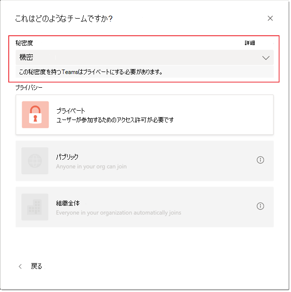
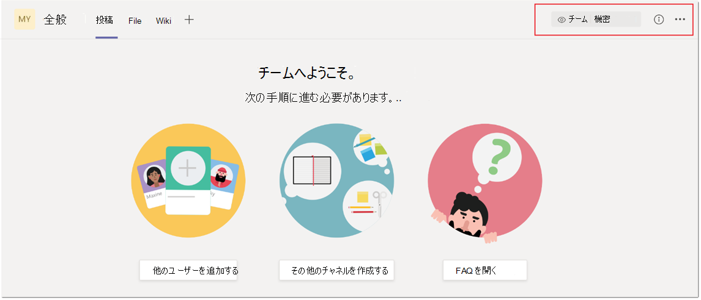
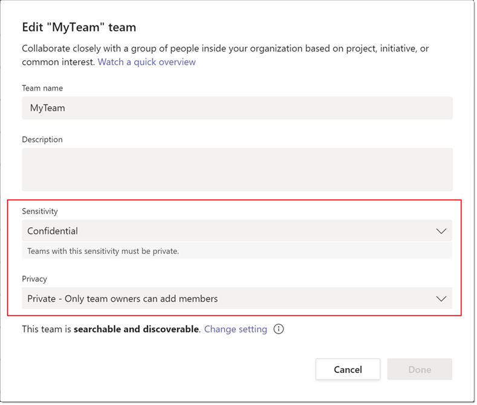

# Microsoft Teams の感度ラベルSensitivity labels for Microsoft Teams

[機密ラベルを使用](https://docs.microsoft.com/microsoft-365/compliance/sensitivity-labels) すると、Teams 管理者は、チーム内での共同作業中に作成された機密性の高い組織コンテンツへのアクセスを保護し、規制することができます。[Sensitivity labels](https://docs.microsoft.com/microsoft-365/compliance/sensitivity-labels) allow Teams admins to protect and regulate access to sensitive organizational content created during collaboration within teams. [Microsoft](https://docs.microsoft.com/microsoft-365/compliance/go-to-the-securitycompliance-center)コンプライアンス センターで、関連するポリシーを使用して感度ラベルを構成した後、これらのラベルを組織内のチームに適用できます。After you configure sensitivity labels with their associated policies in the [Microsoft compliance center](https://docs.microsoft.com/microsoft-365/compliance/go-to-the-securitycompliance-center), these labels can be applied to teams in your organization.

現在、Teams Education SKU を使用しているお客様は、感度ラベルはサポートされていません。Sensitivity labels are currently unsupported for customers using Teams Education SKUs. Teams のライセンスの詳細については、「[Microsoft Teams サービスのサービスの説明](https://docs.microsoft.com/office365/servicedescriptions/teams-service-description)」を参照してください。To learn more about licensing, see [Microsoft Teams service description](https://docs.microsoft.com/office365/servicedescriptions/teams-service-description).

## 感度ラベルと Teams の分類ラベルの違いは何ですか?What's the difference between sensitivity labels and Teams classification labels?

感度ラベルは、分類ラベルとは異なります (Azure ラベルと呼ばれるAD分類)。Sensitivity labels are different from classification labels, also known as Azure AD group classification. 分類ラベルは、Microsoft 365 グループに関連付け可能なが、実際のポリシーが関連付けはないテキスト文字列です。Classification labels are text strings that can be associated with a Microsoft 365 group but don't have any actual policies associated with them. 分類ラベルをメタデータとして使用し、内部ツールやスクリプトなどの他の方法を使用してポリシーを適用する必要があります。You use classification labels as metadata and then must use other methods such as internal tools and scripts, to enforce policies.

感度ラベルを使用する利点は、ポリシーが Microsoft 365 グループ プラットフォーム、コンプライアンス センター、および Teams サービスの組み合わせを通じてエンドツーエンドで自動的に適用される点です。The benefit of using sensitivity labels is that their policies are automatically enforced end-to-end through a combination of the Microsoft 365 Groups platform, the compliance center, and Teams services. 機密ラベルは、組織の機密データをセキュリティで保護し、内部のポリシーまたは規制に準拠するための強力なインフラストラクチャ サポートを提供します。Sensitivity labels provide powerful infrastructure support for securing your organization's sensitive data and ensuring compliance with your internal policies or regulations.

現在分類ラベルを使用している場合は、詳細およびそれらを感度ラベルに移行する方法については、次のドキュメントを参照してください。従来の [Azure AD グループの分類](https://docs.microsoft.com/microsoft-365/compliance/sensitivity-labels-teams-groups-sites#classic-azure-ad-group-classification)。If you currently use classification labels, see the following documentation for more information and instructions how to migrate them to sensitivity labels: [Classic Azure AD group classification](https://docs.microsoft.com/microsoft-365/compliance/sensitivity-labels-teams-groups-sites#classic-azure-ad-group-classification).

## 感度ラベルのシナリオ例Example scenarios for sensitivity labels

組織内の Teams で感度ラベルを使用する方法のシナリオ例:Example scenarios for how you can use sensitivity labels with Teams in your organization:

- [チームのプライバシー レベル (パブリックまたはプライベート) を設定するSet the privacy level (public or private) for teams](#set-the-privacy-level-for-teams)
- [チームへのゲスト アクセスを制御するControl guest access to teams](#control-guest-access-to-teams)

### チームのプライバシー レベルを設定するSet the privacy level for teams

チームの作成中に適用すると、ユーザーが特定のプライバシー (パブリックまたはプライベート) 設定を持つチームを作成できる、感度ラベルを作成および構成できます。You can create and configure a sensitivity label that, when applied during team creation, allows users to create teams with a specific privacy (public or private) setting.

たとえば、"機密" という名前の機密ラベルを作成して発行し、ラベルのプライバシー オプションが [非公開] として構成 **されている場合などです**。For example, you create and publish a sensitivity label named "Confidential" that has the label privacy option configured as **Private**. その結果、このラベルで作成されたチームは、プライベート チームである必要があります。As a result, any team that's created with this label must be a private team. 

ユーザーが新しいチームを作成し、機密ラベルを選択すると、ユーザーが使用できるプライバシー オプションは [プライベート]**のみです**。When a user creates a new team and selects the **Confidential** label, the only privacy option that's available to the user is **Private**. パブリックや組織全体などの他のプライバシー オプションは、ユーザーが次を選択できません。Other privacy options such as Public and Org-wide aren't available for the user to select:

同様に、"全般" という名前の感度ラベルを作成して発行し、ラベルのプライバシー オプションを [パブリック] として構成 **します**。Similarly, you create and publish a sensitivity label named "General" that has the label privacy option configured as **Public**. ユーザーが新しいチームを作成すると、次のラベルを選択した場合にのみ、パブリックまたは組織全体のチームを作成できます。When a user creates a new team, they can only create public or org-wide teams when they select this label:

![[一般的な感度] ラベルのスクリーンショット](media/sensitivity-labels-general-example.png)

チームが作成されると、チームのチャネルの右上隅に感度ラベルが表示されます。When the team is created, the sensitivity label is visible in the upper-right corner of channels in the team. "Confidential\Finance" などの階層的な親の子ラベルを使用している場合は、親ラベルだけがチャネル ヘッダーに表示されます。Note that if you are using hierarchical parent child labels such as "Confidential\Finance" then only the parent label will be showin the channel header.

チーム所有者は、チームにアクセスして [チームの編集] をクリックすると、いつでもチームの感度ラベルとプライバシー設定を **変更できます**。A team owner can change the sensitivity label and the privacy setting of the team at any time by going to the team, and then click **Edit team**.

### チームへのゲスト アクセスを制御するControl guest access to teams

チームへのゲスト アクセスを制御するには、感度ラベルを使用できます。You can use sensitivity labels to control guest access to your teams. ゲスト アクセスを許可しないラベルで作成された Teams は、組織内のユーザーだけが使用できます。Teams created with a label that doesn't allow guest access are only available to users in your organization. 組織外のユーザーをチームに追加できない。People outside your organization can't be added to the team.

## Microsoft Teams 管理センターMicrosoft Teams admin center

Microsoft Teams 管理センターでチームを作成または編集するときに、感度ラベルを適用できます。You can apply sensitivity labels when you create or edit a team in the Microsoft Teams admin center. 

また、チームのプロパティおよび Microsoft Teams 管理センターの [チームの管理] ページの [分類] 列にも、感度ラベルが表示されます。Sensitivity labels are also visible in team properties and in the **Classification** column on the **Manage teams** page of the Microsoft Teams admin center.

## 制限事項Limitations

Teams の感度ラベルを使用する前に、次の制限事項に注意してください。Before you use sensitivity labels for Teams, be aware of the following limitations:

- **サブラベルに親ラベル名が表示されない****Parent label names aren't displayed for sublabels**
    
    Teams はサブラベルをサポートしますが、親ラベルの名前は表示されません。Teams supports sublabels but doesn't display the name of the parent label. たとえば、機密のすべての **従業員** \\ **は、すべての従業員\*\*\*\*として表示されます**。For example, **Confidential** \\ **All Employees** displays as **All Employees**.

- **Teams Graph API、PowerShell コマンドレット、およびテンプレートでは、感度ラベルはサポートされません。****Sensitivity labels aren't supported by Teams Graph APIs, PowerShell cmdlets, and templates**
    
    ユーザーは、Teams Graph API、Teams PowerShell コマンドレット、および Teams テンプレートを使用して直接作成されたチームに、感度ラベルを適用することはできません。Users won't be able to apply sensitivity labels on teams that are created directly through Teams Graph APIs, Teams PowerShell cmdlets, and Teams templates.

- **プライベート チャネルのサポート****Support for private channels**
    
    チームで作成されたプライベート チャネルは、チームに適用された感度ラベルを継承します。Private channels that are created in a team inherit the sensitivity label that was applied on a team. プライベート チャネルの SharePoint サイト コレクションにも同じラベルが自動的に適用されます。The same label is automatically applied on the SharePoint site collection for the private channel.
    
    ただし、ユーザーがプライベート チャネルの SharePoint サイトの感度ラベルを直接変更した場合、そのラベルの変更は Teams クライアントには反映されません。However, if a user directly changes the sensitivity label on a SharePoint site for a private channel, that label change isn't reflected in the Teams client. このシナリオでは、ユーザーはプライベート チャネル ヘッダーにチームに適用された元の感度ラベルを引き続き表示します。In this scenario, users continue to see the original sensitivity label applied on the team in the private channel header.

## Teams の感度ラベルを作成および構成する方法How to create and configure sensitivity labels for Teams

Microsoft 365 ドキュメントの手順を使用して、Teams の感度ラベルを作成および構成します。Use the instructions from the Microsoft 365 documentation to create and configure sensitivity labels for Teams: 

- [Microsoft Teams、Microsoft 365 グループ、SharePoint](https://docs.microsoft.com/microsoft-365/compliance/sensitivity-labels-teams-groups-sites)サイトのコンテンツを保護するには、感度ラベルを使用します。[Use sensitivity labels to protect content in Microsoft Teams, Microsoft 365 groups, and SharePoint sites](https://docs.microsoft.com/microsoft-365/compliance/sensitivity-labels-teams-groups-sites).
