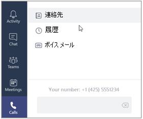

# 通話プランのセットアップ
ビジネス ユーザー向けの他の Skype への呼び出しを自由が、ユーザーが、組織では、外からの電話を呼び出せるようにする場合、国内を呼び出すことを計画、または、国際の呼び出し Office 365 で。 お客様のビジネスにこれを設定するのには簡単です。 

## 手順 1: を確認する計画を呼び出し、国/地域で利用可能です
[オーディオ会議や予定を呼び出すことで可用性を国や地域](country-and-region-availability-for-audio-conferencing-and-calling-plans/country-and-region-availability-for-audio-conferencing-and-calling-plans.md)に移動し、国または地域に関する計画を呼び出すには、利用可能時間情報だけでなく有料の電話会議、電話システム、およびフリー ダイヤル情報を取得するを選択数字、および通信のクレジットです。
  
## 手順 2: 購入し、ライセンスを割り当てる
1. Office 365 の機能では、電話システムが計画に含まれていない場合は、**電話システム**のアドオンのライセンスを購入する必要があります。 **電話システム**用のライセンスを取得したら、 [Office 365 のプランを呼び出すこと](calling-plans-for-office-365.md)を購入します。 [Skype](/skypeforbusiness/skype-for-business-and-microsoft-teams-add-on-licensing/skype-for-business-and-microsoft-teams-add-on-licensing)を参照してくださいし、計画とのライセンスを購入します。 
    
    > [!TIP]
    > **電話システム**用のライセンスと Office 365 のプランを呼び出すことは、計画の呼び出しを購入するためのオプションを表示するには、**電話システム**のライセンスを最初にいる必要がありますので、移動します。
  
2. 最初のライセンスを割り当てるし、計画を呼び出して、組織内のユーザーに割り当てます。 「[Skype for Business と Microsoft Teams のライセンスを割り当てる](/skypeforbusiness/skype-for-business-and-microsoft-teams-add-on-licensing/assign-skype-for-business-and-microsoft-teams-licenses)」をご覧ください。
    
## 手順 3: 電話番号を取得します。
新しいユーザー番号を取得する方法には次の 3 通りあります。

- **ビジネス管理センターは、Skype を使用します。** 国や地域によって[、ユーザーの電話番号の取得](/SkypeForBusiness/what-are-calling-plans-in-office-365/getting-phone-numbers-for-your-users)を参照して、ビジネス管理センターは、Skype を使用してユーザーの番号を取得ください。
    
- **既存の番号を移行する。** ポート、または現在のサービス プロバイダーまたは電話のキャリアからの既存の番号を Office 365 に転送できます。 [Office 365 に電話番号を転送](transfer-phone-numbers-to-office-365.md)または詳細については[、組織の電話番号の管理](manage-phone-numbers-for-your-organization/manage-phone-numbers-for-your-organization.md)作業を行いやすくにを参照してください。  
  
- **新規の番号を取得するには、リクエスト フォームを使用してください。** 場合があります (国または地域) によってことはできません、Skype を使用するビジネス管理センターでは、新しい電話番号を取得するか、特定の電話番号または市外局番が必要です。 その場合は、フォームをダウンロードして記入してからマイクロソフトに返送する必要があります。 詳細については「[組織の電話番号を管理](manage-phone-numbers-for-your-organization/manage-phone-numbers-for-your-organization.md) 」を参照してください。 

## 手順 4: 緊急時のアドレスと、組織の場所を追加します。
 、緊急時のアドレス、電話番号に関連付けられている必要がありますこの関連付けの場合は、国や地域の間で変更できます。 例えば米国では、電話番号をユーザーに割り当てるときに、緊急対応の住所を関連付ける必要があります。 英国では、Office 365 から電話番号を取得するか、現在のサービス プロバイダーから電話番号を移すときに、緊急対応の住所をその電話番号に関連付ける必要があります。 

**組織の緊急時のアドレスを追加するのには**

 **Skype for Business の管理センターを使用する**

Skype のビジネス管理センターでは、[**音声**] に移動 > **緊急場所** > **新しいアドレスを追加**します。 詳細については、[追加または削除、および組織の緊急時のアドレス](/skypefor business/what-are-calling-plans-in-office-365/add-or-remove-an-emergency-address-for-your-organization)を参照してください。

**組織の緊急の場所を追加するには** 

 **Skype for Business の管理センターを使用する**

Skype のビジネス管理センターでは、[**音声**] に移動 > **緊急場所** > **新しいアドレスを追加**します。 詳細については、[追加、変更、または組織には、緊急時の場所を削除する](/skypefor business/what-are-calling-plans-in-office-365/add-or-remove-an-emergency-address-for-your-organization)を参照してください。

    
## 手順 5: 緊急時のアドレスと電話番号をユーザーに割り当てる
 Office 365 のプランの呼び出しを設定している場合する個々 のユーザーに電話番号と緊急時のアドレスを割り当てる必要があります。 作成されていない緊急対応の住所を電話番号に関連付けることはできません。 

**緊急時のユーザーのアドレスを追加するには** 

 **Skype for Business の管理センターを使用する**

Skype のビジネス管理センターでは、[**音声**] に移動 > **音声ユーザー** > **緊急場所** > **番号を割り当てる** > **の位置を変更**します。 詳細については、[割り当て、またはユーザーのシステムのアドレスを変更する](/skypeforbusiness/what-are-calling-plans-in-office-365/assign-or-change-an-emergency-address-for-a-user)を参照してください。

   > [!NOTE]
   > 電話番号を割り当てる場合も、緊急時のアドレスを割り当てることができます。

**ユーザーに電話番号を割り当てるには**

 **Skype for Business の管理センターを使用する**

Skype のビジネス管理センターでは、[**音声**] に移動 > **音声ユーザー** > **番号を割り当てる** > **の位置を変更**します。 詳細については、[割り当て、変更、またはユーザーの電話番号を削除する](/skypeforbusiness/what-are-calling-plans-in-office-365/assign-change-or-remove-a-phone-number-for-a-user)を参照してください。

## 手順 6: ユーザーに、新しい電話番号の連絡します。

新しい電話番号をユーザーに通知する場合は、メールを送信するか、または各組織が指定する方法で行うことをお勧めします。 

以下は、**ビジネスの Skype**アプリでは、その電話番号を表示できる方法です。
  
1. デスクトップで Skype for Business にサインインします。
    
2.  **Settings** > **Tools** > **Options** を選択します。 
    
     
  
3. 次に、[ **電話**] を選びます。 
    
    
 
 **マイクロソフトのチーム**では、ユーザーは、左側のナビゲーションで **呼び出し** をクリックすると、その電話番号を表示できます。 電話番号は、ダイヤル パッドの上に表示されます。

## その他の情報

- 緊急対応の住所は、行政上の住所、所在地住所、または現住所と呼ばれることがあります。緊急対応の住所は、組織の事業所の場所を示す所在地住所または行政上の住所のことです。
    
- 緊急対応の場所は検証されません。緊急対応の住所だけが検証されます。
    
- 緊急対応の住所の詳細については、「[緊急対応の場所、アドレス、通話ルーティングの概要](what-are-emergency-locations-addresses-and-call-routing.md)」をご覧ください。
    
## 電話番号の割り当ての自動化

Windows PowerShell を使うことができる場合は、次のコマンドレットを使用して、ユーザーへの電話番号の割り当てを自動化できます。 
  
- [Get-CsOnlineTelephoneNumber](https://technet.microsoft.com/en-us/library/mt243818.aspx): Business Voice Directory から電話番号を取得します。
    
- [Set-CsOnlineVoiceUser](https://technet.microsoft.com/en-us/library/mt243817.aspx): 電話番号を設定します。
    
詳しくは、「[クイック リファレンス: Windows PowerShell を使用した一般的な Skype for Business Online の管理タスクの実行](https://technet.microsoft.com/en-us/library/dn362776%28v=ocs.15%29.aspx)」ご覧ください。
  
   > [!NOTE]
   > さらに追加で電話番号が必要な場合は、「[一般法人向け Office 365 のサポートへのお問い合わせ - 管理者向けヘルプ](https://support.office.com/en-us/article/32a17ca7-6fa0-4870-8a8d-e25ba4ccfd4b)」をご覧ください。

## 関連トピック
[電話番号の移行に関するよくある質問](transferring-phone-numbers-common-questions.md)

[通話プランで使用されるさまざまな種類の電話番号](different-kinds-of-phone-numbers-used-for-calling-plans.md)

[[[Skype for Business 新しい電話番号の申請](manage-phone-numbers-for-your-organization/manage-phone-numbers-for-your-organization.md)] に移動することによって、電話番号を取得するために利用できるすべてのフォームを一覧表示してダウンロードすることができます。](manage-phone-numbers-for-your-organization/manage-phone-numbers-for-your-organization.md)

[緊急通話の利用条件](emergency-calling-terms-and-conditions.md)

[Skype for Business Online: 緊急通話の免責事項ラベル](https://github.com/MicrosoftDocs/OfficeDocs-SkypeForBusiness/blob/live/Teams/downloads/emergency-calling/emergency-calling-label-(en-us)-(v.1.0).zip?raw=true)

  
 