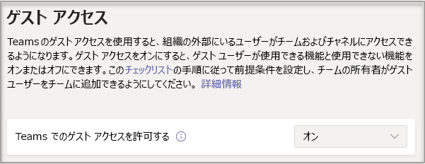

# Microsoft Teams へのゲスト アクセスをオンまたはオフにする

> [!Note]

> **2021 年 2 月** まで、ゲスト アクセスは既定で無効になっています。 管理者やチームの所有者がゲストを追加できるようにするには、Teams へのゲスト アクセスをオンにする必要があります。 ゲストアクセスを有効にするには、変更を反映するのに、数時間かかりることもあります。 ユーザーがチームにゲストを追加しようとするときに **Contact your administrator (管理者にお問い合わせください)** というメッセージが表示される場合、ゲスト アクセスがオンになっていないか、設定が有効になっていないかのいずれかの可能性があります。

> **2021 年 2 月** 以降、この設定を構成していない新規のお客様と既存のお客様へは、Microsoft Teams のゲスト アクセスが既定で有効になります。 この変更を実装すると、Microsoft Teams でゲスト アクセス機能をまだ構成していない場合、その機能はテナントで有効になります。 組織でゲスト アクセスを無効にしたままにする場合は、ゲスト アクセスの設定が **既定のサービス** ではなく **オフ** に設定されていることを確認する必要があります。

> [!IMPORTANT]
> ゲスト アクセスをオンにする方法は、Azure Active Directory、Office 365、SharePoint Online、Teams の設定により異なります。 詳細については、「[チームでゲストと共同作業を行う](https://docs.microsoft.com/microsoft-365/solutions/collaborate-as-team)」を参照してください。

## Teams 管理センターでゲスト アクセスを構成する

1. [Microsoft Teams 管理センター](https://admin.teams.microsoft.com/)にサインインする。

2. [**組織全体の設定**] > [**ゲスト アクセス**] を選択します。

3. **[Microsoft Teams でのゲスト アクセスを許可]** を **[オン]** に設定します。

    

4. **[通話]**、**[会議]**、および **[メッセージング]** で、ゲスト ユーザーに何を許可する必要があるかに応じて、各機能の **[オン]** または **[オフ]** を選択します。

      - **プライベート通話の発信** – この設定を [**オン**] にするとゲストがピアツーピアの通話を発信することができるようになります。
      - **IP ビデオを許可** - この設定を [**オン**] に切り替えると、ゲストは自分たちの通話および会議でビデオを使用することができるようになります。
      - **画面共有モード** – この設定は、ゲスト ユーザーが画面共有を利用可能かどうかを制御します。
          - この設定を [**無効**] にすると、Teams で画面を共有するゲストの機能は削除されます。
          - この設定を [**1 つのアプリケーション**] にすると、個別のアプリケーションの共有を行えるようになります。
          - この設定を [**画面全体**] にすると、完全な画面共有を行えるようになります。
      - **会議の開始を許可** – この設定を [**オン**] にすると、Microsoft Teams でゲストが会議の開始機能を使用することができるようになります。
      - **送信済みメッセージの編集** - この設定を [**オン**] にすると、ゲストが以前送信したメッセージを編集することができるようになります。
      - **ゲストによる送信済みメッセージの削除** - この設定を [**オン**] にすると、ゲストが以前送信したメッセージを削除することができるようになります。
      - **チャット** – この設定を [**オン**] にすると、ゲストが Teams でのチャット機能を使用することができるようになります。
      - **会話で Giphys を使用する** – この設定を [**オン**] にすると、ゲストが会話で Giphys を使用することができるようになります。 Giphy は、ユーザーがアニメーション GIF ファイルを検索および共有することができる、オンライン データベースおよび検索エンジンです。 各 Giphy にはコンテンツ評価が割り当てられています。
      - **Giphy のコンテンツ評価** –  ドロップダウン リストから次の評価を選択します。
          - **すべてのコンテンツを許可** - ゲストは、コンテンツ評価に関係なく、すべての Giphy をチャットに挿入することができるようになります。
          - **中** - ゲストは、Giphy をチャットに挿入することができますが、成人向けコンテンツの挿入についてはある程度制限されます。
          - **高** - ゲストは、Giphy をチャットに挿入することができますが、成人向けコンテンツの挿入については制限されます。
      - **会話でミームを使用する** – この設定を **[オン]** にすると、ゲストが会話でミームを使用することができるようになります。
      - **会話でステッカーを使用する** – この設定を [**オン**] にすると、ゲストが会話でステッカーを使用することができるようになります。

    

5. **[保存]** を選択します。

## 外部アクセス (フェデレーション) とゲスト アクセス

[!INCLUDE [guest-vs-external-access](includes/guest-vs-external-access.md)]

## 関連項目

[Microsoft 365 とセキュリティで保護された共同作業を設定する](https://docs.microsoft.com/microsoft-365/solutions/setup-secure-collaboration-with-teams)

[特定のチームにゲストが入れないようブロックする](https://docs.microsoft.com/microsoft-365/solutions/per-group-guest-access)

[Set-CsTeamsClientConfiguration](https://docs.microsoft.com/powershell/module/skype/set-csteamsclientconfiguration)
