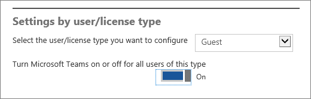

Microsoft Teams へのゲスト アクセスをオンまたはオフにする
======================================

  

Office 365 管理者は、組織のユーザー (具体的にはチーム所有者) がゲストを追加できるようにするため事前にゲスト機能を有効にする必要があります。 

ゲスト設定は Azure Active Directory で設定します。 その変更が Office 365 組織全体で有効になるまでに 2 時間から 24 時間かかります。 ユーザーがチームにゲストを追加しようとするときに「Contact your administrator (管理者にお問い合わせください)」というメッセージが表示される場合、ゲスト機能が使用できる状態になっていないか、設定が有効になっていないかのいずれかの可能性があります。

> [!IMPORTANT]
> ゲスト アクセス機能の完全なエクスペリエンスを有効にするためには、Microsoft Teams、Azure Active Directory、および Office 365 の間での中心的な承認の依存関係を理解することが重要です。 詳細については、「[Microsoft Teams でのゲスト アクセスを承認する](Teams-dependencies.md)」をご覧ください。

1. Office 365 グローバル管理アカウントを使用して、[https://portal.office.com/adminportal/home](https://portal.office.com/adminportal/home) にサインインします。
    
  
2. ナビゲーション メニューで [**設定**] を選択し、[**Services &amp; add-ins (サービスとアドイン)**] を選択します。
    
     ![Office 365 にサインインし、Office 365 管理センターに移動して、[設定]、[Services &amp; add-ins (サービスとアドイン)] の順に選択します。](media/99e676d4-5b48-4525-9556-547031fa37d9.png)
  
 

  
3. [**Microsoft Teams**] を選択します。
    
     
  
  
4. [**Select the user/license type you want to configure (構成するユーザー/ライセンスの種類を選択する)**] で [**ゲスト**] を選択します。
   
    
      

  
  
5. [**Turn Microsoft Teams on or off for all users of this type (この種類のすべてのユーザーについて Microsoft Teams をオンまたはオフにする)**] の横にあるトグルをクリックまたはタップして [**オン**] にして組織の Teams とゲスト アクセスをオンにし、[**保存**] を選択します。 
    
 ゲスト アクセスの詳細については以下のビデオを視聴してください。  

|  |  |
|---------|---------|
| Microsoft Teams でのゲスト アクセスの有効化   | <iframe width="350" height="200" src="https://www.youtube.com/embed/7T54KmlIHQk" frameborder="0" allowfullscreen></iframe>   |
 | Microsoft Teams でのゲストの追加   | <iframe width="350" height="200" src="https://www.youtube.com/embed/1daMBDyBLZc" frameborder="0" allowfullscreen></iframe>   | 