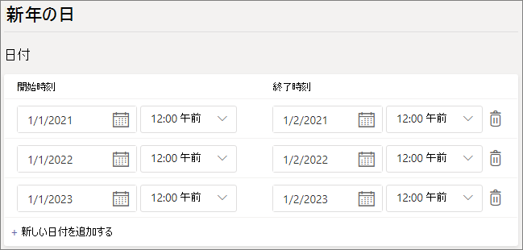

# Microsoft Teams で休日を設定する

Teams の休日機能を使用すると、部署、通話キュー、または組織内のユーザーが別の稼働時間に対応しているか、または使用できない場合に、特定の日時に対して、別のメッセージと発信者へのルーティングを行うことができます。 たとえば、組織が終了している場合は、新しい年の休日を作成することができます。

ここで作成した休日は、 [自動応答を設定](create-a-phone-system-auto-attendant.md)するときに使用できます。それぞれのあいさつ文と通話ルーティング設定が含まれます。

## 休日を作成する

休日を作成するには

1. Microsoft Teams 管理センターで、[ **組織全体の設定**  >  **休日** ] に移動します。

2. [ **新しい休日** ] を選択します。

3. 休日の名前を入力します。

4. [ **Add new date** ] を選びます。

5. [ **開始時刻** ] で、予定表アイコンを選択し、休日の開始日を選択します。

6. ドロップダウンリストを使用して、休日の開始時刻を選択します。

7. [ **終了時刻** ] で、予定表アイコンを選択し、休日の終了日を選択します。

8. ドロップダウンリストを使用して、休日の終了時刻を選択します。 **終了時刻** は **開始時刻** より後でなければなりません。  

   > [!NOTE]
   > 休日の1日を1日に設定する場合 (つまり、24時間の期間)、 **終了時刻** は翌日と 12:00 AM の時刻に設定する必要があります。 たとえば、新しい年の1月1日に組織が終了した場合は、[ **開始時刻** ] を [午前 1 12:00 時] に設定し、 **終了時刻** を1月2日の @ 12:00 am に設定します。

9. 必要に応じて、定期休日の日付を追加します。

10. **[保存]** を選択します。

    

## 休日を変更する

休日を変更するには

1. Microsoft Teams 管理センターで、[ **組織全体の設定**  >  **休日** ] に移動します。

2. リストから休日を選択します。

3. [ **開始時刻** ] で、予定表アイコンを選択し、休日の開始日を選択します。

4. ドロップダウンリストを使用して、休日の開始時刻を選択します。

5. [ **終了時刻** ] で、予定表アイコンを選択し、休日の終了日を選択します。 

6. ドロップダウンリストを使用して、休日の終了時刻を選択します。 **終了時刻** は **開始時刻** より後でなければなりません。  

7. **[保存]** を選択します。

## 関連項目

[Teams の自動応答と通話キューを計画し](plan-auto-attendant-call-queue.md)ますか?
