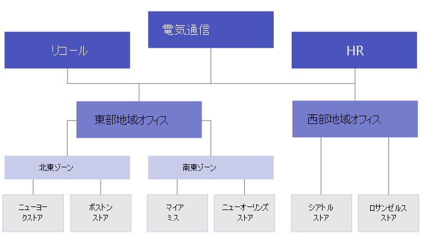

# <a name="set-up-your-team-targeting-hierarchy"></a><span data-ttu-id="fa367-103">チーム対象の階層を設定する</span><span class="sxs-lookup"><span data-stu-id="fa367-103">Set up your team targeting hierarchy</span></span>

<span data-ttu-id="fa367-104">チームのターゲット階層を設定すると、組織は大規模なチーム セットにコンテンツを発行できます。</span><span class="sxs-lookup"><span data-stu-id="fa367-104">Setting up a team targeting hierarchy will allow your organization to publish content to a large set of teams.</span></span> <span data-ttu-id="fa367-105">チームターゲット階層は、階層内のすべてのチームが互いに関連付けられている方法、ユーザーがタスクを発行できる方法、および公開する権限を持つチームを定義します。</span><span class="sxs-lookup"><span data-stu-id="fa367-105">The team targeting hierarchy defines how all the teams in your hierarchy are related to each other, which users can publish tasks, and which teams users have permissions to publish to.</span></span> <span data-ttu-id="fa367-106">組織に対してチームのターゲット階層が設定されていない限り、すべてのユーザーに対して発行機能が無効になります。</span><span class="sxs-lookup"><span data-stu-id="fa367-106">Publishing features are disabled for all users unless a team targeting hierarchy is set up for your organization.</span></span> <span data-ttu-id="fa367-107">チームのターゲット階層を設定するには、階層を定義するファイルを作成し、それを Teams にアップロードして組織に適用する必要があります。</span><span class="sxs-lookup"><span data-stu-id="fa367-107">To set up a team targeting hierarchy, you'll need to create a file that defines the hierarchy and then upload it to Teams to apply it to your organization.</span></span> <span data-ttu-id="fa367-108">スキーマがアップロードされると、Teams 内のアプリで使用できます。</span><span class="sxs-lookup"><span data-stu-id="fa367-108">After the schema is uploaded, apps within Teams can use it.</span></span>

> [!IMPORTANT]
> <span data-ttu-id="fa367-109">最初のリリースでは、タスク アプリだけが階層型チームをサポートしています。</span><span class="sxs-lookup"><span data-stu-id="fa367-109">For the initial release, only the Tasks app supports hierarchical teams.</span></span>  <span data-ttu-id="fa367-110">チームのターゲット階層を組織に適用すると、 [タスク](https://support.microsoft.com/office/publish-task-lists-to-create-and-track-work-in-your-organization-095409b3-f5af-40aa-9f9e-339b54e705df) アプリでのタスクの発行が有効になります。</span><span class="sxs-lookup"><span data-stu-id="fa367-110">Applying a team targeting hierarchy to your organization will enable [task publishing](https://support.microsoft.com/office/publish-task-lists-to-create-and-track-work-in-your-organization-095409b3-f5af-40aa-9f9e-339b54e705df) in the Tasks app.</span></span> <span data-ttu-id="fa367-111">Microsoft Teams の他の領域には、チームの階層は表示されません。</span><span class="sxs-lookup"><span data-stu-id="fa367-111">You won't see a hierarchy of teams in other areas of Microsoft Teams.</span></span>

<span data-ttu-id="fa367-112">Teams のタスク アプリで階層がどのように表されるのかの例を次に示します。</span><span class="sxs-lookup"><span data-stu-id="fa367-112">Here's an example of how the hierarchy is represented in the Tasks app in Teams.</span></span> <span data-ttu-id="fa367-113">タスク リストを作成した後、発行チームのメンバーは、タスク リストを送信 (発行) する受信者チームを選択できます。</span><span class="sxs-lookup"><span data-stu-id="fa367-113">After a task list is created, members of the publishing team can then select the recipient teams to send (publish) the task list to.</span></span> <span data-ttu-id="fa367-114">チームを選択すると、発行チームは階層、属性、または両方の組み合わせでフィルター処理できます。</span><span class="sxs-lookup"><span data-stu-id="fa367-114">When selecting teams, the publishing team can filter by hierarchy, by attributes, or a combination of both.</span></span><br>


## <a name="terminology"></a><span data-ttu-id="fa367-116">用語</span><span class="sxs-lookup"><span data-stu-id="fa367-116">Terminology</span></span>

<span data-ttu-id="fa367-117">階層間を移動する場合、次の用語が重要になります。</span><span class="sxs-lookup"><span data-stu-id="fa367-117">The following terms will be important as you navigate hierarchies.</span></span> <span data-ttu-id="fa367-118">Teams はノードと呼 **ばれます**。</span><span class="sxs-lookup"><span data-stu-id="fa367-118">Teams will be referred to as **nodes**.</span></span>

* <span data-ttu-id="fa367-119">**ルート ノード** は、階層の最上位のノードです。</span><span class="sxs-lookup"><span data-stu-id="fa367-119">**Root nodes** are the topmost nodes in the hierarchy.</span></span> <span data-ttu-id="fa367-120">この例では、Retail Communications はルート ノードです。</span><span class="sxs-lookup"><span data-stu-id="fa367-120">In the example, Retail Communications is a root node.</span></span>
* <span data-ttu-id="fa367-121">**親ノードと\*\*\*\*子ノードは**、接続されている 2 つのノード間の関係を表す用語です。</span><span class="sxs-lookup"><span data-stu-id="fa367-121">**Parent nodes** and **child nodes** are terms that represent a relationship between two connected nodes.</span></span> <span data-ttu-id="fa367-122">この例では、地域 01 は領域 1 の子ノードです。</span><span class="sxs-lookup"><span data-stu-id="fa367-122">In the example, District 01 is a child node of Area 1.</span></span>
* <span data-ttu-id="fa367-123">複数レベルの子は、下位レベル **と呼ばれます**。</span><span class="sxs-lookup"><span data-stu-id="fa367-123">Multiple levels of children are referred to as **descendants**.</span></span> <span data-ttu-id="fa367-124">地域 01、ストア 01、ストア 03、ストア 07、02、学区 03 は、すべて地域 1 の下位です。</span><span class="sxs-lookup"><span data-stu-id="fa367-124">District 01, Store 01, Store 03, Store 07, District 02, and District 03 are all descendants of Area 1.</span></span>
* <span data-ttu-id="fa367-125">子ノードがないノードは、リーフ ノードと **呼ばれる。**</span><span class="sxs-lookup"><span data-stu-id="fa367-125">A node with no children is called a **leaf node**.</span></span> <span data-ttu-id="fa367-126">階層の一番下に表示されます。</span><span class="sxs-lookup"><span data-stu-id="fa367-126">They are at the bottom of a hierarchy.</span></span>
* <span data-ttu-id="fa367-127">**受信者チーム** は、公開するコンテンツの特定のセットを受信するために選択されているチームです。</span><span class="sxs-lookup"><span data-stu-id="fa367-127">**Recipient teams** are teams that have been selected to receive a specific set of content to be published.</span></span> <span data-ttu-id="fa367-128">リーフ ノードである必要があります。</span><span class="sxs-lookup"><span data-stu-id="fa367-128">They must be leaf nodes.</span></span>

## <a name="plan-your-hierarchy"></a><span data-ttu-id="fa367-129">階層を計画する</span><span class="sxs-lookup"><span data-stu-id="fa367-129">Plan your hierarchy</span></span>

<span data-ttu-id="fa367-130">階層を定義するスキーマを作成する前に、計画を立て、組織の形成方法を決定する必要があります。</span><span class="sxs-lookup"><span data-stu-id="fa367-130">Before you create the schema that defines your hierarchy, you need to do some planning and decide how you want to shape your organization.</span></span>  <span data-ttu-id="fa367-131">最初の優先事項の 1 つは、タスクを他のグループに発行する必要がある組織グループを決定する方法です。</span><span class="sxs-lookup"><span data-stu-id="fa367-131">One of the first priorities is deciding which organizational groups need to publish tasks to other groups.</span></span> <span data-ttu-id="fa367-132">階層内の各ノードは、作業グループまたはグループのグループを表します。</span><span class="sxs-lookup"><span data-stu-id="fa367-132">Each node in the hierarchy represents a working group or group of groups.</span></span>

### <a name="permissions-to-publish"></a><span data-ttu-id="fa367-133">発行する権限</span><span class="sxs-lookup"><span data-stu-id="fa367-133">Permissions to publish</span></span>

<span data-ttu-id="fa367-134">発行するアクセス許可は、ユーザーが階層内の任意のチームのメンバーかどうかに加えて、そのチームまたはチームセットと階層内の他のチームとの関係によって異なります。</span><span class="sxs-lookup"><span data-stu-id="fa367-134">Permission to publish depends on whether a user is a member of any teams in the hierarchy plus the relationship of that team or set of teams to other teams in the hierarchy.</span></span>

> [!NOTE]
> <span data-ttu-id="fa367-135">チームの所有者には、発行アクセス許可も付与されます。</span><span class="sxs-lookup"><span data-stu-id="fa367-135">The owner of a team is also granted publishing permissions.</span></span>

* <span data-ttu-id="fa367-136">ユーザーが階層内に下位にある少なくとも 1 つのチームのメンバーである場合、そのユーザーは、発行するチームのメンバーにならずに下位に発行できます。</span><span class="sxs-lookup"><span data-stu-id="fa367-136">If a user is a member of at least one team that has descendants in the hierarchy, that user can publish to those descendants without being a member of all teams they want to publish to.</span></span>
* <span data-ttu-id="fa367-137">ユーザーが階層内の少なくとも 1 つのチームのメンバーであり、階層内に下位にあるチームのメンバーではない場合、そのユーザーは組織の発行済みコンテンツを表示および受信できます。</span><span class="sxs-lookup"><span data-stu-id="fa367-137">If a user is a member of a least one team in the hierarchy but isn't a member of any team with descendants in the hierarchy, that user can see and receive published content from their organization.</span></span>
* <span data-ttu-id="fa367-138">ユーザーが階層内の任意のチームのメンバーではない場合、そのユーザーには発行関連の機能は表示されません。</span><span class="sxs-lookup"><span data-stu-id="fa367-138">If a user isn't a member of any team in the hierarchy, that user won't see any publishing-related functionality.</span></span>

### <a name="guidelines"></a><span data-ttu-id="fa367-139">ガイドライン</span><span class="sxs-lookup"><span data-stu-id="fa367-139">Guidelines</span></span>

* <span data-ttu-id="fa367-140">組織ごとに適用できる階層ファイルは 1 つのみです。</span><span class="sxs-lookup"><span data-stu-id="fa367-140">There can only be one hierarchy file applied per organization.</span></span> <span data-ttu-id="fa367-141">ただし、1 つの CSV ファイル内のノードの個別の階層として、組織の異なる部分をまとめて含めることができるようになりました。</span><span class="sxs-lookup"><span data-stu-id="fa367-141">However, you can include different parts of your organization together as distinct hierarchies of nodes within one CSV file.</span></span> <span data-ttu-id="fa367-142">たとえば、Contoso Pharmaceuticals には、ルート ノードと Retail ルート ノードがあります。</span><span class="sxs-lookup"><span data-stu-id="fa367-142">For example, Contoso Pharmaceuticals has a Pharmacy root node and a Retail root node.</span></span> <span data-ttu-id="fa367-143">両方のルート ノードには複数の下位行が含まれますが、これらの間に重複はありません。</span><span class="sxs-lookup"><span data-stu-id="fa367-143">Both root nodes have multiple rows of descendants and there's no overlap between them.</span></span>
* <span data-ttu-id="fa367-144">リーフ ノードだけが文書の受信者になります。</span><span class="sxs-lookup"><span data-stu-id="fa367-144">Only leaf nodes can be recipients of a publication.</span></span> <span data-ttu-id="fa367-145">階層内の他のノードは、文書の受信者を選択する場合に役立ちます。</span><span class="sxs-lookup"><span data-stu-id="fa367-145">Other nodes in the hierarchy are helpful for selecting recipients of a publication.</span></span>
* <span data-ttu-id="fa367-146">チームは階層内で 1 回だけ表現できます。</span><span class="sxs-lookup"><span data-stu-id="fa367-146">A team can only be represented one time in a hierarchy.</span></span>
* <span data-ttu-id="fa367-147">階層には最大 15,000 ノードを含めできます。</span><span class="sxs-lookup"><span data-stu-id="fa367-147">A hierarchy can contain up to 15,000 nodes.</span></span> <span data-ttu-id="fa367-148">お客様と協力して、大規模な組織に対してこの制限を引き上げる予定です。</span><span class="sxs-lookup"><span data-stu-id="fa367-148">We plan to work with customers to raise this limit for larger organizations.</span></span>

### <a name="example-hierarchy"></a><span data-ttu-id="fa367-149">階層の例</span><span class="sxs-lookup"><span data-stu-id="fa367-149">Example hierarchy</span></span>

<span data-ttu-id="fa367-150">たとえば、次の階層では、リコール、コミュニケーション、人事は、階層内のすべての下位ノード (チーム) にタスクを発行できますが、ノースゾーンでは、タスクをニューヨーク ストアとボストン ストア チームにのみ発行できます。</span><span class="sxs-lookup"><span data-stu-id="fa367-150">For example, in the following hierarchy, Recall, Communications, and HR can publish tasks to every bottom node (team) in the hierarchy, but Northeast Zone can only publish tasks to the New York Store and Boston Store teams.</span></span> <span data-ttu-id="fa367-151">この階層例では、リコール、コミュニケーション、人事グループが、福利厚生情報や CEO からのメッセージなど、会社全体に適用されるタスクを発行できます。</span><span class="sxs-lookup"><span data-stu-id="fa367-151">The example hierarchy allows the Recall, Communications, and HR groups to publish tasks that apply to the entire company, such as benefits information or messages from the CEO.</span></span> <span data-ttu-id="fa367-152">ノースゾーンでは、人事のスケジュール、天気情報など、タスクをニューヨーク のストアチームとボストン ストア チームにのみ発行できます。</span><span class="sxs-lookup"><span data-stu-id="fa367-152">Northeast Zone can publish tasks like personnel scheduling, weather information, and so on, only to the New York Store and Boston Store teams.</span></span>



## <a name="create-your-hierarchy"></a><span data-ttu-id="fa367-154">階層を作成する</span><span class="sxs-lookup"><span data-stu-id="fa367-154">Create your hierarchy</span></span>

> [!NOTE]
> <span data-ttu-id="fa367-155">この記事の残りの部分では、受信者チームにタスクを発行するコンテキストでチーム階層を設定する方法について説明します。</span><span class="sxs-lookup"><span data-stu-id="fa367-155">The remainder of this article discusses setting up a team hierarchy in the context of publishing tasks to recipient teams.</span></span> <span data-ttu-id="fa367-156">タスク 発行が有効な場合に表示されるタスク アプリの概要については [、「Teams](./manage-tasks-app.md) で組織のタスク アプリを管理する」を参照してください。</span><span class="sxs-lookup"><span data-stu-id="fa367-156">Refer to [Manage the Tasks app for your organization in Teams](./manage-tasks-app.md) for an overview of the Tasks app, where task publishing appears when enabled.</span></span>

<span data-ttu-id="fa367-157">階層を定義するスキーマは、コンマ区切り値 (CSV) ファイルに基づいて作成されます。</span><span class="sxs-lookup"><span data-stu-id="fa367-157">The schema that defines your hierarchy is based on a comma-separated values (CSV) file.</span></span> <span data-ttu-id="fa367-158">CSV ファイルの各行は、チームの階層内の 1 つのノードに対応します。</span><span class="sxs-lookup"><span data-stu-id="fa367-158">Each row in the CSV file corresponds to one node within the hierarchy of teams.</span></span> <span data-ttu-id="fa367-159">各行には、階層内のノードに名前を付け、必要に応じてチームにリンクする情報が含まれます。また、それをサポートするアプリでチームをフィルター処理するために使用できる属性も含まれます。</span><span class="sxs-lookup"><span data-stu-id="fa367-159">Each row contains information that names the node within the hierarchy, optionally links it to a team, and includes attributes that can be used to filter teams in apps that support it.</span></span>

<span data-ttu-id="fa367-160">バケットを定義することもできます。これは、発行チームが受信者チームに送信されたコンテンツを整理して、関連するコンテンツの表示、並べ替え、集中を容易にするために使用できるカテゴリです。</span><span class="sxs-lookup"><span data-stu-id="fa367-160">You can also define **buckets**, which are categories that the publishing team can use to organize content sent to recipient teams to make it easier for them to view, sort, and focus on relevant content.</span></span>

### <a name="add-required-columns"></a><span data-ttu-id="fa367-161">必須の列を追加する</span><span class="sxs-lookup"><span data-stu-id="fa367-161">Add required columns</span></span>

<span data-ttu-id="fa367-162">CSV ファイルには、最初の列から始まる次の 3 つの列が次の順序で含まれている必要があります。</span><span class="sxs-lookup"><span data-stu-id="fa367-162">The CSV file must contain the following three columns, in the following order, starting at the first column.</span></span> <span data-ttu-id="fa367-163">タスクを受信するには、ノードをチームにリンクする必要があります。</span><span class="sxs-lookup"><span data-stu-id="fa367-163">A node must be linked to a team for it to receive tasks.</span></span>

| <span data-ttu-id="fa367-164">列名</span><span class="sxs-lookup"><span data-stu-id="fa367-164">Column name</span></span>   | <span data-ttu-id="fa367-165">必須</span><span class="sxs-lookup"><span data-stu-id="fa367-165">Required</span></span> | <span data-ttu-id="fa367-166">説明</span><span class="sxs-lookup"><span data-stu-id="fa367-166">Description</span></span>   |
----------------|----------|---------------|
| <span data-ttu-id="fa367-167">DisplayName</span><span class="sxs-lookup"><span data-stu-id="fa367-167">DisplayName</span></span>    | <span data-ttu-id="fa367-168">はい</span><span class="sxs-lookup"><span data-stu-id="fa367-168">Yes</span></span>      | <span data-ttu-id="fa367-169">このフィールドはノードの名前です。</span><span class="sxs-lookup"><span data-stu-id="fa367-169">This field is the name of the node.</span></span> <span data-ttu-id="fa367-170">名前には最大 100 文字まで使用できます。A ~ Z、a ~ z、0 ~ 9 の文字のみを含めることができます。</span><span class="sxs-lookup"><span data-stu-id="fa367-170">The name can be up to 100 characters long and contain only the characters A-Z, a-z, and 0-9.</span></span> <span data-ttu-id="fa367-171">ノード名は一意である必要があります。</span><span class="sxs-lookup"><span data-stu-id="fa367-171">Node names must be unique.</span></span> |
| <span data-ttu-id="fa367-172">ParentName</span><span class="sxs-lookup"><span data-stu-id="fa367-172">ParentName</span></span>    | <span data-ttu-id="fa367-173">はい</span><span class="sxs-lookup"><span data-stu-id="fa367-173">Yes</span></span>       | <span data-ttu-id="fa367-174">これは親ノードの名前です。</span><span class="sxs-lookup"><span data-stu-id="fa367-174">This is the name of the parent node.</span></span> <span data-ttu-id="fa367-175">ここで指定する値は、親ノードの **DisplayName** フィールドの値と正確に一致する必要があります。</span><span class="sxs-lookup"><span data-stu-id="fa367-175">The value you specify here must match the value in the **DisplayName** field of the parent node exactly.</span></span> <span data-ttu-id="fa367-176">複数の親ノードを追加する場合は、各親ノード名をセミコロン (;)。</span><span class="sxs-lookup"><span data-stu-id="fa367-176">If you want to add more than one parent node, separate each parent node name with a semicolon (;).</span></span> <span data-ttu-id="fa367-177">最大 25 の親ノードを追加できます。各親ノード名は最大 2500 文字まで使用できます。</span><span class="sxs-lookup"><span data-stu-id="fa367-177">You can add up to 25 parent nodes, and each parent node name can be up to 2500 characters long.</span></span> <span data-ttu-id="fa367-178">1 つのノードに複数の親ノードを含めできるのは、親ノードがルート ノードである場合のみです。</span><span class="sxs-lookup"><span data-stu-id="fa367-178">A node can have multiple parent nodes only if the parent nodes are root nodes.</span></span>   <br><br><span data-ttu-id="fa367-179">**重要** 階層内の上位の親が階層の下位にある子ノードを参照するループを作成しないように注意してください。</span><span class="sxs-lookup"><span data-stu-id="fa367-179">**IMPORTANT** Be careful not to create a loop where a parent higher up in the hierarchy references a child node lower in the hierarchy.</span></span> <span data-ttu-id="fa367-180">これはサポートされていません。</span><span class="sxs-lookup"><span data-stu-id="fa367-180">This isn't supported.</span></span> |
| <span data-ttu-id="fa367-181">TeamId</span><span class="sxs-lookup"><span data-stu-id="fa367-181">TeamId</span></span>        | <span data-ttu-id="fa367-182">はい (チームがタスクを発行する場合、または親ノードからタスクを受け取った場合)</span><span class="sxs-lookup"><span data-stu-id="fa367-182">Yes, if the team publishes tasks or receives tasks from a parent node</span></span>       | <span data-ttu-id="fa367-183">これには、ノードをリンクするチームの ID が含されます。</span><span class="sxs-lookup"><span data-stu-id="fa367-183">This contains the ID of the team you want to link a node to.</span></span> <span data-ttu-id="fa367-184">各ノードは一意のチームを参照する必要があります。したがって、各 TeamId 値は階層ファイルに 1 回だけ表示されます。</span><span class="sxs-lookup"><span data-stu-id="fa367-184">Each node must refer to a unique team, so each TeamId value may appear only once in the hierarchy file.</span></span> <span data-ttu-id="fa367-185">ノードをリンクするチームの ID を取得するには、次の PowerShell コマンドを実行します `Get-Team | Export-Csv TeamList.csv` 。</span><span class="sxs-lookup"><span data-stu-id="fa367-185">To get the ID of a team you want to link a node to, run the following PowerShell command: `Get-Team | Export-Csv TeamList.csv`.</span></span> <span data-ttu-id="fa367-186">このコマンドには、組織内のチームが一覧表示され、各チームの名前と ID が含まれます。</span><span class="sxs-lookup"><span data-stu-id="fa367-186">This command lists the teams in your organization and includes the name and ID for each team.</span></span> <span data-ttu-id="fa367-187">リンク先のチームの名前を見つけ、このフィールドに ID をコピーします。</span><span class="sxs-lookup"><span data-stu-id="fa367-187">Find the name of the team you want to link to, and then copy the ID into this field.</span></span>|

> [!NOTE]
> <span data-ttu-id="fa367-188">ノードがルート ノードまたはリーフ ノードで、発行とレポートに対応する権限を付与するためにチーム メンバーシップが必要ない場合は、TeamId を空白のままにすることができます。</span><span class="sxs-lookup"><span data-stu-id="fa367-188">If a node isn't a root node or a leaf node and you don't need the team membership to grant the corresponding permissions for publishing and reporting, you can leave the TeamId blank.</span></span> <span data-ttu-id="fa367-189">この方法を使用すると、受信者チームを選択する場合や、対応するチームを含めずに完了レポートを表示する場合に、より細かい情報を追加できます。</span><span class="sxs-lookup"><span data-stu-id="fa367-189">This method can be used to add more granularity when choosing recipient teams or for viewing completion reports without having a corresponding team.</span></span>

### <a name="add-attribute-columns"></a><span data-ttu-id="fa367-190">属性列を追加する</span><span class="sxs-lookup"><span data-stu-id="fa367-190">Add attribute columns</span></span>

<span data-ttu-id="fa367-191">3 つの必須列を追加した後は、オプションの属性列を追加できます。</span><span class="sxs-lookup"><span data-stu-id="fa367-191">After you add the three required columns, you can add optional attribute columns.</span></span> <span data-ttu-id="fa367-192">これらの属性を使用してノードをフィルター処理し、タスクを発行するノードを簡単に選択できます。</span><span class="sxs-lookup"><span data-stu-id="fa367-192">These attributes can be used to filter nodes so that you can more easily select the ones you want to publish tasks to.</span></span> <span data-ttu-id="fa367-193">属性を定義するには、その属性の値が互いに排他的かどうかに応じて、2 つの方法があります。</span><span class="sxs-lookup"><span data-stu-id="fa367-193">There are two ways to define your attributes, depending on whether values for that attribute are mutually exclusive.</span></span>

|<span data-ttu-id="fa367-194">属性を追加する方法</span><span class="sxs-lookup"><span data-stu-id="fa367-194">Ways to add attributes</span></span>|<span data-ttu-id="fa367-195">説明</span><span class="sxs-lookup"><span data-stu-id="fa367-195">Description</span></span> |<span data-ttu-id="fa367-196">例</span><span class="sxs-lookup"><span data-stu-id="fa367-196">Example</span></span>  |
|---|---------|---------|
|<span data-ttu-id="fa367-197">属性の値が互いに排他的である場合、指定した列名が属性の名前になります。</span><span class="sxs-lookup"><span data-stu-id="fa367-197">If the values for an attribute are mutually exclusive, the column name you specify becomes the name of the attribute.</span></span>|<span data-ttu-id="fa367-198">各行には、その属性の値を 1 つ含め、各属性列には最大 50 の一意の値を含めることができます。</span><span class="sxs-lookup"><span data-stu-id="fa367-198">Each row can contain one value for that attribute, and each attribute column can have up to 50 unique values.</span></span> <span data-ttu-id="fa367-199">各値には、最大 100 文字まで使用できます。</span><span class="sxs-lookup"><span data-stu-id="fa367-199">Each value can be up to 100 characters long.</span></span> <span data-ttu-id="fa367-200">チームのターゲット階層を使用して受信者チームを選択すると、属性列で指定した属性値のセットが、その属性のフィルター値として表示されます。</span><span class="sxs-lookup"><span data-stu-id="fa367-200">The set of attribute values you specify in the attribute column will be displayed as filter values for that attribute when selecting recipient teams using the team targeting hierarchy.</span></span>|<span data-ttu-id="fa367-201">ユーザーがレイアウトでストアをフィルター処理できる必要がある。</span><span class="sxs-lookup"><span data-stu-id="fa367-201">You want users to be able to filter stores by layout.</span></span> <span data-ttu-id="fa367-202">この属性の値は、1 つのストアに 1 つのレイアウトしか設定しないので、相互に排他的です。</span><span class="sxs-lookup"><span data-stu-id="fa367-202">The values for this attribute are mutually exclusive because a store can have only one layout.</span></span> <br><br><span data-ttu-id="fa367-203">レイアウトでストアをフィルター処理する属性を追加するには、[ストア] レイアウトという名前の列を追加します。</span><span class="sxs-lookup"><span data-stu-id="fa367-203">To add an attribute to filter stores by layout, add a column named Store layout.</span></span> <span data-ttu-id="fa367-204">この例では、Store レイアウト属性の値は[コンパクト]、[標準]、および [大] です。</span><span class="sxs-lookup"><span data-stu-id="fa367-204">In this example, values for the Store layout attribute are Compact, Standard, and Large.</span></span>
|<span data-ttu-id="fa367-205">属性に複数の値を指定する必要があるが、値が互いに排他的でない場合は、列名に **AttributeName:UniqueValue** 形式を使用します。</span><span class="sxs-lookup"><span data-stu-id="fa367-205">If you need to indicate multiple values for an attribute and the values aren't mutually exclusive, use the **AttributeName:UniqueValue** format for the column names.</span></span> <br><br><span data-ttu-id="fa367-206">**重要** 必ず英語専用のコロン (:)unicode は属性列区切り記号としてサポートされていません。</span><span class="sxs-lookup"><span data-stu-id="fa367-206">**IMPORTANT** Make sure to use the English-only colon (:) as unicode isn't supported as an attribute column delimiter.</span></span> |<span data-ttu-id="fa367-207">コロンの前の文字列 (:)属性の名前になります。</span><span class="sxs-lookup"><span data-stu-id="fa367-207">The text string before the colon (:) becomes the name of the attribute.</span></span> <span data-ttu-id="fa367-208">コロンの前に同じ文字列を含むすべての列 (:)は、フィルター メニューのセクションにグループ化されます。</span><span class="sxs-lookup"><span data-stu-id="fa367-208">All columns that contain the same text string before the colons (:) are grouped together into a section in the filtering menu.</span></span> <span data-ttu-id="fa367-209">コロンの後の各文字列が、そのセクションの値になります。</span><span class="sxs-lookup"><span data-stu-id="fa367-209">Each of the strings after the colon become the values for that section.</span></span><br><br><span data-ttu-id="fa367-210">各行には、その属性に 0 (ゼロ) または 1 の値を指定できます。</span><span class="sxs-lookup"><span data-stu-id="fa367-210">Each row can have a value of 0 (zero) or 1 for that attribute.</span></span> <span data-ttu-id="fa367-211">値 0 は、属性がノードに適用されません。値 1 は、そのノードに属性が適用されるという意味です。</span><span class="sxs-lookup"><span data-stu-id="fa367-211">A value of 0 means that the attribute doesn't apply to the node and a value of 1 means that the attribute applies to that node.</span></span>|<span data-ttu-id="fa367-212">ユーザーが部門別に店舗をフィルター処理できる必要がある。</span><span class="sxs-lookup"><span data-stu-id="fa367-212">You want users to be able to filter stores by department.</span></span> <span data-ttu-id="fa367-213">店舗には複数の部署を含め、この属性の値は相互に排他的ではありません。</span><span class="sxs-lookup"><span data-stu-id="fa367-213">A store can have multiple departments and so the values for this attribute aren't mutually exclusive.</span></span><br><br><span data-ttu-id="fa367-214">この例では、属性列として Departments:Clothing、Departments:Electronics、Departments:Foods、Departments:Home and Garden、Departments:Sporting goods を追加します。</span><span class="sxs-lookup"><span data-stu-id="fa367-214">In this example, we add Departments:Clothing, Departments:Electronics, Departments:Foods, Departments:Home and Garden, Departments:Sporting goods as attribute columns.</span></span> <span data-ttu-id="fa367-215">部署は属性名になり、ユーザーは、ウェア、電子、食品、家庭と庭、スポーツ用品の各部門でフィルター処理できます。</span><span class="sxs-lookup"><span data-stu-id="fa367-215">Departments becomes the attribute name and users can filter by the Clothing, Electronics, Foods, Home and Garden, and Sporting goods departments.</span></span>|

<span data-ttu-id="fa367-216">属性列を追加する場合は、次の注意が必要です。</span><span class="sxs-lookup"><span data-stu-id="fa367-216">When you add an attribute column, keep the following in mind:</span></span>

* <span data-ttu-id="fa367-217">指定した列名またはコロンの前に指定した列名 (:)属性の名前になります。</span><span class="sxs-lookup"><span data-stu-id="fa367-217">The column name you specify or the column name that you specify before the colon (:) becomes the name of the attribute.</span></span> <span data-ttu-id="fa367-218">この値は、階層を使用する Teams アプリに表示されます。</span><span class="sxs-lookup"><span data-stu-id="fa367-218">This value will be displayed in the Teams apps that use the hierarchy.</span></span>
* <span data-ttu-id="fa367-219">階層には最大 50 列の属性列を含めできます。</span><span class="sxs-lookup"><span data-stu-id="fa367-219">You can have up to 50 attribute columns in your hierarchy.</span></span>
* <span data-ttu-id="fa367-220">列名には、最大 100 文字まで使用できます。A ~ Z、a ~ z、0 ~ 9、およびスペースのみを含めることができます。</span><span class="sxs-lookup"><span data-stu-id="fa367-220">The column name can be up to 100 characters long and contain only the characters A-Z, a-z, and 0-9, and spaces.</span></span> <span data-ttu-id="fa367-221">列名は一意である必要があります。</span><span class="sxs-lookup"><span data-stu-id="fa367-221">Column names must be unique.</span></span>

### <a name="add-bucket-columns"></a><span data-ttu-id="fa367-222">バケット列を追加する</span><span class="sxs-lookup"><span data-stu-id="fa367-222">Add bucket columns</span></span>

<span data-ttu-id="fa367-223">バケット列を追加してバケットを作成できます。バケットは、タスクを整理できるグループです。</span><span class="sxs-lookup"><span data-stu-id="fa367-223">You can add bucket columns to create buckets, which are groupings into which tasks can be organized.</span></span> <span data-ttu-id="fa367-224">各バケットは、CSV ファイルに独自の列を取得します。</span><span class="sxs-lookup"><span data-stu-id="fa367-224">Each bucket gets its own column in the CSV file.</span></span> <span data-ttu-id="fa367-225">作成したバケットは、発行チームが利用できます。</span><span class="sxs-lookup"><span data-stu-id="fa367-225">The buckets you create are made available to the publishing team.</span></span> <span data-ttu-id="fa367-226">発行チームは、これらのバケットを使用して、受信者チームのタスクを分類できます。</span><span class="sxs-lookup"><span data-stu-id="fa367-226">The publishing team can then use these buckets to categorize tasks for the recipient teams.</span></span> <span data-ttu-id="fa367-227">バケットがチームにまだ存在しない場合、タスクが発行されると、バケットはオンデマンドで作成されます。</span><span class="sxs-lookup"><span data-stu-id="fa367-227">If a bucket doesn't already exist on a team, buckets are created on-demand when tasks are published.</span></span>

<span data-ttu-id="fa367-228">作業アイテムを一度に 1 回分類することで、発行チームは、タスク リストを受け取る受信者チームの数十、数百、または数千人のタスク リストを事前に整理できます。</span><span class="sxs-lookup"><span data-stu-id="fa367-228">By categorizing the work items one time centrally, the publishing team can pre-organize the task list for all the tens, hundreds, or thousands of recipient teams that receive the task list.</span></span> <span data-ttu-id="fa367-229">受信者チームは、タスクをバケットで並べ替え、フィルター処理して、作業に最も関連のある領域に焦点を当てできます。</span><span class="sxs-lookup"><span data-stu-id="fa367-229">The recipient teams can then sort and filter their tasks by bucket to focus on the area most relevant to their work.</span></span>

<span data-ttu-id="fa367-230">バケット列を追加する場合は、次の点に注意してください。</span><span class="sxs-lookup"><span data-stu-id="fa367-230">When you add a bucket column, note the following:</span></span>

* <span data-ttu-id="fa367-231">列名がバケットの名前になります。</span><span class="sxs-lookup"><span data-stu-id="fa367-231">The column name becomes the name of the bucket.</span></span> <span data-ttu-id="fa367-232">指定した各バケットは、階層を使用する Teams アプリのバケットリストに表示されます。</span><span class="sxs-lookup"><span data-stu-id="fa367-232">Each bucket you specify will appear in the Buckets list in the Teams apps that use the hierarchy.</span></span>
* <span data-ttu-id="fa367-233">バケット名には機密情報を含めすることをお勧めします。</span><span class="sxs-lookup"><span data-stu-id="fa367-233">We recommend that you don't include sensitive information in bucket names.</span></span> <span data-ttu-id="fa367-234">現時点では、発行チームは作成後に発行を通じてバケットを削除することはできません。</span><span class="sxs-lookup"><span data-stu-id="fa367-234">At this time, publishing teams can't remove a bucket through publishing after it's created.</span></span>
* <span data-ttu-id="fa367-235">列名の前にハッシュタグ (#) を付けなければならない。</span><span class="sxs-lookup"><span data-stu-id="fa367-235">The column name must be preceded by a hashtag (#).</span></span> <span data-ttu-id="fa367-236">最大 100 文字まで使用できます。A ~ Z、a ~ z、0 ~ 9 の文字のみを含めることができます。</span><span class="sxs-lookup"><span data-stu-id="fa367-236">It can be up to 100 characters long and contain only the characters A-Z, a-z, and 0-9.</span></span> <span data-ttu-id="fa367-237">たとえば、商品#Operations、#Frozenします。</span><span class="sxs-lookup"><span data-stu-id="fa367-237">For example, #Operations and #Frozen Goods.</span></span>
* <span data-ttu-id="fa367-238">階層には最大 25 のバケット列を含めできます。</span><span class="sxs-lookup"><span data-stu-id="fa367-238">A hierarchy may contain up to 25 bucket columns.</span></span> <span data-ttu-id="fa367-239">お客様と協力して、大規模な組織でこの制限を増やす予定です。</span><span class="sxs-lookup"><span data-stu-id="fa367-239">We plan to work with customers to increase this limit for larger organizations.</span></span>

### <a name="example"></a><span data-ttu-id="fa367-240">例</span><span class="sxs-lookup"><span data-stu-id="fa367-240">Example</span></span>

<span data-ttu-id="fa367-241">前の画像で示した階層をサポートするために作成されるスキーマ CSV ファイルの例を次に示します。</span><span class="sxs-lookup"><span data-stu-id="fa367-241">Here's an example of a schema CSV file that would be created to support the hierarchy shown in the previous image.</span></span> <span data-ttu-id="fa367-242">このスキーマには、次の情報が含まれます。</span><span class="sxs-lookup"><span data-stu-id="fa367-242">This schema contains the following:</span></span>

* <span data-ttu-id="fa367-243">という名前の 3 つの `TargetName` 必須 `ParentName` 列、および `TeamId`</span><span class="sxs-lookup"><span data-stu-id="fa367-243">Three required columns named `TargetName`, `ParentName`, and `TeamId`</span></span>
* <span data-ttu-id="fa367-244">3 つの属性列 `Store layout` の名前 `Departments:Clothing` 、および `Departments:Foods`</span><span class="sxs-lookup"><span data-stu-id="fa367-244">Three attribute columns named `Store layout`, `Departments:Clothing`, and `Departments:Foods`</span></span>
* <span data-ttu-id="fa367-245">3 つのバケット列 `Fresh Foods` の名前 `Frozen Foods` 、および `Women's Wear`</span><span class="sxs-lookup"><span data-stu-id="fa367-245">Three bucket columns named `Fresh Foods`, `Frozen Foods`, and `Women's Wear`</span></span>

<span data-ttu-id="fa367-246">属性 `Store layout` には、次の `Compact` 値が `Standard` 含まれます `Large` 。</span><span class="sxs-lookup"><span data-stu-id="fa367-246">The `Store layout` attribute has values that include `Compact`, `Standard`, and `Large`.</span></span> <span data-ttu-id="fa367-247">属性 `Departments` 列は、値 `0` (0) または . `1`</span><span class="sxs-lookup"><span data-stu-id="fa367-247">The `Departments` attribute columns can be set to a value of `0` (zero) or `1`.</span></span> <span data-ttu-id="fa367-248">上 `Store` の図 `Departments` では、レイアウトと属性は表示されません。</span><span class="sxs-lookup"><span data-stu-id="fa367-248">The `Store` layout and `Departments` attributes aren't shown in the image above.</span></span> <span data-ttu-id="fa367-249">属性をノード エントリに追加する方法を示すのに役立つ情報がここに追加されます。</span><span class="sxs-lookup"><span data-stu-id="fa367-249">They're added here to help show how attributes can be added to node entries.</span></span> <span data-ttu-id="fa367-250">3 つのバケット列にも同じです。</span><span class="sxs-lookup"><span data-stu-id="fa367-250">The same is true for the three bucket columns.</span></span>

```CSV
TargetName,ParentName,TeamId,Store layout,Departments:Clothing,Departments:Foods,#Fresh Foods,#Frozen Foods,#Women's Wear
Recall,,db23e6ba-04a6-412a-95e8-49e5b01943ba,,,,,,
Communications,,145399ce-a761-4843-a110-3077249037fc,,,,,,
HR,,125399ce-a761-4983-a125-3abc249037fc,,,,,,
East Regional Office,HR;Communications;Recall,,,,,,,
West Regional Office,HR;Communications;Recall,,,,,,,
Northeast Zone,East Regional Office,,,,,,,
Southeast Zone,East Regional Office,,,,,,,
New York Store,Northeast Zone,e2ba65f6-25e7-488b-b8f0-b8562d5de60a,Large,1,1,,,
Boston Store,Northeast Zone,0454f08a-0507-437c-969a-682eb2fae7fc,Standard,1,1,,,
Miami Store,Southeast Zone,619d6e4e-5f68-4b36-8e1f-16c98d7396c1,Compact,0,1,,,
New Orleans Store,Southeast Zone,6be960b8-72af-4561-a343-9ac4711874eb,Compact,0,1,,,
Seattle Store,West Regional Zone,487c0d20-4e55-4dc2-8187-a24c826e0fee,Standard,1,1,,,
Los Angeles Store,West Regional Zone,204a1287-2efb-4a8a-88e0-56fbaf5a2389,Large,1,1,,,
```

## <a name="apply-your-hierarchy"></a><span data-ttu-id="fa367-251">階層を適用する</span><span class="sxs-lookup"><span data-stu-id="fa367-251">Apply your hierarchy</span></span>

<span data-ttu-id="fa367-252">スキーマ CSV ファイルで階層を定義すると、それを Teams にアップロードする準備が整います。</span><span class="sxs-lookup"><span data-stu-id="fa367-252">After you've defined your hierarchy in the schema CSV file, you're ready to upload it to Teams.</span></span> <span data-ttu-id="fa367-253">これを行うには、次のコマンドを実行します。</span><span class="sxs-lookup"><span data-stu-id="fa367-253">To do this, run the following command.</span></span> <span data-ttu-id="fa367-254">この手順を実行するには、グローバル管理者または Teams サービス管理者である必要があります。</span><span class="sxs-lookup"><span data-stu-id="fa367-254">You must be a global admin or Teams service admin to do this step.</span></span>

```powershell
Set-TeamTargetingHierarchy -FilePath "C:\ContosoTeamSchema.csv"
```

### <a name="update-your-hierarchy"></a><span data-ttu-id="fa367-255">階層を更新する</span><span class="sxs-lookup"><span data-stu-id="fa367-255">Update your hierarchy</span></span>

<span data-ttu-id="fa367-256">上記と同じ PowerShell コマンドを使用して、古い階層を置き換える新しい階層をアップロードできます。</span><span class="sxs-lookup"><span data-stu-id="fa367-256">You can upload a new hierarchy to replace the old one using the same PowerShell command as above.</span></span> <span data-ttu-id="fa367-257">新しい階層をアップロードすると、前の階層が置き換わる。</span><span class="sxs-lookup"><span data-stu-id="fa367-257">Each time you upload a new hierarchy, it replaces the previous hierarchy.</span></span>

### <a name="check-the-status-of-your-hierarchy"></a><span data-ttu-id="fa367-258">階層の状態を確認する</span><span class="sxs-lookup"><span data-stu-id="fa367-258">Check the status of your hierarchy</span></span>

<span data-ttu-id="fa367-259">次のコマンドを実行して、階層のアップロードの状態を確認できます。</span><span class="sxs-lookup"><span data-stu-id="fa367-259">You can run the following command to check the status of your hierarchy upload.</span></span>

```powershell
Get-TeamTargetingHierarchyStatus
```

<span data-ttu-id="fa367-260">コマンドは次のフィールドを返します。</span><span class="sxs-lookup"><span data-stu-id="fa367-260">The command will return the following fields:</span></span>

<span data-ttu-id="fa367-261">フィールド</span><span class="sxs-lookup"><span data-stu-id="fa367-261">Field</span></span>|<span data-ttu-id="fa367-262">説明</span><span class="sxs-lookup"><span data-stu-id="fa367-262">Description</span></span>
-----|------------
<span data-ttu-id="fa367-263">ID</span><span class="sxs-lookup"><span data-stu-id="fa367-263">Id</span></span> | <span data-ttu-id="fa367-264">アップロードの一意の ID。</span><span class="sxs-lookup"><span data-stu-id="fa367-264">The unique ID for the upload.</span></span>
<span data-ttu-id="fa367-265">状態</span><span class="sxs-lookup"><span data-stu-id="fa367-265">Status</span></span> | <span data-ttu-id="fa367-266">アップロードの状態。</span><span class="sxs-lookup"><span data-stu-id="fa367-266">Upload status.</span></span> <span data-ttu-id="fa367-267">値には **、開始、\*\*\*\*検証、\*\*\*\*成功**、失敗が **含まれます。**</span><span class="sxs-lookup"><span data-stu-id="fa367-267">Values include **Starting**, **Validating**, **Successful**, and **Failed**</span></span>
<span data-ttu-id="fa367-268">ErrorDetails</span><span class="sxs-lookup"><span data-stu-id="fa367-268">ErrorDetails</span></span> | <span data-ttu-id="fa367-269">アップロード エラーが発生した場合の詳細。</span><span class="sxs-lookup"><span data-stu-id="fa367-269">Details if there's an upload error.</span></span> <span data-ttu-id="fa367-270">エラーの詳細については、「トラブルシューティング」セクションを参照してください。</span><span class="sxs-lookup"><span data-stu-id="fa367-270">For more information about the error details, see the Troubleshooting section.</span></span> <span data-ttu-id="fa367-271">エラーがない場合、このフィールドは空白です。</span><span class="sxs-lookup"><span data-stu-id="fa367-271">If there's no error, this field is blank.</span></span>
<span data-ttu-id="fa367-272">LastUpdatedAt</span><span class="sxs-lookup"><span data-stu-id="fa367-272">LastUpdatedAt</span></span> | <span data-ttu-id="fa367-273">ファイルが最後に更新されたタイムスタンプと日付。</span><span class="sxs-lookup"><span data-stu-id="fa367-273">Timestamp and date of when the file was last updated.</span></span>
<span data-ttu-id="fa367-274">LastModifiedBy</span><span class="sxs-lookup"><span data-stu-id="fa367-274">LastModifiedBy</span></span> | <span data-ttu-id="fa367-275">ファイルを最後に変更したユーザーの ID。</span><span class="sxs-lookup"><span data-stu-id="fa367-275">The ID of the last user who modified the file.</span></span>
<span data-ttu-id="fa367-276">FileName</span><span class="sxs-lookup"><span data-stu-id="fa367-276">FileName</span></span> | <span data-ttu-id="fa367-277">CSV のファイル名。</span><span class="sxs-lookup"><span data-stu-id="fa367-277">The file name of the CSV.</span></span>

## <a name="remove-your-hierarchy"></a><span data-ttu-id="fa367-278">階層を削除する</span><span class="sxs-lookup"><span data-stu-id="fa367-278">Remove your hierarchy</span></span>

<span data-ttu-id="fa367-279">組織内のすべてのユーザーの [発行済みリスト] タブをすぐに無効にする場合は、階層を削除できます。</span><span class="sxs-lookup"><span data-stu-id="fa367-279">If you want to immediately disable the **Published lists** tab for all users in your organization, you can remove your hierarchy.</span></span> <span data-ttu-id="fa367-280">ユーザーは、[発行済み **リスト]** タブやタブの機能にアクセスできない。 これには、新しいタスク リストを作成して、発行、下書きリストへのアクセス、発行、公開の取り消し、重複リストの表示、レポートの表示を行う機能が含まれます。</span><span class="sxs-lookup"><span data-stu-id="fa367-280">Users won't have access to the **Published lists** tab or any of the functionalities on the tab.  This includes the ability to create new task lists to publish, access draft lists, publish, unpublish, and duplicate lists, and view reporting.</span></span> <span data-ttu-id="fa367-281">階層を削除しても、以前に発行されたタスクは発行されません。</span><span class="sxs-lookup"><span data-stu-id="fa367-281">Removing the hierarchy doesn't unpublish tasks that were previously published.</span></span> <span data-ttu-id="fa367-282">これらのタスクは、受信者チームが引き続き実行できます。</span><span class="sxs-lookup"><span data-stu-id="fa367-282">These tasks will remain available for recipient teams to complete.</span></span>

<span data-ttu-id="fa367-283">階層を削除するには、次のコマンドを実行します。</span><span class="sxs-lookup"><span data-stu-id="fa367-283">To remove your hierarchy, run the following command.</span></span> <span data-ttu-id="fa367-284">この手順を実行するには、管理者である必要があります。</span><span class="sxs-lookup"><span data-stu-id="fa367-284">You must be an admin to perform this step.</span></span>

```powershell
Remove-TeamTargetingHierarchy
```

<span data-ttu-id="fa367-285">削除を確認すると、ステータス メッセージには以前のスキーマが表示された状態が引き続き表示されます。ただし、もう一度削除しようとすると、オブジェクトが null というエラーが返されます。</span><span class="sxs-lookup"><span data-stu-id="fa367-285">When confirming deletion, the status message will still display the previous schema is present, although attempting to delete again returns an error that the object is null.</span></span>

## <a name="create-a-sample-hierarchy"></a><span data-ttu-id="fa367-286">サンプル階層を作成する</span><span class="sxs-lookup"><span data-stu-id="fa367-286">Create a sample hierarchy</span></span>

### <a name="install-the-teams-powershell-module"></a><span data-ttu-id="fa367-287">Teams PowerShell モジュールをインストールする</span><span class="sxs-lookup"><span data-stu-id="fa367-287">Install the Teams PowerShell module</span></span>

> [!IMPORTANT]
> <span data-ttu-id="fa367-288">この手順を実行するには、PowerShell ギャラリーから Teams PowerShell パブリック プレビュー モジュールをインストールして [使用する必要があります](https://www.powershellgallery.com/packages/MicrosoftTeams/)。</span><span class="sxs-lookup"><span data-stu-id="fa367-288">To perform this step, you must install and use the Teams PowerShell public preview module from the [PowerShell Gallery](https://www.powershellgallery.com/packages/MicrosoftTeams/).</span></span> <span data-ttu-id="fa367-289">モジュールをインストールする手順については、「Teams PowerShell をインストールする [」を参照してください](teams-powershell-install.md)。</span><span class="sxs-lookup"><span data-stu-id="fa367-289">For steps on how to install the module, see [Install Teams PowerShell](teams-powershell-install.md).</span></span>

### <a name="sample-script"></a><span data-ttu-id="fa367-290">サンプル スクリプト</span><span class="sxs-lookup"><span data-stu-id="fa367-290">Sample script</span></span>

<span data-ttu-id="fa367-291">次のスクリプトを使用して、チームを作成し、.csv ファイルを Microsoft Teams テナントにアップロードできます。</span><span class="sxs-lookup"><span data-stu-id="fa367-291">The following script can be used to create the teams and upload a .csv file to your Microsoft Teams tenant.</span></span> <span data-ttu-id="fa367-292">既存の階層がある場合、このスクリプトで置き換えされます。</span><span class="sxs-lookup"><span data-stu-id="fa367-292">If you have an existing hierarchy, this script will replace it.</span></span>

#### <a name="create-teams-for-a-simple-hierarchy"></a><span data-ttu-id="fa367-293">単純な階層のチームを作成する</span><span class="sxs-lookup"><span data-stu-id="fa367-293">Create teams for a simple hierarchy</span></span>

```powershell
$tm1 = New-Team -DisplayName "HQ"
$tm2 = New-Team -DisplayName "North"
$tm3 = New-Team -DisplayName "Store 1"
$tm4 = New-Team -DisplayName "Store 2"
$tm5 = New-Team -DisplayName "South"
$tm6 = New-Team -DisplayName "Store 3"
$tm7 = New-Team -DisplayName "Store 4"
```

#### <a name="use-team-data-to-create-comma-separated-output-displayname-parentname-teamid"></a><span data-ttu-id="fa367-294">チーム データを使用してコンマ区切りの出力 (DisplayName、ParentName、TeamId) を作成する</span><span class="sxs-lookup"><span data-stu-id="fa367-294">Use team data to create comma-separated output (DisplayName, ParentName, TeamId)</span></span>

```powershell
$csvOutput = "DisplayName" + "," + "ParentName" + "," + "TeamId" + "`n"
$csvOutput = $csvOutput + $tm1.DisplayName + "," + "," + $tm1.GroupID + "`n"
$csvOutput = $csvOutput + $tm2.DisplayName + "," + $tm1.DisplayName + "," + $tm2.GroupID + "`n"
$csvOutput = $csvOutput + $tm3.DisplayName + "," + $tm2.DisplayName + "," + $tm3.GroupID + "`n"
$csvOutput = $csvOutput + $tm4.DisplayName + "," + $tm2.DisplayName + "," + $tm4.GroupID + "`n"
$csvOutput = $csvOutput + $tm5.DisplayName + "," + $tm1.DisplayName + "," + $tm5.GroupID + "`n"
$csvOutput = $csvOutput + $tm6.DisplayName + "," + $tm5.DisplayName + "," + $tm6.GroupID + "`n"
$csvOutput = $csvOutput + $tm7.DisplayName + "," + $tm5.DisplayName + "," + $tm7.GroupID 
```

#### <a name="save-output-to-a-csv-file-in-the-downloads-folder"></a><span data-ttu-id="fa367-295">[ダウンロード] フォルダーの .csv ファイル **に出力を保存** する</span><span class="sxs-lookup"><span data-stu-id="fa367-295">Save output to a .csv file in the **Downloads** folder</span></span>

```powershell
$csvOutputPath = $env:USERPROFILE + "\downloads\testhierarchy-" + (Get-Date -Format "yyyy-MM-dd-hhmmss") + ".csv" 
$csvOutput | Out-File $csvOutputPath
```

#### <a name="upload-the-hierarchy"></a><span data-ttu-id="fa367-296">階層をアップロードする</span><span class="sxs-lookup"><span data-stu-id="fa367-296">Upload the hierarchy</span></span>

```powershell
Set-TeamTargetingHierarchy -FilePath $csvOutputPath
Get-TeamTargetingHierarchyStatus
```

## <a name="troubleshooting"></a><span data-ttu-id="fa367-297">トラブルシューティング</span><span class="sxs-lookup"><span data-stu-id="fa367-297">Troubleshooting</span></span>

### <a name="how-to-view-error-details"></a><span data-ttu-id="fa367-298">エラーの詳細を表示する方法</span><span class="sxs-lookup"><span data-stu-id="fa367-298">How to view error details</span></span>

<span data-ttu-id="fa367-299">次のコマンドを実行して、エラーの原因を把握し、エラーの詳細を返します。</span><span class="sxs-lookup"><span data-stu-id="fa367-299">You can run the following command to understand what is causing an error and return the error details.</span></span>

```powershell
(Get-TeamTargetingHierarchyStatus).ErrorDetails.ErrorMessage
```

### <a name="you-receive-an-error-message-when-you-upload-your-schema-csv-file"></a><span data-ttu-id="fa367-300">スキーマ CSV ファイルをアップロードすると、エラー メッセージが表示される</span><span class="sxs-lookup"><span data-stu-id="fa367-300">You receive an error message when you upload your schema CSV file</span></span>

<span data-ttu-id="fa367-301">エラー メッセージには、スキーマをアップロードできなかった理由を示すトラブルシューティング情報が含まれる必要があります。</span><span class="sxs-lookup"><span data-stu-id="fa367-301">Take note of the error message as it should include troubleshooting information to indicate why the schema couldn't be uploaded.</span></span> <span data-ttu-id="fa367-302">エラー メッセージの情報に基づいてスキーマ CSV ファイルを確認して編集し、もう一度やり直してください。</span><span class="sxs-lookup"><span data-stu-id="fa367-302">Review and edit your schema CSV file based on the information in the error message and then try again.</span></span>

### <a name="you-receive-an-error-invalidteamid-error-message-when-you-upload-your-schema-csv-file"></a><span data-ttu-id="fa367-303">スキーマ CSV ファイルをアップロードすると、"エラー: InvalidTeamId" というエラー メッセージが表示される</span><span class="sxs-lookup"><span data-stu-id="fa367-303">You receive an "Error: InvalidTeamId" error message when you upload your schema CSV file</span></span>

<span data-ttu-id="fa367-304">スキーマ CSV ファイルをアップロードしようとするときに、次のエラー メッセージが表示されます。</span><span class="sxs-lookup"><span data-stu-id="fa367-304">When you try to upload your schema CSV file, you get the following error message:</span></span>

```console
Error: InvalidTeamId
Description: TeamID in row # doesn't match a valid Group ID. Please view our documentation to learn how to get the proper GroupID for each team.
```

<span data-ttu-id="fa367-305">スキーマ CSV ファイルでチームに正しい TeamId を使用していることを確認します。</span><span class="sxs-lookup"><span data-stu-id="fa367-305">Check to make sure that you're using the correct TeamId for the team in your schema CSV file.</span></span> <span data-ttu-id="fa367-306">TeamId は、チームをバックする Microsoft 365 グループのグループ ID と同じである必要があります。</span><span class="sxs-lookup"><span data-stu-id="fa367-306">The TeamId should be the same as the Group ID of the Microsoft 365 group that backs the team.</span></span> <span data-ttu-id="fa367-307">Microsoft Teams 管理センターでチームのグループ ID を確認できます。</span><span class="sxs-lookup"><span data-stu-id="fa367-307">You can look up the Group ID of the team in the Microsoft Teams admin center.</span></span>

1. <span data-ttu-id="fa367-308">Microsoft Teams 管理センターの左側のナビゲーション [で、[チーム](https://admin.teams.microsoft.com/)の管理]  >  **に移動します**。</span><span class="sxs-lookup"><span data-stu-id="fa367-308">In the left navigation of the [Microsoft Teams admin center](https://admin.teams.microsoft.com/), go to **Teams** > **Manage teams**.</span></span>
2. <span data-ttu-id="fa367-309">テーブルに **[グループ ID]** 列が表示されない場合は、テーブルの右上隅にある [列の編集] を選び、[グループ **ID] をオンにします**。</span><span class="sxs-lookup"><span data-stu-id="fa367-309">If the **Group ID** column isn't displayed in the table, select **Edit columns** in the upper-right corner of the table, and then turn on **Group ID**.</span></span>
3. <span data-ttu-id="fa367-310">一覧からチームを見つけ、グループ ID を見つける。</span><span class="sxs-lookup"><span data-stu-id="fa367-310">Find the team in the list, and then locate the Group ID.</span></span>

<span data-ttu-id="fa367-311">スキーマ CSV ファイルの TeamId が、Microsoft Teams 管理センターに表示されるグループ ID と一致する必要があります。</span><span class="sxs-lookup"><span data-stu-id="fa367-311">Make sure that the TeamId in your schema CSV file matches the Group ID that's displayed in the Microsoft Teams admin center.</span></span>

## <a name="related-topics"></a><span data-ttu-id="fa367-312">関連項目</span><span class="sxs-lookup"><span data-stu-id="fa367-312">Related topics</span></span>

* [<span data-ttu-id="fa367-313">Teams で組織のタスク アプリを管理する</span><span class="sxs-lookup"><span data-stu-id="fa367-313">Manage the Tasks app for your organization in Teams</span></span>](manage-tasks-app.md)
* [<span data-ttu-id="fa367-314">Teams での PowerShell の概要</span><span class="sxs-lookup"><span data-stu-id="fa367-314">Teams PowerShell overview</span></span>](teams-powershell-overview.md)
