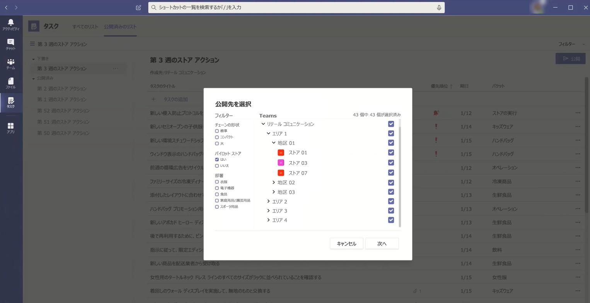

# <a name="set-up-your-team-targeting-hierarchy"></a><span data-ttu-id="35a37-103">チームターゲット設定の階層を設定する</span><span class="sxs-lookup"><span data-stu-id="35a37-103">Set up your team targeting hierarchy</span></span>

> <span data-ttu-id="35a37-104">**現在、この機能はプライベートプレビューに含まれています。**</span><span class="sxs-lookup"><span data-stu-id="35a37-104">**This feature is currently in private preview.**</span></span>

<span data-ttu-id="35a37-105">組織でコンテンツを大規模なチームに公開するために使用できるチームの階層を作成するには、チームのターゲット設定スキーマを設定する必要があります。</span><span class="sxs-lookup"><span data-stu-id="35a37-105">To create a hierarchy of teams that can be used by your organization to publish content to a large set of teams, you need to set up your team targeting schema.</span></span> <span data-ttu-id="35a37-106">スキーマでは、階層内のすべてのチームが互いにどのように関連しているかを定義し、チームをフィルター処理するために使用できる属性を定義します。</span><span class="sxs-lookup"><span data-stu-id="35a37-106">The schema defines how all the teams in your hierarchy are related to each other and the attributes that can be used to filter your teams.</span></span> <span data-ttu-id="35a37-107">スキーマを作成したら、チームにアップロードします。階層は組織全体に適用されます。</span><span class="sxs-lookup"><span data-stu-id="35a37-107">After you create the schema, you upload it to Teams and the hierarchy is applied throughout your organization.</span></span> <span data-ttu-id="35a37-108">スキーマがアップロードされると、Teams クライアント内のアプリでスキーマを使用できるようになります。</span><span class="sxs-lookup"><span data-stu-id="35a37-108">After the schema is uploaded, apps within the Teams client can use it.</span></span> 

> [!IMPORTANT]
> <span data-ttu-id="35a37-109">チームまたはチャネル内のチャネルを参照している場合、teams の階層は表示されません。</span><span class="sxs-lookup"><span data-stu-id="35a37-109">You won't see a hierarchy of teams when you're browsing teams or channels within them.</span></span> <span data-ttu-id="35a37-110">チームの階層を表示するには、それをサポートしているアプリを使用する必要があります。</span><span class="sxs-lookup"><span data-stu-id="35a37-110">To see the hierarchy of teams, you need to use an app that supports it.</span></span> <span data-ttu-id="35a37-111">最初のリリースでは、タスクアプリだけが階層チームをサポートしています。</span><span class="sxs-lookup"><span data-stu-id="35a37-111">For the initial release, only the Tasks app supports hierarchical teams.</span></span> <span data-ttu-id="35a37-112">この記事の残りの部分では、受信者チームへのタスクの発行のコンテキストでのチーム階層のセットアップについて説明します。</span><span class="sxs-lookup"><span data-stu-id="35a37-112">The remainder of this article discusses setting up a team hierarchy in the context of publishing tasks to recipient teams.</span></span> <span data-ttu-id="35a37-113">チームターゲット階層を設定する前に、「[チームのタスクアプリを管理](manage-tasks-app.md)して、タスクの発行の概要を確認する」を参照してください。</span><span class="sxs-lookup"><span data-stu-id="35a37-113">Before you set up your team targeting hierarchy, see [Manage the Tasks app for your organization in Teams](manage-tasks-app.md) for an overview of task publishing.</span></span>

<span data-ttu-id="35a37-114">次の例は、Teams の Tasks アプリで階層がどのように表されるかを示しています。</span><span class="sxs-lookup"><span data-stu-id="35a37-114">Here's an example of how the hierarchy is represented in the Tasks app in Teams.</span></span> <span data-ttu-id="35a37-115">タスクリストが作成された後、発行チームのメンバーは、タスクリストを送信 (公開) する受信者チームを選択することができます。</span><span class="sxs-lookup"><span data-stu-id="35a37-115">After a task list is created, members of the publishing team can then select the recipient teams to send (publish) the task list to.</span></span> <span data-ttu-id="35a37-116">チームを選択すると、発行チームは階層、属性、または両方の組み合わせを使用してフィルターを適用できます。</span><span class="sxs-lookup"><span data-stu-id="35a37-116">When selecting teams, the publishing team can filter by hierarchy, by attributes, or a combination of both.</span></span><br>



## <a name="plan-your-hierarchy"></a><span data-ttu-id="35a37-118">階層を計画する</span><span class="sxs-lookup"><span data-stu-id="35a37-118">Plan your hierarchy</span></span>

<span data-ttu-id="35a37-119">階層を定義するスキーマを作成する前に、組織の形成方法を計画し、決定する必要があります。</span><span class="sxs-lookup"><span data-stu-id="35a37-119">Before you create the schema that defines your hierarchy, you need to do some planning and decide how you want to shape your organization.</span></span> <span data-ttu-id="35a37-120">これには、タスクを他のグループに発行するために必要な組織グループを決定することが含まれます。</span><span class="sxs-lookup"><span data-stu-id="35a37-120">This includes deciding which organizational groups need to publish tasks to other groups.</span></span> <span data-ttu-id="35a37-121">階層内の各ノードは、作業グループまたはグループのグループを表します。</span><span class="sxs-lookup"><span data-stu-id="35a37-121">Each node in the hierarchy represents a working group or group of groups.</span></span> <span data-ttu-id="35a37-122">階層の最下部にあるノード (子がない場合) は、タスクを受け取ることができる teams であり、他のノード (親) は、タスクの下位公開の権限を持つ組織グループです。</span><span class="sxs-lookup"><span data-stu-id="35a37-122">Nodes at the bottom of the hierarchy (those without children) are teams that can receive tasks while other nodes (parents) are organizational groups with permission to publish tasks downward.</span></span> <span data-ttu-id="35a37-123">チームは、階層内で1回のみ表示できます。</span><span class="sxs-lookup"><span data-stu-id="35a37-123">A team can only be represented one time in the hierarchy.</span></span>

<span data-ttu-id="35a37-124">たとえば、次の階層では、取り消し、小売の通信、および人事は、階層内のすべての下位ノード (チーム) にタスクを発行できますが、北米は、ニューヨークの店舗とボストンのストアチームにのみタスクを公開できます。</span><span class="sxs-lookup"><span data-stu-id="35a37-124">For example, in the following hierarchy, Recall, Retail Communications, and HR, can publish tasks to every bottom node (team) in the hierarchy, whereas North East Zone can only publish tasks to the New York Store and Boston Store teams.</span></span> <span data-ttu-id="35a37-125">この階層により、取り消し、小売通信、人事グループは、福利厚生情報や CEO からのメッセージなど、会社全体に適用されるタスクを公開することができます。</span><span class="sxs-lookup"><span data-stu-id="35a37-125">This hierarchy allows the Recall, Retail Communications, and HR groups to publish tasks that apply to the entire company, such as benefits information or messages from the CEO.</span></span> <span data-ttu-id="35a37-126">ノース East ゾーンでは、社員のスケジュール、天気予報などのタスクを、ニューヨークストアとボストンストアチームにのみ公開できます。</span><span class="sxs-lookup"><span data-stu-id="35a37-126">North East Zone can publish tasks, such as personnel scheduling, weather information, and so on, only to the New York Store and Boston Store teams.</span></span>


## <a name="create-your-hierarchy"></a><span data-ttu-id="35a37-128">階層を作成する</span><span class="sxs-lookup"><span data-stu-id="35a37-128">Create your hierarchy</span></span>

<span data-ttu-id="35a37-129">階層を定義するスキーマは、コンマ区切り値 (CSV) ファイルに基づいています。</span><span class="sxs-lookup"><span data-stu-id="35a37-129">The schema that defines your hierarchy is based on a comma-separated values (CSV) file.</span></span> <span data-ttu-id="35a37-130">CSV ファイルの各行は、teams の階層内の1つのノードに対応しています。</span><span class="sxs-lookup"><span data-stu-id="35a37-130">Each row in the CSV file corresponds to one node within the hierarchy of teams.</span></span> <span data-ttu-id="35a37-131">各行には、階層内にノードの名前を指定し、必要に応じてチームにリンクを追加するための情報が含まれており、それをサポートしているアプリでチームをフィルター処理するために使うことができる属性が含まれています。</span><span class="sxs-lookup"><span data-stu-id="35a37-131">Each row contains information that names the node within the hierarchy, optionally links it to a team, and includes attributes that can be used to filter teams in apps that support it.</span></span>

<span data-ttu-id="35a37-132">また、ユーザーが関連性の高いコンテンツを表示、並べ替え、フォーカスするのを容易にするために、発行チームが送信するコンテンツの整理に使用できるバケットとして、バケットを定義することもできます。</span><span class="sxs-lookup"><span data-stu-id="35a37-132">You can also define buckets, which are categories that the publishing team can use to organize content sent to recipient teams to make it easier for them to view, sort, and focus on relevant content.</span></span>

### <a name="add-required-columns"></a><span data-ttu-id="35a37-133">必要な列を追加する</span><span class="sxs-lookup"><span data-stu-id="35a37-133">Add required columns</span></span>

<span data-ttu-id="35a37-134">CSV ファイルには、次の3つの列を、最初の列から順に入力する必要があります。</span><span class="sxs-lookup"><span data-stu-id="35a37-134">The CSV file must contain the following three columns, in the following order, starting at the first column.</span></span> <span data-ttu-id="35a37-135">タスクを受け取るには、ノードがチームにリンクされている必要があります。</span><span class="sxs-lookup"><span data-stu-id="35a37-135">A node must be linked to a team for it to receive tasks.</span></span> <span data-ttu-id="35a37-136">プライベートプレビューの際に、500ノードをサポートしています。</span><span class="sxs-lookup"><span data-stu-id="35a37-136">During private preview, we support 500 nodes.</span></span> <span data-ttu-id="35a37-137">起動時には、少なくとも2000ノードが既定でサポートされることを想定しています。</span><span class="sxs-lookup"><span data-stu-id="35a37-137">At launch, we expect to support at least 2,000 nodes by default.</span></span> <span data-ttu-id="35a37-138">お客様と協力して、大規模な組織でこの制限を引き上げることを計画しています。</span><span class="sxs-lookup"><span data-stu-id="35a37-138">We plan to work with customers to raise this limit for larger organizations.</span></span>

| <span data-ttu-id="35a37-139">列名</span><span class="sxs-lookup"><span data-stu-id="35a37-139">Column name</span></span>   | <span data-ttu-id="35a37-140">必須</span><span class="sxs-lookup"><span data-stu-id="35a37-140">Required</span></span> | <span data-ttu-id="35a37-141">説明</span><span class="sxs-lookup"><span data-stu-id="35a37-141">Description</span></span>   |
----------------|----------|---------------|
| <span data-ttu-id="35a37-142">Storyboard.targetname</span><span class="sxs-lookup"><span data-stu-id="35a37-142">TargetName</span></span>    | <span data-ttu-id="35a37-143">はい</span><span class="sxs-lookup"><span data-stu-id="35a37-143">Yes</span></span>      | <span data-ttu-id="35a37-144">これはノードの名前です。</span><span class="sxs-lookup"><span data-stu-id="35a37-144">This is the name of the node.</span></span> <span data-ttu-id="35a37-145">名前は、最大100文字で、A-z、a-z、0-9 の文字だけを含むことができます。</span><span class="sxs-lookup"><span data-stu-id="35a37-145">The name can be up to 100 characters long and contain only the characters A-Z, a-z, and 0-9.</span></span> <span data-ttu-id="35a37-146">ノード名は一意である必要があります。</span><span class="sxs-lookup"><span data-stu-id="35a37-146">Node names must be unique.</span></span> |
| <span data-ttu-id="35a37-147">ParentName</span><span class="sxs-lookup"><span data-stu-id="35a37-147">ParentName</span></span>    | <span data-ttu-id="35a37-148">はい</span><span class="sxs-lookup"><span data-stu-id="35a37-148">Yes</span></span>       | <span data-ttu-id="35a37-149">これは、親ノードの名前です。</span><span class="sxs-lookup"><span data-stu-id="35a37-149">This is the name of the parent node.</span></span> <span data-ttu-id="35a37-150">ここで指定する値は、親ノードの TargetName フィールドの値と正確に一致する必要があります。</span><span class="sxs-lookup"><span data-stu-id="35a37-150">The value you specify here must match the value in the TargetName field of the parent node exactly.</span></span> <span data-ttu-id="35a37-151">複数の親ノードを追加する場合は、各親ノード名をセミコロン (;)) で区切ります。</span><span class="sxs-lookup"><span data-stu-id="35a37-151">If you want to add more than one parent node, separate each parent node name with a semicolon (;).</span></span> <span data-ttu-id="35a37-152">最大25個の親ノードを追加できます。各親ノード名は、最大2500文字まで指定できます。</span><span class="sxs-lookup"><span data-stu-id="35a37-152">You can add up to 25 parent nodes, and each parent node name can be up to 2500 characters long.</span></span> <span data-ttu-id="35a37-153">ノードには、親ノードがルートノードの場合にのみ、複数の親ノードを含めることができます。</span><span class="sxs-lookup"><span data-stu-id="35a37-153">A node can have multiple parent nodes only if the parent nodes are root nodes.</span></span>   <br><br><span data-ttu-id="35a37-154">**重要**階層の上位の親が、階層の下位の子ノードを参照するループを作成しないように注意してください。</span><span class="sxs-lookup"><span data-stu-id="35a37-154">**IMPORTANT** Be careful not to create a loop where a parent higher up in the hierarchy references a child node lower in the hierarchy.</span></span> <span data-ttu-id="35a37-155">これはサポートされていません。</span><span class="sxs-lookup"><span data-stu-id="35a37-155">This isn't supported.</span></span> |
| <span data-ttu-id="35a37-156">TeamID</span><span class="sxs-lookup"><span data-stu-id="35a37-156">TeamID</span></span>        | <span data-ttu-id="35a37-157">○ (チームが親ノードからタスクを発行するか、タスクを受け取る場合)</span><span class="sxs-lookup"><span data-stu-id="35a37-157">Yes, if the team publishes tasks or receives tasks from a parent node</span></span>       | <span data-ttu-id="35a37-158">これには、ノードをリンクさせるチームの ID が含まれます。</span><span class="sxs-lookup"><span data-stu-id="35a37-158">This contains the ID of the team you want to link a node to.</span></span> <span data-ttu-id="35a37-159">ノードが階層の一番下にある場合は、そのノードからユーザーを公開できるようにする必要がある場合、またはユーザーがそのノードとその子孫のレポートを表示できるようにする場合は、そのノードがチームにリンクされている必要があります。</span><span class="sxs-lookup"><span data-stu-id="35a37-159">A node must be linked to a team if it's is at the bottom of your hierarchy, if you want users to be able to publish from that node, or if you want users to be able to see reporting for that node and its descendants.</span></span> <span data-ttu-id="35a37-160">たとえば、西部地域の Office のマネージャーで、その地域に属するノードのタスク完了レポートを表示するとします。</span><span class="sxs-lookup"><span data-stu-id="35a37-160">For example, if your manager for the West Region Office wants to see task completion reporting for the nodes that belong in that region.</span></span><br><br><span data-ttu-id="35a37-161">階層内の他のノードをグループ化する目的でのみノードを追加する場合は、そのノードをチームにリンクする必要はありません。このフィールドは空白のままにすることができます。</span><span class="sxs-lookup"><span data-stu-id="35a37-161">If you want to add a node only for the purpose of grouping other nodes in the hierarchy, you don't need to link that node to a team and can leave this field blank.</span></span> <span data-ttu-id="35a37-162">各ノードをリンクできるチームは1つだけです。</span><span class="sxs-lookup"><span data-stu-id="35a37-162">You can link each node to only one team.</span></span><br><span data-ttu-id="35a37-163">ノードをリンクさせるチームの ID を取得するには、次の PowerShell コマンドを実行し`Get-Team | Export-Csv TeamList.csv`ます。</span><span class="sxs-lookup"><span data-stu-id="35a37-163">To get the ID of a team you want to link a node to, run the following PowerShell command: `Get-Team | Export-Csv TeamList.csv`.</span></span> <span data-ttu-id="35a37-164">組織内のチームの一覧が表示され、各チームの名前と ID が含まれます。</span><span class="sxs-lookup"><span data-stu-id="35a37-164">This lists the teams in your organization and includes the name and ID for each team.</span></span> <span data-ttu-id="35a37-165">リンク先のチームの名前を見つけ、その ID をこのフィールドにコピーします。</span><span class="sxs-lookup"><span data-stu-id="35a37-165">Find the name of the team you want to link to, and then copy the ID into this field.</span></span>|

### <a name="add-attribute-columns"></a><span data-ttu-id="35a37-166">属性列を追加する</span><span class="sxs-lookup"><span data-stu-id="35a37-166">Add attribute columns</span></span>

<span data-ttu-id="35a37-167">必要な3つの列を追加した後で、省略可能な属性列を追加できます。</span><span class="sxs-lookup"><span data-stu-id="35a37-167">After you add the three required columns, you can add optional attribute columns.</span></span> <span data-ttu-id="35a37-168">これらの属性は、ノードをフィルター処理するために使用できます。これにより、タスクの発行先を簡単に選ぶことができます。</span><span class="sxs-lookup"><span data-stu-id="35a37-168">These attributes can be used to filter nodes so that you can more easily select the ones you want to publish tasks to.</span></span> <span data-ttu-id="35a37-169">属性を定義するには、2つの方法があります。その属性の値が相互排他的であるかどうかによって異なります。</span><span class="sxs-lookup"><span data-stu-id="35a37-169">There are two ways to define your attributes, depending on whether values for that attribute are mutually exclusive.</span></span>

|<span data-ttu-id="35a37-170">属性を追加する方法</span><span class="sxs-lookup"><span data-stu-id="35a37-170">Ways to add attributes</span></span>|<span data-ttu-id="35a37-171">説明</span><span class="sxs-lookup"><span data-stu-id="35a37-171">Description</span></span> |<span data-ttu-id="35a37-172">例</span><span class="sxs-lookup"><span data-stu-id="35a37-172">Example</span></span>  |
|---|---------|---------|
|<span data-ttu-id="35a37-173">属性の値が相互に排他的な場合、指定した列名が属性の名前になります。</span><span class="sxs-lookup"><span data-stu-id="35a37-173">If the values for an attribute are mutually exclusive, the column name you specify becomes the name of the attribute.</span></span>|<span data-ttu-id="35a37-174">各行には、その属性の値を1つ含めることができます。各値は、最大100文字まで指定できます。</span><span class="sxs-lookup"><span data-stu-id="35a37-174">Each row can contain one value for that attribute, and each value can be up to 100 characters long.</span></span> <span data-ttu-id="35a37-175">属性列で指定した属性値のセットは、階層を使用する Teams アプリ内のその属性に使用可能なフィルター値として表示されます。</span><span class="sxs-lookup"><span data-stu-id="35a37-175">The set of attribute values you specify in the attribute column will be displayed as available filter values for that attribute in Teams apps that use the hierarchy.</span></span> <span data-ttu-id="35a37-176">各属性列は、最大50の一意の値を持つことができます。</span><span class="sxs-lookup"><span data-stu-id="35a37-176">Each attribute column can have up to 50 unique values.</span></span> |<span data-ttu-id="35a37-177">ユーザーがレイアウトに基づいてストアにフィルターを適用できるようにする場合。</span><span class="sxs-lookup"><span data-stu-id="35a37-177">You want users to be able to filter stores by layout.</span></span> <span data-ttu-id="35a37-178">この属性の値は、ストアは1つのレイアウトしか持つことができないため、相互に排他的です。</span><span class="sxs-lookup"><span data-stu-id="35a37-178">The values for this attribute are mutually exclusive because a store can have only one layout.</span></span> <br><br><span data-ttu-id="35a37-179">属性を追加して、ストアのレイアウトをフィルター処理するには、[ストアレイアウト] という名前の列を追加します。</span><span class="sxs-lookup"><span data-stu-id="35a37-179">To add an attribute to filter stores by layout, add a column named Store layout.</span></span> <span data-ttu-id="35a37-180">この例では、ストアのレイアウト属性の値がコンパクト、標準、大です。</span><span class="sxs-lookup"><span data-stu-id="35a37-180">In this example, values for the Store layout attribute are Compact, Standard, and Large.</span></span>
|<span data-ttu-id="35a37-181">属性に複数の値を指定する必要があり、その値が相互に排他的でない場合は、列名に**AttributeName: UniqueValue**形式を使用します。</span><span class="sxs-lookup"><span data-stu-id="35a37-181">If you need to indicate multiple values for an attribute and the values aren't mutually exclusive, use the **AttributeName:UniqueValue** format for the column names.</span></span> |<span data-ttu-id="35a37-182">コロンの前にあるテキスト文字列 (:)は、属性の名前になります。</span><span class="sxs-lookup"><span data-stu-id="35a37-182">The text string before the colon (:) becomes the name of the attribute.</span></span> <span data-ttu-id="35a37-183">コロンの前に同じテキスト文字列を含むすべての列 (:)は、[フィルター] メニューのセクションにグループ化されています。</span><span class="sxs-lookup"><span data-stu-id="35a37-183">All columns that contain the same text string before the colon (:) are grouped together into a section in the filtering menu.</span></span> <span data-ttu-id="35a37-184">コロンの後の各文字列は、そのセクションの値になります。</span><span class="sxs-lookup"><span data-stu-id="35a37-184">Each of the strings after the colon become the values for that section.</span></span><br><br><span data-ttu-id="35a37-185">各行の値は、その属性に対して 0 (ゼロ) または1にすることができます。</span><span class="sxs-lookup"><span data-stu-id="35a37-185">Each row can have a value of 0 (zero) or 1 for that attribute.</span></span> <span data-ttu-id="35a37-186">値0は、属性がノードに適用されないことを意味し、値1は属性がそのノードに適用されることを意味します。</span><span class="sxs-lookup"><span data-stu-id="35a37-186">A value of 0 means that the attribute doesn't apply to the node and a value of 1 means that the attribute applies to that node.</span></span>|<span data-ttu-id="35a37-187">ユーザーが部門ごとにストアにフィルターを適用できるようにする場合。</span><span class="sxs-lookup"><span data-stu-id="35a37-187">You want users to be able to filter stores by department.</span></span> <span data-ttu-id="35a37-188">ストアは複数の部署を持つことができるため、この属性の値は相互に排他的ではありません。</span><span class="sxs-lookup"><span data-stu-id="35a37-188">A store can have multiple departments and so the values for this attribute aren't mutually exclusive.</span></span><br><br><span data-ttu-id="35a37-189">この例では、部門を追加しています。衣類、部署: エレクトロニクス、部署: 食品、部署: ホームと庭園、部門: スポーツ商品を属性列として追加します。</span><span class="sxs-lookup"><span data-stu-id="35a37-189">In this example, we add Departments:Clothing, Departments:Electronics, Departments:Foods, Departments:Home and Garden, Departments:Sporting goods as attribute columns.</span></span> <span data-ttu-id="35a37-190">部門は属性名になり、ユーザーは衣類、エレクトロニクス、食品、家庭、庭園、スポーツ用品の各部門によるフィルター処理を行うことができます。</span><span class="sxs-lookup"><span data-stu-id="35a37-190">Departments becomes the attribute name and users can filter by the Clothing, Electronics, Foods, Home and Garden, and Sporting goods departments.</span></span>|

<span data-ttu-id="35a37-191">属性列を追加する場合は、次の点に注意してください。</span><span class="sxs-lookup"><span data-stu-id="35a37-191">When you add an attribute column, keep the following in mind:</span></span>

- <span data-ttu-id="35a37-192">指定した列名、またはコロンの前に指定した列名 (:)は、属性の名前になります。</span><span class="sxs-lookup"><span data-stu-id="35a37-192">The column name you specify or the column name that you specify before the colon (:) becomes the name of the attribute.</span></span> <span data-ttu-id="35a37-193">この値は、階層を使用する Teams アプリに表示されます。</span><span class="sxs-lookup"><span data-stu-id="35a37-193">This value will be displayed in the Teams apps that use the hierarchy.</span></span>
- <span data-ttu-id="35a37-194">列名は、最大100文字で、文字 A-z、a-z、0-9、およびスペースのみを含めることができます。</span><span class="sxs-lookup"><span data-stu-id="35a37-194">The column name can be up to 100 characters long and contain only the characters A-Z, a-z, and 0-9, and spaces.</span></span> <span data-ttu-id="35a37-195">列名は一意である必要があります。</span><span class="sxs-lookup"><span data-stu-id="35a37-195">Column names must be unique.</span></span>
- <span data-ttu-id="35a37-196">起動時に、50の属性列を許可する予定です。</span><span class="sxs-lookup"><span data-stu-id="35a37-196">At launch, we plan to allow 50 attribute columns.</span></span>

### <a name="add-bucket-columns"></a><span data-ttu-id="35a37-197">バケット列を追加する</span><span class="sxs-lookup"><span data-stu-id="35a37-197">Add bucket columns</span></span>

<span data-ttu-id="35a37-198">バケット列を追加して、バケットを作成することができます。これは、どのタスクを整理できるかというグループ化です。</span><span class="sxs-lookup"><span data-stu-id="35a37-198">You can add bucket columns to create buckets, which are groupings into which tasks can be organized.</span></span> <span data-ttu-id="35a37-199">各バケットは、CSV ファイルで独自の列を取得します。</span><span class="sxs-lookup"><span data-stu-id="35a37-199">Each bucket gets its own column in the CSV file.</span></span> <span data-ttu-id="35a37-200">作成したバケットは、発行チームに対して利用可能になります。</span><span class="sxs-lookup"><span data-stu-id="35a37-200">The buckets you create are made available to the publishing team.</span></span> <span data-ttu-id="35a37-201">公開チームは、これらのバケットを使用して、受信者チームのタスクを分類できます。</span><span class="sxs-lookup"><span data-stu-id="35a37-201">The publishing team can then use these buckets to categorize tasks for the recipient teams.</span></span> <span data-ttu-id="35a37-202">バケットがチームにまだ存在しない場合は、タスクが公開されるときにバケットがオンデマンドで作成されます。</span><span class="sxs-lookup"><span data-stu-id="35a37-202">If a bucket doesn't already exist on a team, buckets are created on-demand when tasks are published.</span></span>

<span data-ttu-id="35a37-203">作業を1か所で分類することにより、発行チームは、タスクリストを受信する、数十、数百、または数千の受信者チームのタスクリストを事前に整理できます。</span><span class="sxs-lookup"><span data-stu-id="35a37-203">By categorizing the work one time centrally, the publishing team can pre-organize the task list for all the tens, hundreds, or thousands of recipient teams that receive the task list.</span></span> <span data-ttu-id="35a37-204">受信者のチームは、バケットごとにタスクを並べ替え、フィルター処理して、作業に最も関連性の高い領域にフォーカスを移動することができます。</span><span class="sxs-lookup"><span data-stu-id="35a37-204">The recipient teams can then sort and filter their tasks by bucket to focus on the area most relevant to their work.</span></span>

<span data-ttu-id="35a37-205">バケット列を追加する場合は、次の点に注意してください。</span><span class="sxs-lookup"><span data-stu-id="35a37-205">When you add a bucket column, note the following:</span></span>

- <span data-ttu-id="35a37-206">列名は、バケットの名前になります。</span><span class="sxs-lookup"><span data-stu-id="35a37-206">The column name becomes the name of the bucket.</span></span> <span data-ttu-id="35a37-207">指定した各バケットは、階層を使用する Teams アプリのバケットリストに表示されます。</span><span class="sxs-lookup"><span data-stu-id="35a37-207">Each bucket you specify will appear in the Buckets list in the Teams apps that use the hierarchy.</span></span> <span data-ttu-id="35a37-208">バケット名には機密情報を含めないことをお勧めします。</span><span class="sxs-lookup"><span data-stu-id="35a37-208">We recommend that you don't include sensitive information in bucket names.</span></span> <span data-ttu-id="35a37-209">現時点では、発行チームは、作成後に発行を通じてバケットを削除することはできません。</span><span class="sxs-lookup"><span data-stu-id="35a37-209">At this time, publishing teams can't remove a bucket through publishing after it's created.</span></span>
- <span data-ttu-id="35a37-210">列名の前にハッシュタグ (#) を付ける必要があります。</span><span class="sxs-lookup"><span data-stu-id="35a37-210">The column name must be preceded by a hashtag (#).</span></span> <span data-ttu-id="35a37-211">長さは最大100文字で、A-z、a-z、0-9 の文字だけが含まれます。</span><span class="sxs-lookup"><span data-stu-id="35a37-211">It can be up to 100 characters long and contain only the characters A-Z, a-z, and 0-9.</span></span> <span data-ttu-id="35a37-212">たとえば、商品の #Operations や #Frozen ができます。</span><span class="sxs-lookup"><span data-stu-id="35a37-212">For example, #Operations and #Frozen Goods.</span></span>
- <span data-ttu-id="35a37-213">起動時に25個のバケット列がサポートされることを想定しています。</span><span class="sxs-lookup"><span data-stu-id="35a37-213">At launch, we expect to support 25 bucket columns.</span></span> <span data-ttu-id="35a37-214">大規模な組織では、お客様と協力してこの制限を拡大する予定です。</span><span class="sxs-lookup"><span data-stu-id="35a37-214">We plan to work with customers to increase this limit for larger organizations.</span></span>

### <a name="example"></a><span data-ttu-id="35a37-215">例</span><span class="sxs-lookup"><span data-stu-id="35a37-215">Example</span></span>

<span data-ttu-id="35a37-216">上の画像で示されている階層をサポートするために作成されるスキーマ CSV ファイルの例を次に示します。</span><span class="sxs-lookup"><span data-stu-id="35a37-216">Here's an example of a schema CSV file that would be created to support the hierarchy shown in the image above.</span></span> <span data-ttu-id="35a37-217">このスキーマには、次の要素が含まれます。</span><span class="sxs-lookup"><span data-stu-id="35a37-217">This schema contains the following:</span></span>

- <span data-ttu-id="35a37-218">"And" と`TargetName`いう`ParentName`名前の3つの必須列`TeamID`</span><span class="sxs-lookup"><span data-stu-id="35a37-218">Three required columns named `TargetName`, `ParentName`, and `TeamID`</span></span>
- <span data-ttu-id="35a37-219">"And" と`Store layout`いう`Departments:Clothing`名前の3つの属性列`Departments:Foods`</span><span class="sxs-lookup"><span data-stu-id="35a37-219">Three attribute columns named `Store layout`, `Departments:Clothing`, and `Departments:Foods`</span></span>
- <span data-ttu-id="35a37-220">"And" と`Fresh Foods`いう`Frozen Foods`名前の3つのバケット列`Womenswear`</span><span class="sxs-lookup"><span data-stu-id="35a37-220">Three bucket columns named `Fresh Foods`, `Frozen Foods`, and `Womenswear`</span></span>

<span data-ttu-id="35a37-221">属性`Store layout`には、、 `Compact` `Standard`、、などの`Large`値が含まれます。</span><span class="sxs-lookup"><span data-stu-id="35a37-221">The `Store layout` attribute has values that include `Compact`, `Standard`, and `Large`.</span></span> <span data-ttu-id="35a37-222">`Departments`属性列は、の`0`値 (ゼロ) または`1`に設定できます。</span><span class="sxs-lookup"><span data-stu-id="35a37-222">The `Departments` attribute columns can be set to a value of `0` (zero) or `1`.</span></span> <span data-ttu-id="35a37-223">レイアウト`Store`と`Departments`属性は上の画像には表示されません。</span><span class="sxs-lookup"><span data-stu-id="35a37-223">The `Store` layout and `Departments` attributes aren't shown in the image above.</span></span> <span data-ttu-id="35a37-224">これらは、属性をノードエントリに追加する方法を示すために追加されています。</span><span class="sxs-lookup"><span data-stu-id="35a37-224">They're added here to help show how attributes can be added to node entries.</span></span> <span data-ttu-id="35a37-225">3つのバケット列にも同じことが当てはまります。</span><span class="sxs-lookup"><span data-stu-id="35a37-225">The same is true for the three bucket columns.</span></span>


| <span data-ttu-id="35a37-226">Storyboard.targetname</span><span class="sxs-lookup"><span data-stu-id="35a37-226">TargetName</span></span>             | <span data-ttu-id="35a37-227">ParentName</span><span class="sxs-lookup"><span data-stu-id="35a37-227">ParentName</span></span>                      | <span data-ttu-id="35a37-228">TeamID</span><span class="sxs-lookup"><span data-stu-id="35a37-228">TeamID</span></span>                       | <span data-ttu-id="35a37-229">ストアレイアウト</span><span class="sxs-lookup"><span data-stu-id="35a37-229">Store layout</span></span>|<span data-ttu-id="35a37-230">部門: 衣類</span><span class="sxs-lookup"><span data-stu-id="35a37-230">Departments:Clothing</span></span>|<span data-ttu-id="35a37-231">部署: 食品</span><span class="sxs-lookup"><span data-stu-id="35a37-231">Departments:Foods</span></span>|<span data-ttu-id="35a37-232">#Fresh 食品</span><span class="sxs-lookup"><span data-stu-id="35a37-232">#Fresh Foods</span></span>|<span data-ttu-id="35a37-233">#Frozen 食品</span><span class="sxs-lookup"><span data-stu-id="35a37-233">#Frozen Foods</span></span>|<span data-ttu-id="35a37-234">#Womenswear</span><span class="sxs-lookup"><span data-stu-id="35a37-234">#Womenswear</span></span>|
|------------------------|-------------------------|--------------------------------------|-------------|---|---|---|---|---|
| <span data-ttu-id="35a37-235">呼び出す</span><span class="sxs-lookup"><span data-stu-id="35a37-235">Recall</span></span>                 |                         | <span data-ttu-id="35a37-236">db23e6ba-04a6-412a-95e8-49e5b01943ba</span><span class="sxs-lookup"><span data-stu-id="35a37-236">db23e6ba-04a6-412a-95e8-49e5b01943ba</span></span> |||||||
| <span data-ttu-id="35a37-237">コミュニケーション</span><span class="sxs-lookup"><span data-stu-id="35a37-237">Communications</span></span>         |                         | <span data-ttu-id="35a37-238">145399 cea11030 77 24 倍速、146 8-30 77 797fc</span><span class="sxs-lookup"><span data-stu-id="35a37-238">145399ce-a761-4843-a110-3077249037fc</span></span> |||||||
| <span data-ttu-id="35a37-239">人事</span><span class="sxs-lookup"><span data-stu-id="35a37-239">HR</span></span>                     |                         | <span data-ttu-id="35a37-240">b8f7db91-201c-4cf9-9f7e-90a4894ed8e4</span><span class="sxs-lookup"><span data-stu-id="35a37-240">b8f7db91-201c-4cf9-9f7e-90a4894ed8e4</span></span> |||||||
| <span data-ttu-id="35a37-241">East Office</span><span class="sxs-lookup"><span data-stu-id="35a37-241">East Regional Office</span></span>   |                         |                                      |||||||
| <span data-ttu-id="35a37-242">西部支社</span><span class="sxs-lookup"><span data-stu-id="35a37-242">West Regional Office</span></span>   |                         |                                      |||||||
| <span data-ttu-id="35a37-243">ノース東部領域</span><span class="sxs-lookup"><span data-stu-id="35a37-243">North East Zone</span></span>        | <span data-ttu-id="35a37-244">East Office</span><span class="sxs-lookup"><span data-stu-id="35a37-244">East Regional Office</span></span>    |                                      |||||||
| <span data-ttu-id="35a37-245">南部の東部領域</span><span class="sxs-lookup"><span data-stu-id="35a37-245">South East Zone</span></span>        | <span data-ttu-id="35a37-246">East Office</span><span class="sxs-lookup"><span data-stu-id="35a37-246">East Regional Office</span></span>    |                                      |||||||
| <span data-ttu-id="35a37-247">ニューヨーク店舗</span><span class="sxs-lookup"><span data-stu-id="35a37-247">New York Store</span></span>         | <span data-ttu-id="35a37-248">ノース東部領域</span><span class="sxs-lookup"><span data-stu-id="35a37-248">North East Zone</span></span>         | <span data-ttu-id="35a37-249">e2ba65f6-25e7-488b-b8f0-b8562d5de60a</span><span class="sxs-lookup"><span data-stu-id="35a37-249">e2ba65f6-25e7-488b-b8f0-b8562d5de60a</span></span> |<span data-ttu-id="35a37-250">大</span><span class="sxs-lookup"><span data-stu-id="35a37-250">Large</span></span>|<span data-ttu-id="35a37-251">1</span><span class="sxs-lookup"><span data-stu-id="35a37-251">1</span></span>|<span data-ttu-id="35a37-252">1</span><span class="sxs-lookup"><span data-stu-id="35a37-252">1</span></span>||||
| <span data-ttu-id="35a37-253">ボストンストア</span><span class="sxs-lookup"><span data-stu-id="35a37-253">Boston Store</span></span>           | <span data-ttu-id="35a37-254">ノース東部領域</span><span class="sxs-lookup"><span data-stu-id="35a37-254">North East Zone</span></span>         | <span data-ttu-id="35a37-255">0454f08a-0507-437c-969a-682eb2fae7fc</span><span class="sxs-lookup"><span data-stu-id="35a37-255">0454f08a-0507-437c-969a-682eb2fae7fc</span></span> |<span data-ttu-id="35a37-256">Standard</span><span class="sxs-lookup"><span data-stu-id="35a37-256">Standard</span></span>|<span data-ttu-id="35a37-257">1</span><span class="sxs-lookup"><span data-stu-id="35a37-257">1</span></span>|<span data-ttu-id="35a37-258">1</span><span class="sxs-lookup"><span data-stu-id="35a37-258">1</span></span>||||
| <span data-ttu-id="35a37-259">Miami ストア</span><span class="sxs-lookup"><span data-stu-id="35a37-259">Miami Store</span></span>            | <span data-ttu-id="35a37-260">南部の東部領域</span><span class="sxs-lookup"><span data-stu-id="35a37-260">South East Zone</span></span>         | <span data-ttu-id="35a37-261">619d6e4e-5f68-4b36-8e1f-16c98d7396c1</span><span class="sxs-lookup"><span data-stu-id="35a37-261">619d6e4e-5f68-4b36-8e1f-16c98d7396c1</span></span> |<span data-ttu-id="35a37-262">送付</span><span class="sxs-lookup"><span data-stu-id="35a37-262">Compact</span></span>|<span data-ttu-id="35a37-263">0</span><span class="sxs-lookup"><span data-stu-id="35a37-263">0</span></span>|<span data-ttu-id="35a37-264">1</span><span class="sxs-lookup"><span data-stu-id="35a37-264">1</span></span>||||
| <span data-ttu-id="35a37-265">新しいニューオーリンズストア</span><span class="sxs-lookup"><span data-stu-id="35a37-265">New Orleans Store</span></span>      | <span data-ttu-id="35a37-266">南部の東部領域</span><span class="sxs-lookup"><span data-stu-id="35a37-266">South East Zone</span></span>         | <span data-ttu-id="35a37-267">6be960b8-72af-4561-a343-9ac4711874eb</span><span class="sxs-lookup"><span data-stu-id="35a37-267">6be960b8-72af-4561-a343-9ac4711874eb</span></span> |<span data-ttu-id="35a37-268">送付</span><span class="sxs-lookup"><span data-stu-id="35a37-268">Compact</span></span>|<span data-ttu-id="35a37-269">0</span><span class="sxs-lookup"><span data-stu-id="35a37-269">0</span></span>|<span data-ttu-id="35a37-270">1</span><span class="sxs-lookup"><span data-stu-id="35a37-270">1</span></span>||||
| <span data-ttu-id="35a37-271">シアトル店舗</span><span class="sxs-lookup"><span data-stu-id="35a37-271">Seattle Store</span></span>          | <span data-ttu-id="35a37-272">西部支社</span><span class="sxs-lookup"><span data-stu-id="35a37-272">West Regional Office</span></span>    | <span data-ttu-id="35a37-273">487c0d20-4e55-4dc2-8187-a24c826e0fee</span><span class="sxs-lookup"><span data-stu-id="35a37-273">487c0d20-4e55-4dc2-8187-a24c826e0fee</span></span> |<span data-ttu-id="35a37-274">Standard</span><span class="sxs-lookup"><span data-stu-id="35a37-274">Standard</span></span>|<span data-ttu-id="35a37-275">1</span><span class="sxs-lookup"><span data-stu-id="35a37-275">1</span></span>|<span data-ttu-id="35a37-276">1</span><span class="sxs-lookup"><span data-stu-id="35a37-276">1</span></span>||||
| <span data-ttu-id="35a37-277">ロサンゼルス店舗</span><span class="sxs-lookup"><span data-stu-id="35a37-277">Los Angeles Store</span></span>      | <span data-ttu-id="35a37-278">西部支社</span><span class="sxs-lookup"><span data-stu-id="35a37-278">West Regional Office</span></span>    | <span data-ttu-id="35a37-279">204a12874-efb44 5 a8a2-88 e2389</span><span class="sxs-lookup"><span data-stu-id="35a37-279">204a1287-2efb-4a8a-88e0-56fbaf5a2389</span></span> |<span data-ttu-id="35a37-280">大</span><span class="sxs-lookup"><span data-stu-id="35a37-280">Large</span></span>|<span data-ttu-id="35a37-281">1</span><span class="sxs-lookup"><span data-stu-id="35a37-281">1</span></span>|<span data-ttu-id="35a37-282">1</span><span class="sxs-lookup"><span data-stu-id="35a37-282">1</span></span>||||

## <a name="apply-your-hierarchy"></a><span data-ttu-id="35a37-283">階層を適用する</span><span class="sxs-lookup"><span data-stu-id="35a37-283">Apply your hierarchy</span></span>

> [!IMPORTANT]
> <span data-ttu-id="35a37-284">この手順を実行するには、PowerShell テストギャラリーから最新バージョンの Teams PowerShell モジュールをインストールして使用する必要があります。</span><span class="sxs-lookup"><span data-stu-id="35a37-284">To perform this step, you must install and use the latest version of the Teams PowerShell module from the PowerShell Test Gallery.</span></span> <span data-ttu-id="35a37-285">この方法については、「 [Powershell テストギャラリーから最新の Teams powershell モジュールをインストール](#install-the-latest-teams-powershell-module-from-the-powershell-test-gallery)する」を参照してください。</span><span class="sxs-lookup"><span data-stu-id="35a37-285">For steps on how to do this, see [Install the latest Teams PowerShell module from the PowerShell Test Gallery](#install-the-latest-teams-powershell-module-from-the-powershell-test-gallery).</span></span>

<span data-ttu-id="35a37-286">スキーマ CSV ファイルで階層を定義したら、それを Teams にアップロードできます。</span><span class="sxs-lookup"><span data-stu-id="35a37-286">After you've defined your hierarchy in the schema CSV file, you're ready to upload it to Teams.</span></span> <span data-ttu-id="35a37-287">これを行うには、次のコマンドを実行します。</span><span class="sxs-lookup"><span data-stu-id="35a37-287">To do this, run the following command.</span></span> <span data-ttu-id="35a37-288">この手順を実行するには、管理者である必要があります。</span><span class="sxs-lookup"><span data-stu-id="35a37-288">You must be an admin to perform this step.</span></span> 

```powershell
Set-TeamTargetingHierarchy -FilePath "C:\ContosoTeamSchema.csv"
```

## <a name="remove-your-hierarchy"></a><span data-ttu-id="35a37-289">階層を削除する</span><span class="sxs-lookup"><span data-stu-id="35a37-289">Remove your hierarchy</span></span>

> [!IMPORTANT]
> <span data-ttu-id="35a37-290">この手順を実行するには、PowerShell テストギャラリーから最新バージョンの Teams PowerShell モジュールをインストールして使用する必要があります。</span><span class="sxs-lookup"><span data-stu-id="35a37-290">To perform this step, you must install and use the latest version of the Teams PowerShell module from the PowerShell Test Gallery.</span></span> <span data-ttu-id="35a37-291">この方法については、「 [Powershell テストギャラリーから最新の Teams powershell モジュールをインストール](#install-the-latest-teams-powershell-module-from-the-powershell-test-gallery)する」を参照してください。</span><span class="sxs-lookup"><span data-stu-id="35a37-291">For steps on how to do this, see [Install the latest Teams PowerShell module from the PowerShell Test Gallery](#install-the-latest-teams-powershell-module-from-the-powershell-test-gallery).</span></span>

<span data-ttu-id="35a37-292">組織内のすべてのユーザーに対して [**発行済みのリスト**] タブをすぐに無効にする場合は、階層を削除できます。</span><span class="sxs-lookup"><span data-stu-id="35a37-292">If you want to immediately disable the **Published lists** tab for all users in your organization, you can remove your hierarchy.</span></span> <span data-ttu-id="35a37-293">ユーザーは、[**発行済みリスト**] タブまたはタブのいずれかの機能にアクセスできません。 これには、発行するための新しいタスクリストを作成したり、下書きリストにアクセスしたり、リストにアクセスしたり、リストを公開したり、レポートを表示したりする機能が含まれます。</span><span class="sxs-lookup"><span data-stu-id="35a37-293">Users won't have access to the **Published lists** tab or any of the functionality on the tab.  This includes the ability to create new task lists to publish, access draft lists, publish, unpublish, and duplicate lists, and view reporting.</span></span> <span data-ttu-id="35a37-294">階層を削除しても、以前に公開されたタスクは発行されません。</span><span class="sxs-lookup"><span data-stu-id="35a37-294">Removing the hierarchy doesn't unpublish tasks that were previously published.</span></span> <span data-ttu-id="35a37-295">これらのタスクは、受信者のチームが完了するまで、引き続き利用できます。</span><span class="sxs-lookup"><span data-stu-id="35a37-295">These tasks will remain available for recipient teams to complete.</span></span> 

<span data-ttu-id="35a37-296">階層を削除するには、次のコマンドを実行します。</span><span class="sxs-lookup"><span data-stu-id="35a37-296">To remove your hierarchy, run the following command.</span></span> <span data-ttu-id="35a37-297">この手順を実行するには、管理者である必要があります。</span><span class="sxs-lookup"><span data-stu-id="35a37-297">You must be an admin to perform this step.</span></span> 

```powershell
Remove-TeamTargetingHierarchy
```

### <a name="teams-powershell-module"></a><span data-ttu-id="35a37-298">Teams Powershell モジュール</span><span class="sxs-lookup"><span data-stu-id="35a37-298">Teams Powershell module</span></span>

#### <a name="install-the-latest-teams-powershell-module-from-the-powershell-test-gallery"></a><span data-ttu-id="35a37-299">PowerShell テストギャラリーから最新の Teams PowerShell モジュールをインストールする</span><span class="sxs-lookup"><span data-stu-id="35a37-299">Install the latest Teams PowerShell module from the PowerShell Test Gallery</span></span>

<span data-ttu-id="35a37-300">最新の一般公開バージョンの Teams PowerShell モジュール (現在[1.0.5](https://www.powershellgallery.com/packages/MicrosoftTeams/1.0.5)) では、チーム階層の管理はサポートされていません。</span><span class="sxs-lookup"><span data-stu-id="35a37-300">The latest publicly available version of the Teams PowerShell module (currently [1.0.5](https://www.powershellgallery.com/packages/MicrosoftTeams/1.0.5)) doesn't support managing the team hierarchy.</span></span> <span data-ttu-id="35a37-301">次の手順を使用して、PowerShell テストギャラリーから、team hierarchy サポートを含む最新バージョンの Teams PowerShell モジュールをインストールします。</span><span class="sxs-lookup"><span data-stu-id="35a37-301">Use these steps to install the latest version of the Teams PowerShell module, with team hierarchy support, from the PowerShell Test Gallery.</span></span>

> [!NOTE]
> <span data-ttu-id="35a37-302">PowerShell テストギャラリーから、パブリック PowerShell ギャラリーのバージョンのモジュールと共に Teams PowerShell モジュールをインストールしないでください。</span><span class="sxs-lookup"><span data-stu-id="35a37-302">Don't install the Teams PowerShell module from the PowerShell Test Gallery side-by-side with a version of the module from the public PowerShell Gallery.</span></span> <span data-ttu-id="35a37-303">次の手順に従って、最初にパブリック PowerShell ギャラリーから Teams PowerShell モジュールをアンインストールしてから、PowerShell テストギャラリーから最新バージョンのモジュールをインストールします。</span><span class="sxs-lookup"><span data-stu-id="35a37-303">Follow these steps to first uninstall the Teams PowerShell module from the public PowerShell Gallery, and then install the latest version of the module from the PowerShell Test Gallery.</span></span>

1. <span data-ttu-id="35a37-304">既存のすべての PowerShell セッションを終了します。</span><span class="sxs-lookup"><span data-stu-id="35a37-304">Close all existing PowerShell sessions.</span></span>
2. <span data-ttu-id="35a37-305">Windows PowerShell モジュールの新しいインスタンスを開始します。</span><span class="sxs-lookup"><span data-stu-id="35a37-305">Start a new instance of the Windows PowerShell module.</span></span>
3. <span data-ttu-id="35a37-306">パブリック PowerShell ギャラリーから Teams PowerShell モジュールをアンインストールするには、次の操作を実行します。</span><span class="sxs-lookup"><span data-stu-id="35a37-306">Run the following to uninstall the Teams PowerShell module from the public PowerShell Gallery:</span></span>

    ```PowerShell
    Uninstall-Module -Name MicrosoftTeams
    ```

4. <span data-ttu-id="35a37-307">既存のすべての PowerShell セッションを終了します。</span><span class="sxs-lookup"><span data-stu-id="35a37-307">Close all existing PowerShell sessions.</span></span>
5. <span data-ttu-id="35a37-308">もう一度 Windows PowerShell モジュールを起動し、次の操作を実行して、PowerShell テストギャラリーを信頼できるソースとして登録します。</span><span class="sxs-lookup"><span data-stu-id="35a37-308">Start the Windows PowerShell module again, and then run the following to register the PowerShell Test Gallery as a trusted source:</span></span>

    ```PowerShell
    Register-PSRepository -Name PSGalleryInt -SourceLocation https://www.poshtestgallery.com/ -InstallationPolicy Trusted
    ```

6. <span data-ttu-id="35a37-309">次の操作を実行して、PowerShell テストギャラリーから最新の Teams PowerShell モジュールをインストールします。</span><span class="sxs-lookup"><span data-stu-id="35a37-309">Run the following to install the latest Teams PowerShell module from the PowerShell Test Gallery:</span></span>

    ```PowerShell
    Install-Module -Name MicrosoftTeams -Repository PSGalleryInt -Force
    ```

7. <span data-ttu-id="35a37-310">次の操作を実行して、PowerShell テストギャラリーの最新バージョンの Teams PowerShell モジュールが正常にインストールされていることを確認します。</span><span class="sxs-lookup"><span data-stu-id="35a37-310">Run the following to verify that the latest version of the Teams PowerShell module from the PowerShell Test Gallery is successfully installed:</span></span>

    ```PowerShell
    Get-Module -Name MicrosoftTeams
    ```

#### <a name="update-to-the-latest-version-of-the-teams-powershell-module-from-the-powershell-test-gallery"></a><span data-ttu-id="35a37-311">PowerShell テストギャラリーから最新バージョンの Teams PowerShell モジュールに更新する</span><span class="sxs-lookup"><span data-stu-id="35a37-311">Update to the latest version of the Teams PowerShell module from the PowerShell Test Gallery</span></span>

<span data-ttu-id="35a37-312">PowerShell テストギャラリーから既に Teams PowerShell モジュールをインストールしている場合は、次の手順を使用して最新バージョンに更新します。</span><span class="sxs-lookup"><span data-stu-id="35a37-312">If you already installed the Teams PowerShell module from the PowerShell Test Gallery, use the following steps to update to the latest version.</span></span>

1. <span data-ttu-id="35a37-313">既存のすべての PowerShell セッションを終了します。</span><span class="sxs-lookup"><span data-stu-id="35a37-313">Close all existing PowerShell sessions.</span></span>
2. <span data-ttu-id="35a37-314">Windows PowerShell モジュールの新しいインスタンスを開始します。</span><span class="sxs-lookup"><span data-stu-id="35a37-314">Start a new instance of the Windows PowerShell module.</span></span>
3. <span data-ttu-id="35a37-315">次の操作を実行して、PowerShell テストギャラリーから現在インストールされている Teams PowerShell モジュールのバージョンを更新します。</span><span class="sxs-lookup"><span data-stu-id="35a37-315">Run the following to update the currently installed version of the Teams PowerShell module from the PowerShell Test Gallery:</span></span>

    ```PowerShell
    Update-Module -Name MicrosoftTeams -Force
    ```

4. <span data-ttu-id="35a37-316">次の操作を実行して、PowerShell テストギャラリーの最新バージョンの Teams PowerShell モジュールが正常にインストールされていることを確認します。</span><span class="sxs-lookup"><span data-stu-id="35a37-316">Run the following to verify that the latest version of the Teams PowerShell module from the PowerShell Test Gallery is successfully installed:</span></span>

    ```PowerShell
    Get-Module -Name MicrosoftTeams
    ```

## <a name="troubleshooting"></a><span data-ttu-id="35a37-317">トラブルシューティング</span><span class="sxs-lookup"><span data-stu-id="35a37-317">Troubleshooting</span></span>

### <a name="you-receive-an-error-message-when-you-upload-your-schema-file"></a><span data-ttu-id="35a37-318">スキーマファイルをアップロードすると、エラーメッセージが表示される</span><span class="sxs-lookup"><span data-stu-id="35a37-318">You receive an error message when you upload your schema file</span></span>

<span data-ttu-id="35a37-319">エラーメッセージには、スキーマをアップロードできない理由を示すためのトラブルシューティング情報が含まれていることに注意してください。</span><span class="sxs-lookup"><span data-stu-id="35a37-319">Take note of the error message as it should include troubleshooting information to indicate why the schema couldn't be uploaded.</span></span> <span data-ttu-id="35a37-320">エラーメッセージに記載されている情報に基づいて、スキーマ CSV ファイルを確認して編集してから、もう一度やり直してください。</span><span class="sxs-lookup"><span data-stu-id="35a37-320">Review and edit your schema CSV file based on the information in the error message and then try again.</span></span>

## <a name="related-topics"></a><span data-ttu-id="35a37-321">関連項目</span><span class="sxs-lookup"><span data-stu-id="35a37-321">Related topics</span></span>

- [<span data-ttu-id="35a37-322">Teams で組織のタスクアプリを管理する</span><span class="sxs-lookup"><span data-stu-id="35a37-322">Manage the Tasks app for your organization in Teams</span></span>](manage-tasks-app.md)
