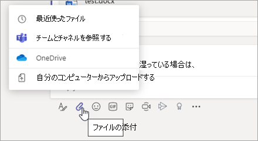
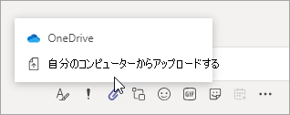
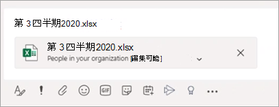
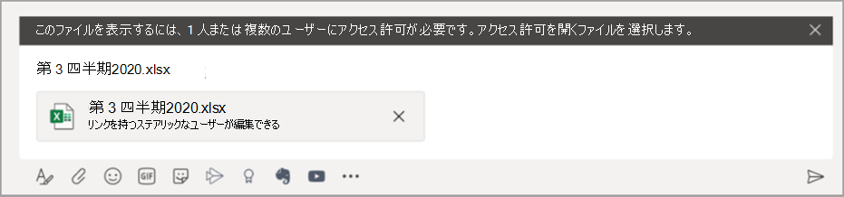

# Microsoft Teams でのファイル共有Sharing files in Microsoft Teams

Microsoft Teams では、ユーザーは組織内外の他の Teams ユーザーとコンテンツを共有できます。In Microsoft Teams, users can share content with other Teams users within and outside their organization. Teams での共有は、SharePoint と OneDrive で構成されている設定に基づいているため、SharePoint と OneDrive のどちらを設定しても、Teams での共有が制御されます。Sharing in Teams is based on the settings configured in SharePoint and OneDrive, so whatever you set up for SharePoint and OneDrive will control sharing in Teams as well.

## 概要Overview

ユーザーは、アクセス権を持つチームやサイトから、または自分のコンピューターからファイルを共有できます。Users can share files from OneDrive, from teams and sites they have access to, and from their computer. ファイルを共有するには、次の操作を行います。To share a file, users can do the following:

- チャネルで、[**添付**] (クリップアイコン) をクリックし、[**最近使用**したファイル] を選択し、[**チームとチャネル**]、[ **OneDrive**] を参照するか、[**マイコンピューターからアップロード**] をクリックして、共有するファイルを選びます。In a channel, click **Attach** (the paperclip icon), select **Recent**, **Browse Teams and Channels**, **OneDrive**, or **Upload from my computer**, and then choose the file they want to share.   
    
- チャットで、[**添付**] (クリップアイコン) をクリック**するか、** [**マイコンピューターからアップロード**] をクリックして、共有するファイルを選択します。In a chat, click **Attach** (the paperclip icon), select  or **OneDrive** or **Upload from my computer**, and then choose the file they want to share.  
    
- 作成ボックスの共有リンクをコピーして貼り付けます。Copy and paste the sharing link in the compose box. 
    

### ファイル共有のエクスペリエンスについて知っておくべきことWhat you need to know about the file sharing experience

### 共有ファイルと共有リンクの権限Permissions of shared files and sharing links

OneDrive またはチームおよびチャネルでファイルを参照してファイルを共有すると、すべての受信者に、[組織レベルで設定された既定のアクセス許可](https://docs.microsoft.com/sharepoint/change-default-sharing-link)が与えられます。When users share a file by browsing to it in OneDrive or teams and channels, all recipients are granted access along with the [default permission that's set at the organization level](https://docs.microsoft.com/sharepoint/change-default-sharing-link).

ユーザーが共有リンクをコピーして貼り付けると、その共有リンクに設定されているアクセス許可が有効になり、SharePoint URL はファイル名に短縮されます。When a user copies and pastes a sharing link, the permissions set on that sharing link are honored and the SharePoint URL is shortened to the file name. つまり、Teams はファイル名だけを使ってファイルにリンクします。In other words, Teams uses just the file name to link to a file.

ユーザーが Teams 内からファイルを共有する場合、Microsoft 365 全体での場合と同様に、ファイルにアクセスできるユーザーを設定することができます。When users share a file from within Teams, they can set who can access the file just like they do across Microsoft 365. ユーザーは、組織内のユーザー、既存のアクセス権を持つユーザー、または特定のユーザーにアクセス権を付与することができます (ユーザーを1:1 チャット、グループチャット、またはチャネルに含めることができます)。They can give access to anyone, people in your organization, people with existing access, or specific people (which can include the people in a 1:1 chat, group chat, or channel).  ファイルが共有されている場合、ファイルのプレビューは、 **[オンラインで開く**]、[**ダウンロード**]、[**コピー**] などのすべてのファイル操作と共に、メッセージで使用できます。When a file is shared, the file preview is available in the message, along with all file actions such as **Open online**, **Download**, and **Copy link**. 既定では、ファイルは Teams で開きます。By default, the file opens in Teams. 場合によっては、ユーザーがメッセージを送信したときに、共有リンクがファイルプレビューに変換されないことがあります。Sometimes, the sharing link may not have converted to a file preview by the time a user sends the message. ファイルプレビューはシステムによって生成されますが、このシナリオでは、ファイル名のみに共有リンクを短縮することはできません。The file preview will be generated by the system, but in this scenario, the sharing link won't be shortened to the only the file name.

ユーザーがチャットまたはチャネルでファイルを共有すると、一部またはすべての受信者にファイルを表示する権限がないかどうかが通知されます。When users share a file in a chat or channel, they're notified whether some or all recipients don't have permission to view the file. ファイルを共有する前に、ファイルのアクセス許可を変更することができます。これで、メッセージに表示されるファイルプレビューの横にある矢印をクリックします。They can change the permissions on the file before they share it by clicking the arrow next to the file preview that now appears in the message.

### Teams で共有リンクをコピーするCopy a sharing link in Teams

ユーザーは、Microsoft 365 と同じように、SharePoint 共有リンクをコピーし、共有権限を変更することができます。Users can copy a SharePoint sharing link and change sharing permissions just like they do across Microsoft 365. 組織内のユーザー、既存のアクセス権を持つユーザー、または特定のユーザーにアクセス権を付与することができます。They can give access to anyone, people in your organization, people with existing access, or specific people. リンクの既定のアクセス許可は、SharePoint のサイトレベルの権限を上書きしない限り、組織レベルで設定された既定の権限セットと同じです。The default permission of the link is the same as the default permission set at the organization level unless SharePoint site level permissions override it.

## OneDrive と SharePoint の共有を構成するConfigure sharing in OneDrive and SharePoint

OneDrive と SharePoint でのファイルの共有について詳しくは、「共有を構成する方法」と「共有を有効または無効にする方法」をご覧ください。For more information about sharing files in OneDrive and SharePoint, including how to configure sharing and how to turn sharing on and off, see:

- [外部共有の概要](https://docs.microsoft.com/sharepoint/external-sharing-overview)-ユーザーが共有している内容や他のユーザーが共有しているときの動作について説明します。[External sharing overview](https://docs.microsoft.com/sharepoint/external-sharing-overview) - describes what happens when users share, depending on what they're sharing and with whom.

- [共有設定を管理](https://docs.microsoft.com/sharepoint/turn-external-sharing-on-or-off)する-グローバルと sharepoint 管理者が Sharepoint と OneDrive の組織レベルの共有設定を変更する方法について説明します。[Manage sharing settings](https://docs.microsoft.com/sharepoint/turn-external-sharing-on-or-off) - describes how global and SharePoint admins can change their organization-level sharing settings for SharePoint and OneDrive.

- [サイトの外部共有を有効または無効](https://docs.microsoft.com/sharepoint/change-external-sharing-site)にする–グローバルと SharePoint 管理者がサイトの外部共有を有効または無効にする方法について説明します。[Turn external sharing on or off for a site](https://docs.microsoft.com/sharepoint/change-external-sharing-site) – describes how global and SharePoint admins can turn external sharing on or off for a site.

- [サイトの既定のリンクの種類を変更](https://docs.microsoft.com/sharepoint/change-default-sharing-link)する-既定のリンクの種類を設定して、より制限されるようにする方法について説明します。[Change the default link type for a site](https://docs.microsoft.com/sharepoint/change-default-sharing-link) - describes how to set the default link type so that it's more restrictive.

## 詳細情報More information

- [Microsoft Teams との SharePoint Online と OneDrive for Business の連携How SharePoint Online and OneDrive for Business interact with Microsoft Teams](sharepoint-onedrive-interact.md)

- [SharePoint とチーム: 共同作業を効率化するSharePoint and Teams: better together](https://techcommunity.microsoft.com/t5/Microsoft-SharePoint-Blog/SharePoint-and-Teams-Better-Together/ba-p/189593)

- [OneDrive のファイルとフォルダーを共有するShare OneDrive files and folders](https://support.office.com/article/Share-OneDrive-files-and-folders-9fcc2f7d-de0c-4cec-93b0-a82024800c07#OS_Type=OneDrive_-_Business)

- [SharePoint のファイルまたはフォルダーを共有するShare SharePoint files or folders](https://support.office.com/article/share-sharepoint-files-or-folders-1fe37332-0f9a-4719-970e-d2578da4941c)
