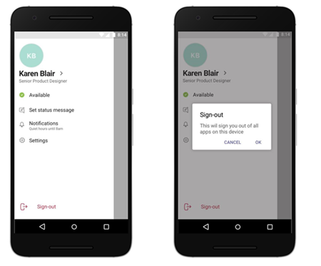

Microsoft Teams にサイン インする
==========================

## Windows ユーザー

Microsoft は、組織が ハイブリッド ドメイン参加構成か Azure AD 参加構成のいずれかで Windows 10 の最新バージョンを使用することを推奨しています。 最新バージョンの使用によって、Windows の Web アカウント マネージャーでユーザーのアカウントが準備され、Teams や他の Microsoft アプリケーションへのシングル サインオンが可能になります。 シングル サインオンにより、ユーザー エクスペリエンス (サイレント サインイン) と、セキュリティ対策が改善されます。

Microsoft Teams は先進認証を使用して、サインイン操作をシンプルかつ安全なものとしています。 ユーザーが Teams にサインインする方法については、「[Teams にサインインする](https://support.office.com/article/sign-in-to-teams-ea4b1443-d11b-4791-8ae1-9977e7723055)」を参照してください。

### 先進認証のしくみ

先進認証とは、ユーザーが資格情報 (職場のメールやパスワードなど) を既に別の場所に入力したことを Teams に知らせ、ユーザーが資格情報を再度入力することを要求されることなくアプリを起動できるようにするためのプロセスです。 ユーザーが Windows を使用しているのか Mac を使用しているのかなど、いつくかの要因によってエクスペリエンスは異なります。 また、組織が単要素認証を有効にしているか多要素認証を有効にしているかによっても異なります。 多要素認証を使用するには通常、電話による資格情報の確認、固有のコードの提供、PIN の入力、拇印の提示が含まれます。 以下は、それぞれの先進認証シナリオの簡単な説明です。

先進認証は、Teams を使用するすべての組織で使用できます。 ユーザーがプロセスを完了できない場合は、組織の Azure AD 構成に根底の問題がある可能性があります。 詳細については、「[Microsoft Teams へのサインインで問題が発生する理由](https://support.office.com/article/why-am-i-having-trouble-signing-in-to-microsoft-teams-a02f683b-61a3-4008-9447-ee60c5593b0f)」を参照してください。

- ユーザーが自分の職場または学校アカウントを使用して既に Windows や別の Office アプリにサインインしている場合、ユーザーが Teams を起動すると、直ちにアプリに移動します。 ユーザーが資格情報を入力する必要はありません。

- Microsoft では、最高のシングル サインオン エクスペリエンスを得るために、Windows 10 のバージョン 1903 以降の使用を推奨しています。

- ユーザーが自分の職場または学校アカウントにいずれのアプリからもサインインしていない場合、ユーザーが Teams を起動すると単一要素認または多要素認証 (SFA または MFA) のどちらかの認証を提供するよう求められます。 このプロセスは、サインイン手順に必要な組織の決定に依存します。

- ドメインに参加しているコンピューターにユーザーがサインインしている場合、ユーザーが Teams を起動すると、MFA を要求するように組織で設定されているかどうか、または、ユーザーのコンピューターへのサインインで既に MFA が要求されているのかどうかにより、もう 1 つ別の認証手順を実行するよう求められる場合があります。 コンピューターへのサインインで既に MFA が要求されている場合、ユーザーが Teams を開くとアプリが自動的に起動します。

- ドメインに参加している PC では、SSO が利用できない場合に、Teams がログイン画面にユーザー プリンシパル名 (UPN) を事前に入力しておく場合があります。 特に組織がオンプレミスと Azure Active Directory で異なる UPN を使用している場合に、これを必要としない場合もあります。 その場合には、次の Windows レジストリ キーを使用して、UPN の事前設定をオフにすることができます。

  Computer\HKEY_CURRENT_USER\Software\Microsoft\Office\Teams 
  SkipUpnPrefill(REG_DWORD) 
  0x00000001 (1)

    > [!NOTE]
    > 「.local」 または 「.corp」 で終わるユーザー名については、ユーザー名の事前入力のスキップは既定でオンになっているため、レジストリ キーを設定してオフにする必要はありません。

### 先進認証を行った後に Teams からサインアウトする

Teams からサインアウトするには、アプリの上部にある自分のプロファイル画像をクリックし、[**サインアウト**] を選択します。タスク バーにあるアプリのアイコンを右クリックして [**ログアウト**] を選択することもできます。一 Teams からサインアウトすると、アプリを起動するには資格情報をもう一度入力する必要があります。

### ドメインに参加しているコンピューター上の別のアカウントにサイン インする

ドメインに参加しているコンピューターのユーザーが、同じ Active Directory ドメイン内の別のアカウントを使用して Teams にサイン インできない場合があります。

## MacOS ユーザー

MacOS 上では、Teams はユーザーにユーザー名と資格情報の入力を促し、組織の設定によっては多要素認証を促す場合もあります。 ユーザーが資格情報を入力すると、入力を再度求められることはありません。 これ以降、ユーザーが同じコンピューターで作業している場合は常に、Teams が自動的に起動します。

## iOS と Android の Teams ユーザー

サインインすると、モバイルユーザーには、デバイス上で現在サインインしているまたは以前にサインインしたすべての Microsoft 365 アカウントの一覧が表示されます。 ユーザーは、任意のアカウントをタップしてサインインできます。 モバイル サインインには2つのシナリオがあります:

1. 選択されたアカウントが他の Office 365 または Microsoft 365 アプリに現在サインインしている場合、そのユーザーは直接 Teams に移動します。 ユーザーは資格情報を入力する必要はありません。

2. ユーザーが他の場所で Microsoft 365 アカウントにサインインしていない場合は、組織がモバイル サインイン ポリシー用に構成した内容に応じて、単一要素認証または多要素認証 (SFA または MFA) を提供するように求められます。

> [!NOTE]
> ユーザーがこのセクションで説明するサインオン エクスペリエンスを体験するには、デバイスで iOS バージョン 2.0.13 (ビルド 2020061704) 以降の Teams、または Android バージョン 1416/1.0.0.2020061702 以降の Teams を実行している必要があります。

## 複数のアカウントを使っての Teams の使用

IOS と Android の Teams では、複数の仕事用または学校用、および複数の個人用アカウントを並べて使うことができます。 Teams のデスクトップ  アプリケーションでは1 つの職場または学校のアカウントと 1 つの個人用のアカウントが2020 年 12 月にはサポートされていますが、後日複数の職場/学校のアカウントをサポートできるようになります。

次の画像は、ユーザーが複数のアカウントを Teams モバイル アプリケーション に追加する方法を示しています。

:::image type="content" source="media/sign-in-multiple-accounts.png" alt-text="Teams に複数アカウントを追加":::

## Teams へのサイン インを制限する

組織は、組織が承認したアプリケーションを管理されたデバイで使用する方法を制限しようとする場合があります。たとえば、学生や従業員が他の組織のデータにアクセスするのを制限したり、組織が承認したアプリを個人の目的で使用するのを制限できるようにする場合があります。 これらの制限は、Teams アプリケーションが認識するデバイスポリシーを設定することによって設定できます。   

### モバイル デバイスでのサイン インを制限する方法

iOS と Android の Teams は、IT 管理者に、アカウント構成を Microsoft 365 アカウントに配布する機能を提供します。 この機能は、iOS の[管理対象アプリ構成](https://developer.apple.com/library/archive/samplecode/sc2279/Introduction/Intro.html) チャネルまたは Android の[Android Enterprise](https://developer.android.com/work/managed-configurations) チャネルを使用するすべてのモバイル デバイス管理 （MDM）プロバイダーで機能します。

Microsoft Intune に登録されているユーザーは、Azure Portal の Intune を使用してアカウント構成設定を展開できます。

MDM プロバイダーでアカウント セットアップ構成が構成され、ユーザーがデバイスを登録した後、iOS と Android の Teams は、許可されたアカウントのみ Teams サインイン ページに表示します。 ユーザーはこのページで許可されているアカウントをタップして、サインインできます。

管理対象デバイスの Azure Intune ポータルで次の構成パラメーターを設定します。

|プラットフォーム |キー  |値  |
|---------|---------|---------|
|iOS     |  **IntuneMAMAllowedAccountsOnly**       | **有効**: 使用できるアカウントは、IntuneMAMUPN キーで定義された管理対象ユーザー アカウントのみです。  **無効** (または、大文字と小文字を区別しない **有効** な任意の値): すべてのアカウントを使用できます。        |
|iOS     |   **IntuneMAMUPN**      |   Teams. へのサインインが許可されているアカウントの UPN です。  Intune に登録されているデバイスの場合、{{userprincipalname}} トークンを使用して、登録済みのユーザーアカウントを表すことができます。       |
|Android     |**com.microsoft.intune.mam.AllowedAccountUPNs**         |    このキーで定義された管理対象ユーザーアカウントのみ許可されます。  1 つ以上のセミコロン;]- 区切られた UPNs。  Intune に登録されているデバイスの場合、{{userprincipalname}} トークンを使用して、登録済みのユーザーアカウントを表すことができます。

アカウント セットアップ構成が設定されると、Teams はサインイン機能を制限し、登録されたデバイス上の許可されたアカウントのみにアクセスを許可します。

管理対象の iOS/iPadOS デバイスのアプリ構成ポリシーを作成するには、「[管理対象の iOS/iPadOS デバイスのアプリ構成ポリシーの追加](/mem/intune/apps/app-configuration-policies-use-ios)」を参照してください。

管理対象の Android デバイスのアプリ構成ポリシーを作成するには、「[管理対象の Android デバイスのアプリ構成ポリシーの追加](/mem/intune/apps/app-configuration-policies-use-android)」を参照してください。

### デスクトップ デバイスでのサイン インを制限する方法
Windows および MacOS の Teams アプリは、組織へのサイン インを制限するデバイス ポリシーのサポートを受けています。 ポリシーは、MDM (モバイル デバイス管理) や GPO (グループ ポリシー オブジェクト) などの通常のデバイス管理ソリューションで設定できます。 

このポリシーがデバイスに構成されている場合、ユーザーは、ポリシーで定義されている "テナントの許可リスト" に含まれている Azure AD テナントを使用しているアカウントでのみサインインできます。 ポリシーは、最初のアカウントと追加のアカウントを含むすべてのサイン インに適用されます。 組織が複数の Azure AD テナントにまたがる場合、許可リストに複数のテナント ID を含めることができます。 別のアカウントを追加するためのリンクは、引き続き Teams アプリに表示される場合がありますが、操作はできません。

> [!NOTE]
>1. ポリシーによって制限されるのは、サインインのみです。他の Azure AD テナントでは、ユーザーがゲストとして招待される機能やほかのテナントへの切り替えが制限されることはありません。
>2. このポリシーには Windows  バージョン 1.3.00.30866 以降の Teams および MacOS バージョン 1.3.00.30882(2020 年 11 月半ばにリリースされました) の Teams が必要です。

**Windows** 管理用テンプレート ファイル (ADMX/ADML) のポリシーについては、 「[ダウンロード センター](https://www.microsoft.com/download/details.aspx?id=49030)」を参照してください。 Windows レジストリに手動でキーを設定することもできます。

- 値の名前: RestrictTeamsSignInToAccountsFromTenantList
- 値の種類: 文字列
- 値のデータ: テナント ID またはコンマ区切りのテナント ID のリスト
- パス: 次のいずれかを使用します。

 Computer\HKEY_CURRENT_USER\SOFTWARE\Policies\Microsoft\Cloud\Office\16.0\Teams Computer\HKEY_CURRENT_USER\SOFTWARE\Policies\Microsoft\Office\16.0\Teams Computer\HKEY_CURRENT_USER\SOFTWARE\Microsoft\Office\16.0\Teams

例: ソフトウェア\ポリシー\Microsoft\Office\16.0\Teams\RestrictTeamsSignInToAccountsFromTenantList = テナント ID またはソフトウェア\ポリシー\Microsoft\Office\16.0\Teams\RestrictTeamsSignInToAccountsFromTenantList = テナント ID 1、テナント ID 2、テナント ID 3

MacOS に管理されているデバイス用の **MacOS のポリシー** は、.plist を使用して、サインイン制限を展開します。 構成プロファイルは、(優先順位の名前を示す) キーによって識別されたエントリで構成される .plist ファイルです。その後に、基本設定の性質に応じて、値が表示されます。 値には、単純 (数値など) または複合のいずれかを指定できます。たとえば、基本設定の入れ子リストがあります。

- ドメイン: com.microsoft.teams
- キー: RestrictTeamsSignInToAccountsFromTenantList
- データ型: 文字列
- コメント: Azure AD テナント ID のコンマ区切りのリストを入力します。

## モバイル デバイスのサイン アウト

モバイル ユーザーはメニューに移動して [**その他**] メニューを選択し、[**サインアウト**] を選択することで、Teams からサインアウトできます。サインアウトすると、ユーザーは次にアプリを起動するときに、資格情報を再入力する必要があります。

> [!NOTE]
> Android の Teams はシングル サインオン (SSO) を使用して、サインインの操作を簡素化します。 ユーザーは、Android プラットフォームで完全にログアウトするために、Teams に加えて **すべての** Microsoft アプリからログアウトする必要があります。

### グローバルなサイン インとサイン アウト

Teams Android アプリは、グローバルなサインインとサインアウトをサポートするようになり、現場担当者は手間なしでサインインとサインアウトができるようになりました。 従業員は、共有デバイスプールからデバイスを選択し、1回サインインするだけで、シフト中は"自分のものにする" ということができます。 これらのユーザーは、シフトの最後に、サインアウトすると、デバイスに対してグローバルにサイン アウトできます。 これにより、デバイスから個人情報と会社情報がすべて削除され、デバイスがデバイスプールに返されます。 この機能を利用するには、デバイスを shared モードにする必要があります。 共有デバイスをセットアップする方法の詳細については、「[Androidで共有デバイスモードを使用する方法](/azure/active-directory/develop/tutorial-v2-shared-device-mode#set-up-an-android-device-in-shared-mode) 」を参照してください。

サインイン エクスペリエンスは、Teams の標準的なサインイン操作と似ていますが、サイン アウトは次の2つの画像のようなイメージです。

  

## URL と IP アドレスの範囲

Teams を使用するには、インターネットへの接続が必要です。 Office 365 の各プラン、政府機関向けまたはその他のクラウドを使用するユーザーが到達する必要があるエンドポイントについては、「[Office 365 の URL と IP アドレスの範囲](/office365/enterprise/urls-and-ip-address-ranges)」を参照してください。

> [!IMPORTANT]
> Teams では現在、すべてのユーザーについて、Google の ssl.gstatic.com サービスへの接続 (TCP ポート 443) が要求されています。Gstatic を使用していない場合であってもこれは要求されます。 Teams では間もなく (2020 年前半) この要件が削除される予定になっており、そのタイミングに合わせてこの記事も更新されます。

## 関連項目

[Teams のトラブルシューティング](/MicrosoftTeams/troubleshoot/teams)