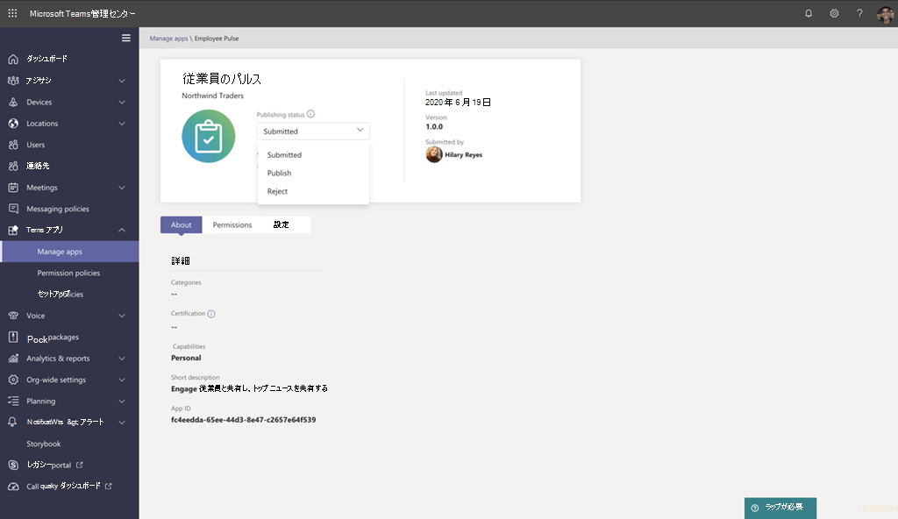

# Teams アプリ提出 API を通じて送信されたカスタム アプリを発行する

## 概要

> [!NOTE]
> カスタム Teams アプリを発行すると、組織のアプリ ストアのユーザーが利用できます。 カスタム アプリを発行する方法と使い方は、アプリの取得方法によって異なります。 **この記事では、開発者** が Teams アプリ提出 API を通じて提出するカスタム アプリを承認および公開する方法について説明します。 もう 1 つの方法であるカスタム アプリのアップロードは、開発者から .zip 形式のアプリ パッケージが送信された場合に使用されます。 この方法の詳細については、「アプリ パッケージをアップロードしてカスタム アプリを発行する <a href="https://docs.microsoft.com/microsoftteams/upload-custom-apps" target="_blank">」を参照してください</a>。

この記事では、Teams アプリを開発から展開から検出に導く方法について、エンドツーエンドのガイダンスを提供します。 Teams がアプリのライフサイクル全体にわたって提供する接続エクスペリエンスの概要を確認し、組織のアプリ ストアでカスタム アプリを開発、展開、管理する方法を合理化します。

ライフサイクルの各ステップについて説明します。たとえば、開発者が Teams アプリ提出 API を使用して、Microsoft Teams 管理センターに直接カスタム アプリを送信してレビューおよび承認する方法、組織内のユーザー用アプリを管理するためのポリシーを設定する方法、およびユーザーが Teams でアプリを検出する方法などについて説明します。

このガイダンスでは、アプリの Teams の側面に重点を当て、管理者と IT のプロを対象にしています。 Teams アプリの開発の詳細については、Teams の開発者向け <a href="https://docs.microsoft.com/microsoftteams/platform" target="_blank">ドキュメントを参照してください</a>。

## 開発

### アプリを作成する

Microsoft Teams 開発者プラットフォームを使用すると、開発者は独自のアプリとサービスを簡単に統合して生産性を向上させ、意思決定を迅速に行い、既存のコンテンツとワークフローに関する共同作業を作成できます。 Teams プラットフォーム上に構築されたアプリは、Teams クライアントとサービスとワークフローの間のブリッジであり、コラボレーション プラットフォームのコンテキストに直接取り込むのです。 詳細については、Teams の開発者向け <a href="https://docs.microsoft.com/microsoftteams/platform" target="_blank">ドキュメントを参照してください</a>。

### アプリを送信する

アプリを実稼働環境で使用する準備ができたら、デベロッパーは Teams アプリ提出 API を使用してアプリを提出できます。アプリは <a href="https://docs.microsoft.com/graph/api/teamsapp-publish?view=graph-rest-1.0&tabs=http#example-2-upload-a-new-application-for-review-to-an-organizations-app-catalog" target="_blank" target="_blank">、Graph API、Visual Studio</a>コードなどの統合された開発環境 (IDE)、または Power Apps や Power Virtual Agents などのプラットフォームから呼び出されます。 これにより、Microsoft Teams 管理センターの [アプリの管理] ページでアプリを利用できます。このページでは、管理者はアプリを確認および承認できます。

<a href="https://docs.microsoft.com/graph/api/teamsapp-publish?view=graph-rest-1.0&tabs=http#example-2-upload-a-new-application-for-review-to-an-organizations-app-catalog" target="_blank">Microsoft Graph</a>上に構築された Teams アプリ提出 API を使用すると、組織は選択したプラットフォーム上で開発を行い、Teams 上のカスタム アプリの提出から承認へのプロセスを自動化できます。

このアプリの提出手順がコード内でどのような外観をVisual Studioします。

これにより、アプリが組織のアプリ ストアにまだ公開されるのではないので、ご安心ください。 この手順では、Microsoft Teams 管理センターにアプリを送信し、組織のアプリ ストアへの公開を承認できます。

Graph API を使用してアプリを送信する方法の詳細については、こちらを参照 <a href="https://docs.microsoft.com/graph/api/teamsapp-publish?view=graph-rest-1.0&tabs=http#example-2-upload-a-new-application-for-review-to-an-organizations-app-catalog" target="_blank">してください</a>。

## 検証

Microsoft Teams <a href="https://docs.microsoft.com/microsoftteams/manage-apps" target="_blank">管理センター</a>の [アプリの管理] ページ (左側のナビゲーションで **[Teams** アプリの管理] に移動)、組織のすべての Teams アプリを  >  表示します。 ページ **の上部にある** 承認待ちウィジェットでは、カスタム アプリが承認のために送信された時間を確認できます。

この表では、新しく送信されたアプリの[発行]の状態が [送信済み] と [ブロック済み]**の状態が** 自動的 **に表示されます**。 [発行状態] **列を** 降順で並べ替え、アプリをすばやく見つける。

アプリ名をクリックして、アプリの詳細ページに移動します。 [詳細情報 **] タブ** では、説明、状態、提出者、アプリ ID など、アプリに関する詳細を表示できます。

Graph API を使用して発行の状態を確認する方法の詳細については **、こちらを参照**<a href="https://docs.microsoft.com/graph/api/appcatalogs-list-teamsapps?view=graph-rest-1.0&tabs=http#example-3-find-application-based-on-the-teams-app-manifest-id" target="_blank">してください</a>。

## 発行

アプリをユーザーが利用できる状態に準備ができたら、アプリを発行します。

1. Microsoft Teams 管理センターの左側のナビゲーションで、Teams アプリの [アプリの **管理]**  >  **に移動します**。
2. アプリ名をクリックしてアプリの詳細ページに移動し、[発行の状態] ボックスで [発行] を **選択します**。

    アプリを発行すると、[発行]**の状態** が[発行済み] に変り、[状態] が **[許可]** に **自動的に変更されます**。

## セットアップと管理

### アプリへのアクセスを制御する

既定では、組織内のすべてのユーザーは、組織のアプリ ストアでアプリにアクセスできます。 アプリを使用するアクセス許可を持つユーザーを制限および制御するには、アプリのアクセス許可ポリシーを作成して割り当てる必要があります。 詳細については、「Teams でアプリ <a href="https://docs.microsoft.com/microsoftteams/teams-app-permission-policies" target="_blank">のアクセス許可ポリシーを管理する」を参照してください</a>。

### ユーザーが検出するアプリをピン留めしてインストールする

既定では、ユーザーが組織のアプリ ストアにアクセスしてアプリを参照または検索する必要があるアプリを見つける場合。 ユーザーが簡単にアプリにアクセスするには、アプリを Teams のアプリ バーにピン留めします。 これを行うには、アプリセットアップ ポリシーを作成し、ユーザーに割り当てる必要があります。 詳細については、「Teams でアプリ <a href="https://docs.microsoft.com/microsoftteams/teams-app-setup-policies" target="_blank">セットアップ ポリシーを管理する」を参照してください</a>。

### Teams アプリ イベントの監査ログを検索する

監査ログを検索して、組織内の Teams アプリのアクティビティを表示できます。 監査ログを検索する方法と、監査ログに記録されている Teams アクティビティの一覧を表示する方法の詳細については <a href="https://docs.microsoft.com/microsoftteams/audit-log-events" target="_blank">、「Teams</a>でイベントの監査ログを検索する」を参照してください。

監査ログを検索するには、まずセキュリティ/コンプライアンス センターで監査 <a href="https://protection.office.com" target="_blank">&があります</a>。 詳細については、「監査ログの <a href="https://support.office.com/article/Turn-Office-365-audit-log-search-on-or-off-e893b19a-660c-41f2-9074-d3631c95a014" target="_blank">検索を有効またはオフにする」を参照してください</a>。 監査データは、監査を有効にした時点からのみ利用できます。

## 検出して採用する

アプリへのアクセス許可を持つユーザーは、組織のアプリ ストアで見つける可能性があります。 [アプリ **] ページの *[組織*** 名のビルド] に移動して、組織のカスタム アプリを見つける。

![公開済みアプリが表示されている [アプリ] ページ ](media/custom-app-lifecycle-discovery.png)

アプリセットアップ ポリシーを作成して割り当てた場合、アプリは Teams のアプリ バーにピン留めされ、ポリシーが割り当てられたユーザーに簡単にアクセスできます。

## 更新

アプリを更新するには、開発セクションの手順に引き続き従う [必要](#develop) があります。

公開済みカスタム アプリに更新プログラムを送信すると、[アプリの管理] ページの[承認待ち] ウィジェットに<a href="https://docs.microsoft.com/microsoftteams/manage-apps" target="_blank">通知が表示</a>されます。 表では、アプリの **発行状態** が [更新] 送信 **済みに設定されます**。

![保留中の要求とアプリの状態を表示する [アプリの管理] ページ ](media/custom-app-lifecycle-update-submitted.png)

アプリの更新プログラムを確認して公開するには、次の方法を実行します。

1. Microsoft Teams 管理センターの左側のナビゲーションで、Teams アプリの [アプリの **管理]**  >  **に移動します**。
2. アプリ名をクリックしてアプリの詳細ページに移動し、[更新可能] を選択して更新の詳細を確認します。

    
3. 準備ができたら、[発行] を **選択して** 更新プログラムを公開します。 これにより、既存のアプリが置き換え、バージョン番号が更新され、[発行] の状態が **[発行済** み] に **変更されます**。 すべてのアプリのアクセス許可ポリシーとアプリセットアップ ポリシーは、更新されたアプリに適用されたままです。

    更新プログラムを拒否した場合、以前のバージョンのアプリは発行されたままです。

次の注意が必要です。

- アプリが承認されると、誰でもアプリに更新を送信できます。 つまり、アプリを最初に送信した開発者を含む他の開発者は、アプリに更新プログラムを送信できます。
- 開発者がアプリを提出し、要求が保留中の場合、同じデベロッパーだけがアプリに更新を送信できます。 他の開発者は、アプリが承認された後にのみ更新プログラムを提出できます。

Graph API を使用してアプリを更新する方法の詳細については、こちらを参照 <a href="https://docs.microsoft.com/graph/api/teamsapp-update?view=graph-rest-1.0#example-2-update-a-previously-reviewed-and-published-application-to-the-teams-app-catalog" target="_blank">してください</a>。

### ユーザーの更新エクスペリエンス

ほとんどの場合、アプリの更新プログラムを公開すると、ユーザーに新しいバージョンが自動的に表示されます。 ただし、Microsoft <a href="https://docs.microsoft.com/microsoftteams/platform/resources/schema/manifest-schema" target="_blank">Teams</a> マニフェストには、完了するためにユーザーの同意が必要な更新プログラムがあります。

* ボットが追加または削除されました
* 既存のボットの "botId" プロパティが変更されました
* 既存のボットの "isNotificationOnly" プロパティが変更されました
* ボットの "supportsFiles" プロパティが変更されました
* メッセージング拡張機能が追加または削除されました
* 新しいコネクタが追加されました
* 新しい静的タブが追加されました
* 新しい構成可能なタブが追加されました
* "webApplicationInfo" 内のプロパティが変更されました

## 関連項目

- [アプリ パッケージをアップロードしてカスタム アプリを発行する](upload-custom-apps.md)
- [Microsoft Teams 管理センターでアプリを管理する](manage-apps.md)
- [Teams のカスタム アプリのポリシーと設定を管理する](teams-custom-app-policies-and-settings.md)
- [Teams のアプリのアクセス許可ポリシーを管理する](teams-app-permission-policies.md)
- [Teams のアプリのセットアップ ポリシーを管理する](teams-app-setup-policies.md)
- <a href="https://docs.microsoft.com/graph/api/resources/teamsapp?view=graph-rest-1.0" target="_blank">Teams アプリ用 Microsoft Graph API</a>
