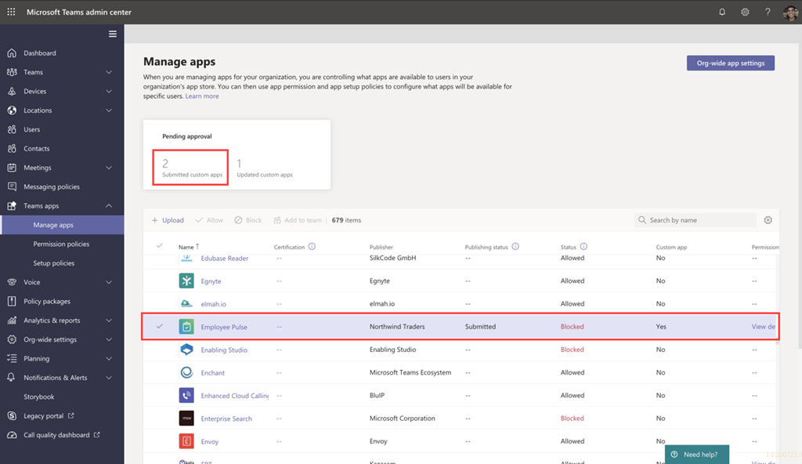

# Teams アプリ提出 API を通じて送信されたカスタム アプリを発行するPublish a custom app submitted through the Teams App Submission API

## 概要Overview

> [!NOTE]
> カスタム Teams アプリを発行すると、組織のアプリ ストアのユーザーが利用できます。When you publish a custom Teams app, it's available to users in your organization's app store. カスタム アプリを発行する方法と使い方は、アプリの取得方法によって異なります。There are two ways to publish a custom app and the way that you use depends on how you get the app. **この記事では、開発者** が Teams アプリ提出 API を通じて提出するカスタム アプリを承認および公開する方法について説明します。**This article focuses on how to approve and publish a custom app that a developer submits through the Teams App Submission API**. もう 1 つの方法であるカスタム アプリのアップロードは、開発者から .zip 形式のアプリ パッケージが送信された場合に使用されます。The other method, uploading a custom app, is used when a developer sends you an app package in .zip format. この方法の詳細については、「アプリ パッケージをアップロードしてカスタム アプリを発行する <a href="https://docs.microsoft.com/microsoftteams/upload-custom-apps" target="_blank">」を参照してください</a>。To learn more about that method, see <a href="https://docs.microsoft.com/microsoftteams/upload-custom-apps" target="_blank">Publish a custom app by uploading an app package</a>.

この記事では、Teams アプリを開発から展開から検出に導く方法について、エンドツーエンドのガイダンスを提供します。This article provides end-to-end guidance for how to take your Teams app from development to deployment to discovery. Teams がアプリのライフサイクル全体にわたって提供する接続エクスペリエンスの概要を確認し、組織のアプリ ストアでカスタム アプリを開発、展開、管理する方法を合理化します。You'll get an overview of the connected experiences that Teams provides across the app lifecycle to streamline how to develop, deploy, and manage custom apps in your organization's app store.

ライフサイクルの各ステップについて説明します。たとえば、開発者が Teams アプリ提出 API を使用して、Microsoft Teams 管理センターに直接カスタム アプリを送信してレビューおよび承認する方法、組織内のユーザー用アプリを管理するためのポリシーを設定する方法、およびユーザーが Teams でアプリを検出する方法などについて説明します。We'll cover each step of the lifecycle, including how developers can use the Teams App Submission API to submit custom apps directly to the Microsoft Teams admin center for you to review and approve, how to set policies to manage apps for users in your organization, and how your users discover them in Teams.

このガイダンスでは、アプリの Teams の側面に重点を当て、管理者と IT のプロを対象にしています。This guidance focuses on the Teams aspects of the app and is intended for admins and IT pros. Teams アプリの開発の詳細については、Teams の開発者向け <a href="https://docs.microsoft.com/microsoftteams/platform" target="_blank">ドキュメントを参照してください</a>。For information about developing Teams apps, see the <a href="https://docs.microsoft.com/microsoftteams/platform" target="_blank">Teams developer documentation</a>.

## 開発Develop

### アプリを作成するCreate the app

Microsoft Teams 開発者プラットフォームを使用すると、開発者は独自のアプリとサービスを簡単に統合して生産性を向上させ、意思決定を迅速に行い、既存のコンテンツとワークフローに関する共同作業を作成できます。The Microsoft Teams developer platform makes it easy for developers to integrate your own apps and services to improve productivity, make decisions faster, and create collaboration around existing content and workflows. Teams プラットフォーム上に構築されたアプリは、Teams クライアントとサービスとワークフローの間のブリッジであり、コラボレーション プラットフォームのコンテキストに直接取り込むのです。Apps built on the Teams platform are bridges between the Teams client and your services and workflows, bringing them directly into the context of your collaboration platform. 詳細については、Teams の開発者向け <a href="https://docs.microsoft.com/microsoftteams/platform" target="_blank">ドキュメントを参照してください</a>。For more information, go to the <a href="https://docs.microsoft.com/microsoftteams/platform" target="_blank">Teams developer documentation</a>.

### アプリを送信するSubmit the app

アプリを実稼働環境で使用する準備ができたら、デベロッパーは Teams アプリ提出 API を使用してアプリを提出できます。アプリは <a href="https://docs.microsoft.com/graph/api/teamsapp-publish?view=graph-rest-1.0&tabs=http#example-2-upload-a-new-application-for-review-to-an-organizations-app-catalog" target="_blank" target="_blank">、Graph API、Visual Studio</a>コードなどの統合された開発環境 (IDE)、または Power Apps や Power Virtual Agents などのプラットフォームから呼び出されます。When the app is ready for use in production, the developer can submit the app using the Teams App Submission API, which can be called from <a href="https://docs.microsoft.com/graph/api/teamsapp-publish?view=graph-rest-1.0&tabs=http#example-2-upload-a-new-application-for-review-to-an-organizations-app-catalog" target="_blank" target="_blank">Graph API</a>, an integrated development environment (IDE) such as Visual Studio Code, or a platform such as Power Apps and Power Virtual Agents. これにより、Microsoft Teams 管理センターの [アプリの管理] ページでアプリを利用できます。このページでは、管理者はアプリを確認および承認できます。Doing this makes the app available on the <a href="https://docs.microsoft.com/microsoftteams/manage-apps" target="_blank">Manage apps</a> page of the Microsoft Teams admin center, where you, the admin, can review and approve it.this

<a href="https://docs.microsoft.com/graph/api/teamsapp-publish?view=graph-rest-1.0&tabs=http#example-2-upload-a-new-application-for-review-to-an-organizations-app-catalog" target="_blank">Microsoft Graph</a>上に構築された Teams アプリ提出 API を使用すると、組織は選択したプラットフォーム上で開発を行い、Teams 上のカスタム アプリの提出から承認へのプロセスを自動化できます。The Teams App Submission API, <a href="https://docs.microsoft.com/graph/api/teamsapp-publish?view=graph-rest-1.0&tabs=http#example-2-upload-a-new-application-for-review-to-an-organizations-app-catalog" target="_blank">built on Microsoft Graph</a>, allows your organization to develop on the platform of your choice and automates the submission-to-approval process for custom apps on Teams.

このアプリの提出手順がコード内でどのような外観をVisual Studioします。Here's an example of what this app submission step looks like in Visual Studio Code:

これにより、アプリが組織のアプリ ストアにまだ公開されるのではないので、ご安心ください。Keep in mind that this doesn't publish the app to your organization's app store yet. この手順では、Microsoft Teams 管理センターにアプリを送信し、組織のアプリ ストアへの公開を承認できます。This step submits the app to the Microsoft Teams admin center where you can approve it for publishing to your organization's app store.

Graph API を使用してアプリを送信する方法の詳細については、こちらを参照 <a href="https://docs.microsoft.com/graph/api/teamsapp-publish?view=graph-rest-1.0&tabs=http#example-2-upload-a-new-application-for-review-to-an-organizations-app-catalog" target="_blank">してください</a>。For more information about using the Graph API to submit apps, see <a href="https://docs.microsoft.com/graph/api/teamsapp-publish?view=graph-rest-1.0&tabs=http#example-2-upload-a-new-application-for-review-to-an-organizations-app-catalog" target="_blank">here</a>.

## 検証Validate

Microsoft Teams <a href="https://docs.microsoft.com/microsoftteams/manage-apps" target="_blank">管理センター</a>の [アプリの管理] ページ (左側のナビゲーションで **[Teams** アプリの管理] に移動)、組織のすべての Teams アプリを  >  表示します。The <a href="https://docs.microsoft.com/microsoftteams/manage-apps" target="_blank">Manage apps</a> page in the Microsoft Teams admin center (in the left navigation, go to **Teams apps** > **Manage apps**), gives you a view into all Teams apps for your organization. ページ **の上部にある** [承認待ち] ウィジェットでは、カスタム アプリが承認のために送信された時間を確認できます。The **Pending approval** widget at the top of the page lets you know when a custom app is submitted for approval.

この表では、新しく送信されたアプリの[発行]の状態が [送信済み] と [ブロック済み]**の状態が** 自動的 **に表示されます**。In the table, a newly submitted app automatically shows a **Publishing status** of **Submitted** and **Status** of **Blocked**. [発行状態] **列を** 降順で並べ替え、アプリをすばやく見つける。You can sort the **Publishing status** column in descending order to quickly find the app.

アプリ名をクリックして、アプリの詳細ページに移動します。Click the app name to go to the app details page. [詳細情報 **] タブ** では、説明、状態、提出者、アプリ ID など、アプリに関する詳細を表示できます。On the **About** tab, you can view details about the app, including description, status, submitter, and app ID.

送信されたアプリの !app details page](media/custom-app-lifecycle-app-details.png)!app details page for a submitted app](media/custom-app-lifecycle-app-details.png)

Graph API を使用して発行の状態を確認する方法の詳細については **、こちらを参照**<a href="https://docs.microsoft.com/graph/api/teamsapp-list?view=graph-rest-1.0&tabs=http#example-3-list-applications-with-a-given-id-and-return-the-submission-review-state" target="_blank">してください</a>。For more information about using the Graph API to check the **Publishing status**, see <a href="https://docs.microsoft.com/graph/api/teamsapp-list?view=graph-rest-1.0&tabs=http#example-3-list-applications-with-a-given-id-and-return-the-submission-review-state" target="_blank">here</a>.

## 発行Publish

アプリをユーザーが利用できる状態に準備ができたら、アプリを発行します。When you're ready to make the app available to users, publish the app.

1. Microsoft Teams 管理センターの左側のナビゲーションで、Teams アプリの [アプリの **管理]**  >  **に移動します**。In the left navigation of the Microsoft Teams admin center, go to **Teams apps** > **Manage apps**.
2. アプリ名をクリックしてアプリの詳細ページに移動し、[発行の状態] ボックスで [発行] を **選択します**。Click the app name to go to the app details page, and then in the **Publishing status** box, select **Publish**.

    アプリを発行すると、[発行]**の状態** が[発行済み] に変り、[状態] が **[許可]** に **自動的に変更されます**。After you publish the app, the **Publishing status** changes to **Published** and the **Status** automatically changes to **Allowed**.

## セットアップと管理Set up and manage

### アプリへのアクセスを制御するControl access to the app

既定では、組織内のすべてのユーザーは、組織のアプリ ストアでアプリにアクセスできます。By default, all users in your organization can access the app in your organization's app store. アプリを使用するアクセス許可を持つユーザーを制限および制御するには、アプリのアクセス許可ポリシーを作成して割り当てる必要があります。To restrict and control who has permission to use the app, you can create and assign an app permission policy. 詳細については、「Teams でアプリ <a href="https://docs.microsoft.com/microsoftteams/teams-app-permission-policies" target="_blank">のアクセス許可ポリシーを管理する」を参照してください</a>。To learn more, see <a href="https://docs.microsoft.com/microsoftteams/teams-app-permission-policies" target="_blank">Manage app permission policies in Teams</a>.

### ユーザーが検出するアプリをピン留めしてインストールするPin and install the app for users to discover

既定では、ユーザーが組織のアプリ ストアにアクセスしてアプリを参照または検索する必要があるアプリを見つける場合。By default, for users to find the app they have to go to your organization's app store and browse or search for it. ユーザーが簡単にアプリにアクセスするには、アプリを Teams のアプリ バーにピン留めします。To make it easy for users to get to the app, you can pin the app to the app bar in Teams. これを行うには、アプリセットアップ ポリシーを作成し、ユーザーに割り当てる必要があります。To do this, create an app setup policy and assign it to users. 詳細については、「Teams でアプリ <a href="https://docs.microsoft.com/microsoftteams/teams-app-setup-policies" target="_blank">セットアップ ポリシーを管理する」を参照してください</a>。To learn more, see <a href="https://docs.microsoft.com/microsoftteams/teams-app-setup-policies" target="_blank">Manage app setup policies in Teams</a>.

### Teams アプリ イベントの監査ログを検索するSearch the audit log for Teams app events

監査ログを検索して、組織内の Teams アプリのアクティビティを表示できます。You can search the audit log to view Teams apps activity in your organization. 監査ログを検索する方法と、監査ログに記録されている Teams アクティビティの一覧を表示する方法の詳細については <a href="https://docs.microsoft.com/microsoftteams/audit-log-events" target="_blank">、「Teams</a>でイベントの監査ログを検索する」を参照してください。To learn more about how to search the audit log and to see a list of Teams activities that are logged in the audit log, see <a href="https://docs.microsoft.com/microsoftteams/audit-log-events" target="_blank">Search the audit log for events in Teams</a>.

監査ログを検索するには、まずセキュリティ/コンプライアンス センターで監査 <a href="https://protection.office.com" target="_blank">を&があります</a>。Before you can search the audit log, you have to first turn on auditing in the <a href="https://protection.office.com" target="_blank">Security & Compliance Center</a>. 詳細については、「監査ログの <a href="https://support.office.com/article/Turn-Office-365-audit-log-search-on-or-off-e893b19a-660c-41f2-9074-d3631c95a014" target="_blank">検索を有効またはオフにする」を参照してください</a>。To learn more, see <a href="https://support.office.com/article/Turn-Office-365-audit-log-search-on-or-off-e893b19a-660c-41f2-9074-d3631c95a014" target="_blank">Turn audit log search on or off</a>. 監査データは、監査を有効にした時点からのみ利用できます。Keep in mind that audit data is only available from the point at which you turned on auditing.

## 検出して採用するDiscover and adopt

アプリへのアクセス許可を持つユーザーは、組織のアプリ ストアで見つける可能性があります。Users who have permissions to the app can find it in your organization's app store. [アプリ **] ページの *[組織*** 名のビルド] に移動して、組織のカスタム アプリを見つける。Go to **Built for *Your Organization Name*** on the Apps page to find your organization's custom apps.

![公開済みアプリが表示されている [アプリ] ページApps page showing published app ](media/custom-app-lifecycle-discovery.png)

アプリセットアップ ポリシーを作成して割り当てた場合、アプリは Teams のアプリ バーにピン留めされ、ポリシーが割り当てられたユーザーに簡単にアクセスできます。If you created and assigned an app setup policy, the app is pinned to the app bar in Teams for easy access for those users who were assigned the policy.

## 更新Update

アプリを更新するには、開発セクションの手順に引き続き従う [必要](#develop) があります。To update an app, developers should continue to follow the steps in the [Develop](#develop) section.

公開済みカスタム アプリに更新プログラムを送信すると、[アプリの管理] ページの[承認待ち] ウィジェットに<a href="https://docs.microsoft.com/microsoftteams/manage-apps" target="_blank">通知が表示</a>されます。When the developer submits an update to a published custom app, you'll get notified in the **Pending approval** widget of the <a href="https://docs.microsoft.com/microsoftteams/manage-apps" target="_blank">Manage apps</a> page. 表では、アプリの **発行状態** が [更新が送信されました **] に設定されます**。In the table, the **Publishing status** of the app will be set to **Update submitted**.

![保留中の要求とアプリの状態を表示する [アプリの管理] ページManage apps page showing pending requests and app status ](media/custom-app-lifecycle-update-submitted.png)

アプリの更新プログラムを確認して公開するには、次の方法を実行します。To review and publish an app update:

1. Microsoft Teams 管理センターの左側のナビゲーションで、Teams アプリの [アプリの **管理]**  >  **に移動します**。In the left navigation of the Microsoft Teams admin center, go to **Teams apps** > **Manage apps**.
2. アプリ名をクリックしてアプリの詳細ページに移動し、[更新可能] を選択して更新の詳細を確認します。Click the app name to go to the app details page, and then select **Update available** to review details of the update.

    
3. 準備ができたら、[発行] を **選択して** 更新プログラムを公開します。When you're ready, select **Publish** to publish the update. これにより、既存のアプリが置き換え、バージョン番号が更新され、[発行] の状態が **[発行済** み] に **変更されます**。Doing this replaces the existing app, updates the version number, and changes the **Publishing status** to **Published**. すべてのアプリのアクセス許可ポリシーとアプリセットアップ ポリシーは、更新されたアプリに適用されたままです。All app permission policies and app setup policies remain enforced for the updated app.

    更新プログラムを拒否した場合、以前のバージョンのアプリは発行されたままです。If you reject the update, the earlier version of the app remains published.

次の注意が必要です。Keep in mind the following:

- アプリが承認されると、誰でもアプリに更新を送信できます。When an app is approved, any one can submit an update to the app. つまり、アプリを最初に送信した開発者を含む他の開発者は、アプリに更新プログラムを送信できます。This means other developers, including the developer who originally submitted the app, can submit an update to the app.
- 開発者がアプリを提出し、要求が保留中の場合、同じ開発者だけがアプリに更新を送信できます。When a developer submits an app and the request is pending, only that same developer can submit an update to the app. 他の開発者は、アプリが承認された後にのみ更新プログラムを提出できます。Other developers can submit an update only after the app is approved.

Graph API を使用してアプリを更新する方法の詳細については、こちらを参照 <a href="https://docs.microsoft.com/graph/api/teamsapp-update?view=graph-rest-1.0#example-2-update-a-previously-reviewed-and-published-application-to-the-teams-app-catalog" target="_blank">してください</a>。For more information about using the Graph API to update apps, see <a href="https://docs.microsoft.com/graph/api/teamsapp-update?view=graph-rest-1.0#example-2-update-a-previously-reviewed-and-published-application-to-the-teams-app-catalog" target="_blank">here</a>.

### ユーザーの更新エクスペリエンスUpdate experience for users

ほとんどの場合、アプリの更新プログラムを発行すると、ユーザーに新しいバージョンが自動的に表示されます。In most cases, after you publish an app update, the new version automatically appears for users. ただし、Microsoft <a href="https://docs.microsoft.com/microsoftteams/platform/resources/schema/manifest-schema" target="_blank">Teams</a> マニフェストには、完了するためにユーザーの同意が必要な更新プログラムがあります。However, there are some updates to the <a href="https://docs.microsoft.com/microsoftteams/platform/resources/schema/manifest-schema" target="_blank">Microsoft Teams manifest</a> that require user acceptance to complete:

* ボットが追加または削除されましたA bot was added or removed
* 既存のボットの "botId" プロパティが変更されましたAn existing bot's "botId" property changed
* 既存のボットの "isNotificationOnly" プロパティが変更されましたAn existing bot's "isNotificationOnly" property changed
* ボットの "supportsFiles" プロパティが変更されましたThe bot's "supportsFiles" property changed
* メッセージング拡張機能が追加または削除されましたA messaging extension was added or removed
* 新しいコネクタが追加されましたA new connector was added
* 新しい静的タブが追加されましたA new static tab was added
* 新しい構成可能なタブが追加されましたA new configurable tab was added
* "webApplicationInfo" 内のプロパティが変更されましたProperties inside "webApplicationInfo" changed

## 関連トピックRelated topics

- [アプリ パッケージをアップロードしてカスタム アプリを発行するPublish a custom app by uploading an app package](upload-custom-apps.md)
- [Microsoft Teams 管理センターでアプリを管理するManage your apps in the Microsoft Teams admin center](manage-apps.md)
- [Teams のカスタム アプリのポリシーと設定を管理するManage custom app policies and settings in Teams](teams-custom-app-policies-and-settings.md)
- [Teams のアプリのアクセス許可ポリシーを管理するManage app permission policies in Teams](teams-app-permission-policies.md)
- [Teams のアプリのセットアップ ポリシーを管理するManage app setup policies in Teams](teams-app-setup-policies.md)
- <a href="https://docs.microsoft.com/graph/api/resources/teamsapp?view=graph-rest-1.0" target="_blank">Teams アプリ用 Microsoft Graph API</a><a href="https://docs.microsoft.com/graph/api/resources/teamsapp?view=graph-rest-1.0" target="_blank">Microsoft Graph API for Teams apps</a>
