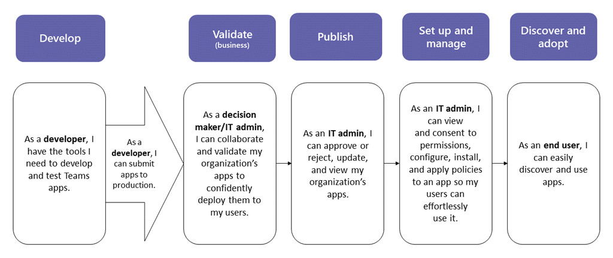

# Teams アプリ申請 API を通じて送信されたカスタムアプリを公開する

## 概要

> [!NOTE]
> カスタム Teams アプリを公開すると、組織のアプリストア内のユーザーがそのアプリを利用できるようになります。 カスタムアプリを公開する方法は2つあります。また、アプリの入手方法によって異なります。 **この記事では、開発者が Teams アプリ申請 API を通じて提出するカスタムアプリを承認および公開する方法について説明**します。 その他の方法として、カスタムアプリをアップロードすることは、開発者が .zip 形式でアプリパッケージを送信するときに使用されます。 このメソッドの詳細については、「<a href="https://docs.microsoft.com/microsoftteams/upload-custom-apps" target="_blank">アプリパッケージをアップロードしてカスタムアプリを公開</a>する」を参照してください。
 
この記事では、チームアプリを開発から展開に移動する方法についてのエンドツーエンドのガイダンスについて説明します。 チームがアプリのライフサイクルを通じて提供する接続されたエクスペリエンスの概要について説明します。これにより、組織のアプリストアでカスタムアプリを開発、展開、管理する方法が効率化されます。

ここでは、ライフサイクルの各ステップについて説明します。開発者は、確認と承認のために、アプリを管理するためにポリシーを設定する方法、組織内のユーザーを管理するためのポリシーを設定する方法、ユーザーが Teams でそれらを見つける方法についても説明します。

このガイダンスは、アプリの Teams の側面を中心としており、管理者と IT プロフェッショナルを対象としています。 Teams アプリの開発について詳しくは、 <a href="https://docs.microsoft.com/microsoftteams/platform" target="_blank">teams の開発者向けドキュメント</a>をご覧ください。

## 開発

### アプリを作成する

Microsoft Teams の開発者は、開発者が独自のアプリとサービスを統合して生産性を向上させ、意思決定を迅速化し、既存のコンテンツとワークフローを取り巻くコラボレーションを作成することが容易になります。 Teams プラットフォームで構築されたアプリは、Teams クライアントとサービスとワークフローの間のブリッジであり、コラボレーションプラットフォームのコンテキストに直接移行します。 詳細については、「 <a href="https://docs.microsoft.com/microsoftteams/platform" target="_blank">Teams の開発者向けドキュメント</a>」を参照してください。

### アプリを申請する

アプリを運用環境で使用する準備ができたら、開発者は、Graph API、Visual Studio コードなどの統合開発環境 (IDE)、または Power Apps や Power Virtual Agent などのプラットフォームから呼び出すことができる Teams アプリ申請 API を使ってアプリを申請できます。 これにより、アプリは Microsoft Teams 管理センターの [<a href="https://docs.microsoft.com/microsoftteams/manage-apps" target="_blank">アプリの管理</a>] ページで利用できるようになります。ここでは、管理者がレビューして承認することができます。 

Microsoft Graph 上に構築された Teams アプリ申請 API を使用すると、お客様が選択したプラットフォームで組織を開発し、チームのカスタムアプリの申請申請書を自動化できます。

Visual Studio コードのこのアプリの申請手順の例を次に示します。

これにより、アプリは組織のアプリストアに公開されないことに注意してください。 この手順によって、アプリは Microsoft Teams 管理センターに送信され、組織のアプリストアへの発行を承認することができます。

## 有効性

Microsoft Teams 管理センターの [<a href="https://docs.microsoft.com/microsoftteams/manage-apps" target="_blank">アプリの管理</a>] ページ (左側のナビゲーションで、[ **Teams アプリ**の管理]) に移動して  >  **Manage apps**、組織のすべての teams アプリを表示することができます。 ページの上部にある [**保留中] 承認**ウィジェットを使用すると、ユーザー設定のアプリが承認のために送信された場合に通知を受けることができます。

表では、新しく送信されたアプリには、**送信****状態**と**ブロック****状態**が自動的に表示されます。 アプリをすばやく見つけるために、[**発行の状態**」列を降順で並べ替えることができます。

![保留中の要求とアプリの状態を示す [アプリの管理] ページのスクリーンショット ](media/custom-app-lifecycle-validate-app.png)

アプリ名をクリックして、[アプリの詳細] ページに移動します。 [**バージョン情報**] タブには、説明、状態、送信者、アプリ ID など、アプリに関する詳細が表示されます。

## 出版

アプリをユーザーが利用できるようにする準備ができたら、アプリを公開します。

1. Microsoft Teams 管理センターの左のナビゲーションで、[ **Teams アプリ**の管理] に移動  >  **Manage apps**します。
2. アプリ名をクリックして [アプリの詳細] ページに移動し、[**発行の状態**] ボックスで [**発行**] を選択します。

    アプリを公開すると、**発行の状態**が [**公開済み**] に変わり、**状態**が [許可] に自動的に変更**さ**れます。

## 設定と管理

### アプリへのアクセスを制御する

既定では、組織内のすべてのユーザーが、組織のアプリストアのアプリにアクセスできます。 アプリを使う権限を持つユーザーを制限および制御するには、アプリのアクセス許可ポリシーを作成して割り当てることができます。 詳細については、「 <a href="https://docs.microsoft.com/microsoftteams/teams-app-permission-policies" target="_blank">Teams でアプリのアクセス許可ポリシーを管理</a>する」を参照してください。

### ユーザーが検出できるようにアプリを固定してインストールする

既定では、ユーザーがアプリを見つけるには、組織のアプリストアに移動し、それを参照または検索する必要があります。 ユーザーがアプリを簡単に利用できるようにするために、アプリを Teams のアプリバーにピン留めすることができます。 これを行うには、アプリのセットアップポリシーを作成し、ユーザーに割り当てます。 詳細については、「 <a href="https://docs.microsoft.com/microsoftteams/teams-app-setup-policies" target="_blank">Teams でアプリセットアップポリシーを管理</a>する」を参照してください。

### チームアプリイベントの監査ログを検索する

監査ログを検索して、組織内の Teams アプリのアクティビティを表示できます。 監査ログを検索し、監査ログに記録されている Teams アクティビティの一覧を表示する方法の詳細については、「 <a href="https://docs.microsoft.com/microsoftteams/audit-log-events" target="_blank">Teams のイベントの監査ログを検索</a>する」を参照してください。

監査ログを検索する前に、まず<a href="https://protection.office.com" target="_blank">セキュリティ & コンプライアンスセンター</a>で監査を有効にする必要があります。 詳細については、「<a href="https://support.office.com/article/Turn-Office-365-audit-log-search-on-or-off-e893b19a-660c-41f2-9074-d3631c95a014" target="_blank">監査ログの検索を有効または無効に</a>する」を参照してください。 監査データは、監査を有効にした時点でのみ利用可能であることに注意してください。

## 発見と採用

アプリへのアクセス許可を持つユーザーは、そのアプリを組織のアプリストアで見つけることができます。 [アプリ] ページで [ ***組織名に合わせ*て作成**済み] に移動して、組織のカスタムアプリを見つけます。

![公開されたアプリが表示されている [アプリ] ページのスクリーンショット ](media/custom-app-lifecycle-discovery.png)

アプリのセットアップポリシーを作成して割り当てた場合、アプリは、ポリシーが割り当てられたユーザーに対して簡単にアクセスできるように、Teams のアプリバーに固定されます。

## 更新する

アプリを更新するには、開発者は「[開発](#develop)」セクションの手順に従って続行する必要があります。

開発者が公開されたカスタムアプリへの更新を送信すると、[<a href="https://docs.microsoft.com/microsoftteams/manage-apps" target="_blank">アプリの管理</a>] ページの [**保留中の承認**ウィジェット] に通知が表示されます。 表では、アプリの**発行の状態**が [**更新送信**済み] に設定されます。

![保留中の要求とアプリの状態を示す [アプリの管理] ページのスクリーンショット ](media/custom-app-lifecycle-update-submitted.png)

アプリの更新を確認して公開するには、次の操作を行います。

1. Microsoft Teams 管理センターの左のナビゲーションで、[ **Teams アプリ**の管理] に移動  >  **Manage apps**します。
2. アプリ名をクリックして [アプリの詳細] ページに移動し、[**利用可能な更新**] を選択して、更新プログラムの詳細を確認します。

    ![保留中の要求とアプリの状態を示す [アプリの管理] ページのスクリーンショット ](media/custom-app-lifecycle-update-app.png)
3. 準備ができたら、[**発行**] を選択して更新を公開します。 この操作を行うと、既存のアプリが置き換えられ、バージョン番号が更新され、**発行の状態**が [**公開済み**] に変わります。 更新されたアプリには、すべてのアプリのアクセス許可ポリシーとアプリのセットアップポリシーが適用されます。

    更新プログラムを拒否した場合、以前のバージョンのアプリは公開されたままになります。

次の点に注意してください。

- アプリが承認されると、アプリに更新プログラムを送信できます。 これは、アプリを最初に提出した開発者を含め、他の開発者がアプリに更新プログラムを提出できることを意味します。
- 開発者がアプリを送信したときに要求が保留になっている場合、その開発者だけがアプリに更新を送信できます。 他の開発者は、アプリが承認された後にのみ更新プログラムを送信できます。

### ユーザー向けの更新エクスペリエンス

ほとんどの場合、アプリの更新プログラムを公開すると、新しいバージョンが自動的にユーザーに表示されます。 ただし、 <a href="https://docs.microsoft.com/microsoftteams/platform/resources/schema/manifest-schema" target="_blank">Microsoft Teams マニフェスト</a>には、ユーザーの承認を必要とする次のような更新があります。

* ボットが追加または削除された
* 既存のボットの "botId" プロパティが変更されました
* 既存のボットの "isNotificationOnly" プロパティが変更されました
* ボットの "supportsFiles" プロパティが変更されました
* メッセージング拡張機能が追加または削除されました
* 新しいコネクタが追加されました
* 新しい静的タブが追加されました
* 新しい [構成可能] タブが追加されました
* "WebApplicationInfo" 内のプロパティが変更されました

## 関連トピック

- [アプリパッケージをアップロードしてカスタムアプリを公開する](upload-custom-apps.md)
- [Microsoft Teams 管理センターでアプリを管理する](manage-apps.md)
- [Teams のカスタム アプリのポリシーと設定を管理する](teams-custom-app-policies-and-settings.md)
- [Teams のアプリのアクセス許可ポリシーを管理する](teams-app-permission-policies.md)
- [Teams のアプリのセットアップ ポリシーを管理する](teams-app-setup-policies.md)
