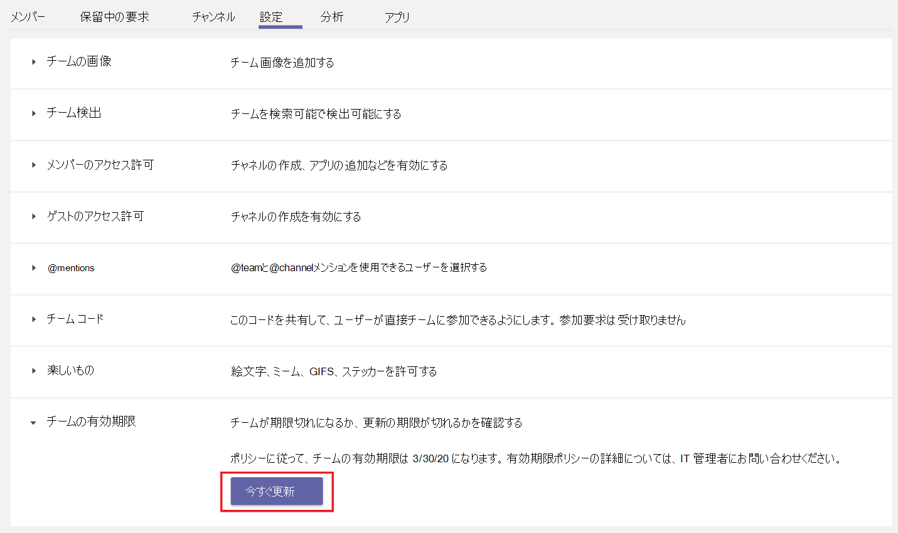

# Microsoft Teams でのチームの期限切れと更新Team expiration and renewal in Microsoft Teams

多くのチームがいる組織には、実際には使用されない teams が多いことがよくあります。Organizations with a large number of teams often have teams that are never actually used. これは、製品の実験、短期的なチームのコラボレーション、または組織を離れるチーム所有者など、いくつかの理由で発生する可能性があります。This can happen because of several reasons including product experimentation, short-term team collaboration, or team owners leaving the organization. 時間の経過と共に、チームはテナントリソースを蓄積して、負担を作ることができます。Over time, such teams can accumulate and create a burden on tenant resources.  

使用されていないチームの数を管理者として指定するには、 [Microsoft 365 グループの有効期限ポリシー](https://docs.microsoft.com/microsoft-365/admin/create-groups/office-365-groups-expiration-policy)を使って、使用していないチームを自動的にクリーンアップすることができます。To curb the number of unused teams, as an admin, you can use [Microsoft 365 group expiration policy](https://docs.microsoft.com/microsoft-365/admin/create-groups/office-365-groups-expiration-policy) to automatically clean up unused teams. Teams はグループによってサポートされているため、グループの有効期限ポリシーはチームにも自動的に適用されます。Because teams are backed by groups, group expiration policies automatically apply to teams as well.

チームに有効期限ポリシーを適用すると、チームの所有者は、チームの有効期限の30日、15日間、1日前にチームの更新の通知を受け取ります。When you apply an expiration policy to a team, a team owner receives a notification for team renewal 30 days, 15 days and 1 day before the team's expiration date. チーム所有者は通知を受信したときに、チームの設定で [**今すぐ更新**] をクリックして、チームを更新することができます。When the team owner receives the notification, they can click **Renew now** in team settings to renew the team.

![チーム設定でチームを更新するための [今すぐ更新] ボタンのスクリーンショット](media/team-expiration.png "チーム設定でチームを更新するための [今すぐ更新] ボタンのスクリーンショット")

チーム所有者がチームを更新しない場合は、チームは "ソフト削除" 状態になります。つまり、この状態は、次の30日以内に復元できます。If the team owner doesn't renew the team, the team is put in a "soft-deleted" state, which means it can be restored within the next 30 days.

## チームの自動更新Team auto-renewal

更新が期限切れになった場合に、チーム所有者がチームの更新を忘れてしまった可能性があります。There can be times when a team owner is unable to renew the team perhaps because they forgot to renew or were away when renewal was due. これらのシナリオでは、チームに適用される有効期限ポリシーが原因で、アクティブな使用中のチームが削除される可能性があります。In these scenarios, a team in active use can get deleted because of expiration policies that apply to the team.  

誤って削除されるのを防ぐため、自動更新はグループの有効期限ポリシーのチームに対して自動的に有効になります。To prevent accidental deletion, auto-renewal is automatically enabled for a team in the group expiration policy. グループの有効期限ポリシーが設定されると、チーム所有者から手動での介入なしに、少なくとも1つのチームメンバーからのチャネルアクセスを持つすべてのチームが自動的に更新されます。When the group expiration policy is set up, any team that has at least one channel visit from any team member before its expiration date is automatically renewed without any manual intervention from the team owner.

## 既知の問題Known issues

**チームの有効期限と、基になるグループが一致しない****Expiration date of team and underlying group don't match**

チームを更新する前に、チームをバックアップするグループが最初に更新されます。Before a team is renewed, the group that backs the team is renewed first. 更新の一部として、グループに新しい有効期限が設定され、将来の日付になります。As part of renewal, a new expiry date is set on the group for a future date. この新しい日付は、Teams にすぐに表示されない可能性があります。This new date may not be immediately visible in Teams. 同期には最大24時間かかることがあります。チームとその基になるグループの有効期限の間に不一致がある場合は、24時間待ってからさらにサポートを求めます。It can take up to 24 hours to sync. If you see a discrepancy between the expiry date for a team and its underlying group, wait 24 hours before seeking further support.
