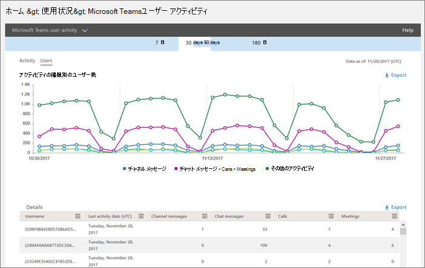
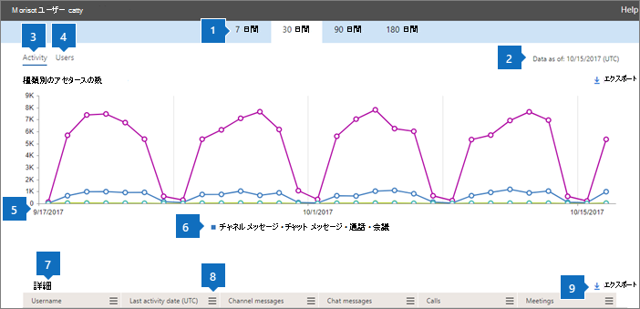

Microsoft Teams のユーザー アクティビティ レポートを使用するUse activity reports for Microsoft Teams 
========================================

Microsoft 365 管理センターのアクティビティレポートを使用して、組織内のユーザーが Microsoft Teams をどのように使用しているかを確認できます。You can use activity reports in the Microsoft 365 admin center to see how users in your organization are using Microsoft Teams. たとえば、Microsoft Teams をまだ使用していない場合は、作業を開始する方法や、チームを使用して生産性とコラボレーションを向上させる方法がわからないことがあります。For example, if some don't use Microsoft Teams yet, they might not know how to get started or understand how they can use Teams to be more productive and collaborative. 組織では、アクティビティ レポートを使用して、トレーニングとコミュニケーションに関する優先項目を判断できます。Your organization can use the activity reports to decide where to prioritize training and communication efforts.

## レポートダッシュボードで Teams レポートを表示する方法How to view the Teams reports in the Reports dashboard

1. [Microsoft 365 管理センター](https://portal.office.com/adminportal/home)で、[**レポート** > の**利用状況**] を選択します。In the [Microsoft 365 admin center](https://portal.office.com/adminportal/home), select **Reports** > **Usage**.
 
2. [**利用状況**] ページで、[**レポートの選択**] を選び、レポートの一覧の [ **Microsoft Teams** ] で、表示するレポートを選びます。On the **Usage** page, choose **Select a report**, and then under **Microsoft Teams** in the list of reports, choose the report you want to view.

## 利用可能な Teams アクティビティレポートTeams activity reports that are available

現在、次の2つのアクティビティレポートを表示できます。There are currently two activity reports you can view:

- [Microsoft Teams ユーザー アクティビティ レポートMicrosoft Teams user activity report](#microsoft-teams-user-activity-report) 
- [Microsoft Teams のデバイス使用状況レポートMicrosoft Teams device usage report](#microsoft-teams-device-usage-report) 

### Microsoft Teams ユーザー アクティビティ レポートMicrosoft Teams user activity report

Teams ユーザーアクティビティレポートは、ユーザーが Teams で実行する最も一般的なアクティビティのビューを提供します。The Teams user activity report gives you a view of the most common activities that your users perform in Teams. これには、チャネル内でチャットに参加している人の数、プライベートチャットメッセージによるコミュニケーションの数、通話や会議への参加回数などが含まれます。This includes how many people engage in a chat in a channel, how many communicate via private chat message, and how many participate in calls or meetings. この情報は、個々のユーザーに加えて、組織全体で確認できます。You can see this information for your whole organization, as well as for each individual user.

#### Microsoft Teams ユーザーアクティビティレポートを解釈するInterpret the Microsoft Teams user activity report

[**アクティビティ**] と [**ユーザー** ] のグラフを見ることで、チームユーザーアクティビティを把握することができます。You can get a view into Teams user activity by looking at the **Activity** and **Users** charts.

|CalloutCallout |説明Description  |
|--------|-------------|
|**1****1**   |[Teams ユーザーアクティビティ] レポートでは、過去7日間、30日間、90日間、または180日間の傾向を確認できます。The Teams user activity report can be viewed for trends over the last 7 days, 30 days, 90 days, or 180 days. ただし、レポート内の特定の時間範囲をクリックすると、テーブル (7) には、レポートが生成された日までの30日間のデータが表示されます。However, if you click into a particular time range in the report, the table (7) will show data for 30 days, up to the date (2) for when the report was generated. |
|**2****2**   |各レポートには、このレポートが生成された日付が表示されます。通常、レポートはアクティビティの時刻から 24 から 48 時間の遅延を反映します。Each report has a date for when this report was generated. The reports usually reflect a 24 to 48 hour latency from time of activity. |
|**3****3**   |[**アクティビティ**ビューには、アクティビティの種類別の Microsoft Teams アクティビティの数が表示されます。The **Activity** view shows you the number of Microsoft Teams activities by activity type. アクティビティの種類は、チームチャットメッセージの数、プライベートチャットメッセージ、通話、会議です。The activity types are number of team chat messages, private chat messages, calls, and meetings. |
|**4****4**   |**ユーザー**ビューには、アクティビティの種類別にユーザー数が表示されます。The **Users** view shows you the number of users by activity type. アクティビティの種類は、チームチャットメッセージの数、プライベートチャットメッセージ、通話、会議です。The activity types are number of team chat messages, private chat messages, calls, and meetings. |
|**5****5**   |グラフの X 軸は、特定のレポートに対して選択した日付範囲です。The X axis on the charts is the selected date range for the specific report. <ul><li>[**アクティビティ**] グラフの Y 軸は、指定されたアクティビティの数です。On the **Activity** chart, the Y axis is the count of the specified activity.</ul></li> <ul><li>[**ユーザー** ] グラフの Y 軸は、チームチャット、プライベートチャット、通話、または会議に参加しているユーザーの数です。On the **Users** chart, the Y axis is the number of users participating in teams chats, private chats, calls, or meetings.</ul></li> |
|**6****6**   |凡例の項目をクリックして、グラフに表示する系列をフィルター処理できます。You can filter the series you see on the chart by clicking on an item in the legend. たとえば、[**アクティビティ**] グラフで、[**チャネルメッセージ**]、[**チャットメッセージ**]、[**通話**]、または [**会議**] をクリックまたはタップして、それぞれに関連する情報のみを表示します。For example, on the **Activity** chart, click or tap **Channel messages**, **Chat messages**, **Calls**, or **Meetings** to see only the info related to each one. この選択を変更しても、グリッドテーブルの情報は変更されません。Changing this selection doesn't change the information in the grid table. |
|**7****7**   |広い範囲にわたるアクティブなチームの一覧 (180 日) レポートの時間枠。The list of active teams across the widest (180-day) reporting time frame.  アクティビティの数は、日付の選択によって異なります。The activity count will vary according to the date selection.    表に次の情報を表示するには、テーブルに列を追加していることを確認してください。To see the following information the table, make sure you add the columns to the table. <ul><li>**Username**はユーザーのメールアドレスです。**Username** is the email address of the user. 実際のメールアドレスを表示したり、このフィールドを匿名にすることができます。You can display the actual email address or make this field anonymous.</ul></li> <ul><li>[**最後のアクティビティの日付 (UTC)** ] は、ユーザーが Microsoft Teams アクティビティに参加した最後の日付を指します。**Last Activity Date (UTC)** refers to the last date that the user participated in a Microsoft Teams activity.</ul></li> <ul><li>**[チャネル メッセージ数]** は、指定された期間内にユーザーがチーム チャットに投稿した一意のメッセージの数です。**Channel messages** is the number of unique messages that the user posted in a team chat during the specified time period.</ul></li> <ul><li>**[チャット メッセージ数]** は、指定された期間内にユーザーがプライベート チャットに投稿した一意のメッセージの数です。**Chat messages** is the number of unique messages that the user posted in a private chat during the specified time period.</ul></li> <ul><li>[**通話**数指定した期間中にユーザーが参加した通話の数です。**Calls** is the number of calls that the user participated in during the specified time period.</ul></li> <ul><li>[**会議**数の指定は、指定された期間中にユーザーが参加したオンライン会議の数です。**Meetings** is the number of online meetings that the user participated in during the specified time period.</ul></li> <ul><li>[**その他のアクティビティ**] は、ユーザーが [メッセージ]、[アプリ]、[ファイルの操作]、[検索]、[チームとチャネルのフォロー]、[お気に入り] の順に選択したその他のチームアクティビティの数です。**Other activity** is the number of other team activities by the user some of which include, and not limited to: liking messages, apps, working on files, searching, following teams and channel and favoriting them.</ul></li> <ul><li>[**削除済み**を表示するチームが削除されたかどうかを示します。**Deleted** indicates if the team is deleted. チームが削除されたが、レポート期間にアクティビティがあった場合は、[削除済み] が true に設定されたグリッドに表示されます。If the team is deleted, but had activity in the reporting period, it will show up in the grid with deleted set to true.</ul></li> <ul><li>"**削除日**" は、ユーザーが削除された日付です。**Deleted date** is the date that the user was deleted.</ul></li> <ul><li>[**割り当て製品**] は、ユーザーに割り当てられている製品の一覧です。**Product assigned** is the list of products that are assigned to the user.</ul></li>組織のポリシーにより、ユーザー情報を特定できるレポートを表示できない場合は、これらすべてのレポートのプライバシー設定を変更できます。If your organization's policies prevents you from viewing reports where user information is identifiable, you can change the privacy setting for all these reports. [Microsoft 365 管理センタープレビューのアクティビティレポート](https://support.office.com/article/activity-reports-in-the-office-365-admin-center-0d6dfb17-8582-4172-a9a9-aed798150263)で、[**ユーザーレベルの詳細を非表示にする方法**] セクションを確認します。</ui>Check out the **How do I hide user level details?** section in the [Activity Reports in the Microsoft 365 Admin Center Preview](https://support.office.com/article/activity-reports-in-the-office-365-admin-center-0d6dfb17-8582-4172-a9a9-aed798150263).</ui> |
|**個****8**   |[**列**] をクリックまたはタップして、表の列を追加または削除します。Click or tap **Columns** to add or remove columns in the table. |
|**ファイブ****9**   |[**エクスポート**] をクリックまたはタップして、レポートデータを Excel の .csv ファイルにエクスポートします。Click or tap **Export** to export report data to an Excel .csv file. これにより、すべてのユーザーのデータがエクスポートされ、単純な並べ替えとフィルター処理を行ってさらに分析することができます。This exports data of all users and enables you to do simple sorting and filtering for further analysis. ユーザー数が2000より少ない場合は、レポート自体のテーブル内で並べ替えとフィルター処理を行うことができます。If you have less than 2,000 users, you can sort and filter within the table in the report itself. 2000人以上のユーザーがいる場合、レポートをフィルター処理して並べ替えるには、データをエクスポートする必要があります。If you have more than 2,000 users, you will have to export the data to filter and sort the report. 

### Microsoft Teams のデバイス使用状況レポートMicrosoft Teams device usage report

Teams デバイスの使用状況レポートには、モバイルアプリなど、ユーザーが Teams に接続する方法についての情報が表示されます。The Teams device usage report provides you with information about how your users connect to Teams, including mobile apps. このレポートでは、組織で使用されているデバイスと、外出先で作業しているユーザーの数を理解することができます。The report helps you understand which devices are popular in your organization and how many users work on the go.

### Microsoft Teams デバイスの使用状況レポートを解釈するInterpret the Microsoft Teams device usage report

[**ユーザー** ] グラフと [**分布**] グラフを見ることで、チームデバイスの使用状況を把握できます。You can get a view into Teams device usage by looking at the **Users** and **Distribution** charts.

|CalloutCallout |説明Description  |
|--------|-------------|
|**1****1**   |Teams デバイスレポートでは、過去7日間、30日間、90日間、または180日間の傾向を確認できます。The Teams device report can be viewed for trends over the last 7 days, 30 days, 90 days, or 180 days. ただし、レポート内の特定の時間範囲をクリックすると、テーブル (7) には、レポートが生成された日までの30日間のデータが表示されます。However, if you click into a particular time range in the report, the table (7) will show data for 30 days, up to the date (2) for when the report was generated. |
|**2****2**   |各レポートには、このレポートが生成された日付が表示されます。通常、レポートはアクティビティの時刻から 24 から 48 時間の遅延を反映します。Each report has a date for when this report was generated. The reports usually reflect a 24 to 48 hour latency from time of activity. |
|**3****3**   |**ユーザー**ビューには、デバイスの種類別の毎日のユーザー数が表示されます。The **Users** view shows you the number of daily users by device type. |
|**4****4**   |[**配布**ビューには、選択した期間中のデバイス別のユーザー数が表示されます。The **Distribution** view shows you the number of users by device over the selected time period.  |
|**5****5**   | <ul><li>[**ユーザー** ] グラフの X 軸は、レポート用に選択された日付範囲であり、Y 軸は、デバイスの種類別のユーザー数です。On the **Users** chart, the X axis is the selected date range for the report and the Y axis is the number of users by device type.</ul></li> <ul><li>[**分布**] グラフの X 軸には、Teams に接続するために使用されるさまざまなデバイスが表示され、Y 軸はデバイスを使っているユーザーの数です。On the **Distribution** chart, the X axis shows the different devices used to connect to Teams and the Y axis is the number of users using the device.</ul></li> |
|**6****6**   |凡例の項目をクリックして、グラフに表示する系列をフィルター処理できます。You can filter the series you see on the chart by clicking on an item in the legend. たとえば、[**分布**] グラフで、[ **Windows**]、[ **Mac**]、[ **Linux**]、[ **Web**]、[ **iOS**]、[ **Android** ] のいずれかをクリックまたはタップして、それぞれに関連する情報のみを表示します。For example, on the **Distribution** chart, click or tap **Windows**, **Mac**, **Linux**, **Web**, **iOS**, or **Android** to see only the info related to each one. この選択を変更しても、グリッドテーブルの情報は変更されません。Changing this selection doesn't change the information in the grid table. |
|**7****7**   |広い範囲にわたるアクティブなチームの一覧 (180 日) レポートの時間枠。The list of active teams across the widest (180-day) reporting time frame.  アクティビティの数は、日付の選択によって異なります。The activity count will vary according to the date selection.    表に次の情報を表示するには、テーブルに列を追加していることを確認してください。To see the following information in the table, make sure you add the columns to the table. <ul><li>**Username**はユーザーのメールアドレスです。**Username** is the email address of the user. 実際のメールアドレスを表示したり、このフィールドを匿名にすることができます。You can display the actual email address or make this field anonymous.</ul></li> <ul><li>[**最後のアクティビティの日付 (UTC)** ] は、ユーザーが Teams アクティビティに参加した最後の日付を指します。**Last Activity Date (UTC)** refers to the last date that the user participated in a Teams activity.</ul></li> <ul><li>[**削除済み**を表示するチームが削除されたかどうかを示します。**Deleted** indicates if the team is deleted. チームが削除されたが、レポート期間にアクティビティがあった場合は、[削除済み] が true に設定されたグリッドに表示されます。If the team is deleted, but had activity in the reporting period, it will show up in the grid with deleted set to true.</ul></li><ul><li>"**削除日**" は、ユーザーが削除された日付です。**Deleted date** is the date that the user was deleted.</ul></li> <ul><li>Windows ベースのコンピューターの Teams デスクトップクライアントでユーザーがアクティブになっていた場合は、 **windows**が選択されます。**Windows**  is selected if the user was active in the Teams desktop client on a Windows-based computer.</ul></li> <ul><li>**Mac**は、ユーザーが macOS コンピューターの Teams デスクトップクライアントでアクティブになった場合に選択されます。**Mac** is selected if the user was active in the Teams desktop client on a macOS computer.</ul></li>  <ul><li>ユーザーが Linux コンピューターの Teams デスクトップクライアントでアクティブになった場合、 **linux**が選択されます。**Linux** is selected if the user was active in the Teams desktop client on a Linux computer.</ul></li>   <ul><li>ユーザーが Teams web クライアントでアクティブになっていた場合は、[ **Web**に選択されています。**Web** is selected if the user was active on the Teams web client.</ul></li> <ul><li>ユーザーが iOS の Teams モバイルクライアントでアクティブになっていた場合、 **ios**が選択されます。**iOS** is selected if the user was active on the Teams mobile client for iOS.</ul></li> <ul><li>ユーザーが Android 用の Teams モバイルクライアントでアクティブになっていた場合は、[ **android スマートフォン**を選択します。**Android phone**  is selected if the user was active on the Teams mobile client for Android.</ul></li></li> <ui>組織のポリシーにより、ユーザー情報が特定できるレポートを表示できない場合は、これらのレポートすべてのプライバシー設定を変更することができます。[Microsoft 365 管理センタープレビューのアクティビティレポート](https://support.office.com/article/activity-reports-in-the-office-365-admin-center-0d6dfb17-8582-4172-a9a9-aed798150263)で、[**ユーザーレベルの詳細を非表示にする方法**] セクションを確認します。</ui><ui>If your organization's policies prevents you from viewing reports where user information is identifiable, you can change the privacy setting for all these reports. Check out the **How do I hide user level details?** section in the [Activity Reports in the Microsoft 365 Admin Center Preview](https://support.office.com/article/activity-reports-in-the-office-365-admin-center-0d6dfb17-8582-4172-a9a9-aed798150263).</ui> |
|**個****8**   |[**列**] をクリックまたはタップして、表の列を追加または削除します。Click or tap **Columns** to add or remove columns in the table. |
|**ファイブ****9**   |[**エクスポート**] をクリックまたはタップして、レポートデータを Excel の .csv ファイルにエクスポートします。Click or tap **Export** to export report data to an Excel .csv file. これにより、すべてのユーザーのデータがエクスポートされ、単純な並べ替えとフィルター処理を行ってさらに分析することができます。This exports data of all users and enables you to do simple sorting and filtering for further analysis. ユーザー数が2000より少ない場合は、レポート自体のテーブル内で並べ替えとフィルター処理を行うことができます。If you have less than 2,000 users, you can sort and filter within the table in the report itself. 2000人以上のユーザーがいる場合、レポートをフィルター処理して並べ替えるには、データをエクスポートする必要があります。If you have more than 2,000 users, you will have to export the data to filter and sort the report. 

## Teams アクティビティレポートにアクセスできるユーザーWho can access the Teams activity reports

アクティビティレポートには、割り当てられているユーザーがアクセスできます。The activity reports can be accessed by users that are assigned:

- グローバル管理者の役割Global admin role
- 製品固有の管理者の役割 (Exchange、Skype for Business、または SharePoint)Product-specific admin role (Exchange, Skype for Business, or SharePoint)
- レポートリーダーの役割Reports reader role

### レポートリーダーの役割Reports reader role

*レポートリーダー*ロールは、これらのレポートにアクセスできる IT 以外のスタッフに割り当てることができます。You can assign the *Reports reader* role to non-IT staff who you want to have access to these reports. この役割をトレーニングマネージャーやビジネス関係者に割り当てることで、チームの導入を推進し、管理するのに役立つ分析情報にアクセスできるようにします。By assigning this role to training managers or business stakeholders, you can make sure that they have access to the insights that are helpful to drive and track adoption of Teams.

## レポートダッシュボードのその他の情報Other information on the Reports dashboard

### 概要アクティビティウィジェットAt-a-glance activity widget

レポートダッシュボードには、Teams の利用状況データが表示されます。このウィジェットは、Office 365 の他のさまざまなサービスを使用して、ユーザーのコミュニケーションや共同作業を行うためのクロスプロダクトビューを提供します。The Reports dashboard includes the usage data from Teams in the at-a-glance activity widget, which gives you a cross-product view of how users communicate and collaborate using the other various services in Office 365.

![[チームの概要] アクティビティウィジェットのスクリーンショット。](media/at-a-glance-activity-widget.png)

### Teams のアクティビティカードTeams activity card

レポートダッシュボードの Teams アクティビティカードには、アクティブなユーザー数など、Teams でのアクティビティの概要が表示されるため、サービスを使用しているユーザーの数をすばやく理解することができます。The Teams activity card on the Reports dashboard gives you an overview of the activity in Teams, including the number of active users, so that you can quickly understand how many users are using the service. ダッシュボードのアクティビティカードをクリックすると、Teams のユーザーアクティビティレポートに移動します。Clicking the activity card on the dashboard takes you to the Teams user activity report. 

