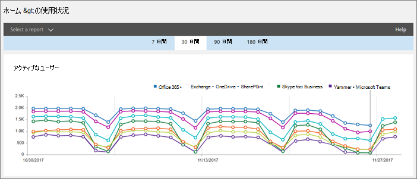

Microsoft Teams のユーザー アクティビティ レポートを使用する 
========================================

Microsoft 365 管理センターの活動レポートを使用すると、組織内のユーザーがマイクロソフトのチームを使用する方法を参照してください。 などの場合は、マイクロソフトのチームがまだいくつか使用しないことが認識できませんを開始またはチームを使用して、生産性と共同作業する方法を理解する方法。 組織では、アクティビティ レポートを使用して、トレーニングとコミュニケーションに関する優先項目を判断できます。

## チーム レポートをレポートのダッシュ ボードに表示する方法

1. [Microsoft 365 管理センター](https://portal.office.com/adminportal/home)で**レポート**を選択します > **の使用率**です。
 
2. **使用法**] ページで、**レポートを選択**すると、選択をポイントし、**マイクロソフトのチーム**のレポートの一覧で、[レポートを表示します。

## 使用可能なチームの活動レポート

現在、2 つの活動レポートを表示することがあります。

- [Microsoft Teams ユーザー アクティビティ レポート](#microsoft-teams-user-activity-report) 
- [Microsoft Teams のデバイス使用状況レポート](#microsoft-teams-device-usage-report) 

### Microsoft Teams ユーザー アクティビティ レポート

チームのユーザー アクティビティ レポートを使用すると、ユーザーをチームで実行する最も一般的なアクティビティの表示。 何人かがチャネルでチャットに参加、プライベート チャット メッセージを使用して数に伝達し、その通話や会議の参加を数が含まれます。 組織全体および個々 のユーザーごとにこの情報を表示できます。

#### マイクロソフトのチームのユーザー アクティビティ レポートを解釈します。

チームのユーザーのアクティビティにビューを取得するには、**アクティビティ**および**ユーザー**のグラフを見るします。

|コールアウト |説明  |
|--------|-------------|
|**1**   |過去 7 日間、30 日、90 日または 180 日間での傾向のチームのユーザー アクティビティ レポートを表示できます。 ただし場合は、レポート内の特定の時間範囲をクリックすると、テーブル (7) データが表示されます (2) の日までの 30 日間のレポートが生成されたときです。 |
|**2**   |各レポートには、このレポートが生成された日付が表示されます。通常、レポートはアクティビティの時刻から 24 から 48 時間の遅延を反映します。 |
|**3**   |**[活動**] ビューでは、活動の種類によって、マイクロソフトのチーム アクティビティの数を示します。 活動の種類は数チーム チャット ・ メッセージ、プライベート メッセージ、呼び出し、および会議の。 |
|**4**   |**Users**ビューでは、活動の種類別のユーザーの数を示します。 活動の種類は数チーム チャット ・ メッセージ、プライベート メッセージ、呼び出し、および会議の。 |
|**5**   |グラフの X 軸は、特定のレポートの選択した日付範囲です。 <ul><li>**アクティビティ**グラフでは、Y 軸は、指定された活動の数です。</ul></li> <ul><li>**ユーザー**グラフには、Y 軸は、チーム チャット、プライベート チャット、通話、または会議に参加しているユーザーの数です。</ul></li> |
|**6**   |凡例の項目をクリックして、グラフに表示する系列をフィルター処理できます。 **アクティビティ**グラフで、をクリックしてなど、**チャネル メッセージ**、**チャット メッセージ**、**呼び出し**、または**会議**を 1 つずつに関連する情報のみを参照してください] をタップします。 この選択を変更すると、グリッド テーブルの情報は変更されません。 |
|**7**   |最も幅の広い (180 日間) レポートの期間にわたってアクティブなチームのリストです。  活動の数は、日付の選択によって異なります。    テーブルの次の情報を表示するには、テーブルに列を追加するようにします。 <ul><li>**ユーザー名**は、ユーザーの電子メール アドレスです。 実際の電子メール アドレスを表示したり、このフィールドを匿名にします。</ul></li> <ul><li>**最終アクティビティの日付 (UTC)** は、ユーザーがマイクロソフトのチームの活動に参加した最後の日付を参照します。</ul></li> <ul><li>**チャネル メッセージ**は、ユーザーが転記される一意のメッセージの数を指定された期間中にチーム チャットにします。</ul></li> <ul><li>**チャット メッセージ**は、ユーザーで転記いるプライベート チャット指定された期間中に一意のメッセージの数です。</ul></li> <ul><li>**呼び出し**にユーザーが参加している呼び出しの数を指定された期間中にします。</ul></li> <ul><li>**会議**は、指定された期間中にユーザーが参加しているオンライン会議の数です。</ul></li> <ul><li>**その他の活動**は、他のチームのアクティビティを含めるには、その以外のユーザーの数: 自由のメッセージは、アプリケーション、ファイル、検索、次のチームとチャネル、favoriting で作業します。</ul></li> <ul><li>**削除**では、チームが削除されるかどうかを示します。 チームが削除されると、レポートの期間で活動をした場合は、削除された true に設定すると、グリッド表示されます。</ul></li> <ul><li>**削除された日付**は、ユーザーが削除された日付です。</ul></li> <ul><li>**製品の割り当て**は、ユーザーに割り当てられている製品の一覧です。</ul></li>組織のポリシーにより、ユーザー情報を特定できるレポートを表示できない場合は、これらすべてのレポートのプライバシー設定を変更できます。 チェック アウト、**ユーザー レベルの詳細を非表示にする方法ですか?** [Microsoft 365 管理センターのプレビューでの活動レポート](https://support.office.com/article/activity-reports-in-the-office-365-admin-center-0d6dfb17-8582-4172-a9a9-aed798150263)のセクション。</ui> |
|**8**   |**列**を追加またはテーブル内の列を削除] をタップまたはクリックします。 |
|**9**   |**エクスポート**レポート データを Excel の .csv ファイルにエクスポートする] をタップまたはクリックします。 これにより、すべてのユーザーのデータがエクスポートされ、単純な並べ替えとフィルター処理を行ってさらに分析することができます。 2,000 人未満のユーザーをした場合は、並べ替えし、フィルター処理、レポート内のテーブル内でします。 2,000 を超えるユーザーがいる場合は、フィルタ リングおよび並べ替え、レポート データをエクスポートする必要があります。 

### Microsoft Teams のデバイス使用状況レポート

チームのデバイスの使用状況レポートは、ユーザーがモバイル アプリケーションを含む、すべてのチームに接続する方法に関する情報を提供します。 レポートでは、どのデバイスが、組織でよく使用されるとどのように多くのユーザーが外出先で作業を理解するのに役立ちます。

### マイクロソフト チームのデバイスの使用状況レポートを解釈します。

デバイスの使用状況をチームにビューを取得するには、**ユーザー**と**配布**のグラフを見ています。

|コールアウト |説明  |
|--------|-------------|
|**1**   |傾向の過去 7 日間、30 日、90 日または 180 日間でチームのデバイスのレポートを表示できます。 ただし場合は、レポート内の特定の時間範囲をクリックすると、テーブル (7) データが表示されます (2) の日までの 30 日間のレポートが生成されたときです。 |
|**2**   |各レポートには、このレポートが生成された日付が表示されます。通常、レポートはアクティビティの時刻から 24 から 48 時間の遅延を反映します。 |
|**3**   |**Users**ビューでは、デバイスの種類によってユーザーの 1 日の数を示します。 |
|**4**   |**配布**が表示するユーザーの数のデバイスが選択した期間にわたってされます。  |
|**5**   | <ul><li>**ユーザー**グラフのレポートの選択した日付の範囲は、X 軸と Y 軸は、デバイスの種類では、ユーザーの数です。</ul></li> <ul><li>**分布**] グラフの X 軸は、チーム、および Y 軸への接続に使用されるさまざまなデバイスは、デバイスを使用するユーザーの数を示します。</ul></li> |
|**6**   |凡例の項目をクリックして、グラフに表示する系列をフィルター処理できます。 やなどの**分布**のグラフで] をクリックしてまたはタップして**Windows**、 **Mac**、 **Web**、 **iOS**、 **Android**を 1 つずつに関連する情報のみを参照してください。 この選択を変更すると、グリッド テーブルの情報は変更されません。 |
|**7**   |最も幅の広い (180 日間) レポートの期間にわたってアクティブなチームのリストです。  活動の数は、日付の選択によって異なります。    テーブルに次の情報を表示するには、テーブルに列を追加するようにします。 <ul><li>**ユーザー名**は、ユーザーの電子メール アドレスです。 実際の電子メール アドレスを表示したり、このフィールドを匿名にします。</ul></li> <ul><li>**最終アクティビティの日付 (UTC)** は、ユーザーがチームの活動に参加した最後の日付を参照します。</ul></li> <ul><li>**削除**では、チームが削除されるかどうかを示します。 チームが削除されると、レポートの期間で活動をした場合は、削除された true に設定すると、グリッド表示されます。</ul></li><ul><li>**削除された日付**は、ユーザーが削除された日付です。</ul></li> <ul><li>**Windows**は、ユーザーがチームのデスクトップ クライアントを Windows ベースのコンピューター上でアクティブな場合に選択されます。</ul></li> <ul><li>**Mac**は、ユーザーが macOS コンピューター上のチームのデスクトップ クライアントでアクティブな場合に選択されます。</ul></li>  <ul><li>**Web**は、ユーザーがチームの web クライアント上でアクティブな場合に選択されます。</ul></li> <ul><li>ユーザーは、iOS のチームのモバイル クライアント上でアクティブだった場合は、 **iOS**が選択されます。</ul></li> <ul><li>**Android の電話**は、ユーザーが Android のチームのモバイル クライアント上でアクティブな場合に選択されます。</ul></li></li> <ui>場合は、組織のポリシーからユーザー情報が識別可能なレポートを表示するように、これらすべてのレポートのプライバシー設定を変更できます。チェック アウト、**ユーザー レベルの詳細を非表示にする方法ですか?** [Microsoft 365 管理センターのプレビューでの活動レポート](https://support.office.com/article/activity-reports-in-the-office-365-admin-center-0d6dfb17-8582-4172-a9a9-aed798150263)のセクション。</ui> |
|**8**   |**列**を追加またはテーブル内の列を削除] をタップまたはクリックします。 |
|**9**   |**エクスポート**レポート データを Excel の .csv ファイルにエクスポートする] をタップまたはクリックします。 これにより、すべてのユーザーのデータがエクスポートされ、単純な並べ替えとフィルター処理を行ってさらに分析することができます。 2,000 人未満のユーザーをした場合は、並べ替えし、フィルター処理、レポート内のテーブル内でします。 2,000 を超えるユーザーがいる場合は、フィルタ リングおよび並べ替え、レポート データをエクスポートする必要があります。 

## チームの活動レポートにアクセスできるユーザー

活動レポートは、割り当てられているユーザーがアクセスできます。

- Office 365 のグローバル管理者の役割
- 製品固有の管理者の役割 (Exchange、ビジネス、または SharePoint の Skype)
- レポートの閲覧者の役割

### レポートの閲覧者の役割

非 IT スタッフが、これらのレポートにアクセスするのには、*レポートの閲覧者*の役割を割り当てることができます。 トレーニング マネージャー、またはビジネスの利害関係者にこのロールを割り当てるでは、チームのドライブとトラックの採用に役立つ情報へのアクセスがあることを確認の操作を行うことができます。

## レポートのダッシュ ボードの他の情報

### 概要活動のウィジェット

レポート ダッシュ ボードには使用するユーザーの通信し、共同作業を他のさまざまなサービスを使用して、Office 365 でのクロス積表示の概要アクティビティ、ウィジェット、チームからの使用状況データが含まれます。

### チーム活動カード

レポートのダッシュ ボードのチームの活動カードによって、サービスを使用しているユーザーの数を簡単に理解できるように、アクティブなユーザーの数を含む、チームの活動の概要ができます。 ダッシュ ボードの活動カードをクリックすると、チームのユーザーの利用状況レポートに移動します。 

