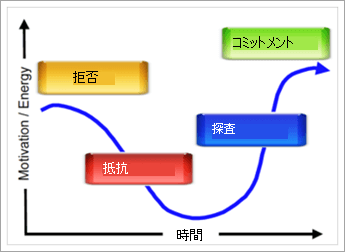

# マイクロソフト チームの組織はどのように準備ができてのですか。How ready is your organization for Microsoft Teams?

プロジェクト チームが一体となって、あなたはチームで何ができる、組織の表示を開始、することが重要チーム移行のため、組織の対応を評価します。Now that your project team has come together and you are beginning to see what Teams can do for your organization, it's important to assess your organization’s readiness for the Teams transition. 対応力を評価するために必要になります。To assess your readiness, you will need to:

1. 関係者を評価します。Assess your stakeholders.
2. 初期採用者を識別します。Identify early adopters.
3. 変更のための組織の対応を評価します。Evaluate the organization's readiness for change. 

## 関係者を評価します。Assess your stakeholders

主要な利害関係者と組織のビジネス ・ リーダーを一覧表示します。List the core stakeholders and business leaders in your organization. 各は、次の質問を確認してください。For each individual, ask the following questions:
 
1. このリーダーは、新しいテクノロジーへのわかりやすいですか。Is this leader friendly to new technology?
2. このリーダーの現在のテクノロジでは、満足度を評価します。Rate this leader’s satisfaction with your current technology.
3. このリーダーは承認されていないテクノロジーを使用して、結果を迅速化、または自分のチーム メンバーが快適に作業を作成するつもりですか。Is this leader willing to use unsanctioned technology to accelerate results or create a better experience for his/her team members?
4. このリーダーは、高度に重要なビジネスの結果を配信するというプレッシャーの下ですか。Is this leader under a high degree of pressure to deliver key business results? 
5. このリーダーはへの移行を支援するチームと自分の経験を浸透させるつもりでしょうか。Will this leader be willing to evangelize his/her experience with Teams to assist in the transition?
6. このリーダーは、既存のプロジェクト チームの主要メンバーと良好な関係をあるか。Does this leader have a positive relationship with key members of the existing project team?
7. このリーダーは、"エージェントの変更]、組織内で表示されるようください。Does this leader like to be viewed as an “agent of change” within the organization?  

組織に関連するその他の質問を追加することができます。You can add additional questions that are relevant to your organization. 初期の 2 つのフェーズ (起動と実験) が表示されますリーダーを変更するのにはわかりやすい、やや不満である現在の技術と適切な関係があります。For your initial two phases (startup and experiment), you'll see leaders who are friendly to change, somewhat dissatisfied with current technology, and that you have a good relationship with. これらのリーダーは、ビジネス ・ アドバイザーとして、コア プロジェクト チームにする必要があり、プロジェクト、実験段階に不可欠となる場合があります。These leaders should be brought into the core project team as business advisors and may have projects that will be essential for your experimentation phase. 、を試してみるし、初期の実験の危険度の高いプロジェクトを避けるために効果の大きい、現実の世界の状況を選択するのには重要です。It is important to select impactful, real world situations to experiment with, and avoid high risk projects for your initial experiments.
   
> [!NOTE]
> このようなアンケートは、組織内の関係の人的要素の影響を最小限に抑えるにスコアを割り当てることはできますが、変更の推進によって異なりますチームの化学程度の技術的なスキルやビジネスの能力。While it's possible to assign a score to this sort of questionnaire that would minimize the impact of the human element of relationships within your organization, driving change depends on the chemistry of the team as much as their technical skill or business acumen. 後続のフェーズのプロジェクトおよびスタッフを選択すると、「フィット」のこのプロジェクト各種リーダーを説明する、チームのメンバーがこの一覧を確認します。Review this list with your team members to discuss the “fit” of your various leaders with this project as you select projects and staff for subsequent phases. 

## 初期採用者を識別します。Identify early adopters

初期採用者は、組織がある可能性がありますどのような規模や業界に関係なく特定の特徴を共有します。Early adopters share certain traits no matter what size or industry your organization may be. 通常、初期採用者は、これらの特徴を共有します。Typically, early adopters share these traits:

- 技術に関心があります。Interested in technology
- 変更の一部を開けていただけるWilling to be a part of change
- 改善しようとしています。Seeking to make improvements
- 本質的に共同作業Collaborative by nature
- 開けていただける、観測値とな学習項目をグループで共有Willing to share their observations and learnings with the group
- リスクを取ることでした。つまり、つもりに動作するかどうかを何かの操作を実行してください。Are risk takers; that is, they're willing to try something to see if it works

Office 365 のチームが、早期採用プログラムを無効にするのにこれらの個人を許可するのに簡単なフォームを使用します。Use a simple form in Office 365 to allow these individuals to opt into your early adopter program for Teams. サイズと複雑さによっては、組織の、実験段階のこれらのメンバーの一部またはすべてを有効にすることもできます。Depending on the size and complexity of your organization, you may choose to enable some or all of these individuals for your experimentation phase. このプログラムで、同意したものとに積極的に、実験段階で参加し、プロジェクト チームに定期的なフィードバックを提供します。In this program, they are agreeing to actively participate in your experimentation phase and provide regular feedback to the project team. 新しいドライブ ・ テクノロジーをテストしたいデータだけで個人の必要があります。Avoid having individuals who simply want to test drive new technology. アクティブなフィードバックを提供することでは、プロジェクトの結果を作成するのには支援しているのかを知らせます。Let them know that by giving this active feedback, they are helping to craft the outcome of your project. [第 2 段階の実験](teams-adoption-phase2-experiment.md)では、このユーザーの一覧を使用します。You will use this list of people in [Phase 2 - experiment](teams-adoption-phase2-experiment.md).

早期採用プログラム ガイドは、お客様の環境でこのプログラムを始める際に役に立つリソースです。Our Early Adopter Program Guide is a helpful resource for kicking off this program in your environment.  
 
## 変更のため、組織の導入準備を評価します。Assess your organization’s readiness for change

変更は、テクノロジーとは何をした人間のプロセスです。Change is a human process that has nothing to do with technology. 行動心理学、自然な抵抗を変更するのには私たちへのトレーニングの neuroscience がありません。There is behavioral psychology and neuroscience that educates us about the natural resistance to change. 変更許容可能なユーザーのニーズを予測し、各自の状況についての理解を表現し、その状況を改善するソリューションを作成するが重要です。To make change acceptable, it's critical to anticipate the needs of your users, express your understanding of their situation, and create solutions that improve that situation. で変更するのには自然な抵抗が発生するそうです。Even in doing so you will encounter natural resistance to change.  

地域、ワーク スタイル、本格的なプロファイルは、組織の他の要素によって異なる方法で変更をすべての組織に近くなります。Every organization approaches change differently, depending on region, work style, professional profile, and other elements of the organization. 組織の準備を評価するには、[組織の評価を変更する準備](upgrade-org-change-readiness.md)を参照してください。To assess your organization's readiness, see [Assess organizational change readiness](upgrade-org-change-readiness.md). ガイドラインを使用して、次の質問に回答します。Use the guidelines to answer the following questions:

1. ユーザーの割合は、各バケットに分類されますか。What percentage of users fall into each bucket? (*変更の抵抗*)(*Change resistance*)
    - **初期採用者**: 使用可能になる前にソリューションを要求します。**Early adopters**: request the solution before it's available.
    - **ユーザーに通知**: したら、その値は、実証済みのソリューションを使用します。**Informed users**: use the solution once its value is proven.
    - **Dissenters**: すべての変更にプッシュします。**Dissenters**: push back on any change.
    
   > [!TIP]
   > 初期採用者は、優れたパイロットのテスト担当者を行い、チャンピオンのピアです。Early adopters make great pilot testers and peer champions. 新しいツールを採用する低速であるユーザーは、追加の激励とより多くの時間を調整する必要があります。Users who are slow to adopt new tools require additional encouragement and more time to adjust. 

2. 変更のユーザーの能力とは何ですか。What is the users’ competency for change? (*トレーニング*)(*Training*)
    - **セルフ スターター**ビデオへのリンクのみを必要とします。**Self starters** require only a link to a video.
    - グループのトレーニングと**チーム ビルダー**の操作を行います。**Team builders** do well with group training.
    - **1 対 1 の学習者**は、個人のサポートを必要とします。**One-to-one learners** require personal support.

    > [!TIP]
    > タイプと適性とペルソナにトレーニングの量を調整します。Tailor the type and amount of training to competency and personas. トレーニングはオンラインの新機能と更新をしてください。Keep training updated as new features come online.

3. このサービスの導入だけでなく他の多くの変更が発生しているでしょうか。In addition to this service deployment, how many other changes are happening? (*適応*)(*Adaptability*)  Office または Windows のアップグレード、事務所の移転、合併、再編成用などの変更があります。Changes could include Office/Windows upgrades, office moves, mergers, reorgs, and so on.
    - なしNone
    - 1-3 の変更1-3 changes
    - 3 つ以上の変更More than 3 changes
 
    > [!TIP] 
    > 変更が多すぎるは承諾し、生産性を妨げられます。Too much change can impede acceptance and productivity. 3 つ以上の変更が進行中である場合は、間隔、またはバンドルにテーマを作成するが同時に変更を検討してください。If more than 3 changes are underway, consider spacing them out or creating a theme to bundle changes together.  

早期採用プログラムのオプトインする従業員、利害関係者のプロファイルでこのデータを結合します。Combine this data with the stakeholder profiles and employees who wish to opt in for the early adopter program. これは、テンプレートを使用する特定のグループの準備ができていると、既存の業務と併せて変更を吸収することができます。This will let you identify groups that are ready for and can absorb change alongside their existing duties. このメソッドは、変更のパートナーを作成できます。This method will allow you to create partners in change.

内部のエキスパートを使用するにはさまざまな変更の種類を持つことの問題に対処します。You can use internal champions to address the problem of having different change types. ここでは、フィードバックは、成功への鍵: お客様の課題とニーズを共有するユーザーをお勧めします。Here, feedback is the key to success: encourage people to share their challenges and needs. 実験中に、テーブル席でこれらの個人またはグループが提供して、disrupters と dissenters を採用します。Embrace disrupters and dissenters by giving these individuals or groups a seat at the table during experimentation. このベスト プラクティスは、コラボレーション機能の強化のより滑らかな広範な展開の道が開かれます。This best practice will pave the way for a smoother broad deployment of your collaboration improvements.  

次:[マイクロソフト チーム導入フェーズ 2: 実験](teams-adoption-phase2-experiment.md) Next: [Microsoft Teams adoption phase 2: Experiment](teams-adoption-phase2-experiment.md) 