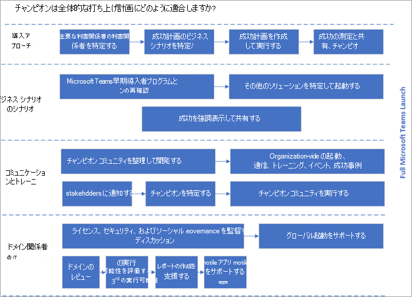

# Microsoft Teams のチャンピオン プログラムを作成するCreate your champions program for Microsoft Teams

チャンピオンは、組織の認識、導入、教育を推進するために不可欠です。Champions are essential to driving awareness, adoption, and education in your organization. チャンピオンとは、新しいテクノロジ (特に Teams) に関心を持つ他のユーザーを支援し、他の従業員がベスト プラクティスに従って使用するのを支援することで、主に動機付けられている人物です。A champion is a person, primarily motivated by helping others, who is interested in new technology (specifically Teams) and helping other employees use it in alignment with your best practices. 組織の規模によっては、その人の役割の正式な一部としてこれを持つ場合がありますが、多くの場合、従業員は他のユーザーを支援する主な動機のために、この役割を自分で担います。Depending on the size of your organization you may have this as a formal part of the person's role, but often employees take on this role themselves because of their core motivation to help others.

チャンピオンは、次に示すように、さまざまな方法で全体的な発売計画に適合します。Champions will fit into your overall launch planning in a variety of ways as shown below.

チャンピオンは以下を行う必要があります。Champions should:

- 知識の深さと幅を高める正式なトレーニングを受け取るBe formally trained to increase their depth and breadth of knowledge
- 同僚のガイド、教え、トレーニングを行うのを奨励および強化するBe encouraged and empowered to guide, teach, and train their peers
- 努力の影響を肯定的に示す一貫した肯定的な強化を持つHave consistent and positive reinforcement that affirms the impact of their efforts
- 実行する明確な計画を立てHave a clear plan to execute

チャンピオン プログラム [ガイドを使用して](https://go.microsoft.com/fwlink/?linkid=854665) 、組織でこのプログラムをビルドします。Use our [Champions Program Guide](https://go.microsoft.com/fwlink/?linkid=854665) to build this program in your organization. このコミュニティのベスト プラクティスは次のとおりです。Our best practices for this community are:

- チャンピオン ズ プログラム [に参加します](https://aka.ms/O365Champions)。Join the [Champions Program](https://aka.ms/O365Champions). 少なくともチャンピオン プログラムのリーダー (およびすべての会社のチャンピオン) がプログラムのメンバーである必要があります。Make sure that at a minimum the leaders of the Champions program (and potentially all company champions) are members of the program. この無料の毎月のコミュニティ呼び出しは、独自のプログラムを実行し、Teams や他のサービスやサービスを利用Microsoft 365情報Office 365提供します。This free, monthly community call will provide valuable information for running your own program and getting the most from Teams and other Microsoft 365 or Office 365 services. プログラム資料は、独自の内部プログラムで再利用できます。Program materials can be reused in your own internal program.

- Teamwork Champions チームを使用する: チャンピオンは、セットアップしたチームを、すべてのプログラムのコミュニケーション、フィードバック、およびリソースの検索に使用する必要があります。Use the Teamwork Champion team: Your champions should use the team you have setup for them for all program communications, feedback, and to find resources.  これを行う際には、製品とその利点に慣れ親しむ必要があります。In doing this they will become increasingly familiar with the product and its benefits.

- 定期的な毎月の会議を開催する: 定期的な毎月の会議を開催することで、コミュニティの熱意と一意性を高める。Hold regular monthly meetings: Promote enthusiasm and cohesiveness of your community by holding regular monthly meetings. これらは、対人会議と仮想会議を組み合わせて使用できますが、その一貫性は、チャンピオン コミュニティを成長する鍵です。These can be a combination of in person and virtual meetings, but their consistency is key to having a thriving champions community.

    > [!TIP]
    > 議題を作成するには、一般向けコミュニティの呼び出しの後の 1 週間の会議をスケジュールします。To help build your agendas, schedule your meetings for the week after the public community call. 

- プログラムの要件を明確に: 一部のチャンピオン プログラムでは、メンバーが毎月の会議に出席し、サポートするユーザーのグループのオフィス時間を保持し、新しいユーザーにトレーニングを提供する必要があります。Be clear about program requirements: Some champion programs require that members attend the monthly meetings, hold office hours for the group of users they support, and provide training to new users. 要件が何であれ、プログラムに正常に参加する方法をチャンピオンが明確に確認してください。Whatever your requirements, make sure that champions are clear on how to successfully participate in the program.

- チャンピオンに目に見えて報奨を与える: チャンピオンは、プロジェクトの進捗状況と潜在的な落とし穴に関する重要な洞察を提供します。Visibly reward your champions: Your champions will give you important insights into the progress and potential pitfalls of your project. 多くの場合、参加に対してリワードを与えます。Reward them often for their participation. 小さなジェスチャーは長い道のりを行き、多くの場合、従業員は金銭的利益を探しているのではなく、その貢献に対する認識を高く評価しています。Small gestures go a long way, and often employees are not looking for monetary gain but appreciate recognition for their contributions. コミュニティに感謝する適切で楽しい方法を見つける。Find appropriate and fun ways to thank your community. 

- 早期および頻繁にチャンピオンをトレーニングする: プログラムが開始され、毎月の会議を使用して、チャンピオン コミュニティでスキルを構築できます。Train champions early and often: Your program kick off and monthly meetings can be used to build skills in your champion community. これらの機会を利用し、最初のトレーニングを実施し、コースへの参加を促し、実験フェーズに進む従業員をサポートする準備ができていることを確認します。Use these opportunities to bring them on board, conduct their initial training, encourage them to attend our courses, and make sure they are ready to support their employees as they move forward in the experimentation phase.  

 次: [ガバナンスのクイック スタートを完了する](teams-adoption-governance-quick-start.md) Next: [Complete the governance quick start](teams-adoption-governance-quick-start.md)

