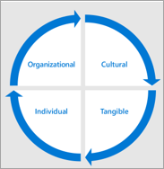

# Microsoft Teams の導入の結果と成功を定義する

近代化するすべてのビジネスシナリオまたはサービスについては、ビジネスにおける成功を定義することが重要です。 この情報は、前のフェーズでマッピングした最初のシナリオに対して収集されます。 スケーリングの実装を準備するときは、これらの重要な成功抽出条件を再検討して展開する必要があります。
  
以下に、これらの条件をマッピングするための推奨される方法を示します。 この手順には、さまざまな有効な方法があります。 ガイドを参照するか、または操作している Microsoft パートナーのガイドに従ってください。 どの方法を選んでも、お客様のビジネスの成果は、お客様のサービスと組織の全体的な目標によってサポートされていることを確認してください。
  
ビジネスに応じて優先順位を付けられる結果の4つのカテゴリがあります。 相互に接続され、個々の従業員が経験する近代化とデジタルトランスフォームの基盤となります。  

各カテゴリの結果の例を次に示します。

- **階層**
   - 文化的変換
   - 従業員の保持
   - 才能獲得
   - ソーシャルエンゲージメント
   - オペレーショナルアジリティ 

- **文化**
   - 従業員感情
   - 従業員の推奨事項
   - お客様からのフィードバック
   - 革新の手段 (たとえば、アイデアフォーラムの投稿、hackathons、製品革新の取り組みなど)

- **現実的**
   - カスタマーエクスペリエンスの影響 (サービスの高速化、サービスインシデントの削減、顧客紹介/ロイヤルティプログラムへの参加)
   - コスト削減
   - 収益の創出
   - データのセキュリティ
   - プロセスの効率化
   - 従来のシステムの廃止
   
- **異なる**
   - 目的のツールの使用
   - 従業員 morale
   - 従業員の生産性
   - 従業員のエンゲージメント
   - アイデアの生成
 
一般的に、次のように、これらのメジャーを集積して、会社の変更の商をこの方法で作成します。

## サービスの有効化戦略を選ぶ

Teams は transformative テクノロジであるため、組織の規模や既存のテクノロジによっては、さまざまな方法をとることができます。 次の戦略を検討してください。

| チームの先頭へ | Teams Core | チームが大きくなる | Skype を並べて比較 | 移行 |
|------------ | ---------- | ------------ | ------------------ | --------- |
| Teams を使用したクラウド展開の導入 | チームとの共同作業のシナリオの支援 | チームおよび組織全体のチームのすべての従業員 | Teams と Skype for Business を有効にする | Skype for Business から Teams へのユーザーの移行 |
| -Office 365 の新規または低使用のお客様に適用される  -顧客固有のシナリオに Teams を導入する  -統合されたユーザーエクスペリエンスを強調表示し、Office 365 の時間を短縮する  -シリアルの実装を回避するために、共同作業の計画を行う | -OneDrive および SharePoint Online と共にチームを有効にする  -Microsoft Stream を使ってニュースのリソースとビデオを共有するために会社のイントラネットを作成する **共同**作業の改善:  Teams SharePoint Yammer プランナー PowerApps |-5000 座席の数が2未満のお客様 (現在の制限) -1 つのチームで組織間の共同作業を可能にする -一般的なタスク (休暇要求、従業員調査、役員契約) を自動化する |-チームのコア戦略を使用して共同作業を促進する -必要なサイズと機能セットに基づいて会議シナリオガイダンスを強調表示する -エンタープライズ通話、相互運用性、およびハイブリッドシナリオに Skype for Business を使用する -機能計画のためのパブリックロードマップを使用します。 |-顧客のサービス戦略ロードマップを作成して、Skype for Business から Teams への移行を計画する -機能リリーススケジュールに添付 -左右に並べて、チームコアを含めることをお勧めします。

ほとんどのお客様の組織に関する推奨事項を以下に示します。 ただし、例外もあります。 ここに記載されていないシナリオのガイダンスを得るには、推進のためのコミュニティまたは FastTrack のチームまたは Microsoft パートナーネットワークに質問してください。

- **チームの最初または teams のコアを選択し**ます。ほとんどの組織には、Microsoft テクノロジへの既存の投資が含まれています。 Exchange Online、OneDrive for Business、または SharePoint など、一度に複数のワークロードを有効にすることができます。 このような場合は、Teams の最初のコアまたは Teams のコアを選択することをお勧めします。 これにより、チームのコラボレーション環境が強化されます。 共同作業プロジェクトチームは、追加機能の展開を計画し、それを成功させるために必要なトレーニングとサポートを計画することができます。 

- チームの最大数**を選ぶ**: 新しい Office 365 顧客組織では、新しいテクノロジを複数回学習することで発生する変更の疲労を最小限に抑えるために、多くの場合、チームの大きなアプローチを取ることをお勧めします。 主要なコラボレーションと会議、SharePoint、OneDrive、Planner、その他のワークロードの両方について Teams を有効にすると、チームの展開のコンテキストで従業員がそのことを知ることができるので、最大のメリットが得られます。 

    チームの規模は、従業員のコミュニケーションと契約を簡単にするために、1000従業員の組織にとって、適切な有効化戦略でもあります。 組織全体のチームを使用すると、ユーザーを協力して、どのデバイスでも一般的なタスクと計画を確認できます。 

- **[左右に並べて**表示]: 電話会議用に Skype for business を使用している組織、会議室デバイスのサポートを利用している組織、またはクラウドの音声機能を使用している組織の場合、チームと skype を並行して共同作業を行うことをお勧めします。 Skype for business を会社の都合に合わせて移行すること 両方のクライアントを同時に実行することで、どのツールを使用するかについてユーザーが混乱する可能性があることに注意してください。このフェーズは、導入に向けて短くすることをお勧めします。 

- **移行の選択**: Skype for Business から Teams への移行には技術的な観点からの追加コンポーネントが含まれていますが、ユーザーの導入の計画には、チームの大きな実装と同じコンポーネントが含まれています。 さらに、チーム会議のエクスペリエンスとインターフェイス、新しい常設チャットの動作、および Skype for Business とは異なるエクスペリエンスのその他の要素についても、ユーザーを教育します。

各有効化戦略については、お客様の環境で従業員のエクスペリエンスを最大限に高めるために、技術的な準備チームと密接に協力することが重要です。 

 決定: Microsoft Teams のビジネスの成果を最大限にサポートし、テクニカル実装チームが有効にできる有効化戦略を選択します。 これは、IT 主導、プログラム管理のリーダー、ユーザー導入の専門家の間での共同での意思決定です。 この決定は、多くの場合、Microsoft Teams または組織内のコラボレーションサービスの最終的な成功の所有者である役員関係者になります。

ベストプラクティス: プロジェクトまたは部門の実装スケジュールの特定のフェーズに適した有効化戦略を設定することができます。 主要なペルソナとそのニーズを使って選択します。 技術実装チームと密接に協力して、ユーザーのために高品質のエクスペリエンスを実現します。  

## 関係者の関与

適切な変更プロジェクトでは、コミュニケーションと期待値の管理が重要な要素となります。 全体的なビジョンと、その目標に向けた進捗状況を、関係者や組織の他のユーザーに定期的に伝えることが重要です。 

 決定: 会社の文化と連携して、関係者と通信するためのリズムと方法を決定します。 組織全体で、さまざまなレベルの契約と関心をお客様に伝えます。 

オプション: プロジェクトに関する情報の継続的な知識ベースを作成するには、SharePoint コミュニケーションサイトでニュースページを使用することを検討してください。 計画チームに関連付けられた SharePoint サイトのサイトページを公開して、すべての関係者と共有できるようにします。

## 実装チームを拡張する

大規模な組織では、幅広い有効化フェーズにさまざまな役割を取り入れることをお勧めします。 これには、追加のビジネススポンサー、スタッフのサポート、チャンピオンコミュニティ内の追加メンバー、正式な変更管理やトレーニング担当者などが含まれる場合があります。 次の図は、職務の分割を可能にする大規模な採用チームを示しています。

小規模の組織では、これらの役割の1つまたは複数が1人のユーザーによって実行されることもありますが、必要なスキルは変わりません。  技術、コミュニケーション、トレーニングのスキルは、変更プロジェクトを成功させるために重要です。 

## ガバナンスと情報管理ポリシーを拡張する

有効化戦略を選択すると、フェーズ1で行ったガバナンス上の決定を再検討して、調整する準備が整います。 [ガバナンスクイックスタート](teams-adoption-governance-quick-start.md)から 1 ~ 6 の決定を再確認して、チームを使用するビジネスユーザーに合わせてこれらのポリシーを展開します。 

| チームレベル | 範囲/目的 | 標準メンバーシップ | [時間] |
|----------- | ------------- | ------------------- | -------- |
|レベル1 | 部門またはビジネスユニットの権限を持つチーム | 通常はこの区分/単位の公式メンバーに制限されます。 | Perpetuity で、部門が存在する限り (IT 部門、人事、マーケティングなど)|
| レベル2 | スコープが狭いプロジェクト、サービス、またはイニシアチブチーム |  通常は組織間で、ゲストも含まれている可能性がある | プロジェクトまたはサービスが作業している間、 |
| レベル3 | ポイントインタイムプロジェクト | 個々のスコープを持つ小規模の結束チームゲストが含まれている可能性がある | 主要成果物に関連付けられた短いライフサイクル |

チームレベルのプロビジョニングと管理のベストプラクティスの例:

|チームレベル | 誰が作成したか? | Lavels と保持 | 考慮事項 |
| --------- | ------------ | -------------------- | -------------- |
| レベル 1-部門 | そのグループの IT またはチャンピオンが適切に名前を指定する | 標準のアイテム保持ポリシーと1年の更新ポリシーが適用されている機密情報 | 「ドメイン名を予約する」のように考えてみましょう。 区分チームの名前の付け方と含まれている内容を管理する必要があります。  他のユーザーを追加する前に、チームを設計します。|
| レベル 2-プロジェクト/サービス | プロジェクト所有者またはチャンピオン | コンテンツによって社外秘または機密性が高くなります。 アイテム保持ポリシーが設定されている可能性があります。 6か月の更新。 | これを作成する前に、作業しているプロジェクトまたはサービスの境界を超えてみてください。 他のチームとの力を組み合わせることも意味がありますか? 1つのプロジェクトまたはサービスで作業するときに、個々のユーザーがアクセスする必要があるチームの数を最小限に抑えるように努力します。|
| レベル3–スモールオンデマンドプロジェクトチーム | 組織内のすべての人 | 標準の保存期間と6か月の更新された [全般] ラベル。 名前付け規則 (プレフィックス/サフィックス) を含めることができます。| セルフサービスオンデマンドチーム。 競合のないプロビジョニング。 これにより、小規模のプロジェクトチームが、会社が提供するサービスからすぐに価値を得ることができるようになり、円滑な共同作業とコミュニケーションが容易になります。 |

## ビジネスエンゲージメントの合理化

Microsoft Teams でデジタル変換と使用を推進するための重要な要素は、ビジネスユニットと連携して、ニーズ、ビジネスチャンス、および問題点を把握することです。 従来の IT とビジネスの会話と同じように、必要なものにフォーカスを移動する必要があります。 技術要件に移行する前にリッスンします。 多くの場合、Teams の機能が不足すると、組織のニーズを満たすことができます。   

ベストプラクティス: カスタムソリューションの開発を検討する前に、組織が Office 365 のボックスの機能を完全に使用していることを確認します。 カスタムソリューションの開発は、IT とサポート部門にとって長期的な料金を常に負担しています。
 
事業単位の作業を合理化するには、次の手順を実行します。  このプロセスは、大規模な多国籍企業で、Microsoft Teams の最初の大規模な展開の後、長く続く可能性があることを認識します。

1. ビジネスユニット内の主要な影響力を持って、経営陣による洞察と配置の向上を実現します。
2. 一般的なシナリオ (メール、SharePoint、Yammer、その他の製品) の現在のソリューションについて説明します。
3. [大きな影響度]、[低/中程度の難易度] にマップされたシナリオを選択して小さくします。
4. 移行をサポートするためのビジネスユニットの知識を利用して、フィードバックをキャプチャして、エキスパートを育成します。
5. 進捗状況について説明し、追加のプロジェクトのバックログの優先順位を付けるための月次チェックポイントを設定します。

を示すアイコン:[フィードバックの最適化とレポート](teams-adoption-optimize-feedback-and-reporting.md)
