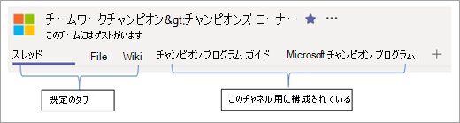

# Microsoft Teams で最初のチームを作成する

チームの導入を推進する最良の方法は、製品を使用することです。 Office 365 の展開は Teams で管理することをお勧めします。 また、チームワークと生産性に重点を置いている従業員のコミュニティも作成する必要があります。 (これらの初期チームは、時間の経過と共に変化する可能性があります)。おすすめのチームの一部を次に示します。

| チーム名 | 提示されたチャネル名 |
| --------- | ---------------------- |
| チームを理解する | General  Say hi  方法を教えてください。 Feedback   Ideas for future teams   Support |
| Microsoft Teams の実装 | General   認知度と導入   ビジネスエンゲージメント   早期導入プログラム   フィードバックと分析   セキュリティとコンプライアンス   戦略と計画   サービス正常性とインシデント   トレーニング   Watercooler チャット |
| チームワークエキスパート | General   ベストプラクティス、トレーニング、および使い方   精鋭コーナー   フィードバックとサポート   プログラムの潜在顧客   ソーシャルハブ |

Microsoft Teams では、 管理者によって有効になっているすべての Office 365 とサードパーティ製のアプリにアクセスできます。 製品の最大値を取得するには、適切な各チャネルのタブとしてキーリソースをピン留めすることをお勧めします。 次の例を参照してください。

最初のチームでは、チームチャネルで簡単に参照できるように、次の項目をピン留めすることをお勧めします。 これらのアセットは、OneNote ノートブックのセクションに追加されています。 FastTrack チームで作業している場合は、最初のチームを構成するのに役立ちます。 

|チーム/チャネル名 | 固定されたタブ |
|----------------- | ---------- |
| **Microsoft Teams の展開** ||
| General | [Web] タブ:[チームドキュメント](https://aka.ms/SuccessWithTeams) |
| 認知度と導入 | [Teams の導入ハブ](https://aka.ms/DriveTeamsAdoption) [Microsoft Teams カスタマー サクセス キット](https://download.microsoft.com/download/A/E/9/AE984CD4-CF4B-41E7-9ABD-6735E3F01897/MicrosoftTeamsCustomerSuccessKit.zip)|
| ビジネスエンゲージメント | Wiki –契約ガイダンス フォーム– Teams の相談要求 リスト–契約要求 |
|最早採用 | 固定されたフィードバックのコミュニティ   OneNote for FAQ と一般的なテーマ |
| フィードバックと報告 | 固定された Office 365 使用状況レポート (Office 365 管理者のみ) |
| セキュリティとコンプライアンス | Microsoft 信頼ポータル   [セキュリティとコンプライアンスに関するドキュメント](https://docs.microsoft.com/en-us/office365/securitycompliance/index)  [Roadmap](https://docs.microsoft.com/office365/securitycompliance/security-roadmap) |
| 戦略と計画 | 共同作業用の北 Star PowerPoint   サービス導入プロジェクト計画 |
| トレーニング | カスタム学習トレーニングポータル   [Teams online のトレーニング](https://aka.ms/TeamsTraining) |
| **チームワークエキスパート**|  |
| General | プログラムアナウンスに使用する   ピンのチャンピオンプログラムの概要 |
| ベスト プラクティス | チーム、チャネル、およびチャットの PowerPoint のベストプラクティス   チームのライフサイクル |
| 精鋭コーナー | 会議のメモとプレゼンテーション |
| ソーシャルハブ | RSS コネクタ: Teams ブログと運転促進ブログ |
| トレーニングとその方法 | トレーニングポータルへのリンク |

## Microsoft Teams への切り替え

Teams の使用を開始すると、チームのチャット、チャネル、リソースを使用してプロジェクトを実行するために、プロジェクトチームの残りの部分が重要になります。 チームの実際の使用は、導入プロジェクトの品質にとって重要です。 メールでコアプロジェクトチームとの会話を続けて、プロジェクトの断片化を防ぐことをお勧めします。 Teams に切り替えることで、従業員が最終的に採用する動作をモデル化します。 まずトーンを設定してから、プロジェクト情報を1か所でお楽しみください。  

を示すアイコン: [Microsoft Teams の組織はどのように準備されていますか?](teams-adoption-assess-readiness.md)
