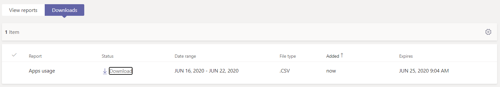

# Microsoft Teams アプリの使用状況レポート

Microsoft Teams 管理センターの Teams アプリの使用状況レポートには、ユーザーが Teams で使用しているアプリに関する情報が表示されます。  

## アプリの使用状況レポートを表示する

1.  管理センターの左のナビゲーションで <https://teams.admin.microsoft.com> 、[分析] をクリックして [**レポート**の \> **利用状況レポート]**& します。 [**レポートの表示**] タブの [**レポート**] で、[**アプリの利用状況**] を選択します。

     :::image type="content" source="media/app-usage-report1.png" alt-text="[利用状況レポート] メニュー項目のスクリーンショット":::

2.  **[日付の範囲]** の下で、範囲を選択して、**[レポートの実行]** をクリックします。

      :::image type="content" source="media/app-usage-report2.png" alt-text="アプリの利用状況レポートのスクリーンショット":::

## レポートを解釈する

|Callout |説明  |
|--------|-------------|
|**1**   |Teams アプリの使用状況レポートでは、過去7日間、30日間、または90日間の傾向を確認できます。 |
|**2**   |各レポートには、レポートが生成された日付が含まれています。 通常、レポートには、アプリが開かれた時点からの24時間の遅延時間が反映されます。   |
|**3**    | <ul><li>グラフの X 軸は、特定のレポートに対して選択した日付範囲です。</li><li>Y 軸は、指定した日にグラフ内にマウスポインターを置いたユーザーの数です。これらのユーザーは、少なくとも1回アプリを開いた後、アクティブなユーザーと見なされ、その後、マウスをポイントしたときに表示される合計に計上されます。</li></ul>|
|**4**   |特定の日付でのアプリの利用状況を表すドットの上にマウスポインターを移動すると、その日付でアプリのアクティブなユーザーの合計数が表示されます。  |
|**5**   |すべてのアプリが含まれますが、フィルターアイコンを選ぶと追加のフィルターを使用できます。  |
|**6**   |この表では、アプリ名によってアクティブなユーザーとチームが分類されていることを示します。 <ul><li>[**アプリ名**は、Teams で使用されるアプリの表示名です。</li><li>[**アクティブなユーザー**数」は、指定された期間に少なくとも1回アプリを開いたユーザーの数です。</li><li>[**アプリの種類**] は、"Microsoft" または "サードパーティ" の静的な値です。</li><li>[**アクティブなチーム**] は、チームの少なくとも1人のメンバーが、指定された期間中にアプリを開いたチームの数です。</li><li>**Publisher**は、アプリのソフトウェア発行元です。</li><li>**バージョン**は、アプリの発行元からの、アプリのソフトウェアバージョンです。</li></ul>   |
|**7**  |[**列の編集**] を選択して表で列を追加または削除します。  ![[列の編集] ページのスクリーンショット](media/app-usage-report5.png)  |
|**個**  |レポートを CSV ファイルにエクスポートすると、オフラインで分析できます。 **[Excel にエクスポート]** をクリックしてから、**[ダウンロード]** タブの **[ダウンロード]** をクリックして、準備のできたレポートをダウンロードします。   |
|**ファイブ**   |Excel でレポートを表示すると、アプリ ID を表す**Id**列も表示されます。 通常、チーム ID は英数字の文字列です。 **Id**列に * * \n * * * と表示されている場合は、ユーザーが情報を削除しようとしたことを意味します。   |

## 関連項目

- [Teams の分析とレポート](teams-reporting-reference.md)