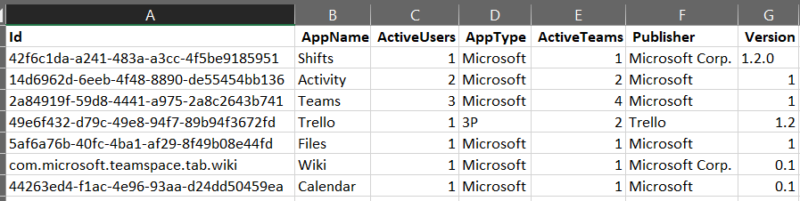

# Microsoft Teams使用状況レポートを作成するMicrosoft Teams app usage report

Teams管理センターのアプリ使用状況レポートMicrosoft Teams、ユーザーがアプリで使用しているアプリに関する情報Teams。The Teams app usage report in the Microsoft Teams admin center provides you with information about which apps users are using in Teams.  

## アプリの使用状況レポートを表示するView the App Usage report

1.  管理センターの左側のナビゲーションで、[分析] をクリックし、[ <https://admin.teams.microsoft.com> **利用状況& レポート** \> **を表示します**。In the left navigation of the admin center at <https://admin.teams.microsoft.com>, click **Analytics & reports** \> **Usage reports**. [レポートの **表示] タブの** [レポート] **で、[アプリ** の使用状況] **を選択します**。On the **View reports** tab, under **Report**, select **Apps Usage**.

     :::image type="content" source="media/app-usage-report1.png" alt-text="[使用状況レポート] メニュー項目のスクリーンショット":::

2.  **[日付の範囲]** の下で、範囲を選択して、**[レポートの実行]** をクリックします。Under **Date range**, select a range, and then click **Run report**.

      :::image type="content" source="media/app-usage-report2.png" alt-text="アプリの使用状況レポートのスクリーンショット":::

## レポートを解釈するInterpret the report

|CalloutCallout |説明Description  |
|--------|-------------|
|**1****1**   |[Teams アプリの使用状況レポートでは、過去 7 日間、30 日間、または 90 日間の傾向を確認できます。The Teams Apps usage report can be viewed for trends over the last 7, 30 or 90 days. |
|**2****2**   |各レポートには、レポートが生成された日付があります。Each report has a date for when the report was generated. 通常、レポートには、アプリを開いた時刻から 24 時間の待機時間が反映されます。The reports usually reflect a 24-hour latency from the time an app was opened.   |
|**3****3**    | <ul><li>グラフの X 軸は、特定のレポートに対して選択した日付範囲です。The X axis on the charts is the selected date range for the specific report.</li><li>Y 軸は、特定の日にグラフ内でポイントされたユーザーの数です。これらのユーザーは少なくとも 1 回アプリを開き、これを行ってアクティブ ユーザーと見なされ、マウス ポインターで表示された合計に対して発生します。The Y axis is the number of users who for the given day hovered over in chart, those users have opened an app at least once and by doing so are considered an Active User and accrue towards the total seen on mouse hover over.</li></ul>|
|**4****4**   |指定した日付のアプリの使用状況を表すドットにマウス ポインターを合わせると、その日付のアプリの合計アクティブ ユーザー数が表示されます。Hover over the dot representing an Apps Usage on a given date to see the number of instances of that App’s Total Active Users on that given date.  |
|**5****5**   |すべてのアプリが含まれますが、[フィルター] アイコンを選択すると、追加のフィルターを使用できます。All Apps will be included but by choosing the Filter icon, additional filters are available.  |
|**6****6**   |この表は、アクティブなユーザーとチームの内訳をアプリ名別に示しています。The table gives you a breakdown of active users and teams by App name. <ul><li>**[アプリ名**] は、アプリで使用されるアプリの表示Teams。**App name** is the display name of the app used in Teams.</li><li>**アクティブ ユーザー** とは、指定した期間中にアプリを少なくとも 1 回開いたユーザーの数です。**Active users** is the number of users who opened the app at least once during the specified time period.</li><li>**アプリの** 種類は、"Microsoft" または "サード パーティ" のいずれかの静的な値です。**App type** is a static value of either “Microsoft” or “Third Party”.</li><li>**アクティブな** チームとは、チームの少なくとも 1 人のメンバーが指定した期間中にアプリを開いたチームの数です。**Active teams** is the number of teams who have opened the App by at least one member of the team and during the specified time periods.</li><li>**Publisher** は、アプリのソフトウェア発行元です。**Publisher** is the software publisher of the app.</li><li>**バージョン** は、アプリの発行元から提供される、アプリのソフトウェア バージョンです。**Version** is the software version of the app, from the app publisher.</li></ul><b> 注:</b> 現在、"アクティブ ユーザー" と "アクティブ なチーム" は、チャネルでのみ使用されるアプリに対して計算されます。<b> Note :</b> Currently, 'Active users' and 'Active teams' are calculated for apps used in channels only.     

  **7**  |[列 **の編集] を** 選択して、テーブルの列を追加または削除します。  | |**7**  |Select **Edit columns** to add or remove columns in the table.  ![[列の編集] ページのスクリーンショット| | ](media/app-usage-report5.png) **8 |**  レポートを CSV ファイルにエクスポートして、オフライン分析を行います。  | |**8**  |You can export the report to a CSV file for offline analysis. **[Excel にエクスポート]** をクリックしてから、**[ダウンロード]** タブの **[ダウンロード]** をクリックして、準備のできたレポートをダウンロードします。Click **Export to Excel**, and then on the **Downloads** tab, click **Download** to download the report when it's ready. ![[ダウンロード] ページのスクリーンショット| | ](media/app-usage-report7.png) **9 |** レポートを [ビュー] にExcel、アプリ ID を表す **[ID]** 列も表示されます。  | |**9**   |When you view the report in Excel, you'll also see an **Id** column, which represents the app ID. 通常、チーム ID は英数字の文字列です。A team ID is typically an alphanumeric string. **[Id] 列** に **\n** と表示されている場合は、ユーザーが自分の情報を削除する要求を行いました。If the **Id** column shows as \*\*\n\*\*\*\*, this means that a user requested their information to be deleted.   |  |

## 関連トピックRelated topics

- [Teams の分析とレポートTeams analytics and reporting](teams-reporting-reference.md)