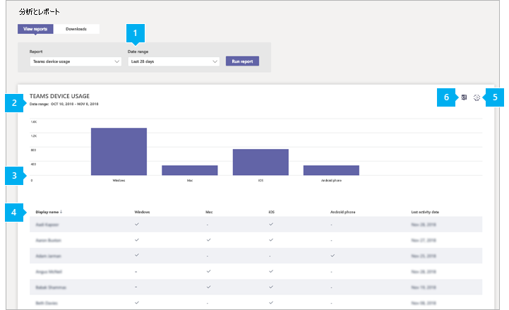

# Microsoft Teams のデバイス使用状況レポート

Microsoft Teams 管理センターの Teams デバイス使用状況レポートでは、ユーザーが Teams に接続する方法についての情報が提供されます。 レポートを使用すると、外出先でも、モバイルデバイスで何人のチームを使用しているかなど、組織全体で使用されているデバイスを確認できます。  

## レポートを表示する

1. Microsoft Teams 管理センターに移動し、左のナビゲーションで [**分析 & レポート**] をクリックして、[**レポート**] で [**チームデバイスの使用状況**] を選択します。 
2. [**日付の範囲**] の下で、範囲を選択して、[**レポートの実行**] をクリックします。 

## レポートを解釈する

|コールアウト |説明  |
|--------|-------------|
|**1**   |[チームデバイスの使用状況] レポートでは、過去7日間または28日間の傾向を確認できます。  |
|**2**   |各レポートには、レポートが生成された日付が含まれています。 通常、レポートはアクティビティの時刻から 24 ～ 48 時間の遅延を反映します。 |
|**3**   |<ul><li>グラフの X 軸は、Teams に接続するために使用されるさまざまなデバイス (**Windows**、 **Mac**、 **iOS**、 **Android フォン**) を示しています。 </li><li>Y 軸は、選択した期間中にデバイスを使用したユーザーの数です。</li> </ul>デバイスを表すバーの上にマウスポインターを移動すると、そのデバイスを使用して Teams に接続したユーザーの数が表示されます。|
|**4**   |この表では、ユーザーによるデバイスの使用状況の内訳を示します。 <ul><li>[**表示名**はユーザーの表示名です。 表示名をクリックすると、Microsoft Teams 管理センターのユーザーの設定ページに移動できます。 </li><li>Windows ベースのコンピューターの Teams デスクトップクライアントでユーザーがアクティブになっていた場合は、 **windows**が選択されます。</li><li>**Mac**は、ユーザーが macOS コンピューターの Teams デスクトップクライアントでアクティブになった場合に選択されます。 </li> <li>ユーザーが iOS の Teams モバイルクライアントでアクティブになっていた場合、 **ios**が選択されます。</li><li>ユーザーが Android 用の Teams モバイルクライアントでアクティブになっていた場合は、[ **android スマートフォン**を選択します。 <li>[**最後のアクティビティ**] は、ユーザーが Teams アクティビティに参加した最後の日付 (UTC) です。</li> </ul> 表に希望する情報を表示するには、表に列を追加する必要があります。 |
|**5**   |[**列の編集**] を選択して表で列を追加または削除します。 |
|**6**   |レポートを CSV ファイルにエクスポートしてオフラインで分析することができます。 [ **Excel にエクスポート**] をクリックし、[**ダウンロード**] タブの [**ダウンロード**] をクリックして、準備ができたらレポートをダウンロードします。 ![ダウンロードするエクスポートされたレポートが表示された [ダウンロード] タブのスクリーンショット](../media/teams-reports-export-to-csv.png)|

## 関連トピック
- [Teams の分析とレポート](teams-reporting-reference.md)
- [Teams の使用状況レポート](teams-usage-report.md)
- [Teams ユーザー アクティビティ レポート](user-activity-report.md)