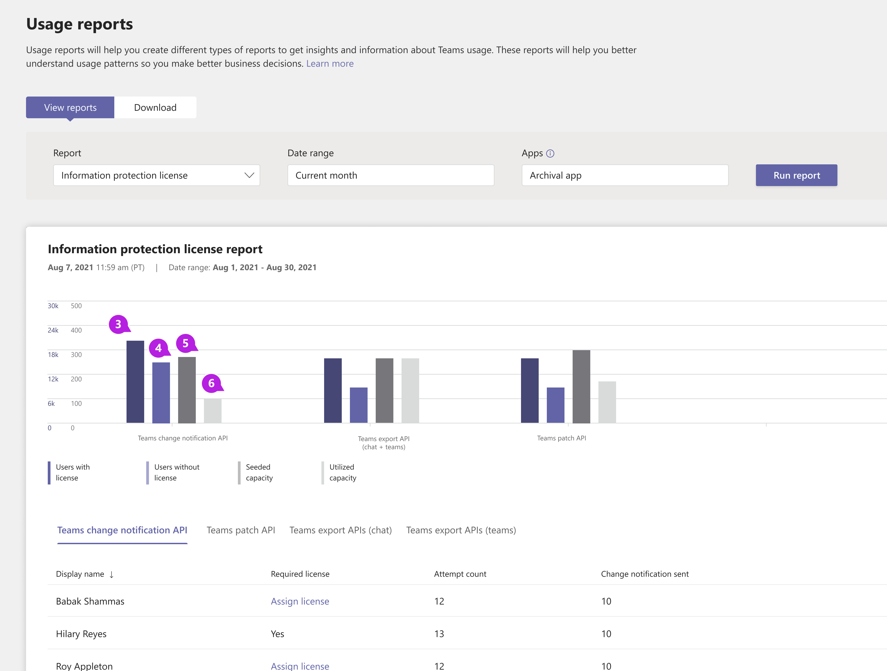
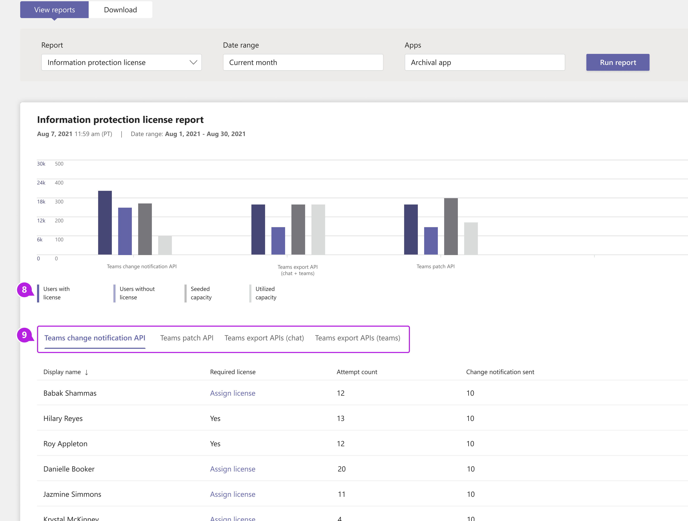

# Microsoft Teams情報保護ライセンス レポート

Teams情報保護ライセンス レポートでは、ライセンスと支払いの要件を持つ [Microsoft Graph API の API 使用状況に関する分析情報が提供されます](/graph/teams-licenses)。 このレポートでは、model=A でこれらの API を使用しているすべてのアプリ [が強調表示されます](/graph/teams-licenses#modela-requirements)。 API が [model=B](/graph/teams-licenses#modelb-requirements) または評価モードで使用されている場合、使用状況は [表示されません](/graph/teams-licenses#evaluation-mode-default-requirements)。 

## 情報保護ライセンス レポートを表示する

これらの変更を行うには、Teams サービス管理者であることが必要です。 「[Teams 管理者ロールを使用してチームを管理する](../using-admin-roles.md)」をご覧いただき、管理者ロールとアクセス許可を取得する方法について読んでください。

1. 管理センターの左側のナビゲーションで、[レポートMicrosoft Teams分析] を **選択&レポート** > **を管理します**。 [レポートの **表示] タブの** [レポート **] で、[****Information Protection License] を選択します**。
2. [ **日付範囲] で** 範囲を選択します。
3. [アプリ **] で** アプリを選択し、[レポートの実行] **を選択します**。

    

4. カテゴリごとに、ライセンスを持つユーザー、ライセンスのないユーザー、シード処理された容量、および利用容量に関するメトリックを表示できます。 

    

5. データは、[エクスポート] ボタンをクリックしてエクスポートできます。 Teams 変更通知 API、Teams パッチ API、Teams エクスポート API (チャット)、および Teams エクスポート API (teams) のタブをクリックして、テーブル データを切り替えます。 

    

    ![吹き出し付き Teamsの情報保護ライセンス レポートの [Teams通知] タブのスクリーンショット。](../media/teams-info-protection-license-report-change-notification-with-callouts.png "吹き出し付き Teamsの情報保護ライセンス レポートの [Teams通知] タブのスクリーンショット。")

## レポートを解釈する

|Callout |説明  |
|--------|-------------|
|**1**   |情報保護ライセンス レポートでは、過去 3 か月間の傾向を確認できます。 |
|**2**   |アプリ名には、選択した期間中にライセンスと支払いの要件[がある Microsoft Graph API](/graph/teams-licenses) を使用しているすべてのアプリの一覧が表示されます。|
|**3**   |有効なライセンスを持つユーザー [の数](/graph/teams-licenses#required-licenses-for-modela)。  |
|**4**   |有効なライセンスを持つユーザーの [数](/graph/teams-licenses#required-licenses-for-modela)。  |
|**5**   |アプリに対して許可される API 呼び出しボリュームの合計。このボリュームを超えて、API 呼び出しあたりの消費料金がアプリに課金されます。 |
|**6**   |指定された日付範囲に対してアプリによって使用される API 呼び出しボリュームの合計。 |
|**7**   |レポートを CSV ファイルにエクスポートしてオフライン分析します。 [**エクスポート] Excel**、[ダウンロード] タブの順に選択します。準備ができたら、[ダウンロード] を選択してレポートをダウンロードします。 このエクスポートでは、現在選択されているタブだけがエクスポートされます。|
|**8**   |グラフで表示または非表示にする特定のラベルを選択します。 |
|**9**   |各タブには、特定の API セットの使用状況、通知の変更、API のエクスポート、および[メッセージ API の更新が表示されます](/graph/api/message-update)。  タブを選択して、その API の使用状況の詳細を表示します。 |
|**10**   |**通知 API の使用状況を変更する**<li>**[表示名** ] - 変更通知がトリガーされたユーザーの表示名。</li><li>**必須ライセンス** - 特定のユーザーが変更通知をアプリに正常に送信するために必要なライセンスを持つかどうか。</li><li>**試行回数** - このユーザーによってトリガーされた変更通知の総数。</li><li>**通知の送信を変更** する - アプリに送信された変更通知の総数。 これは、ユーザーが有効なライセンスを持たなかった場合にトリガーされる変更通知の合計よりも少なになります。</li>|
|**11**|**Patch API**<li>**[表示名** ] - メッセージを更新しようとしたユーザーの表示名。</li> <li>**必要なライセンス** - 指定されたユーザーがメッセージを正常に更新するために必要なライセンスを持つかどうか。</li><li>**試行回数** - メッセージの更新試行の合計。</li><li>**[メッセージの修正プログラム** が適用されました] - 正常に更新されたメッセージの合計。</li>|
|**12**|**チャット エクスポート API の使用状況**<li>**[表示名** ] - ユーザーのチャット メッセージをエクスポートしようとしたユーザーの表示名。</li><li>**必要なライセンス** - 指定されたユーザーがメッセージが正常にエクスポートするために必要なライセンスを持つかどうか。</li><li>**試行回数** - チャット メッセージのエクスポート試行の合計。</li><li>**メッセージのエクスポート** - チャット メッセージが正常にエクスポートされた試行の合計。</li> |
|**13**|**Team Export API の使用状況**<li>**[表示名** ] - そのチームのメッセージをエクスポートしようとしたチームの表示名。</li><li>**試行回数** - チーム メッセージのエクスポート試行の合計。</li><li>**エクスポートされたメッセージ** - チーム メッセージが正常にエクスポートされた試行の合計。</li> |

## ユーザー固有のデータを匿名にする

ユーザー アクティビティ レポートTeamsデータを匿名にする場合は、グローバル管理者である必要があります。 これにより、レポートとそのエクスポートの表示名、電子メール、Azure AD ID などの識別可能な情報が非表示になります。

1. [組織Microsoft 365 管理センターに移動し設定 \> **、[** 設定] タブの [レポート] を選択 **します**。
    
2. [ **レポート]** を選択し、[匿名識別子 **を表示する] を選択します**。 この設定は、管理センターと管理センターのMicrosoft 365 管理センターレポートTeams適用されます。
  
3. [変更の **保存] を選択します**。