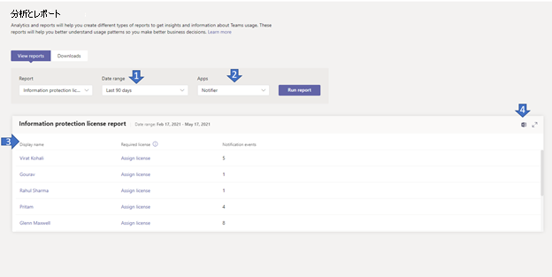

# Microsoft Teams情報保護ライセンス レポートMicrosoft Teams information protection license report

Teams 情報保護ライセンス レポートは、テナント レベル (/teams/getAllMessage または /chats/getAllMessages) で作成、更新、または削除されたメッセージをリッスンするために、変更通知イベントをサブスクライブしているアプリに関する分析情報を提供します。  The Teams information protection license report gives insight into apps that have [subscribed](/graph/api/resources/subscription?view=graph-rest-1.0) to [change notification](/graph/api/resources/webhooks?view=graph-rest-1.0) events to listen to created, updated, or deleted messages at tenant level (that is, /teams/getAllMessage or /chats/getAllMessages). メッセージに対応する変更通知は、ユーザーが必要なライセンス を持つ場合にのみ正常 [に送信されます](/graph/teams-licenses)。A change notification corresponding to the message is sent successfully only when the user has the [required license](/graph/teams-licenses).  特定のユーザーによってトリガーされた変更通知の数を確認できます。You can see how many change notifications was triggered by a given user.

## 情報保護ライセンス レポートを表示するView the information protection license report

これらの変更を行うには、Teams サービス管理者であることが必要です。You must be a Teams service admin to make these changes. 「[Teams 管理者ロールを使用してチームを管理する](../using-admin-roles.md)」をご覧いただき、管理者ロールとアクセス許可を取得する方法について読んでください。See [Use Teams administrator roles to manage Teams](../using-admin-roles.md) to read about getting admin roles and permissions.

1. 管理センターの左側のナビゲーションで、[分析Microsoft Teamsレポート] **& レポート]**  >  **を選択します**。In the left navigation of the Microsoft Teams admin center, select **Analytics & reports** > **Usage reports**. [レポートの **表示] タブの** [レポート] **で、[Information** **Protection License] を選択します**。On the **View reports** tab, under **Report**, select **Information Protection License**.
2. [ **日付範囲] で** 範囲を選択します。Under **Date range**, select a range.
3. [アプリ **] で** アプリを選択し、[レポートの実行] **を選択します**。Under **Apps**, select an app and then select **Run report**.

    

## レポートを解釈するInterpret the report

|CalloutCallout |説明Description  |
|--------|-------------|
|**1****1**   |情報保護ライセンス レポートでは、過去 7 日間、30 日間、または 90 日間の傾向を確認できます。The information protection license report can be viewed for trends over the last 7 days, 30, or 90 days. |
|**2****2**   |アプリ名には、日付範囲で選択された過去 n 日間のメッセージの通知イベントを変更するためにサブスクライブしているすべてのアプリの一覧が表示されます。App name will display a list of all apps that have subscribed to change notification events of messages in the last n days as selected in the date range. |
|**3****3**   |テーブルには、選択したアプリのユーザーごとの使用状況の内訳が表示されます。The table gives you a breakdown of usage per user for the selected app.<ul><li>**表示名** はユーザーの表示名です。**Display name** is the display name of the user. 表示名を選択して、管理センターのユーザーの詳細ページMicrosoft Teamsします。Select the display name to go to the user's details page in the Microsoft Teams admin center.</li><li>**Has Required License** is yes if the user has one required licenses as defined (here)[ https://docs.microsoft.com/en-us/graph/teams-licenses ].**Has Required License** is yes if the user has one of the required licenses as defined (here)[https://docs.microsoft.com/en-us/graph/teams-licenses]. ユーザーが必要なライセンスを持ってない場合は、[ライセンスの割り当て] リンクが表示され、Microsoft 管理センターのユーザーのライセンスの詳細ページに移動します **([** ユーザーのアクティブ ユーザー] >選択  >  します)。If the user does not have the required license, the _Assign license_ link is displayed which navigated to the user's license detail page in the Microsoft admin center (**Users** > **Active Users** > select username).</li><li>**ライセンスで保護されたイベント** は、そのユーザーによって作成、更新、または削除されたメッセージに対してアプリに送信される一意の変更通知イベントの数です。**License Protected Events** is the number of unique change notification events sent to the app against a message which was created, updated or deleted by that user.</li></ul> |
|**4****4**   |レポートを CSV ファイルにエクスポートしてオフライン分析します。Export the report to a CSV file for offline analysis. [**エクスポート] をExcel、[** ダウンロード]**タブを選択** します。[**ダウンロード]** を選択して、準備ができたらレポートをダウンロードします。Select **Export to Excel**, and then the **Downloads** tab. Select **Download** to download the report when it's ready. |
|**5****5**   |レポートを CSV ファイルにエクスポートしてオフライン分析します。Export the report to a CSV file for offline analysis. [**エクスポート] をExcel、[** ダウンロード]**タブを選択** します。[**ダウンロード]** を選択して、準備ができたらレポートをダウンロードします。Select **Export to Excel**, and then the **Downloads** tab. Select **Download** to download the report when it's ready. レポートを Excel で表示すると、ユーザーのユーザー ID とメールアドレスを表す [ID] 列と [電子メール] 列も表示されます。When you view the report in Excel, you'll also see an **Id** and **email** column, which represents the User ID and email address of the user. |

## ユーザー固有のデータを匿名にするMake the user-specific data anonymous

ユーザー アクティビティ レポートのTeamsを匿名にする場合は、グローバル管理者である必要があります。To make the data in the Teams user activity report anonymous, you have to be a global administrator. これにより、レポートとそのエクスポートの表示名、電子メール、Azure AD ID などの識別可能な情報が非表示になります。This will hide identifiable information such as display name, email, and Azure AD ID in reports and their exports.

1. [組織] Microsoft 365 管理センター に移動し、[設定] タブ設定 [レポート] を \> 選択 **します**。 In the Microsoft 365 admin center, go to **Settings** \> **Org Settings**, and under the **Services** tab, choose **Reports**.
    
2. [ **レポート]** を選択し、[匿名識別子 **を表示する] を選択します**。Select **Reports**, and then choose to **Display anonymous identifiers**. この設定は、管理センターと管理センターの使用状況Microsoft 365 管理センター両方Teams適用されます。This setting gets applied both to the usage reports in the Microsoft 365 admin center and the Teams admin center.
  
3. [変更の **保存] を選択します**。Select **Save changes**.
