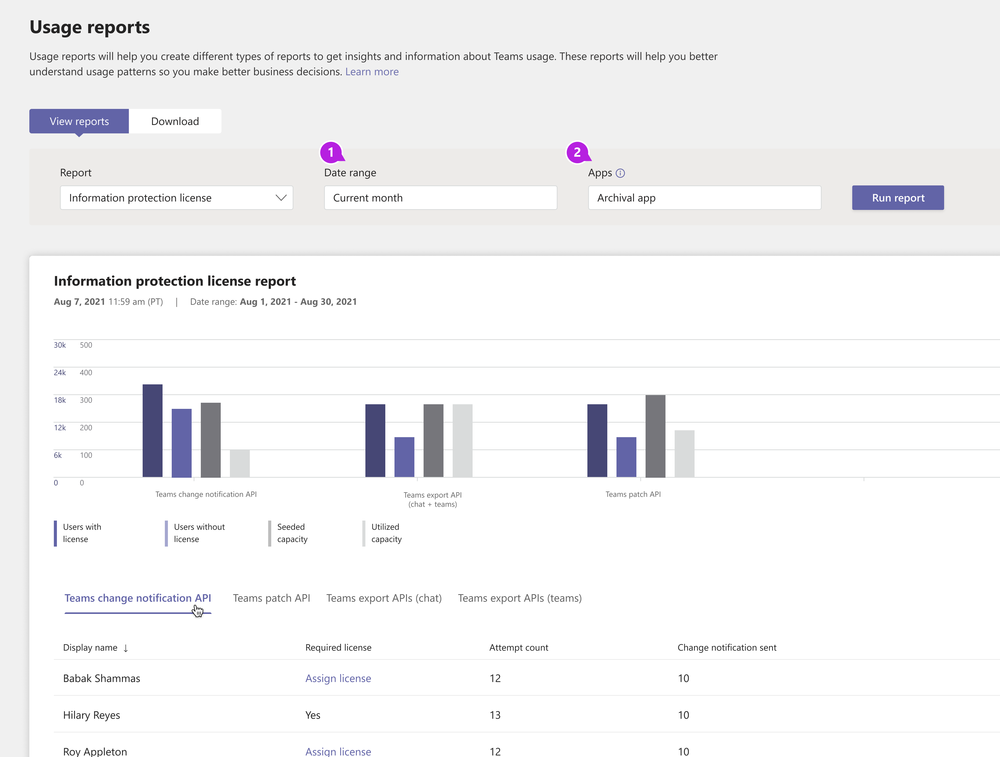

# Microsoft Teams情報保護ライセンス レポート

Teams情報保護ライセンス レポートは、[ライセンスと支払いの要件を持つ Microsoft Graph API の](/graph/teams-licenses) API 使用状況に関する分析情報を提供します。 このレポートでは、 [model=A](/graph/teams-licenses#modela-requirements) でこれらの API を使用しているすべてのアプリが強調表示されます。 [API が model=B](/graph/teams-licenses#modelb-requirements) または[評価モード](/graph/teams-licenses#evaluation-mode-default-requirements)で使用されている場合、使用状況は表示されません。 

## 情報保護ライセンス レポートを表示する

これらの変更を行うには、Teams サービス管理者であることが必要です。 「[Teams 管理者ロールを使用してチームを管理する](../using-admin-roles.md)」をご覧いただき、管理者ロールとアクセス許可を取得する方法について読んでください。

1. Microsoft Teams管理センターの左側のナビゲーションで、[**Analytics & レポート****使用状況レポート** > ] を選択します。 [**レポートの表示**] タブの [**レポート**] で、[**ライセンスのInformation Protection**] を選択します。
2. **[日付範囲**] で範囲を選択します。
3. [ **アプリ]** でアプリを選択し、[ **レポートの実行**] を選択します。

    

4. カテゴリごとに、ライセンスを持つユーザー、ライセンスのないユーザー、シードされた容量、利用容量に関するメトリックを表示できます。 

    

5. データは、[エクスポート] ボタンをクリックしてエクスポートできます。 テーブル データを切り替えるには、変更通知 API、Teams Teamsパッチ API、Teamsエクスポート API (チャット)、エクスポート API (チーム) のタブTeamsクリックします。 

    

    

## レポートを解釈する

|Callout |説明  |
|--------|-------------|
|**1**   |情報保護ライセンス レポートは、過去 3 か月間の傾向を確認できます。 |
|**2**   |アプリ名には、選択した期間中に[ライセンスと支払いの要件がある Microsoft Graph API](/graph/teams-licenses)を使用したすべてのアプリの一覧が表示されます。|
|**3**   |有効な [ライセンス](/graph/teams-licenses#required-licenses-for-modela)を持つユーザーの数。  |
|**4**   |有効な [ライセンス](/graph/teams-licenses#required-licenses-for-modela)を持っていないユーザーの数。  |
|**5**   |アプリに許可される API 呼び出し量の合計。この値を超えると、API 呼び出しごとの消費料金がアプリに課金されます。 |
|**6**   |指定された日付範囲に対してアプリによって使用される API 呼び出し量の合計。 |
|**7**   |オフライン分析のためにレポートを CSV ファイルにエクスポートします。 **[エクスポートしてExcel**]、[**ダウンロード**] タブの順に選択します。[**ダウンロード**] を選択して、準備ができたらレポートをダウンロードします。 このエクスポートでは、現在選択されているタブのみがエクスポートされます。|
|**8**   |グラフで表示または非表示にする特定のラベルを選択します。 |
|**9**   |各タブには、特定の API セットの使用状況( [通知の変更](/graph/api/resources/webhooks)、 [API のエクスポート](/microsoftteams/export-teams-content)、 [メッセージ API の更新](/graph/api/message-update)) が表示されます。 タブを選択すると、その API の使用状況の詳細が表示されます。 |
|**10**   |**通知 API の使用法を変更する**<li>**表示名** - 変更通知がトリガーされたユーザーの表示名。</li><li>**必須ライセンス** - 特定のユーザーが、変更通知をアプリに正常に送信するために必要なライセンスを持っているかどうか。</li><li>**試行回数** - このユーザーが原因でトリガーされた変更通知の合計数。</li><li>**送信された変更通知** - アプリに送信された変更通知の合計数。 これは、ユーザーが有効なライセンスを持っていない場合にトリガーされる変更通知の合計数より小さくなります。</li>|
|**11**|**Patch API**<li>**表示名** - メッセージの更新が行われたユーザーの表示名。</li> <li>**必須ライセンス** - 指定されたユーザーがメッセージを正常に更新するために必要なライセンスを持っているかどうか。</li><li>**試行回数** - メッセージの更新試行の合計。</li><li>**[修正プログラムが適用されたメッセージ** ] - 正常に更新されたメッセージの合計数。</li>|
|**12**|**チャット エクスポート API の使用状況**<li>**表示名** - ユーザーのチャット メッセージをエクスポートしようとしたユーザーの名前を表示します。</li><li>**必須ライセンス** - 特定のユーザーがメッセージを正常にエクスポートするために必要なライセンスを持っているかどうか。</li><li>**試行回数** - チャット メッセージのエクスポート試行の合計。</li><li>**メッセージのエクスポート** - チャット メッセージが正常にエクスポートされた試行の合計数。</li> |
|**13**|**Team Export API の使用状況**<li>**表示名** - チームのメッセージをエクスポートしようとしたチームの名前を表示します。</li><li>**試行回数** - チーム メッセージのエクスポート試行の合計。</li><li>**エクスポートされたメッセージ** - チーム メッセージが正常にエクスポートされた合計試行数。</li> |

## ユーザー固有のデータを匿名にする

Teams ユーザー アクティビティ レポートのデータを匿名にするには、グローバル管理者である必要があります。 これにより、レポートとそのエクスポートの表示名、電子メール、Azure AD ID などの識別可能な情報が非表示になります。

1. Microsoft 365 管理センターで[**設定組織設定**\>]、[**サービス**] タブの [**レポート**] の順に選択します。
    
2. [ **レポート**] を選択し、[ **匿名識別子の表示**] を選択します。 この設定は、Microsoft 365 管理センターとTeams管理センターの使用状況レポートの両方に適用されます。
  
3. [ **変更の保存] を選択します**。