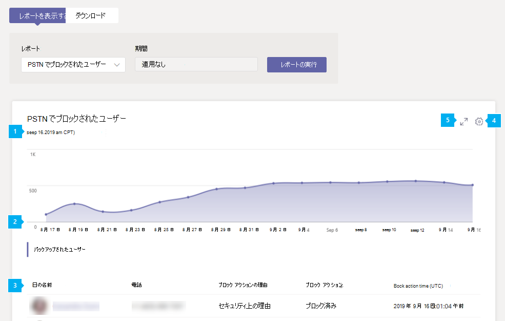

# Microsoft TeamsPSTN ブロックユーザー レポートMicrosoft Teams PSTN blocked users report

Microsoft Teams 管理センターの PSTN ブロックユーザー レポートには、組織内のユーザーが、TEAMS で PSTN 通話を行うのをブロックされているユーザーが表示されます。The PSTN blocked users report in the Microsoft Teams admin center shows you the users in your organization who are blocked from making PSTN calls in Teams. 割り当てられた電話番号や、通話がブロックされた理由など、ブロックされている各ユーザーの詳細を表示できます。You can view more information about each blocked user, including their assigned phone number and the reason they were blocked from making calls.

## PSTN ブロックユーザー レポートを表示するView the PSTN blocked users report

Microsoft Teams 管理センターの左側のナビゲーションで、**[分析 & レポート]** > **[使用状況レポート]** をクリックします。In the left navigation of the Microsoft Teams admin center, click **Analytics & reports** > **Usage reports**. [レポート **の表示] タブの** [レポート] **で**、[PSTN ブロックユーザー] を **選択し**、[レポートの実行] **をクリックします**。On the **View reports** tab, under **Report**, select **PSTN blocked users**, and then click **Run report**.

## レポートを解釈するInterpret the report

|CalloutCallout |説明Description  |
|--------|-------------|
|**1****1**   |各レポートには、生成された日付があります。Each report has a date for when it was generated. 通常、レポートはアクティビティの時刻から 24 ～ 48 時間の遅延を反映します。The reports usually reflect a 24 to 48 hour latency from time of activity. |
|**2****2**   |X 軸は日付です。The X axis is the date. Y 軸はユーザー数です。The Y axis is the number of users.  特定の日付のドットにマウス ポインターを合わせると、その日付にブロックされたユーザーの数が表示されます。Hover over the dot on a given date to see the number of users blocked on that date. |
|**3****3**   |この表は、PSTN 通話をブロックしているすべてのユーザーの内訳を示しています。The table gives a breakdown of all users who are blocked from making PSTN calls.  このページには、電話会議または電話電話システム割り当てられているすべてのユーザーが表示され、各ユーザーに関する詳細が表示されます。It shows all users who have Phone System or Audio Conferencing assigned and gives you more information about each user. <ul><li>**表示名** はユーザーの表示名です。**Display name** is the display name of the user. 表示名をクリックして、Microsoft Teams 管理センターのユーザーの設定ページに移動することができます。You can click the display name to go to the user's setting page in the Microsoft Teams admin center. </li> <li>**電話** は、ユーザーに割り当てられている番号です。**Phone** is the number that's assigned to the user.</li> <li>**ブロックされる理由** は、ユーザーが呼び出しを行うのをブロックされる理由です。**Blocked reason** is the reason the user is blocked from making calls.</li><li>**[ブロック] アクション** は、ユーザーが PSTN 通話を行うのをブロックまたはブロック解除されているかどうかを示Teams。**Blocked action**  tells you whether the user is blocked or unblocked from making PSTN calls in Teams.</li> <li>**[ブロックされた時刻** ] は、ユーザーが呼び出しを行うのをブロックされた日時 (UTC) です。**Blocked time** is the date and time (UTC) that the user was blocked from making calls.</li></li> </ul>表に希望する情報を表示するには、表に列を追加する必要があります。To see the information that you want in the table, make sure to add the columns to the table. |
|**4****4**   |[**列の編集**] を選択して表で列を追加または削除します。Select **Edit columns** to add or remove columns in the table.|
|**5****5**   |[ **全画面] を** 選択して、レポートを全画面モードで表示します。Select **Full screen** to view the report in full screen mode.|

## 関連トピックRelated topics

- [Teams の分析とレポートTeams analytics and reporting](teams-reporting-reference.md)