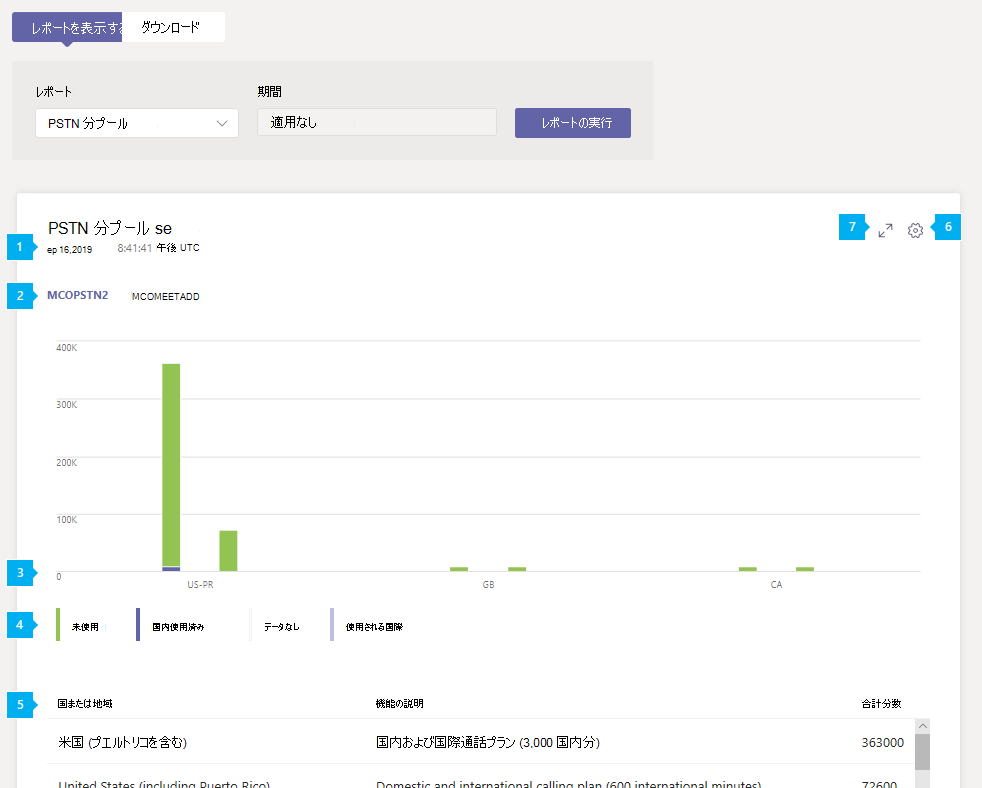

# Microsoft TeamsPSTN 分プール レポートMicrosoft Teams PSTN minute pools report

Microsoft Teams 管理センターの Teams PSTN ミニデータ プール レポートでは、組織内の電話会議と通話アクティビティの概要を示します。このレポートには、当月に消費された分数が表示されます。The Teams PSTN minute pools report in the Microsoft Teams admin center gives you an overview of audio conferencing and calling activity in your organization by showing you the number of minutes consumed during the current month. 通話に使用されるライセンス、利用可能な合計分数、使用分数、場所別のライセンス使用量など、アクティビティの内訳を確認できます。You can see a breakdown of activity including the license used for calls, total minutes available, used minutes, and license usage by location.

## PSTN 分プール レポートを表示するView the PSTN minute pools report

Microsoft Teams 管理センターの左側のナビゲーションで、**[分析 & レポート]** > **[使用状況レポート]** をクリックします。In the left navigation of the Microsoft Teams admin center, click **Analytics & reports** > **Usage reports**. [レポート **の表示] タブの** [レポート] **で**、[PSTN 分プール] **を選択し**、[レポートの実行] **をクリックします**。On the **View reports** tab, under **Report**, select **PSTN minute pools**, and then click **Run report**.

## レポートを解釈するInterpret the report

|CalloutCallout |説明Description  |
|--------|-------------|
|**1****1**   |各レポートには、生成された日付があります。Each report has a date for when it was generated. 通常、レポートはアクティビティの時刻から 24 ～ 48 時間の遅延を反映します。The reports usually reflect a 24 to 48 hour latency from time of activity. |
|**2****2**   |機能 (ライセンス) をクリックして、その機能のアクティビティを表示します。Click a capability (license) to view activity for that capability. |
|**3****3**   |X 軸は国または地域です。The X axis is country or region. Y 軸は分数です。The Y axis is number of minutes.  グラフ上の棒にマウス ポインターを合わせると、その使用状況の場所のアクティビティが表示されます。Hover over a bar on the chart to see the activity for that usage location.  |
|**4****4**   |凡例の項目をクリックして、グラフに表示する情報をフィルター処理できます。You can filter what you see on the chart by clicking an item in the legend. たとえば、[未使用 **]、** 国内ユーザー 、**データ** なし、または [国際] をクリックして、それぞれに関連する情報のみを表示します。For example, click **Unused**, **Domestic users**, **No data**, or **International used** to see only the info related to each one. |
|**5****5**   |この表は、機能と使用場所別の分プールの内訳を示しています。The table gives you a breakdown of minute pools by capability and usage location. <ul><li>**国または地域** は使用場所です。**Country or region** is the usage location. </li><li>**機能の** 説明は、呼び出しに使用されるライセンスの説明です。**Capability description** is the description of the license used for the call.  このレポートに表示される機能の説明は次のとおりです。The capability descriptions you may see in this report include: <ul><li>国内通話プランと国際通話プラン (国内通話 1,200 分)Domestic and international calling plan (1200 domestic minutes)</li><li>国内通話プランと国際通話プラン (国内通話 3,000 分)Domestic and international calling plan (3000 domestic minutes)</li><li>国内通話プランと国際通話プラン (600 分の国際通話)Domestic and international calling plan (600 international minutes)</li></ul></li> <li>**[合計分** 数] は、その月に使用できる合計分数です。**Total minutes** is the total number of minutes available for the month.</li><li>**[分数** ] は、毎月使用される分数です。**Minutes used** is the number of minutes used each month</li> <li>**[分]** は、その月の残り時間 (分) です。**Minutes available** is the number of minutes remaining for the month.</li><li>[ **機能** ] は通話のために使用されるライセンスです。**Capability** is the license used for the call. 表示される可能性があるライセンスは次のとおりです。The licenses you may see include:<ul><li>**MCOPSTN1** - 国内通話プラン (米国 3000 分/ EU 1200 分プラン)**MCOPSTN1** - Domestic Calling Plan (3000 min US / 1200 min EU plans)</li><li>**MCOPSTN2** - 国際通話プラン**MCOPSTN2** - International Calling Plan</li><li>**MCOPSTN5** - 国内通話プラン (120 分の通話プラン)**MCOPSTN5** - Domestic Calling Plan (120 min calling plan)</li><li>**MCOPSTN6** - 国内通話プラン (240 分の通話プラン)**MCOPSTN6** - Domestic Calling Plan (240 min calling plan)</li><li>**MCOMEETADD** - 電話会議**MCOMEETADD** - Audio Conferencing</li></ul></li> </ul> 表に希望する情報を表示するには、表に列を追加する必要があります。To see the information that you want in the table, make sure to add the columns to the table.|
|**6****6**   |[**列の編集**] を選択して表で列を追加または削除します。Select **Edit columns** to add or remove columns in the table.|
|**7****7**   |[ **全画面] を** 選択して、レポートを全画面モードで表示します。Select **Full screen** to view the report in full screen mode.|

## 関連トピックRelated topics

- [Teams の分析とレポートTeams analytics and reporting](teams-reporting-reference.md)
