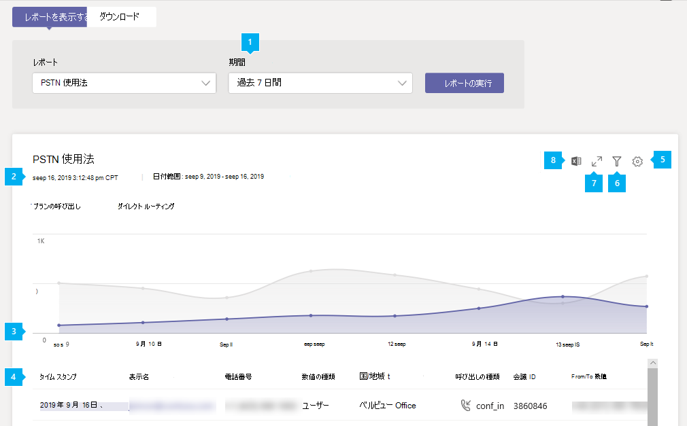
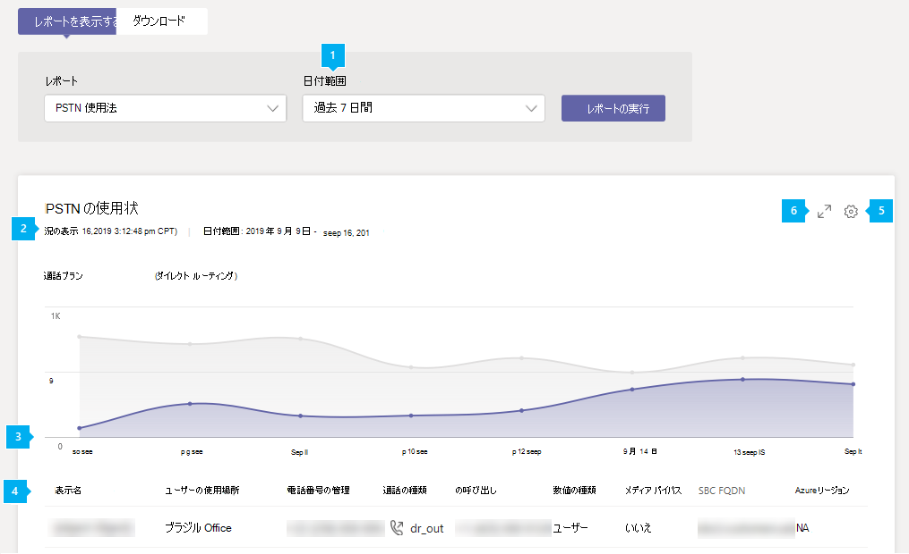

# Microsoft Teams の PSTN 使用状況レポートMicrosoft Teams PSTN usage report

Microsoft Teams 管理センターのチーム PSTN 使用状況レポートでは、組織内での通話と電話会議のアクティビティの概要が示されます。The Teams PSTN usage report in the Microsoft Teams admin center gives you an overview of calling and audio conferencing activity in your organization. Microsoft をテレフォニーキャリアとして使用していて、独自のテレフォニーキャリアを使用している場合は、通話プランの詳細な通話アクティビティを表示できます。You can view detailed calling activity for Calling Plans if you use Microsoft as your telephony carrier and for Direct Routing if you use your own telephony carrier.

[**通話プラン**] タブには、ユーザーが着信と発信の PSTN 通話に費やした時間 (分)、およびこれらの通話の料金が表示されます。The **Calling Plans** tab shows information including the number of minutes that users spent in inbound and outbound PSTN calls and the cost of these calls. [ **Direct Routing** ] タブには、SIP アドレスと通話の開始時刻と終了時刻などの情報が表示されます。The **Direct Routing** tab shows you information including the SIP address and call start and end times. このレポートの情報を使用して、組織の PSTN の使用状況を把握し、ビジネス上の意思決定を調査、計画、決定するのに役立ちます。Use the information in this report to gain insight into PSTN usage in your organization and help you to investigate, plan, and make business decisions.

## レポートを表示するView the report

1. Microsoft Teams 管理センターの左のナビゲーションで、[**分析] & [レポート** > の**利用状況レポート**] をクリックします。In the left navigation of the Microsoft Teams admin center, click **Analytics & reports** > **Usage reports**. [**レポートの表示**] タブの [**レポート**] で、[ **PSTN 使用状況レポート**] を選択します。On the **View reports** tab, under **Report**, select **PSTN usage report**.
2. [**日付範囲**] で、定義済みの7日または28日の範囲を選択するか、ユーザー設定の範囲を設定して、[**レポートの実行**] を選択します。Under **Date range**, select a predefined range of 7 or 28 days, or set a custom range, and then select **Run report**.

## レポートを解釈するInterpret the report

### 通話プランCalling Plans

|コールアウトCallout |説明Description  |
|--------|-------------|
|**1****1**   |レポートでは、過去7日間、28日間、または設定したユーザー設定の日付範囲の傾向を確認できます。The report can be viewed for trends over the last 7 days, 28 days, or a custom date range that you set |
|**2****2**   |各レポートには、生成された日付が含まれています。Each report has a date for when it was generated. 通常、レポートはアクティビティの時刻から 24 ～ 48 時間の遅延を反映します。The reports usually reflect a 24 to 48 hour latency from time of activity. |
|**3****3**   |X 軸は、特定のレポートに対して選択された日付範囲です。The X axis is the selected date range for the specific report. Y 軸は、選んだ期間中の通話の合計数です。The Y axis is the total number of calls over the selected time period.  特定の日付のドットの上にマウスポインターを移動すると、その日付までの合計通話数が表示されます。Hover over the dot on a given date to see the total calls on that date.  |
|**4****4**   |この表では、通話あたりの PSTN の使用状況の内訳を示しています。The table gives you a breakdown of PSTN usage per call. <ul><li>[**タイムスタンプ (UTC)** ] は、通話が開始された時刻です。**Time stamp (UTC)** is the time the call started.</li><li>[**表示名**はユーザーの表示名です。**Display name** is the display name of the user. 表示名をクリックすると、Microsoft Teams 管理センターのユーザーの設定ページに移動できます。You can click the display name to go to the user's setting page in the Microsoft Teams admin center.</li><li>**Username**は、ユーザーのサインイン名です。**Username** is the user's sign in name.</li><li>"**電話番号**" は、着信通話に対して通話を受信した番号、または発信通話用にダイヤルされた番号です。**Phone number** is the number that received the call for inbound calls or the number dialed for outbound calls.</li><li>[**通話の種類**] は、通話が PSTN 送信または着信のどちらであるかと、ユーザーまたは電話会議によって発信された通話などの通話の種類です。**Call type** is whether the call was a PSTN outbound or inbound call and the type of call such as a call placed by a user or an audio conference. 次のような通話の種類が表示されます。The calls types you may see include:  **Teams ユーザーの通話の種類****Teams user call types**<ul><li>**user_in** -ユーザーが着信 PSTN 通話を受信しました。**user_in** - the user received an inbound PSTN call.</li><li>**user_out** -ユーザーが送信 PSTN 通話を発信した**user_out** - the user placed an outbound PSTN call</li><li>**user_out_conf** -ユーザーが2人以上の PSTN 参加者を3方向の電話会議などに追加しました**user_out_conf** - the user added two or more PSTN participants to the call such as a three-way conference call</li><li>**user_out_transfer** -ユーザーが通話を PSTN 番号に転送した**user_out_transfer** - the user transferred the call to a PSTN number</li><li>**user_out_forwarding** -ユーザーが通話を PSTN 番号に転送した**user_out_forwarding** - the user forwarded the call to a PSTN number</li><li>**conf_in** -電話会議ブリッジへの着信通話**conf_in** - an inbound call to the Audio Conferencing bridge</li><li>**conf_out** -電話会議ブリッジからの発信通話。通常は、電話会議に PSTN 番号を追加します。**conf_out** - an outbound call from the Audio Conferencing bridge usually to add a PSTN number to the conference</li></ul> **Teams のボット通話の種類****Teams bots call types**<ul><li>**ucap_in** -自動応答や通話キューなどの Teams への着信 PSTN 通話**ucap_in** - an inbound PSTN call to Teams bot such as auto attendant or call queue</li><li>**ucap_out** -自動応答や通話キューなどの Teams から送信される PSTN 通話**ucap_out** - an outbound PSTN call from a Teams bot such as auto attendant or call queue</li></ul> <li>発信**先**とは、ダイヤルされた番号です。**Called to** is the number dialed.</li><li>[**国または地域へ**の通話発信先の国または地域を選びます。**To country or region** is the country or region dialed.</li><li>**"発信元"** は、通話を発信した番号です。**Called from** is the number that placed the call.</li><li>[**国または地域から**の通話発信元の国または地域を指定してください。**From country or region** is the country or region from where the call was placed.</li><li>[**料金**] は、アカウントに課金される金額または通話の料金です。**Charge** is the amount of money or cost of the call that's charged to your account. </li><li>[**通貨**] は、通話の料金を計算するために使用される通貨の種類です。**Currency** is the type of currency used to calculate the cost of the call. </li><li>[ **通話時間**] は、通話が接続されていた時間です。**Duration** is how long the call was connected.</li><li>[**国内/国際**] は、ユーザーの所在地に基づいて、通話が国内 (国または地域内) または国際 (国または地域外) のどちらであるかを示します。**Domestic/International** tells you whether the call was domestic (within a country or region) or international (outside a country or region) based on the user's location.</li><li>**通話 ID** は通話の識別番号です。**Call ID** is the call ID for a call. Microsoft サポートに連絡するときに使用できる、通話の一意の識別子です。It's a unique identifier for the call you can use when calling Microsoft Support.</li><li>[**番号の種類**] は、無料番号のサービスなど、ユーザーの電話番号の種類です。**Number type** is the user's phone number type, such as a service of toll-free number. </li><li>[**国または地域**] は使用場所です。**Country or region** is the usage location. </li> <li>**会議 id**は、電話会議の会議 id です。**Conference ID** is the conference ID of the audio conference. </li><li>[ **機能** ] は通話のために使用されるライセンスです。**Capability** is the license used for the call. 表示される可能性のあるライセンスの種類は、次のとおりです。The license types you may see include:<ul><li>**Mcopstnpp** -通信クレジット**MCOPSTNPP** - Communications Credits</li><li>**MCOPSTN1** -国内通話プラン (3000 分間/1200 分の EU プラン)**MCOPSTN1** - Domestic Calling Plan (3000 min US / 1200 min EU plans)</li><li>**MCOPSTN2** -国際通話プラン**MCOPSTN2** - International Calling Plan</li><li>**MCOPSTN5** -国内通話プラン (120 分の通話プラン)**MCOPSTN5** - Domestic Calling Plan (120 min calling plan)</li><li>**MCOPSTN6** -国内通話プラン (240 分の通話プラン)**MCOPSTN6** - Domestic Calling Plan (240 min calling plan)</li><li>**MCOMEETADD** -電話会議**MCOMEETADD** - Audio Conferencing</li><li>**MCOMEETACPEA** -1 分あたりの通話料金電話会議**MCOMEETACPEA** - Pay Per Minute Audio Conferencing</li></ul></li></ul> 表に希望する情報を表示するには、表に列を追加する必要があります。To see the information that you want in the table, make sure to add the columns to the table.|
|**5****5**   |[**列の編集**] を選択して表で列を追加または削除します。Select **Edit columns** to add or remove columns in the table. |
|**6****6**   |[**フィルター** ] を選択して、ユーザー名または通話の種類でレポートをフィルター処理するSelect **Filter** to filter the report by username or call type |
|**7****7**   |全画面表示モードでレポートを表示するには、[**全画面**表示] を選択します。Select **Full screen** to view the report in full screen mode. |
|**個****8**   |レポートを CSV ファイルにエクスポートしてオフラインで分析することができます。You can export the report to a CSV file for offline analysis. [ **Excel にエクスポート**] をクリックし、[**ダウンロード**] タブの [**ダウンロード**] をクリックして、準備ができたらレポートをダウンロードします。Click **Export to Excel**, and then on the **Downloads** tab, click **Download** to download the report when it's ready.|

### ダイレクト ルーティングDirect Routing

|コールアウトCallout |説明Description  |
|--------|-------------|
|**1****1**   |レポートでは、過去7日間または28日間の傾向を確認できます。The report can be viewed for trends over the last 7 days or 28 days. |
|**2****2**   |各レポートには、生成された日付が含まれています。Each report has a date for when it was generated. 通常、レポートはアクティビティの時刻から 24 ～ 48 時間の遅延を反映します。The reports usually reflect a 24 to 48 hour latency from time of activity. |
|**3****3**   |X 軸は、特定のレポートに対して選択された日付範囲です。The X axis is the selected date range for the specific report. Y 軸は、選んだ期間中の通話の合計数です。The Y axis is the total number of calls over the selected time period. 特定の日付のドットの上にマウスポインターを移動すると、その日付までの合計通話数が表示されます。Hover over the dot on a given date to see the total calls on that date.  |
|**4****4**   |この表では、通話あたりの PSTN の使用状況の内訳を示しています。The table gives you a breakdown of PSTN usage per call. <ul><li>[**タイムスタンプ (UTC)** ] は、通話が開始された時刻です。**Time stamp (UTC)** is the time the call started.</li><li>[**表示名**はユーザーの表示名です。**Display name** is the display name of the user. 表示名をクリックすると、Microsoft Teams 管理センターのユーザーの設定ページに移動できます。You can click the display name to go to the user's setting page in the Microsoft Teams admin center.</li><li>**Sip アドレス**は、通話を受信または発信したユーザの sip アドレスです。**SIP address** is the SIP address of the user who received or made the call.</li><li>**電話番号**は、通話を発信したユーザーの数です。**Phone number** is the number of the user who made the call. </li><li>[**通話の種類**] は、通話が PSTN 送信または着信のどちらであるかと、ユーザーまたは電話会議によって発信された通話などの通話の種類です。**Call type** is whether the call was a PSTN outbound or inbound call and the type of call such as a call placed by a user or an audio conference. 次のような通話の種類が表示されます。The calls types you may see include:  **Teams ユーザーの通話の種類****Teams user call types**<ul><li>**dr_in** -ユーザーは着信 PSTN 通話を受信しました**dr_in** - the user received an inbound PSTN call</li><li>**dr_out** -ユーザーが送信 PSTN 通話を発信した**dr_out** - the user placed an outbound PSTN call</li><li>**dr_out_user_conf** -ユーザーが PSTN 参加者を通話に追加しました**dr_out_user_conf** - the user added a PSTN participant to the call</li><li>**user_out_transfer** -ユーザーが通話を PSTN 番号に転送した**user_out_transfer** - the user transferred the call to a PSTN number</li><li>**dr_out_user_forwarding** -ユーザーが通話を PSTN 番号に転送した**dr_out_user_forwarding** - the user forwarded the call to a PSTN number</li><li>**dr_out_user_transfer** -ユーザーが通話を PSTN 番号に転送した**dr_out_user_transfer** - the user transferred the call to a PSTN number</li><li>**dr_emergency_out** -ユーザーは緊急通話を発信します**dr_emergency_out** - the user makes an emergency call</li></ul> **Teams のボット通話の種類****Teams bots call types**<ul><li>**dr_in_ucap** -自動応答や通話キューなどの Teams への着信 PSTN 通話**dr_in_ucap** - an inbound PSTN call to a Teams bot such as auto attendant or call queue</li><li>**dr_out_ucap** -自動応答や通話キューなどの Teams から送信される PSTN 通話**dr_out_ucap** - an outbound PSTN call from a Teams bot such as auto attendant or call queue</li></ul> <li>は、通話**を**受信したユーザーの数です。**Called to** is the number of the user who received the call.</li><li>[**開始時刻 (UTC)** ] は、通話が接続された時刻です。**Start time (UTC)** is the time the call connected.</li><li>[**時間の招待 (UTC)** ] は、通話が開始された時刻です。**Invite time (UTC)** is the time when the call was initiated.</li><li>[**エラー時刻 (UTC)** ] は、通話が失敗した時間です。**Failure time (UTC)** is the time the call failed. (失敗した通話のみ)(For failed calls only.)</li><li>[**終了時刻 (UTC)** ] は、通話が終了した時刻です。**End time (UTC)** is the time the call ended. (成功した通話のみ)(For successful calls only.)</li><li>[ **通話時間**] は、通話が接続されていた時間です。**Duration** is how long the call was connected.</li><li>[**番号の種類**] は、無料番号のサービスなど、ユーザーの電話番号の種類です。**Number type** is the user's phone number type, such as a service of toll-free number. </li><li>**メディアバイパス**メディアバイパスでトランクが有効になっているかどうかを示します。**Media bypass** indicates whether the trunk was enabled for media bypass </li> <li>**SBC FQDN**は、セッションボーダーコントローラー (SBC) の完全修飾ドメイン名 (FQDN) です。**SBC FQDN** is the fully qualified domain name (FQDN) of the Session Border Controller (SBC). </li><li>**Azure region**は、シグナリングに使用されるデータセンターです。**Azure region** is the datacenter used for signaling.</li><li>[**イベントの種類**とは、通話のイベントの種類です。**Event type** is the event type for the call. 成功した通話が成功し、通話が失敗します。You'll see Success for successful calls and Attempt for failed calls. </li><li>**最終的な SIP コード**は、通話の終了時のコードです。**Final SIP code** is the code with which the call ended.</li><li>**最終版の Microsoft サブコード**は、発生した特定のアクションを示すコードです。**Final Microsoft subcode** is a code that indicates specific actions that occurred.</li><li>**最終的な sip フレーズ**は、sip コードと Microsoft サブコードの説明です。**Final SIP phrase** is the description of the SIP code and Microsoft subcode.</li><li>**Coorelation ID**は、Microsoft サポートに連絡するときに使用できる、通話の一意の識別子です。**Coorelation ID** is a unique identifier for the call that you can use when calling Microsoft Support.</li></ul> 表に希望する情報を表示するには、表に列を追加する必要があります。To see the information that you want in the table, make sure to add the columns to the table.|
|**5****5**   |[**列の編集**] を選択して表で列を追加または削除します。Select **Edit columns** to add or remove columns in the table. |
|**6****6**   |全画面表示モードでレポートを表示するには、[**全画面**表示] を選択します。Select **Full screen** to view the report in full screen mode. |

## 関連トピックRelated topics

- [Teams の分析とレポートTeams analytics and reporting](teams-reporting-reference.md)