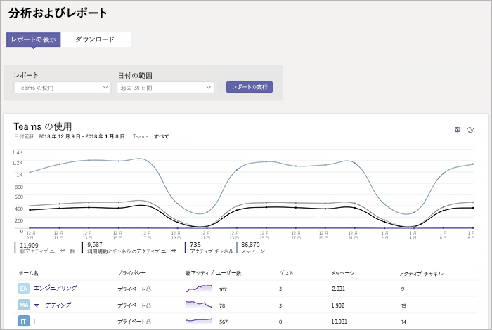

# Microsoft Teams の使用状況レポート

Microsoft Teams 管理センターにある Teams の使用状況レポートは、Teams での使用状況のアクティビティの概要を提供するもので、アクティブなユーザーおよびチャネルの数が含まれており、組織全体で何人のユーザーが通信や共同作業のために Teams を使用しているかをすぐに確認することができます。 各チームのアクティブなユーザー、チャネル、ゲスト、およびメッセージの数など、チームでの使用状況に関する情報を表示することができます。

## レポートを表示する

1.In Microsoft Teams 管理センターでは、左側のナビゲーションで [ **& 分析**] をクリックし、[**レポート**] で [**チームの利用状況**] を選択します。
2. [**日付の範囲**] の下で、範囲を選択して、[**レポートの実行**] をクリックします。

## レポートを解釈する

|コールアウト |説明  |
|--------|-------------|
|**1**   |Teams 使用状況アクティビティ レポートでは、過去 7 日間または 28 日間の傾向を確認できます。 |
|**2**   |各レポートには、このレポートが生成された日付が表示されます。通常、レポートはアクティビティの時刻から 24 から 48 時間の遅延を反映します。 |
|**3**   |<ul><li>グラフ上の X 軸はこのレポートで選択した日付範囲です。</li> <li> Y 軸はアクティブな項目またはアクティビティの数です。</li> </ul>特定の日付の項目またはアクティビティを示しているドットの上にマウス カーソルを合わせると、その特定の日付のその項目またはアクティビティのインスタンスの数を見ることができます。|
|**4**   |凡例の項目をクリックして、グラフに表示する情報をフィルター処理できます。 たとえば、[**アクティブなユーザーの合計**]、[**チーム & のアクティブユーザー**]、[**アクティブなチャネル**]、または [**メッセージ**] をクリックして、それぞれに関連する情報のみを表示します。 この選択を変更しても、表内の情報は変わりません。 |
|**5**   |表によって、チームごとの使用状況の内訳が表示されます。 <ul><li>**チーム名**は、チームの表示名です。 チーム名をクリックすると、Microsoft Teams 管理センターのチームの [設定] ページに移動できます。 </li> <li>**プライバシー**では、チームがプライベートなチームであるかパブリックなチームであるかが示されます。</li> <li>**アクティブ ユーザー**は指定された期間でのチーム内のアクティブなユーザーの数です。</li><li>**ゲスト**は指定された期間でのチーム内のゲストの数です。</li> </li> </ul>表に希望する情報を表示するには、表に列を追加する必要があります。 |
|**6**   |[**列の編集**] を選択して表で列を追加または削除します。|
|**7**   |レポートを CSV ファイルにエクスポートしてオフラインで分析することができます。 [ **Excel にエクスポート**] をクリックし、[**ダウンロード**] タブの [**ダウンロード**] をクリックして、準備ができたらレポートをダウンロードします。 ![ダウンロードするエクスポートされたレポートが表示された [ダウンロード] タブのスクリーンショット](../media/teams-reports-export-to-csv.png)|

## 関連トピック
- [Teams の分析とレポート](teams-reporting-reference.md)
- [Teams ユーザー アクティビティ レポート](user-activity-report.md)
- [Teams のデバイス使用状況レポート](device-usage-report.md)
