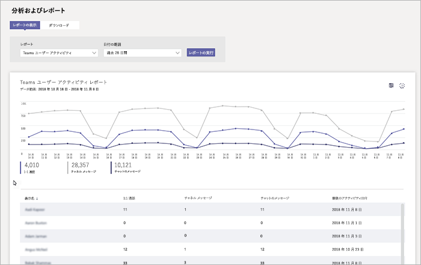

# Microsoft Teams ユーザー アクティビティ レポート

Teams ユーザーアクティビティレポートは、組織内のユーザーが Teams で実行するアクティビティの種類を把握するのに役立ちます。 たとえば、1:1 通話で何人のユーザが通信しているかを確認したり、チャンネルメッセージを通じてやり取りするユーザの数を確認したり、プライベートチャットメッセージで何人のユーザを参加させることができます。

## レポートを表示する

1. Microsoft Teams 管理センターに移動し、左のナビゲーションで [**分析] & [レポート**] をクリックして、[**レポート**] で [**チームユーザーアクティビティ**] を選択します。 
2. [**日付の範囲**] の下で、範囲を選択して、[**レポートの実行**] をクリックします。 

## レポートを解釈する

|コールアウト |説明  |
|--------|-------------|
|**1**   |Teams ユーザーアクティビティレポートでは、過去7日間または28日間の傾向を確認できます。 |
|**2**   |各レポートには、このレポートが生成された日付が表示されます。通常、レポートはアクティビティの時刻から 24 から 48 時間の遅延を反映します。 |
|**3**   |<ul><li>グラフの X 軸は、特定のレポートに対して選択されている日付範囲です。 </li><li>Y 軸は、アクティビティに参加しているユーザーの数です。</li></ul>特定の日付のアクティビティを表すドットの上にマウスポインターを移動すると、その日付のアクティビティのインスタンス数が表示されます。 |
|**4**   |凡例の項目をクリックして、グラフに表示する情報をフィルター処理できます。 たとえば、[ **1:1 通話**]、[**チャネルメッセージ**]、[**チャットメッセージ**] のいずれかをクリックすると、それぞれに関連する情報のみが表示されます。 選択範囲を変更しても、表内の情報が変更されることはありません。 |
|**5**   |この表では、ユーザーごとの使用状況の内訳を示します。   <ul><li>[**表示名**はユーザーの表示名です。 表示名をクリックすると、Microsoft Teams 管理センターのユーザーの設定ページに移動できます。</li><li>" **1:1 calls** " は、指定した期間にユーザーが参加した1:1 通話の数です。</li><li>[**チャネルメッセージ**数」は、指定した期間にユーザーがチームチャットに投稿した一意のメッセージの数です。</li> <li>"**チャットメッセージ**" は、指定された期間中にユーザーがプライベートチャットに投稿した一意のメッセージの数です。</li>  <li>[**最後のアクティビティ**] は、ユーザーが Teams アクティビティに参加した最後の日付 (UTC) です。</li> </ul>ユーザーアカウントが Azure AD に存在しなくなった場合は、ユーザー名がテーブルに "--" として表示されることに注意してください。   表に希望する情報を表示するには、表に列を追加する必要があります。
|**6**   |[**列の編集**] を選択して表で列を追加または削除します。 |
|**7**   |レポートを CSV ファイルにエクスポートしてオフラインで分析することができます。 [ **Excel にエクスポート**] をクリックし、[**ダウンロード**] タブの [**ダウンロード**] をクリックして、準備ができたらレポートをダウンロードします。 ![ダウンロードするエクスポートされたレポートが表示された [ダウンロード] タブのスクリーンショット](../media/teams-reports-export-to-csv.png)  Excel でレポートを表示すると、 **id**列も表示されます。これはチーム id を表します。 チーム ID は、通常は英数字の文字列です。 **Id**列に**\n**と表示されている場合は、ユーザーが情報を削除するように要求したことを意味します。 ||

## 関連トピック
- [Teams の分析とレポート](teams-reporting-reference.md)