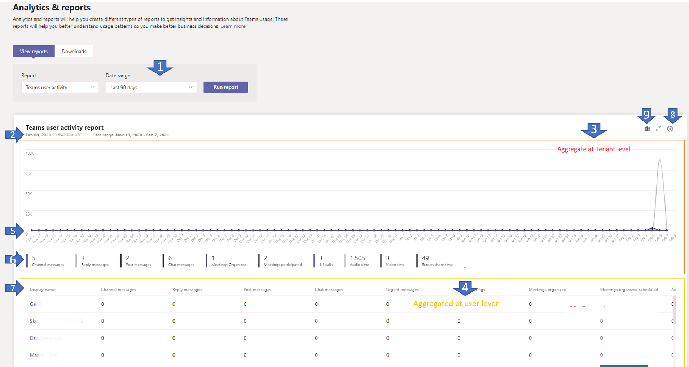

# Microsoft Teams ユーザー アクティビティ レポートMicrosoft Teams user activity report

Teams ユーザー アクティビティ レポートは、Teams で組織内のユーザーが実行するアクティビティの種類を把握するのに役立ちます。The Teams user activity report gives you insight into the types of activities that users in your organization perform in Teams. たとえば、1 対 1 の通話で対話するユーザーの数、チャネル メッセージを使用して連絡し合うユーザーの数、プライベート チャット メッセージでやり取りするユーザーの数を確認することができます。For example, you can see how many users communicate through 1:1 calls, how many users communicate through channel messages, and how many users engage in private chat messages.

## ユーザーアクティビティレポートを表示するView the user activity report

1. Microsoft Teams 管理センターの左側のナビゲーションで、**[分析およびレポート]** > **[使用状況レポート]** をクリックします。In the left navigation of the Microsoft Teams admin center, click **Analytics & reports** > **Usage reports**. **[レポートの表示]** タブの **[レポート]** で、**[Teams ユーザーの利用状況]** を選択します。On the **View reports** tab, under **Report**, select **Teams user activity**.
2. **[日付の範囲]** の下で、範囲を選択して、**[レポートの実行]** をクリックします。Under **Date range**, select a range, and then click **Run report**.

    ")

## レポートを解釈するInterpret the report

|CalloutCallout |説明Description  |
|--------|-------------|
|**1****1**   |Teams ユーザーアクティビティレポートでは、過去7日間、28日、または90日間の傾向を確認できます。The Teams user activity report can be viewed for trends over the last 7 days, 28 or 90 days. |
|**2****2**   |各レポートには、このレポートが生成された日付が表示されます。通常、レポートはアクティビティの時刻から 24 から 48 時間の遅延を反映します。Each report has a date for when this report was generated. The reports usually reflect a 24 to 48 hour latency from time of activity. |
|**3****3**   |<ul><li>グラフの X 軸は、特定のレポートに対して選択した日付範囲です。The X axis on the charts is the selected date range for the specific report. </li><li>Y 軸は、アクティビティに参加しているユーザーの数です。The Y axis is the number of users participating in the activity.</li></ul>特定の日付のアクティビティを示しているドットの上にマウス カーソルを合わせると、その特定の日付のそのアクティビティのインスタンスの数を見ることができます。Hover over the dot representing an activity on a given date to see the number of instances of that activity on that given date. |
|**4****4**   |凡例の項目をクリックして、グラフに表示する情報をフィルター処理できます。You can filter what you see on the chart by clicking an item in the legend. たとえば、**[1 対 1 の通話数]**、**[チャネル メッセージ]**、または **[チャット メッセージ]** をクリックすると、それぞれに関連した情報のみを確認できます。For example, click **1:1 calls**, **Channel messages**, or **Chat messages** to see only the info related to each one. 選択を変更しても、表内の情報は変わりません。Changing the selection doesn’t change the information in the table. |
|**5****5**   |表によって、ユーザーごとの使用状況の内訳が表示されます。The table gives you a breakdown of usage by user.   <ul><li>**表示名**はユーザーの表示名です。**Display name** is the display name of the user. 表示名をクリックして、Microsoft Teams 管理センターのユーザーの設定ページに移動することができます。You can click the display name to go to the user's setting page in the Microsoft Teams admin center.</li><li>**[1 対 1 の通話数]** は、指定された期間内にユーザーが参加した 1 対 1 の通話の数です。**1:1 calls** is the number of 1:1 calls that the user participated in during the specified time period.</li><li>**[チャネル メッセージ数]** は、指定された期間内にユーザーがチーム チャットに投稿した一意のメッセージの数です。**Channel messages** is the number of unique messages that the user posted in a team chat during the specified time period.</li><li>"**返信メッセージ**" は、指定された期間中にユーザーがチームチャネルに投稿した一意の返信メッセージの数です。**Reply messages** is the number of unique reply messages that the user posted in a team channel during the specified time period.</li> <li>"**投稿メッセージ**" は、指定された期間中にユーザーがチームチャネルに投稿した一意の投稿メッセージの数です。**Post messages** is the number of unique post messages that the user posted in a team channel during the specified time period.</li><li>[**会議開催**者は、指定した期間中にユーザーが開催した予約済み会議の数です。**Meetings organized** is the number of scheduled meetings a user organized during the specified time period.</li><li>[**会議に参加**しました」は、指定された期間中にユーザーが参加した予約済みの会議の数です。**Meetings participated** is the number of scheduled meetings a user participated in during the specified time period.</li><li>**[チャット メッセージ数]** は、指定された期間内にユーザーがプライベート チャットに投稿した一意のメッセージの数です。**Chat messages** is the number of unique messages that the user posted in a private chat during the specified time period.</li><li>[**緊急メッセージ**数は、指定された期間中にユーザーがチャットで投稿した緊急メッセージの数です。**Urgent messages** is the number of urgent messages that the user posted in a  chat during the specified time period.</li><li>[**グループ通話]** は、指定した期間にユーザーが参加したグループ通話の数です。**Group Calls** is the number of group calls that the user participated in during the specified time period.</li><li>[**オーディオ時間**数の指定は、指定された期間中にユーザーが参加した音声の合計時間です。**Audio time** is the total audio time that the user participated in during the specified time period.</li><li>[**ビデオ時間**は、指定した期間にユーザーが参加したビデオの合計時間です。**Video time** is the total video time that the user participated in during the specified time period.</li><li>[**画面共有時間**] は、指定した期間にユーザーが参加した画面共有時間の合計です。**Screen Share time** is the total screen share time that the user participated in during the specified time period.</li>  <li>**[最後のアクティビティ]** は、ユーザーが Teams アクティビティに参加した最後の日付 (UTC) を指します。**Last activity** is the last date (UTC) that the user participated in a Teams activity.</li> </ul>ユーザー アカウントが Azure AD に存在しなくなった場合は、ユーザー名がテーブルに "--" として表示されます。Note that if a user account no longer exists in Azure AD, the user name is displayed as "--" in the table.   表に希望する情報を表示するには、表に列を追加する必要があります。To see the information that you want in the table, make sure to add the columns to the table.
|**6****6**   |[**列の編集**] を選択して表で列を追加または削除します。Select **Edit columns** to add or remove columns in the table. |
|**7****7**   |レポートを CSV ファイルにエクスポートすると、オフラインで分析できます。You can export the report to a CSV file for offline analysis. **[Excel にエクスポート]** をクリックしてから、**[ダウンロード]** タブの **[ダウンロード]** をクリックして、準備のできたレポートをダウンロードします。Click **Export to Excel**, and then on the **Downloads** tab, click **Download** to download the report when it's ready.  ![ダウンロードするエクスポート済みのレポートが表示された [ダウンロード] タブのスクリーンショット](../media/teams-reports-export-to-csv.png)  Excel でレポートを表示すると、チーム ID を表す **[ID]** 列も表示されます。When you view the report in Excel, you'll also see an **Id** column, which represents the team ID. 通常、チーム ID は英数字の文字列です。A team ID is typically an alphanumeric string. **[ID]** 列が **\n** として表示されている場合は、ユーザーが情報を削除することを要求していることを意味します。If the **Id** column shows as **\n**, this means that a user requested their information to be deleted. ||

[!INCLUDE [teams-reports-definitions](../includes/teams-reports-definitions.md)]

## 関連項目Related topics

- [Teams の分析とレポートTeams analytics and reporting](teams-reporting-reference.md)
