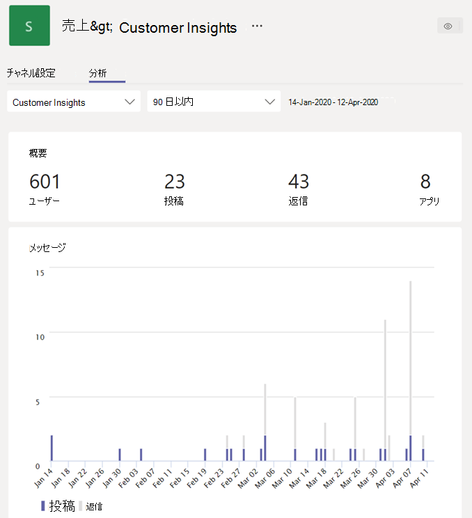

# Teams で分析を表示する

Microsoft Teams では、ユーザーは自分が参加しているチームとチャネルの分析を表示できます。 この情報は、チームの使用パターンやアクティビティに関する分析情報をユーザーに提供します。 ユーザーは、アクティブなユーザー数、投稿数、返信数などのデータを 3 つのレベルで表示できます。

- **チーム間分析では** 、1 つのリスト ビューでメンバーまたは所有者であるすべてのチームの使用状況データの概要がユーザーに表示されます。
- **チームごとの分析では、特定** のチームの利用状況データを表示する、より詳細なビューをユーザーに提供します。
- **チャネルごとの分析では、ユーザー** はさらに詳細なビューを表示し、特定のチャネルの使用状況データを表示できます。

ユーザーは、これらのビューをフィルター処理して、指定した期間のデータを表示できます。

## チーム間分析を表示する

1. Teams のチーム リストの下部で、[**チームに参加、またはチームを作成**] の横にある [**チームを管理**] をクリックします。
2. [分析 **] タブをクリック** します。
3. 日付範囲を選択すると、自分がメンバーまたは所有者であるすべてのチームの使用状況データが表示されます。

    

    |アイテム |説明  |
    |--------|-------------|
    |**名前**   |チームの名前です。 |
    |**アクティブ ユーザー**   |指定した期間内のアクティブ ユーザーの数およびチーム アクティビティの傾向線です。
    |**ユーザー**   |指定した期間内のチームの合計ユーザー数です。 これには、チームの所有者、チーム メンバー、およびゲストが含まれます。|
    |**ゲスト**   |指定した期間内のチームのゲストの数です。 |
    |**投稿**   |指定した期間中にチーム チャットに投稿された新しいメッセージの数。 |
    |**返信**   |指定された期間中のチーム チャットでの返信の数。 |
    |**種類**   |チームがプライベート チームであるかパブリック チームであるかが示されます。|

## チームごとの分析を表示する

1. Teams で、目的のチームに移動し、[**その他のオプション (...)**] をクリックし、[**チームを管理**] をクリックします。
2. [分析 **] タブをクリック** します。
4. 日付範囲を選び、チームの利用状況データを表示します。  

    

    |アイテム |説明  |
    |--------|-------------|
    |**要約**   |次を含む、チーム アクティビティの要約です。<ul><li>**ユーザー**: 指定した期間のユーザーの総数。 これには、チームの所有者、チーム メンバー、およびゲストが含まれます。</li> <li>**投稿**: 指定した期間中にチーム チャットに投稿された新しいメッセージの数です。</li><li>**返信**: 指定した期間中のチーム チャットでの返信の数です。</li> <li>**アプリ**: チームに追加されたアプリの数です。</li><li>**会議**: チーム レベルで開催された Teams 会議の数。</li> </ul> |
    |**アクティブ ユーザー**   |アクティブなユーザーと非アクティブなユーザーの数です。|
    |**役割**   |役割別のユーザー数 (チーム所有者、チーム メンバー、ゲストを含む)。|
    |[**アクティブ ユーザー**] グラフ  |アクティブな 1 日の数。 特定の日付のドットの上にマウス ポインターを置くと、その日付のアクティブ ユーザーの数が表示されます。|
    |[**メッセージ**]  |日付別にチーム チャットに投稿されたメッセージの総数。 指定した日付のドットの上にマウス ポインターを置くと、その日付に投稿された新しい投稿と返信の数が表示されます。|

> [!TIP]
> チームごとの分析を表示するには、チーム間分析ビューの一覧 [でチームをクリックします](#view-cross-team-analytics)。

## チャネルごとの分析を表示する

1. Teams で、必要なチャネルに移動し、[その他のオプション **(...)]** をクリックし、[チャネルの管理] **をクリックします**。
2. [分析 **] タブをクリック** します。
3. チャネルの使用状況データを表示する日付範囲を選択します。  

    

    |アイテム |説明  |
    |--------|-------------|
    |**要約**   |次のようなチャネル アクティビティの概要。<ul><li>**ユーザー**: 指定した期間のユーザーの総数。 これには、チームの所有者、チーム メンバー、およびゲストが含まれます。</li> <li>**投稿**: 指定した期間中にチャネルに投稿された新しいメッセージの数です。</li><li>**返信**: 指定した期間中のチャネル内の返信の数です。</li> <li>**アプリ**: チャネルに追加されたアプリの数です。</li> </ul> |
    |[**メッセージ**]  |日付別にチャネル チャットに投稿されたメッセージの総数。 指定した日付のドットの上にマウス ポインターを置くと、その日付に投稿された新しい投稿と返信の数が表示されます。|

> [!TIP]
> また、チームごとの分析ビューのドロップダウン リスト ボックスでチャネルを選択して、チャネルごとの [分析を表示することもできます](#view-per-team-analytics)。
    
> [!NOTE]
> デスクトップ クライアント、モバイル クライアント、Web クライアントで意図的なアクションを実行するユーザーとして、アクティブなユーザーを定義します。 意図的なアクションの例としては、チャットの開始、通話の開始、ファイルの共有、チーム内のドキュメントの編集、会議への参加などです。 自動起動、画面の最小化、アプリの終了など、パッシブアクションを取り除きます。 また、1 つのユーザー ID ですべてのアクションを削除します。

## 関連項目

- [チームの分析を表示する](https://support.office.com/article/view-analytics-for-your-teams-5b8ad4b1-af34-4217-aff4-cd11a820b56b)
- [Teams の分析とレポート](teams-reporting-reference.md)