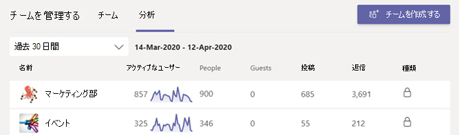

# Teams で分析を表示するView analytics in Teams

Microsoft Teams では、ユーザーは自分が参加しているチームとチャネルの分析を表示できます。In Microsoft Teams, users can view analytics for teams and channels that they are part of. この情報は、チームの使用パターンやアクティビティに関する分析情報をユーザーに提供します。This information gives users insight into usage patterns and activity on their teams. ユーザーは、アクティブなユーザー数、投稿数、返信数などのデータを 3 つのレベルで表示できます。Users can see data such as the number of active users, posts, replies, and more at three levels.

- **チーム間分析では** 、1 つのリスト ビューでメンバーまたは所有者であるすべてのチームの使用状況データの概要がユーザーに表示されます。**Cross-team analytics** gives users a broad overview of usage data for all teams that they are a member or owner of in a single list view.
- **チームごとの分析では、特定** のチームの利用状況データを表示する、より詳細なビューをユーザーに提供します。**Per-team analytics** gives users a more granular view, showing usage data for a specific team.
- **チャネルごとの分析では、ユーザー** はさらに詳細なビューを表示し、特定のチャネルの使用状況データを表示できます。**Per-channel analytics** gives users an even more granular view, showing usage data for a specific channel.

ユーザーは、これらのビューをフィルター処理して、指定した期間のデータを表示できます。Users can filter any of these views to see data for a specified time period.

## チーム間分析を表示するView cross-team analytics

1. Teams のチーム リストの下部で、[**チームに参加、またはチームを作成**] の横にある [**チームを管理**] をクリックします。In Teams, at the bottom of the teams list, next to **Join or create a team**, click **Manage teams**.
2. [分析 **] タブをクリック** します。Click the **Analytics** tab.
3. 日付範囲を選択すると、自分がメンバーまたは所有者であるすべてのチームの使用状況データが表示されます。Select a date range to show usage data for all teams that you're a member or owner of.

    

    |アイテムItem |説明Description  |
    |--------|-------------|
    |**名前****Name**   |チームの名前です。Name of the team. |
    |**アクティブ ユーザー****Active users**   |指定した期間内のアクティブ ユーザーの数およびチーム アクティビティの傾向線です。Number of active users on the team and trend line of team activity during the specified time period.
    |**ユーザー****People**   |指定した期間内のチームの合計ユーザー数です。Total number of people on the team in the specified time period. これには、チームの所有者、チーム メンバー、およびゲストが含まれます。This includes team owners, team members, and guests.|
    |**ゲスト****Guests**   |指定した期間内のチームのゲストの数です。Number of guests on the team during the specified time period. |
    |**投稿****Posts**   |指定した期間中にチーム チャットに投稿された新しいメッセージの数。Number of new messages posted in team chat during the specified time period. |
    |**返信****Replies**   |指定された期間中のチーム チャットでの返信の数。Number of replies in team chat during the specified time period. |
    |**種類****Type**   |チームがプライベート チームであるかパブリック チームであるかが示されます。Whether the team is a private team or public team.|

## チームごとの分析を表示するView per-team analytics

1. Teams で、目的のチームに移動し、[**その他のオプション (...)**] をクリックし、[**チームを管理**] をクリックします。In Teams, go to the team that you want, click **More options (...)**, and then click **Manage team**.
2. [分析 **] タブをクリック** します。Click the **Analytics** tab.
4. 日付範囲を選び、チームの利用状況データを表示します。Select a date range to show usage data for the team.  

    

    |アイテムItem |説明Description  |
    |--------|-------------|
    |**要約****Summary**   |次を含む、チーム アクティビティの要約です。Summary of team activity including the following:<ul><li>**ユーザー**: 指定した期間のユーザーの総数。**Users**: Total number of users in the specified time period. これには、チームの所有者、チーム メンバー、およびゲストが含まれます。This includes team owners, team members, and guests.</li> <li>**投稿**: 指定した期間中にチーム チャットに投稿された新しいメッセージの数です。**Posts**: Number of new messages posted in team chat during the specified time period.</li><li>**返信**: 指定した期間中のチーム チャットでの返信の数です。**Replies**: Number of replies in team chat during the specified time period.</li> <li>**アプリ**: チームに追加されたアプリの数です。**Apps**: Number of apps added to the team.</li><li>**会議**: チーム レベルで開催された Teams 会議の数。**Meetings**: Number of Teams meetings organized at the team level.</li> </ul> |
    |**アクティブ ユーザー****Active users**   |アクティブなユーザーと非アクティブなユーザーの数です。Number of active and inactive users.|
    |**役割****Role**   |役割別のユーザー数 (チーム所有者、チーム メンバー、ゲストを含む)。Numbers of users by role, including team owners, team members, and guests.|
    |[**アクティブ ユーザー**] グラフ**Active users** chart  |アクティブな 1 日の数。Number of daily active. 特定の日付のドットの上にマウス ポインターを置くと、その日付のアクティブ ユーザーの数が表示されます。Hover over the dot on a given date to see the number of active users on that date.|
    |[**メッセージ**]**Messages** chart  |日付別にチーム チャットに投稿されたメッセージの総数。Total number of messages posted in team chat by date. 指定した日付のドットの上にマウス ポインターを置くと、その日付に投稿された新しい投稿と返信の数が表示されます。Hover over the dot on a given date to see the number of new posts and replies posted on that date.|

> [!TIP]
> チームごとの分析を表示するには、チーム間分析ビューの一覧 [でチームをクリックします](#view-cross-team-analytics)。You can also view per-team analytics by clicking a team in list in the [cross-team analytics view](#view-cross-team-analytics).

## チャネルごとの分析を表示するView per-channel analytics

1. Teams で、必要なチャネルに移動し、[その他のオプション **(...)]** をクリックし、[チャネルの管理] **をクリックします**。In Teams, go to the channel that you want, click **More options (...)**, and then click **Manage channel**.
2. [分析 **] タブをクリック** します。Click the **Analytics** tab.
3. チャネルの使用状況データを表示する日付範囲を選択します。Select a date range to show usage data for the channel.  

    

    |アイテムItem |説明Description  |
    |--------|-------------|
    |**要約****Summary**   |次のようなチャネル アクティビティの概要。Summary of channel activity including the following:<ul><li>**ユーザー**: 指定した期間のユーザーの総数。**Users**: Total number of users in the specified time period. これには、チームの所有者、チーム メンバー、およびゲストが含まれます。This includes team owners, team members, and guests.</li> <li>**投稿**: 指定した期間中にチャネルに投稿された新しいメッセージの数です。**Posts**: Number of new messages posted to the channel during the specified time period.</li><li>**返信**: 指定した期間中のチャネル内の返信の数です。**Replies**: Number of replies in the channel during the specified time period.</li> <li>**アプリ**: チャネルに追加されたアプリの数です。**Apps**: Number of apps added to the channel.</li> </ul> |
    |[**メッセージ**]**Messages** chart  |日付別にチャネル チャットに投稿されたメッセージの総数。Total number of messages posted to the channel chat by date. 指定した日付のドットの上にマウス ポインターを置くと、その日付に投稿された新しい投稿と返信の数が表示されます。Hover over the dot on a given date to see the number of new posts and replies posted on that date.|

> [!TIP]
> また、チームごとの分析ビューのドロップダウン リスト ボックスでチャネルを選択して、チャネルごとの [分析を表示することもできます](#view-per-team-analytics)。You can also view per-channel analytics by selecting a channel in the drop-down list box in the [per-team analytics view](#view-per-team-analytics).
    
> [!NOTE]
> デスクトップ クライアント、モバイル クライアント、Web クライアントで意図的なアクションを実行するユーザーとして、アクティブなユーザーを定義します。We define active users as users who perform an intentional action in the desktop client, mobile client, and web client. 意図的なアクションの例としては、チャットの開始、通話の開始、ファイルの共有、チーム内のドキュメントの編集、会議への参加などです。Examples of an intentional action include starting a chat, placing a call, sharing a file, editing a document within teams, participating in a meeting, and so on. 自動起動、画面の最小化、アプリの終了など、パッシブアクションを取り除きます。We strip out passive actions like auto boot, minimizing a screen, or closing the app. また、1 つのユーザー ID ですべてのアクションを削除します。We also de-dupe all actions across a single user ID.

## 関連項目Related topics

- [チームの分析を表示するView analytics for your teams](https://support.office.com/article/view-analytics-for-your-teams-5b8ad4b1-af34-4217-aff4-cd11a820b56b)
- [Teams の分析とレポートTeams analytics and reporting](teams-reporting-reference.md)