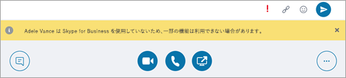
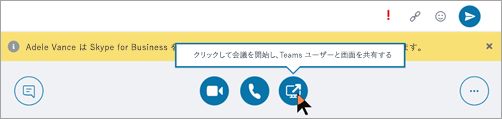
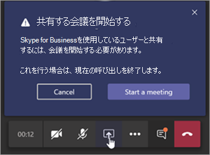

# Microsoft Teams と Skype for Business の共存と相互運用性を理解する

この記事は、お客様のアップグレード行程の「プロジェクトの定義」段階の一部です。 スポンサー連合とプロジェク チームを作成し、プロジェクトの適用範囲、目標、ビジョンを定義した後に実行します。 先に進む前に、次のアクティビティを完了していることを確認してください。

- [プロジェクトの関係者をリスト化した](upgrade-enlist-stakeholders.md)
- [プロジェクトの対象範囲を定義した](https://aka.ms/SkypetoTeams-Scope)

組織で現在 Skype for Business を使用し、Skype for Business と一緒に Teams を使用し始める場合、または Teams へのアップグレードを開始する場合は、2 つのアプリケーションがどのように共存し、いつ、どのように相互運用されるか、および Skype for Business から Teams への最終的なアップグレードまで、ユーザーの移行を管理する方法を理解することが重要です。

> [!Tip]
> [共存と相互運用性](https://aka.ms/teams-upgrade-coexistence-interop)の詳細を説明するセッションをご視聴ください。
>
> アップグレードの計画と実施に役立つように作られたガイダンス、ベスト プラクティス、リソースを紹介する、インタラクティブなライブ ワークショップにもご参加いただけます。
>
> アップグレードを開始するには、最初に「[アップグレードの計画](https://aka.ms/SkypeToTeamsPlanning)」セッションにご参加ください。

## Teams と Skype for Business の共存の概要

以下のセクションでは、Teams へのアップグレードを決定するときに使用できる共存モードと、各モードで提供される機能について説明します。 さらに、Skype-for-Business クライアント上のユーザーと Teams クライアント上のユーザー間で発生する相互運用性 (相互運用) と、選択した共存モードによる相互運用の影響について説明します。

 Teams では、共同作業の機能だけでなく、チャット、通話、会議の機能を提供しています。 選択する Teams の展開方法によっては、これらの機能が、特定のユーザーに対して Skype for Business で提供される機能と重複する場合があります。 既定のモードでは、Teams は Skype for Business と並列に、機能が重複して実行されます。 ただし、ユーザーにはいくつかある共存モード (アップグレード モードとも呼ばます) のいずれかを割り当てることができます。共存モードは、モードが割り当てられたユーザーに対して機能が重複しないよう作られており、その場合には Teams と Skype for Business の相互運用性を利用できます。 たとえば、複雑なエンタープライズ VoIP の展開と共に、多くの Skype for Business Server のオンプレミスの資産を持っているものの、ユーザーが最新の会議をできるだけ早く利用できるようにしたい場合には、代替パスとして [Meetings First](meetings-first.md) を評価することができます。

どのパスが組織に一番適しているかを判断するために、以下の共存モードを確認することをお勧めします。

> [!Important]
> 新たな優れたビジネス上のメリットを提供しつつ、新しいテクノロジを導入したり、既存の馴染みのある Skype for Business 環境を変更したりする場合、ユーザーが混乱する場合があります。 この記事で説明する変更を実行する前に、時間をかけてユーザーの準備状況を評価し、コミュニケーションおよびトレーニングの計画を実施するようにしてください。 また、計画は、組織全体に実装する前に、選択したユーザーのグループで実験運用することを強くお勧めします。

### アイランド モード

既定では、ユーザーは、類似した重なり合う機能を提供する 2 つの別個のソリューションとして、Teams と Skype for Business を並列で実行できます。 プレゼンス、チャット、通話、会議などの機能を利用できます。 Teams ユーザーは、チームとチャネル、Microsoft 365 または Office 365 のファイルへのアクセス、アプリケーションなどの新しい共同作業の機能を利用することもできます。

「**アイランド**」と呼ばれるこの共存モードでは、各クライアント アプリケーションが別個のアイランド (島) として動作します。 Skype for Business は Skype for Business とやり取りし、Teams は Teams とやり取りします。 ユーザーは、両方のクライアントを常時実行することが想定されており、コミュニケーションを開始したクライアントでネイティブにコミュニケーションできます。 そのため、[**アイランド**] モードでは、相互運用性は必要ありません。

Skype for Business が混乱したり、エクスペリエンスが低下したりしないように、Skype for Business は、Teams **Islands** モードで処理されない次の統合を処理します。

- 外部 (フェデレーション) 通信。
- PSTN 音声サービスと音声アプリケーション、Office の統合。
- USB デバイスの HID コントロール。
- その他の統合。  

電話システムは、 Teams の **Islands モード** でサポートされていません。 **Island** モードは、Skype for Business のエンタープライズ ボイス クライアントをサポートしていません。

> [!Important]
> [**アイランド**] モードでは、フェデレーション ユーザー (組織外のユーザー) からのすべてのメッセージと通話は、Skype for Business に配信されます。 [**Teams のみ**] モードにアップグレードすると、組織の外部からのすべてのメッセージと通話が Teams に配信されます。

> [!Tip]
> Skype for Business Online を使用中のお客様の場合、最初は既定の [**アイランド**] モードを使用し、組織内で Teams の導入完了を図り、その後、迅速に [**Teams のみ**] モードに移行することをお勧めします。 オンプレミスおよびハイブリッドのお客様は、その環境が複雑な場合は特に、出発点として [**アイランド**] モードではなく [**Skype for Business と Teams のコラボレーション**] モードを展開し、組織で Teams の導入準備が整い次第、(状況に応じて) [**Skype for Business と Teams のコラボレーションと会議**] モード (Meetings First のことです) および [**Teams のみ**] モードに進むという方法が有効な場合があります。

### Teams のみ

「**Teams のみ**」ユーザー (*アップグレード済み* ユーザーとも呼ばれます) は、Teams のすべての機能にアクセスできます。 これらのユーザーは、アップグレード済みではないユーザーや外部関係者によって開催される Skype for Business の会議に参加するために Skype for Business クライアントを残しておくことができます。 アップグレード済みユーザーは、Skype for Business をまだ使用している組織内の他のユーザーと引き続きやり取りするために、(Skype for Business ユーザーが [**アイランド**] モードに設定されていない限り) Teams と Skype for Business との相互運用機能を使用することができます。 ただし、アップグレードしたユーザーは、Skype for Business のチャット、通話、会議を開始することはできません。

一部またはすべてのユーザーが Teams を唯一のコミュニケーションおよびコラボレーション ツールとして使用する準備が組織ででき次第、それらのユーザーを [**Teams のみ**] モードにアップグレードしてください。 [**アイランド**] モードからアップグレードする場合は、最初に Teams の導入を組織全体に行き渡らせてからアップグレード プロセスを開始することをお勧めします。 この導入により、相互運用性が [**アイランド**] モードで提供されないことによるコミュニケーションの中断という事態を避けられます。

[**Teams のみ**] モードでは、Teams が SIP/Tel プロトコルの既定のアプリとなります。 Outlook 内にある、通話またはチャットのためのユーザーの連絡先カード内のリンクは、Teams によって処理されます。

[**Teams のみ**] モードへの移行に関するその他の考慮事項については、「[Teams のみモードの考慮事項](teams-only-mode-considerations.md)」を参照してください。

### Skype for Business のみ

この共存モードでは、ユーザーはチャット、会議、通話を行うために Teams ではなく、引き続き Skype for Business を利用します。また、チームとチャネルには Teams を使用しません。 このモードは現在使用できます。ただし、現在の実装では、チームとチャネルはユーザーに対して自動的にオフになりません。 これを行うには、アプリケーションの設定ポリシーを使用して、チームとファイルを非表示にします。

このモードは、Teams の管理された展開を開始する前に使用することができます。これにより、ユーザーが準備完了に先行して Teams の使用を開始することを防ぐことができます。 このモードは、Skype for Business ユーザーの Teams 会議での認証された参加を可能にする方法として、ユーザーが Teams のライセンスを持っている場合に使用できます。

### Skype for Business と Teams のコラボレーション

このモードを使用すると、Skype for Business の既存の投資を継続して利用しつつ、Teams を組織の環境に導入できます。 Skype for Business のチャット、通話、会議の機能については、変更しないままにしておきます。 Teams のコラボレーション機能の追加:

- チームとチャネル
- Microsoft 365 または Office 365 のファイルにアクセスします。
- アプリケーション。 Teams のコミュニケーション機能 (プライベート チャット、通話、会議のスケジュールなど)。

このモードでは、Teams のプライベート チャット、通話、会議のスケジュールは、既定ではオフになります。

オンプレミスまたはハイブリッドの Skype for Business Server を開始点とする組織は、コミュニケーションの相互運用性と予測可能性をユーザーに提供する場合、または ([**アイランド**] モードでの導入の浸透に頼る代わりに) ユーザーの Teams へのアップグレードを予測可能なタイムラインに沿って行う場合は、このモードを [**アイランド**] モードの代わりに使用することを検討してください。

### Skype for Business と Teams のコラボレーションと会議 (Meetings First とも呼ばれます)

この共存モードを使用すると、組織で Teams 会議とコラボレーション機能を迅速に利用できます。 共存モードにより、ユーザーは優れた Teams 会議環境を体感できます。

- 優れた品質。
- 文字起こしと翻訳。
- 背景がぼやけて表示される。
- モバイル デバイスやブラウザーを含むすべてのプラットフォームで優れたユーザー エクスペリエンスを提供します。

このモードでは、Teams はチームやチャネル ベースの会話に使用される他、ユーザーが会議のスケジュールを設定して実施するのにも Teams が使用されます。 プライベート チャットと通話は引き続き Skype for Business で行います。 Teams と Skype for Business は広範な "連携により強化される" 機能の恩恵を受けます。たとえば、プレゼンス調整、自動保留/保留解除、両方のアプリケーションにおける HID デバイスのサポートなどです。 必要な場合は、アプリのセットアップ ポリシーを使用して、チームとチャネルを非表示にすることができます。

この共存モードは、エンタープライズ ボイスを使用して Skype for Business をオンプレミスに展開している組織において特に適しています。 このような組織では多くの場合、Teams へのアップグレードに時間を要し、より優れた Teams の会議をできるだけ早く活用したいと望んでいるためです。

> [!TIP]
> Skype for Business の使用が継続している場合に、 Teams で有効にしたい機能に基づき推奨されるアップグレード モードを特定するには、[Skype から Teams へのアップグレード ウィザード](https://aka.ms/SkypeToTeamsWizard)を使用します。

共存モード、前提条件、および管理の詳細については、「[Teams を Skype for Business と併用する組織向けの移行と相互運用に関するガイダンス](https://aka.ms/SkypeToTeams-Interop)」および「[共存およびアップグレードを設定する](https://aka.ms/SkypeToTeams-SetCoexistence)」を参照してください。

|判断ポイント アイコン。 |アイコンの定義 |説明 |
|---|---|---|
||判断ポイント|<ul><li>組織とユーザーのニーズに最適な共存モードを特定する。</li></ul>|
||次の手順|<ul><li>アップグレード行程での最適なアプローチを選択する。</li></ul>|

### Teams と Skype for Business の相互運用性

相互運用とは、同じ組織内の Teams ユーザーと Skype for Business ユーザーが Teams と Skype for Business の間で通信できるようにする機能です。

相互運用は、受信者の共存モード (アップグレード モードとも呼ばれます) によって制御されます。 受信者が [**アイランド**] モードの場合、相互運用性はありません。

> [!Note]
> [**アイランド**] 以外のいずれかの共存モードで展開すると、Teams と Skype for Business では [相互運用](#interoperability-of-teams-and-skype-for-business)が可能になります。これにより、アプリ間でのユーザー同士のチャットや通話がサポートされ、Teams へのアップグレードの行程期間中、円滑なコミュニケーションを組織全体で維持できます。 相互運用性は、共存モードにより制御されます。 受信者の共存モードにより、相互運用性を利用できるかどうかが決まります。 たとえば、受信者のモードが、チャットを 1 つのクライアントでのみ使用できるモード (Teams であるとします) である場合、発信者が別のクライアント (この場合は、Skype for Business) を使用してチャットを開始した場合に、チャットの相互運用性を利用できます。 一方、受信者のモードが、両方のクライアントでチャットが可能なモード ([アイランド] モード) の場合、チャットで相互運用性を利用できません。 受信者がメッセージを受信する際は、発信者がチャットを開始した際に使用したものと同じクライアントを使用して受信されます。 したがって、[**アイランド**] モードでコミュニケーションを正常に行うには、Teams の導入が行き渡っている必要があります。つまり、すべてのユーザーが、両方のクライアントをアクティブに使用して監視している状態です。

> [!Note]
> **最新の共存エクスペリエンスを体験するには、クライアント バージョンがユーザーの Office 展開チャネルで利用可能な最新のクライアントである必要があります。**

#### ネイティブ相互運用と相互運用エスカレーション

相互運用エクスペリエンスには、ネイティブ相互運用と相互運用エスカレーションの 2 種類があります。

- _ネイティブ相互運用_ は、ユーザーがその時点で使用しているクライアントにおいて実行されます。 1 人のユーザーが Skype for Business クライアント内に存在し、もう 1 人は Teams 内にいる場合です。 ネイティブの相互運用機能では、通信のために別のクライアントに移動することはありません。 ユーザーは現在使用しているクライアントで会話を行えるようになります。 ネイティブ相互運用エクスペリエンスは、1 対 1 のチャットと通話です。
- _相互運用エスカレーション_ エクスペリエンスでは、ユーザー行う高度な操作 (デスクトップの共有など) のサポートの一環として、クライアントでの会議の作成が容易になります。ユーザーはこの会議に参加して、相互運用エスカレーション エクスペリエンスを会議内で継続させられます。 会議は、操作を開始したユーザーのプラットフォームに作成されます。 そのプラットフォーム上にいないユーザーには、会議参加のリンクが送られます。 このリンクをクリックすると、互換性のあるクライアント (構成に基づいて、ブラウザー、Web アプリ、フル クライアントのいずれか) で会議に参加できます。 Skype for Business からの相互運用エスカレーションには、最新のクライアントが必要です。 Teams から相互運用エスカレーションを利用できるようになりました。 いずれのエスカレーションも、テナント内の相互運用エクスペリエンス、およびテナント間のフェデレーション コミュニケーションでサポートされます。

#### ネイティブ相互運用エクスペリエンス

前述のように、ユーザーに割り当てられている共存モードに基づいて、以下のネイティブ相互運用エクスペリエンスを使用できます。

Skype for Business ユーザーと Teams ユーザーは 1 対 1 のチャットを行えます。 相互運用チャットは、Teams クラウド サービスの一部である (つまり、オンラインでのみ存在する) 相互運用ゲートウェイを経由する必要があります。 相互運用チャットはプレーン テキストです。リッチ テキストと絵文字はサポートされていません。 Teams と Skype for Business のユーザーには、相互運用による会話であることが通知されます。

<!---->

Skype for Business ユーザーは、Teams ユーザーとの 1 対 1 の音声通話とビデオ通話を行えます。Teams ユーザーも同じことが行えます。

<!---->

> [!Important]
> オンプレミス展開の Skype for Business を使用する相互運用エクスペリエンスでは、対象のオンプレミス展開が Microsoft 365 または Office 365 Skype for Business のハイブリッド モードである必要があります。 詳細については、「[移行と相互運用に関するガイドライン](https://aka.ms/SkypeToTeams-Interop)」を参照してください。

これらの相互運用エクスペリエンスは、[**Skype for Business と Teams のコラボレーション**]、[**Skype for Business と Teams のコラボレーションと会議**]、[**Skype for Business Only のみ**]、および [**Teams のみ**] の共存モードが割り当てられているユーザーが利用でき、これらのユーザー間で使用できます。 [**アイランド**] モードのユーザーの場合、相互運用性はありません。

#### ネイティブ相互運用エクスペリエンスの制限事項

プロトコルやテクノロジの違いにより、すべての機能をネイティブにサポートすることはできません。 具体的には、次の機能は使用できません。

- マークダウン、リッチ テキスト、絵文字の完全なセットは Teams と Skype for Business のどちらからもサポートされていません。 Teams チャットの作成ボックスの他のネイティブ機能はサポートされていません。
- Teams と Skype for Business 間の画面共有 (デスクトップやアプリの共有) は、ネイティブでサポートされていません。 ただし、相互運用エスカレーションを使用する場合にはサポートされます。
- Teams のグループ チャット (複数による会話) には、Teams を使用している参加者のみが加わることができます。
- Skype for Business の複数による IM 会話 (グループ チャット) には、Skype for Business を使用している参加者のみが加わることができます。 ただし、Skype for Business からは複数での会話に相互運用エスカレーションを利用できます。
- Teams と Skype for Business の両方のユーザーが関係する、その時点で行われているピアツーピアの音声通話またはビデオ通話から複数通話にエスカレーションする操作はサポートされていません。
- Teams と Skype for Business 間における 2 者間チャットのファイル転送、またはグループ チャットのファイル添付はサポートされていません。
- Skype for Business 常設チャットには相互運用性はありません。

(常設チャットを除く) これらすべての制限事項に関しては、考えられる 1 つの回避策として、1 人のユーザーが会議を開始し、それに参加するよう他のユーザーを招待するという方法があります。

この回避策が、相互運用エスカレーションの基礎となっています。 特に、画面の共有および複数ユーザーへのエスカレーションはネイティブには実行できませんが、相互運用エスカレーションによってサポートされています。

#### 相互運用エスカレーション エクスペリエンス

相互運用エスカレーションは、ネイティブ相互運用機能を、会議への管理されたエスカレーションを使用して補完したものです。 会議では、ユーザーが所有しているクライアントに関係なく、だれもが豊富な機能を利用できます。

Teams ユーザーにより相互運用エスカレーションがトリガーされると、Teams 会議が作成されます。 それをトリガーしたのが Skype for Business ユーザーであった場合は、Skype for Business 会議が作成されます。 いずれの場合も、作成される会議は [**今すぐ会議**] の会議となり、これはユーザーの予定表には反映されません。

相手のユーザーは、相互運用チャットで会議参加リンクを受け取り、そのリンクをクリックすると参加できます。 Skype for Business ユーザーが Teams アカウントを持っていて Teams ユーザーによって招待されると、認証された状態で会議に参加します。 それ以外の場合は、匿名の参加者として参加します。 反対に、ほとんどの Teams ユーザーには必ず Skype for Business アカウントと、Skype for Business 会議に認証された参加者として使用できる Skype for Business クライアントがありますが、Skype 会議アプリを使用する場合など匿名の参加者として参加することもできます。

会議に参加したユーザーは、デスクトップやコンテンツの共有、ファイルの共有や転送、他の参加者の追加など、会議でサポートされるすべてのアクティビティを実行できます。

#### Skype for Business からの相互運用エスカレーション

Skype for Business からの相互運用と相互運用エスカレーションは、月次 C2R の 2019 年 7 月ビルドで更新されました。 以前は、Skype for Business では、リモート ユーザーが Teams を使用していることを事前に認識できませんでした。 セッションが確立された後に受信した信号に基づいて推測されるだけでした。

応答が相互運用ゲートウェイから来たこと、またはゲートウェイを経由したことを信号が示している場合、そのユーザーが Skype for Business を使用していないことを示す黄色の ビジネス バー (バナー) が表示されます。 サービスの進化に伴い、実際の **Teams のみ** ユーザーに接続したときではなく、クラウド ボイスメール サービスや他のクラウド ボイス サービスに接続した場合にこのビジネス バーが Skype for Business ユーザーに表示されるようになり、誤検知が発生していました。

こうした誤検知を防ぐために、プレゼンス サービスでは、相手のユーザーが実際に **Teams のみ** ユーザーである場合に Skype for Business クライアントに通知するようになりました。 これにより、会話ウィンドウが作成されてしまう前に相互運用会話および相互運用専用の会話ウィンドウを作成する必要があることを Skype for Business に認識させられます。

Skype for Business ユーザーがデスクトップを共有しようとすると、会議が始まることが通知され、手順が案内されます。

それと同時に、Teams ユーザーには会議へのリンクが含まれたチャット メッセージが届き、参加するためのガイドが示されます。

Skype for Business 会議へのこのエスカレーションは、テナント内の相互運用と、テナント間のフェデレーション通話とチャットで利用できます。 これは既定で有効になっており、管理者がプロビジョニングする必要のある設定はありません。

#### Teams からの相互運用エスカレーション

Teams から Teams 会議への相互運用エスカレーションが、Skype for Business ユーザーとのテナント内相互運用スレッドにある、またはテナント間相互運用フェデレーション スレッドにあるデスクトップ共有ボタンを Teams ユーザーが選択すると利用できるようになりました。 相互運用エスカレーションは、1 対 1 のチャット会話または 1 対 1 の通話でサポートされています。

この機能は、Windows 用の Teams デスクトップ クライアント、Mac 用の Teams デスクトップ クライアント、コンテンツ共有がサポートされているブラウザー上の Teams Web クライアントでサポートされています。すべてのバージョンの Skype for Business クライアントと通信できます。

相互運用スレッドとフェデレーション相互運用スレッドで、Teams ユーザーにコンテンツ共有を開始するためのコントロール (ボタン) が表示されるようになりました。 Teams ユーザーがこのボタンを選択すると、コンテンツ共有や、Teams 会議を開始する必要があることを知らせる追加メニューが表示されます。

ユーザーが通話中の場合は、Teams と Skype for Business 間で行われている現在の通話が、Teams 会議に参加すると終了することも警告されます。 選択した場合は、承諾前に Skype for Business ユーザーに警告できます。

承諾すると、Teams 会議に参加できます。会議の共有トレイから共有を開始する必要があります。

一方、Skype for Business ユーザーは、会議へのリンクを含む着信チャット メッセージを受信し、参加するためのガイドが示されます。

Teams 会議へのこのエスカレーションは、テナント内の相互運用と、テナント間のフェデレーション通話とチャットで利用できます。 これは既定で有効になっており、管理者がプロビジョニングする必要のある設定はありません。 ただし、管理者が ``CsTeamsMeetingPolicy`` の ``-AllowPrivateMeetNow`` を ``$false`` に設定すると、ユーザーに対して無効になります。

この記事の内容を確認し終わったら、実装の詳細について、「[アップグレードの行程を選択する](upgrade-and-coexistence-of-skypeforbusiness-and-teams.md)」、「[移行と相互運用に関するガイドライン](https://aka.ms/SkypeToTeams-Interop)」、「[Skype for Business と共存する](coexistence-chat-calls-presence.md)」、および「[共存およびアップグレードを設定する](https://aka.ms/SkypeToTeams-SetCoexistence)」を参照してください。 また、ビデオ: [SfB](https://www.youtube.com/watch?v=wEc9u4S3GIA&list=PLaSOUojkSiGnKuE30ckcjnDVkMNqDv0Vl&index=11)と Teams の共存と相互運用性を管理する

## Teams と Skype for Business の共存に関する技術的な詳細

次のセクションでは、使用されるモードとアップグレード方法に関係なく、同じ組織で Teams と Skype for Business クライアントの両方を実行するときに発生する可能性がある動作についてまとめります。

- [会議](#meetings)
- [相互運用性](#interoperability)
- [Teams の会話スレッドとネイティブ スレッドの相互運用](#teams-conversations---interop-versus-native-threads)
- [プレゼンス](#presence)
- [フェデレーション](#federation)
- [連絡先](#contacts)

### 会議

モードに関係なく、ユーザーは、Skype for Business であれ Teams であれ、招待されたすべての種類の会議にいつでも参加できます。  ただし、ユーザーは、会議の種類に合った対応するクライアントを使用してその会議に参加する必要があります。

- 会議が Teams 会議の場合、参加者全員 (TeamsOnly、アイランド、Skype for Business のいずれのユーザーであっても) が、Teams クライアントを使用して会議に参加します。 Teams がインストールされていない場合、そのユーザーが会議に参加しようとすると、Web に移動されます。

- 会議が Skype for Business 会議の場合、参加者全員 (TeamsOnly、アイランド、Skype for Business のいずれのユーザーであっても) が、Skype for Business クライアントを使用して会議に参加します。 Skype for Business クライアントがインストールされていない場合、そのユーザーは、Skype 会議アプリ経由で参加できるように Web に移動されます。

会議を開催する場合、スケジュールされる会議の種類は、次の表に示すように開催者のモードに基づいて決定されます。

| 開催者のモード    |      動作 |
| :------------------ | :---------------- |
| TeamsOnly、SfbWithTeamsCollabAndMeetings |    すべての会議が Teams でスケジュールされます。 Skype for Business アドインは Outlook では使用できません。 | 
| SfbWithTeamsCollab、SfbOnly   | すべての会議が Skype for Business でスケジュールされます。 Teams アドインは Outlook では使用できません。 | 
| アイランド | 既定では、会議は Skype for Business または Teams でスケジュールできます。 両方のアドインを Outlook で使用できます。 ただし、オプションで、Islands のユーザーに PreferredMeetingProviderForIslandsMode=Teams を使用する TeamsMeetingPolicy のインスタンスを割り当てると、Teams で常に会議をスケジュールする必要があります。| 

### 相互運用性

前述のように [、Teams](#interoperability-of-teams-and-skype-for-business)と Skype for Business の相互運用性は、Teams が特定のシナリオで Skype for Business との相互運用をサポートしています。 相互運用通信とは、Skype for Business ユーザーと Teams ユーザーとの間のチャットや通話を意味しています。  相互運用通信は、2 人のユーザー間でのみ可能です。マルチパーティ チャットや通信、別のユーザーを追加することはサポートされていません。

2 人のユーザー間での相互運用チャットや通信は、次の各条件が満たされている場合に作成されます。

- 一方のユーザーは Teams を使用し、他方のユーザーは Skype for Business を使用している。

- どちらも同じ組織内のユーザーである場合は、最初の通信の受信者のモードがアイランドではない (アイランド モードの場合、通信は同一のクライアントに配信される)。 フェデレーション シナリオの場合、送信側のユーザーは Teams を使用しており、受信者は TeamsOnly モードではない。 

- Teams ユーザーは、オンプレミスに所属している Skype for Business アカウントも所有してはいない。

相互運用通信では、チャットはプレーンテキストのみです。 また、*相互運用チャット自体* では、ファイル共有や画面共有は行えません。 ただし、次のようにして相互運用チャット内からオンデマンド会議を作成することにより、相互運用会話中のユーザーは簡単にファイル共有や画面共有を実現できます。

- Teams ユーザーが画面を共有しようとすると、オンデマンドの Teams 会議が自動的に作成され、Skype for Business ユーザーのクライアントにその会議への招待リンクが送信されます。 リンクをクリックすると、Skype for Business ユーザーの Teams が開き、会議に参加できます。 これで、両方のユーザーが Teams 会議に参加する形になり、必要に応じて共有を行なえます。

- Skype for Business ユーザーが 2018 以降のクライアントを使用していて、任意のコンテンツを共有しようとすると、オンデマンドの Skype for Business 会議が自動的に作成され、Teams ユーザーのクライアントにその会議への招待リンクが送信されます。 リンクをクリックすると、Teams ユーザーがその Skype for Business 会議に参加するための試行が実行されます。 その Teams ユーザーが Skype for Business クライアントをインストール済みの場合は、そのクライアントが開き、ユーザーはログインするように求められます (ログインしていない場合)。  その Teams ユーザーが Skype for Business クライアントをインストールしていない場合は、Web バージョンを使用するように求められます。 両方のユーザーがログインすると、どちらも Skype for Business 会議に参加している形になり、必要に応じて共有を行なえます。

### Teams の会話スレッド - 相互運用とネイティブ スレッド

相互運用通信はネイティブな Teams の会話の一部の機能をサポートしていないため、Teams クライアントは、"Teams から Teams" の通信と "Teams から Skype for Business" の通信の会話スレッドを別個に維持します。 これらの会話は、ユーザー インターフェイスに異なる方法で表示されます。相互運用スレッドは、通常のネイティブな Teams スレッドと次の点で区別できます。

- リッチ テキスト、ファイル/画面共有、ユーザー追加禁止のコントロールが表示されない。
- ターゲット ユーザーのアイコンが変更され、Skype for Business を意味する S が表示される。

これらの違いを次のスクリーンショットに示します。

ユーザー G3 Test とのネイティブな "Teams から Teams" の会話

同じユーザー G3 Test との相互運用会話

会話スレッドが一旦作成されると、その種類は変更されません。 作成された Teams の相互運用スレッドは、常にターゲット ユーザーの Skype for Business クライアントにルーティングされます。 ネイティブ スレッドは、常にターゲット ユーザーの Teams クライアントにルーティングされます。  受信者ユーザーのモードが変わると、そのユーザーに対する既存の Teams スレッドは機能しなくなり、次のスクリーンショットに示すように、メモと、ネイティブな会話を新たに始めるためのリンクがそのチャット上に表示されます。

### プレゼンス

特定のユーザーのプレゼンスは、クライアントを介したサービスでのユーザーのアクティビティに基づきます。 プレゼンスは、他のユーザーが表示できるように公開されます。  Skype for Business と Teams は、別個のクライアントを持つ別個のサービスなので、各サービスはユーザーに関する独自のプレゼンス状態を持ちます。   Teams と Skype for Business Online のプレゼンス サービスの間では、同期も行われます。  これにより、必要に応じて一方のサービスが他方のサービスからユーザーのプレゼンスを公開することが可能になります。 

プレゼンスの公開動作は、ユーザーのモードに基づいて決定されます。 次の 3 つの基本的なケースがあります。

- ユーザーが TeamsOnly モードの場合、他のすべてのユーザーには、使用するクライアントに関係なく、そのユーザーの Teams プレゼンスが表示されます。

- ユーザーが Skype for Business のいずれかのモードの場合、他のすべてのユーザーには、使用するクライアントに関係なく、そのユーザーの Skype for Business プレゼンスが表示されます。

- ユーザーがアイランド モードの場合、Skype for Business と Teams で公開されるプレゼンスは独立しているため、同一組織内のユーザーに表示されるプレゼンスは、相手側ユーザーのクライアントによって決まります。 フェデレーション組織のユーザーには、Skype for Business のアクティビティに基づいてそのユーザーのプレゼンスが表示されます。これは、アイランド モードのユーザーに対するフェデレーション トラフィックが Skype for Business に配信されるためです。

たとえば、ユーザー A がアイランド モードであるとします。 ユーザー A が Teams ではアクティブで Skype for Business にはサインインしていない場合、他のユーザーには、Teams クライアントからはユーザー A はアクティブであるように見えますが、Skype for Business クライアントではユーザー A はオフラインであるように見えます。 これは仕様です。クライアントを実行していない場合、ユーザー A にはアクセスできません。 

### フェデレーション

Skype for Business を使用している他のユーザーへの Teams からのフェデレーションには、Teams ユーザーが Skype for Business のオンラインに所属している必要があります。 TeamsUpgradePolicy は、着信するフェデレーションされたチャットと通話のルーティングを制御します。 フェデレーションされたルーティングの動作は、同じテナントの場合のシナリオと同じものです (アイランド モードの場合を除く)。 受信者がアイランド モードの場合の動作は、次のようになります。

- Teams から開始されたチャットと通話は、受信者がフェデレーションされたテナントにいる場合、Skype for Business に配信されます。
- Teams から開始されたチャットと通話は、受信者が同じテナントにいる場合、Teams に配信されます。
- Skype for Business から開始されたチャットと通話は常に、Skype for Business に配信されます。

フェデレーション チャットには、ネイティブ スレッドまたは相互運用スレッドを使用できます。 [Teams の会話と---対ネイティブ スレッドを参照してください](#teams-conversations---interop-versus-native-threads)。

- 受信者と送信者の両方が TeamsOnly アップグレード モードの場合、会話はネイティブ チャットエクスペリエンスになります。これには、すべてのリッチ メッセージング機能と通話機能が含まれます。 詳細については、Teams の外部 (フェデレーション) ユーザーのネイティブ [チャット エクスペリエンスを参照してください](native-chat-for-external-users.md)。 

- いずれかの会話の参加者が TeamsOnly アップグレード モードではない場合、会話はテキスト専用メッセージとの相互運用性を維持します。 ユーザー インターフェイスには、そのユーザーが外部ユーザーであることを示すメモがあることを除けば、同一テナントの相互運用スレッドと同様の方法でフェデレーション チャットが表示されます。

詳細については [、「Microsoft Teams](manage-external-access.md) での外部アクセスの管理」および「Teams の外部 (フェデレーション) ユーザーのネイティブ チャット エクスペリエンス」 [を参照してください](native-chat-for-external-users.md)。

### 連絡先

Teams と Skype for Business は、連絡先の別個のリストを保持します。 これは、一方のシステムでなされた連絡先の追加、削除、変更が、他方のシステムには同期されないことを意味します。 ただし、次の 2 つの特定のイベントのどちらかが発生すると、Skype for Business の連絡先が Teams に自動的にコピーされます。 

- Skype for Business Online ユーザーが初めて Teams にログオンすると、Skype for Business の連絡先が Teams にコピーされます。  この動作は、Skype for Business Server のオンプレミス アカウントを持つユーザーには利用できません。  

- ユーザーが TeamsOnly にアップグレードされ (TeamsUpgradePolicy を割り当てるか Move-CsUser -MoveToTeams で) た後に、次にユーザーが Teams にログインすると、Skype for Business の既存の連絡先が Teams の既存の連絡先とマージされます。 この動作は、ユーザーの Skype for Business アカウントがオンプレミスかオンラインである場合に発生します。 

どちらの場合も、Skype for Business から Teams への連絡先の転送は非同期なので、連絡先が Teams に表示されるまでに数分かかることがあります。 上述の 2 つのイベントがコピーをトリガーします。  

### 関連リンク

[Teams を Skype for Business と一緒に使用する組織向けの移行と相互運用に関するガイダンス](migration-interop-guidance-for-teams-with-skype.md) 

[Skype for Business Server と Microsoft 365 または Office 365 間のハイブリッド接続を構成する](https://docs.microsoft.com/SkypeForBusiness/hybrid/configure-hybrid-connectivity)

[オンプレミスとクラウドの間でユーザーを移動する](https://docs.microsoft.com/SkypeForBusiness/hybrid/move-users-between-on-premises-and-cloud)

[共存およびアップグレードを設定する](setting-your-coexistence-and-upgrade-settings.md)

[Grant-CsTeamsUpgradePolicy](https://docs.microsoft.com/powershell/module/skype/grant-csteamsupgradepolicy?view=skype-ps)

[会議移行サービス (MMS) を使用する](https://docs.microsoft.com/skypeforbusiness/audio-conferencing-in-office-365/setting-up-the-meeting-migration-service-mms)
