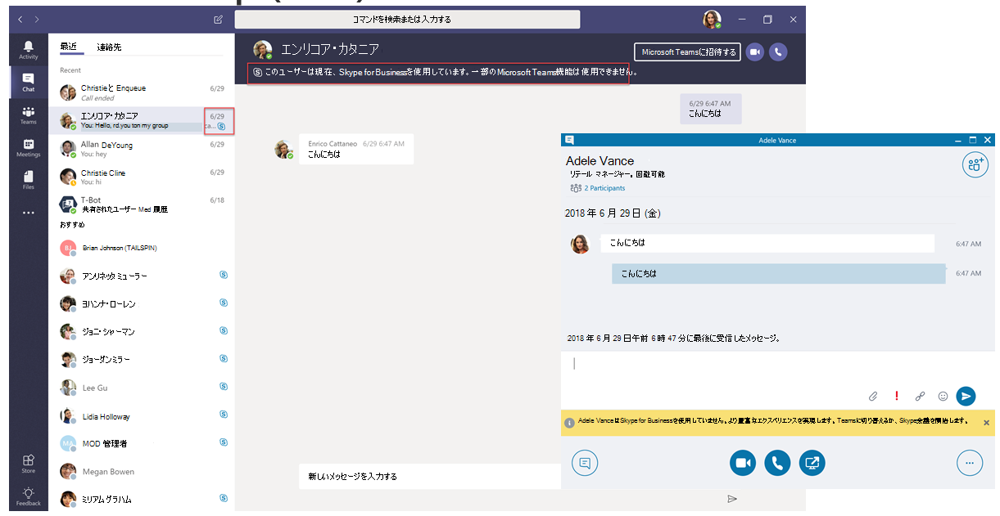

この資料では、プロジェクトの定義の段階アップグレード、旅の一部、活動を行う支援体制の構築とプロジェクト チームを作成して、プロジェクトのスコープ、目標、およびビジョンを定義します。 進む前に、次のアクティビティを完了したしたことを確認します。

-   [プロジェクトの利害関係者が参加しています。](upgrade-enlist-stakeholders.md)
-   [プロジェクト スコープの定義](https://aka.ms/SkypetoTeams-Scope)

# マイクロソフトのチームと Skype をビジネスの共存と相互運用性を理解します。

組織を使用して Skype ビジネスの現在と、ビジネスの Skype と共にチームの使用を開始する場合、チームへのアップグレードを開始するか、方法 2 つのアプリケーション、共存との相互運用方法と方法を理解することが重要にチームにビジネス用の Skype から、最終的なアップグレードに至るユーザーの移行を管理します。

> [!Tip]
> [共存と相互運用性](https://aka.ms/teams-upgrade-coexistence-interop)について学習するのには次のセッションを見る

## ビジネスのチームと Skype の共存

チームは、共同作業機能だけでなく、チャット、通話、および会議機能を提供します。 チームを配置するを選択する方法によってこれらの機能はユーザーごとに、ビジネスの Skype によって提供される機能と重複します。 業務用 Skype と共にチームを実行する既定のモードは、します。ただし、ユーザー指定できますこれらの機能は、そのユーザーの重なっていないことを確認するように設計されたいくつかの共存モードのいずれかです。

組織に適したパスを確認するために以下で説明する共存モードを確認することをお勧めします。

> [!Important]
> 新しいテクノロジーを導入することをまたは変更、既存の知識の Skype のビジネス環境では、優れた新しい業務上のメリットを提供しながらユーザーのシステムを停止できます。 ユーザーの対応を評価し、この資料に記載されている変更のいずれかを実装する前に、コミュニケーションとトレーニングの計画を実装するに時間がかかります。 さらに、強くお勧めするユーザーの選択したグループに、組織全体に実装する前に、計画を検証します。 

### アイランド モード

既定では、ユーザーは、チャット、通話、および会議などのようなと重複する機能を提供する 2 つの個別のソリューションとビジネスの Skype と共にチームを実行できます。 チームのユーザーもチームとチャネル、Office 365 内のファイルへのアクセス、およびアプリケーションなどのコラボレーション機能の利点がかかります。

**島**と呼ばれるこの共存モードでは、別の島としてクライアント アプリケーションの動作します。 Skype のビジネス、およびチームに問い合わせることによってビジネスの Skype は、チームに説明します。 ユーザーは、両方のクライアントを実行し、通信が開始されたクライアントでネイティブに通信できます。 次のように、**島**のモードでの相互運用性の必要性はありません。

> [!Tip]
> Skype のオンライン ビジネスのお客様の推奨されるパスでは、ドライブ採用の飽和状態の組織で、急速に**チームのみ**のモードに移動し、**島**の既定のモードで起動。 設置型およびハイブリッド型の場合がありますからメリットを採用する準備ができたら、組織の開始点ではなく島、そこから**チームのみ**のモードの進行状況と今後の**チームの共同作業によるビジネスの Skype**モードを展開します。チームです。 

### Skype ビジネスだけに

この共存モードでは、ユーザーはビジネス用の Skype に残る-チームではありません-チャット、会議、および呼び出し機能、および、チームおよびチャネルのためのチームを使用しないのです。 このモードは、今日利用可能ですただし、現在の実装では、チームの様相はないユーザーの自動的にオフにします。 この機能は、期限の迫っています。 間に、管理者は、Skype の唯一の通信アプリケーションとビジネスのために維持する必要があるすべてのユーザーのチームのライセンスを削除できます。

### チームにのみ (ロールバックを開始するこのモードは、夏 2018 をチェック アウトされ、2019 年にすべてのテナントを終了する)

組織の唯一のコミュニケーションとコラボレーションのツールとして、チームを使用する一部またはすべてのユーザーの準備ができたらとすぐに**チームのみ**のモードにそれらのユーザーをアップグレードできます。

**チームのみ**のユーザーは、既存の Skype ビジネス会議、またはアップグレードしていないユーザーや外部の関係者で編成されているビジネス用の Skype での会議に参加するのにビジネス クライアント用の Skype をのみ使用できます。 アップグレード済みのユーザーもを使用している Skype のビジネス業務のチームと Skype との間の相互運用性機能を使用して、組織内の他のユーザーとの通信を続行します。ただし、アップグレード済みのユーザーは、Skype のビジネス チャット、通話、または会議を開始できません。

### (このモードは、期限の迫っている) チームの共同作業によるビジネスの Skype

このモードを使用すると、ビジネスの Skype の既存の投資を活用しながらお客様の環境でチームを紹介します。 Skype チャット、通話、および会議の機能をそのままのビジネスのままにするこのモードで、チームの共同作業機能を追加して、Office 365、およびアプリケーション内のファイルへのアクセスをチームとのチャネル。 設置型およびハイブリッド型のビジネス サーバーのポイントの Skype を起動している組織は、島のモードではなくこのモードを使用する必要があります。

### (このモードは、期限の迫っている) チームの共同作業や会議でのビジネスのための Skype

この共存モードを使用して、優れた品質、議事録などの新機能を活用する、チームの共同作業機能だけでなく、組織内の機能、ユーザーの有効性を促進し、翻訳、およびブラウザーで会議をサポートします。

チームと、このモードでの会話のチャネル ベースのチームを使用するとは、ユーザーは、チームを使用してスケジュールを設定し、会議の開催を開始します。 プライベート チャット、音声とビデオ通話は、Skype のビジネスのままになります。 この共存モードでは、エンタープライズ ボイスは、チームにアップグレードするのには時間がかかる可能性があるが、優れたチームの会議から恩恵を受けたい、設置型展開でビジネスに Skype のユーザーの方が便利です。

> [!Note]
> 特定の共存モードで展開されると、チームやビジネス用の Skype できます[相互運用](#interoperability-of-teams-and-skype-for-business)とチャットして、他のユーザーを有効にして、通信が、チームへのアップグレードの旅の中に、組織全体で流体を維持することを確保します。 共存モードでは、相互運用性を制御します。 受信機の共存モードでは、相互運用性が利用するかどうかを決定します。 などの受信機が、チャットのみ使用可能な 1 つのクライアント (たとえば、チーム) のモードである場合は、チャットの相互運用性は一般にできるイニシエーターを使用して、他のクライアント (ここでは、ビジネスの Skype)、チャットを開始する場合に。 その一方で、受信機は、チャットで両方のクライアントで利用可能なモードでは、相互運用できませんチャットの-メッセージは、イニシエーターがチャットを開始する同じクライアントの受信機によって受信されることとします。

共存モード、前提条件、および管理に関する詳細については、[チームと、ビジネス用の Skype を使用する組織の移行と相互運用性](https://aka.ms/SkypeToTeams-Interop)と[の共存を設定し設定のアップグレード](https://aka.ms/SkypeToTeams-SetCoexistence)を参照してください。

|         |         |         |
|---------|---------|---------|
||判断ポイント|<ul><li>どの最適な共存モード」は、ユーザー、組織のニーズに合わせてでしょうか。</li></ul>|
||次のステップ|<ul><li>アップグレード、旅の最良の方法を選択します。</li></ul>|

## チームやビジネス用の Skype の相互運用性

相互運用性は、同じ組織内のビジネス ユーザーのチーム、およびビジネスのための Skype 経由で通信するためにチームと Skype の機能です。

### ネイティブの相互運用機能と相互運用機能のエスカレーション

相互運用機能のエクスペリエンスの 2 種類があります: ネイティブな相互運用機能とエスカレーションします。

-   _ネイティブの相互運用機能_のエクスペリエンスは、ユーザーが現在使用しているクライアントで発生します。 1 人のユーザーは、チームの他のビジネスのクライアントは、Skype になります。 ネイティブの相互運用機能の操作性になりますそれらを別のクライアントの通信、ユーザーが現在使用しているクライアントでの会話を行うことが可能になります。 ネイティブの相互運用機能のエクスペリエンスは、1 対 1 チャットを呼び出すとします。
-   _エスカレーションの相互運用機能_の操作性は、(自分のデスクトップを共有する) などの高度なアクションを実行するユーザーを支援の一環として、サービスが会議の作成を容易にするため、その会議での経験を継続を意味します。 アクションのイニシエーターのプラットフォームでは、会議が作成されます。 ユーザーまたはユーザーはそのプラットフォーム上で受信した会議の座標への参加し、(クライアントの切り替え) の後の会議に参加します。

### ネイティブの相互運用機能のエクスペリエンス

によっては (上述のようにユーザーに割り当てられている、共存モードでは、次のネイティブ相互運用の経験があります。

-   チームのユーザーと、その逆も Skype のビジネス ユーザーが 1 対 1 チャットすることができます。 相互運用機能、チャットでは、クラウド サービス (およびそのためのみ存在するオンライン) のチームの一部である相互運用機能のゲートウェイを経由する必要があります。 相互運用機能のチャットを使用してプレーン テキスト: リッチ テキストや絵文字がサポートされていません。 チームでユーザーに通知する会話は、相互運用機能の会話です。Skype のビジネス ユーザー向けのような通知がすぐに提供されます。

-   ビジネス ユーザーの Skype は、1 対 1 の音声と、チームのユーザーにビデオ通話を行うことができ、その逆です。

> [!Important]
> ビジネス用の Skype の設置型展開での相互運用機能の経験では、ビジネス向けの Office 365 Skype でハイブリッド モードで、オンプレミス環境である必要があります。 詳細については、[移行と相互運用性ガイド](https://aka.ms/SkypeToTeams-Interop)を参照してください。

これらの相互運用機能のエクスペリエンスは、して割り当てられている共存モードは次のいずれかを持つユーザーの間で利用可能な:**チームの共同作業によるビジネスの Skype**、**チームの共同作業や会議でのビジネス用の Skype**Skype の**のビジネスだけ**、または**チームのみ**です。 アイランド モードでユーザーには、相互運用性はありません。

### ネイティブの相互運用機能の制限事項

一部の機能は、相互運用機能のチャットおよびチームとビジネス用の Skype との間の相互運用機能呼び出し経験が。

-   値下げ、リッチ テキスト、および完全絵文字セットには、チームまたはビジネス用の Skype のいずれかがサポートされていません。 チーム チャットで作成する] ボックスの他のネイティブの機能はサポートされていません。
-   画面をチームとビジネス用の Skype との間の (デスクトップまたはアプリケーションの共有) の共有はサポートされていません。
-   チームでのグループ チャット (複数パーティ会話) では、チームを使用している参加者を含めることができますのみです。
-   ビジネス用の Skype の IM 会話 (グループ チャット) 複数のパーティでは、ビジネスの Skype を使用している参加者を含めることができますのみです。
-   エスカレーションする、継続的なピア ツー ピア音声またはビデオのビジネス ユーザーのチームと Skype の両方を含む複数のパーティの呼び出し呼び出しはサポートされていません。
-   ファイル転送の 2 つのパーティ チャット、またはグループのチャット、Skype のビジネスにチームからの添付ファイルをファイル、およびその逆の場合-はサポートされていません。
-   ビジネスの永続的なチャットの Skype では、相互運用性はありません。

これらすべての制限 (永続的なチャット) 以外では、1 つの考えられる回避策では、会議を開始し、それに参加する他のユーザーを招待するユーザーを 1 つ。 この回避策は、相互運用機能のエスカレーションの基盤です。

> [!Important]
> 呼び出しまたは特別なミーティングに簡単なチャット (IM) ことが非常に簡単にどのような起動します。 これらのシナリオでは、使いやすさとユーザーの操作性にとって重要な Skype ビジネスとチームのユーザーの間での相互運用機能のエクスペリエンスの進化している継続的に私たちを理解します。 最新の情報を確認してください。

この資料を確認した後については[、アップグレードの旅を選択して](upgrade-and-coexistence-of-skypeforbusiness-and-teams.md)[移行と相互運用性ガイド](https://aka.ms/SkypeToTeams-Interop)、 [Skype のビジネスとの共存](coexistence-chat-calls-presence.md)と[の共存を設定および設定をアップグレード](https://aka.ms/SkypeToTeams-SetCoexistence)の実装詳細です。
