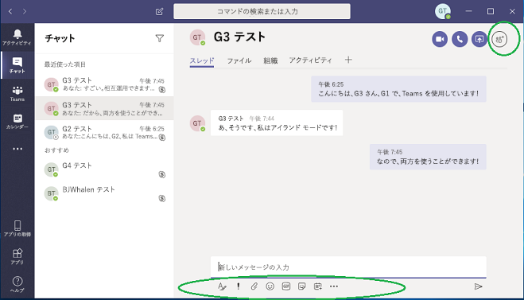
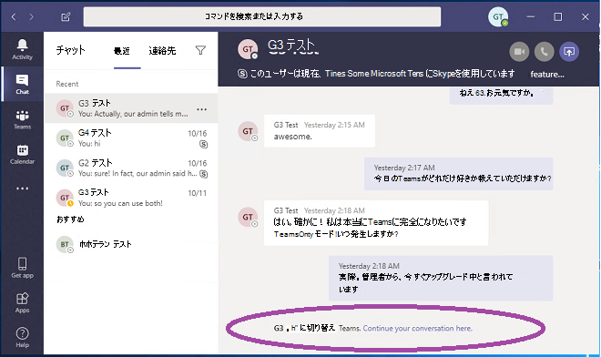

# Microsoft Teams と Skype for Business の共存と相互運用性を理解するUnderstand Microsoft Teams and Skype for Business coexistence and interoperability

この記事は、お客様のアップグレード行程の「プロジェクトの定義」段階の一部です。This article is part of the Project Definition stage of your upgrade journey. スポンサー連合とプロジェク チームを作成し、プロジェクトの適用範囲、目標、ビジョンを定義した後に実行します。Complete after you create a sponsorship coalition and project team and define the scope, goals, and plan for your project. 先に進む前に、次のアクティビティを完了していることを確認してください。Before proceeding, confirm that you've completed the following activities:

- [プロジェクトの関係者をリスト化したEnlisted your project stakeholders](upgrade-enlist-stakeholders.md)
- [プロジェクトの対象範囲を定義したDefined your project scope](./upgrade-define-project-scope.md)

現在 Skype for Business を使用中の組織で Skype for Business と Teams の併用を開始する場合、または Teams へのアップグレードを開始する場合は、これら 2 つのアプリケーションがどのように共存し、いつ、どのように相互運用するのか、Skype for Business から Teams へ最終的にアップグレードが完了するまでどのようにユーザーの移行を管理するかを理解することが重要です。If your organization uses Skype for Business today and you are starting to use Teams alongside Skype for Business—or you are starting to upgrade to Teams—it's important to understand how the two applications coexist, when and how they interoperate, and how to manage your users' migration all the way to their eventual upgrade from Skype for Business to Teams.

> [!Tip]
> [共存と相互運用性](https://aka.ms/teams-upgrade-coexistence-interop)の詳細を説明するセッションをご視聴ください。Watch the following session to learn about [Coexistence and Interoperability](https://aka.ms/teams-upgrade-coexistence-interop).
>
> アップグレードの計画と実施に役立つように作られたガイダンス、ベスト プラクティス、リソースを紹介する、インタラクティブなライブ ワークショップにもご参加いただけます。Additionally, you can join us for live, interactive workshops in which we'll share guidance, best practices, and resources designed to kick start upgrade planning and implementation.
>
> アップグレードを開始するには、最初に「[アップグレードの計画](./upgrade-workshops-landing-page.yml)」セッションにご参加ください。Join the [Plan your upgrade](./upgrade-workshops-landing-page.yml) session first to get started.

## Teams と Skype for Business の共存についての概要Coexistence of Teams and Skype for Business overview

次のセクションでは、Teams へのアップグレードを決定するときに使用できる共存モードと、各モードが提供する機能について説明します。The following sections describe the coexistence modes that are available when you decide to upgrades to Teams, and the capabilities each mode offers. さらに、Skype-for-Business クライアントのユーザーと Teams クライアントのユーザーの間で発生する相互運用性、および選択した共存モードによって相互運用性がどのように影響を受けるかについても説明します。In addition, we describe the interoperability (interop) that occurs between users on Skype-for-Business clients and users on Teams clients, and how interop is affected by the chosen coexistence mode.

 Teams では、共同作業の機能だけでなく、チャット、通話、会議の機能を提供しています。Teams delivers collaboration capabilities, chat, calling, and meeting capabilities. 選択する Teams の展開方法によっては、これらの機能が、特定のユーザーに対して Skype for Business で提供される機能と重複する場合があります。Depending on how you choose to deploy Teams, these capabilities might overlap with the capabilities delivered by Skype for Business for a given user. 既定のモードでは、Teams は Skype for Business と並列に、機能が重複して実行されます。The default mode is to run Teams alongside Skype for Business with the capabilities overlap. ただし、ユーザーにはいくつかある共存モード (アップグレード モードとも呼ばます) のいずれかを割り当てることができます。共存モードは、モードが割り当てられたユーザーに対して機能が重複しないよう作られており、その場合には Teams と Skype for Business の相互運用性を利用できます。However, a user can be assigned one of several coexistence modes (also known as upgrade modes) that were designed to ensure that these capabilities don't overlap for that user (in which case interoperability between Teams and Skype for Business is available). たとえば、複雑なエンタープライズ VoIP の展開と共に、多くの Skype for Business Server のオンプレミスの資産を持っているものの、ユーザーが最新の会議をできるだけ早く利用できるようにしたい場合には、代替パスとして [Meetings First](meetings-first.md) を評価することができます。For example, if you have significant Skype for Business Server on-premises assets with a complex Enterprise Voice deployment, but want your users to enjoy modern meetings as quickly as possible, you might want to evaluate [Meetings First](meetings-first.md) as an alternative path.

どのパスが組織に一番適しているかを判断するために、以下の共存モードを確認することをお勧めします。We recommend that you review the following coexistence modes to help determine which path is right for your organization.

> [!Important]
> 新たな優れたビジネス上のメリットを提供しつつ、新しいテクノロジを導入したり、既存の馴染みのある Skype for Business 環境を変更したりする場合、ユーザーが混乱する場合があります。Introducing new technology or making changes to your existing, familiar Skype for Business environment, while delivering great new business benefits, can be disruptive for users. この記事で説明する変更を実行する前に、時間をかけてユーザーの準備状況を評価し、コミュニケーションおよびトレーニングの計画を実施するようにしてください。Take time to assess user readiness and implement a communication and training plan before you implement any of the changes outlined in this article. また、計画は、組織全体に実装する前に、選択したユーザーのグループで実験運用することを強くお勧めします。In addition, we strongly encourage you to pilot your plan with a selected group of users before implementing it across your organization.

### アイランド モードIslands mode

既定では、ユーザーは、類似した重なり合う機能を提供する 2 つの別個のソリューションとして、Teams と Skype for Business を並列で実行できます。By default, users can run Teams alongside Skype for Business as two separate solutions that deliver similar and overlapping capabilities. プレゼンス、チャット、通話、会議などの機能を利用できます。The capabilities include presence, chat, calling, and meetings. Teams ユーザーは、チームとチャネル、Microsoft 365 または Office 365 のファイルへのアクセス、アプリケーションなどの新しい共同作業の機能を利用することもできます。Teams users also can take advantage of new collaboration capabilities such as teams and channels, access to files in Microsoft 365 or Office 365, and applications.

「**アイランド**」と呼ばれるこの共存モードでは、各クライアント アプリケーションが別個のアイランド (島) として動作します。In this coexistence mode, called **Islands**, each of the client applications operates as a separate island. Skype for Business は Skype for Business とやり取りし、Teams は Teams とやり取りします。Skype for Business talks to Skype for Business, and Teams talks to Teams. ユーザーは、両方のクライアントを常時実行することが想定されており、コミュニケーションを開始したクライアントでネイティブにコミュニケーションできます。Users are expected to run both clients at all times and can communicate natively in the client from which the communication was started. そのため、[**アイランド**] モードでは、相互運用性は必要ありません。As such, there's no need for interoperability in **Islands** mode.

Skype for Business が混乱したり、エクスペリエンスが低下したりしないように、Skype for Business は、Teams **Islands** モードで処理されない次の統合を処理します。To avoid a confusing or regressed Skype for Business experience, the Skype for Business handles the following integrations that aren't handled in Teams **Islands** mode:

- 外部 (フェデレーション) 通信。External (federated) communications.
- PSTN 音声サービスと音声アプリケーション、Office の統合。PSTN voice services and voice applications, Office integration.
- USB デバイスの HID コントロール。HID controls for USB devices.
- その他の統合。Several other integrations.  

電話システムは、 Teams の **Islands モード** でサポートされていません。Phone System isn't supported in Teams in **Islands** mode. **Island** モードは、Skype for Business のエンタープライズ ボイス クライアントをサポートしていません。**Islands** mode doesn't support Enterprise Voice client is Skype for Business.

> [!Important]
> [**アイランド**] モードでは、フェデレーション ユーザー (組織外のユーザー) からのすべてのメッセージと通話は、Skype for Business に配信されます。In **Islands** mode, all messages and calls from federated users (people outside your organization) are delivered to Skype for Business. [**Teams のみ**] モードにアップグレードすると、組織の外部からのすべてのメッセージと通話が Teams に配信されます。After upgrading to **Teams Only** mode, all messages and calls from outside your organization are delivered to Teams.

> [!Tip]
> Skype for Business Online を使用中のお客様の場合、最初は既定の [**アイランド**] モードを使用し、組織内で Teams の導入完了を図り、その後、迅速に [**Teams のみ**] モードに移行することをお勧めします。Skype for Business Online customers recommended path is to start with the default **Islands** mode, drive Teams adoption saturation in the organization, and then move to **Teams Only** mode rapidly. オンプレミスおよびハイブリッドのお客様は、その環境が複雑な場合は特に、出発点として [**アイランド**] モードではなく [**Skype for Business と Teams のコラボレーション**] モードを展開し、組織で Teams の導入準備が整い次第、(状況に応じて) [**Skype for Business と Teams のコラボレーションと会議**] モード (Meetings First のことです) および [**Teams のみ**] モードに進むという方法が有効な場合があります。On premises and hybrid customers, especially complex ones, might benefit from deploying the **Skype for Business with Teams Collaboration** mode as a starting point rather than **Islands** mode, and progress from there to **Skype for Business with Teams Collaboration and Meetings** mode (that is, Meetings First), if appropriate, and to **Teams Only** mode when the organization is ready to adopt Teams.

### Teams のみTeams Only

「**Teams のみ**」ユーザー (*アップグレード済み* ユーザーとも呼ばれます) は、Teams のすべての機能にアクセスできます。A **Teams Only** user (also called an *upgraded* user) has access to all the capabilities in Teams. これらのユーザーは、アップグレード済みではないユーザーや外部関係者によって開催される Skype for Business の会議に参加するために Skype for Business クライアントを残しておくことができます。They may retain the Skype for Business client to join meetings on Skype for Business that have been organized by non-upgraded users or external parties. アップグレード済みユーザーは、Skype for Business をまだ使用している組織内の他のユーザーと引き続きやり取りするために、(Skype for Business ユーザーが [**アイランド**] モードに設定されていない限り) Teams と Skype for Business との相互運用機能を使用することができます。An upgraded user can continue to communicate with other users in the organization who are still using Skype for Business by using the interoperability capabilities between Teams and Skype for Business (provided the Skype for Business users are not in **Islands** mode). ただし、アップグレードしたユーザーは、Skype for Business のチャット、通話、会議を開始することはできません。However, an upgraded user can't initiate a Skype for Business chat, call, or meeting.

一部またはすべてのユーザーが Teams を唯一のコミュニケーションおよびコラボレーション ツールとして使用する準備が組織ででき次第、それらのユーザーを [**Teams のみ**] モードにアップグレードしてください。As soon as your organization is ready for some or all users to use Teams as their only communications and collaboration tool, upgrade those users to **Teams Only** mode. [**アイランド**] モードからアップグレードする場合は、最初に Teams の導入を組織全体に行き渡らせてからアップグレード プロセスを開始することをお勧めします。If you're upgrading from **Islands** mode, we advise that you first saturate Teams adoption throughout your organization before beginning the upgrade process. この導入により、相互運用性が [**アイランド**] モードで提供されないことによるコミュニケーションの中断という事態を避けられます。This adoption avoids broken communication scenarios due to **Islands** mode not providing interoperability.

[**Teams のみ**] モードでは、Teams が SIP/Tel プロトコルの既定のアプリとなります。When in **Teams Only** mode, Teams is the default app for the SIP/Tel protocol. Outlook 内にある、通話またはチャットのためのユーザーの連絡先カード内のリンクは、Teams によって処理されます。Links in a user's contact card in Outlook for calling or chat will be handled by Teams.

[**Teams のみ**] モードへの移行に関するその他の考慮事項については、「[Teams のみモードの考慮事項](teams-only-mode-considerations.md)」を参照してください。For extra considerations about moving to **Teams Only** mode, see [Teams Only mode considerations](teams-only-mode-considerations.md).

### Skype for Business のみSkype for Business only

この共存モードでは、ユーザーはチャット、会議、通話を行うために Teams ではなく、引き続き Skype for Business を利用します。また、チームとチャネルには Teams を使用しません。In this coexistence mode, users remain in Skype for Business—not Teams—for chat, meeting, and calling capabilities, and they don't use Teams for teams and channels. このモードは現在使用できます。ただし、現在の実装では、チームとチャネルはユーザーに対して自動的にオフになりません。This mode is available today; however, in the current implementation, teams and channels are not automatically turned off for the user. これを行うには、アプリケーションの設定ポリシーを使用して、チームとファイルを非表示にします。This can be achieved by using the App Setup policy to hide teams and files.

このモードは、Teams の管理された展開を開始する前に使用することができます。これにより、ユーザーが準備完了に先行して Teams の使用を開始することを防ぐことができます。This mode can be used prior to starting a managed deployment of Teams to prevent users from starting to use Teams ahead of having built readiness. このモードは、Skype for Business ユーザーの Teams 会議での認証された参加を可能にする方法として、ユーザーが Teams のライセンスを持っている場合に使用できます。This mode is also a way to enable authenticated participation in Teams meetings for Skype for Business users, provided the users are licensed for Teams.

### Skype for Business と Teams のコラボレーションSkype for Business with Teams Collaboration

このモードを使用すると、Skype for Business の既存の投資を継続して利用しつつ、Teams を組織の環境に導入できます。Use this mode to introduce Teams in your environment while you continue to use your existing investment in Skype for Business. Skype for Business のチャット、通話、会議の機能については、変更しないままにしておきます。Leave Skype for Business unchanged for chat, calling, and meeting capabilities. Teams のコラボレーション機能の追加:Add Teams collaboration capabilities:

- チームとチャネルTeams and channels.
- Microsoft 365 または Office 365 のファイルにアクセスします。Access to files in Microsoft 365 or Office 365.
- アプリケーション。Applications. Teams のコミュニケーション機能 (プライベート チャット、通話、会議のスケジュールなど)。Teams communications capabilities—private chat, calling, and scheduling meetings.

このモードでは、Teams のプライベート チャット、通話、会議のスケジュールは、既定ではオフになります。Teams private chat, calling, and scheduling meetings are off by default in this mode.

オンプレミスまたはハイブリッドの Skype for Business Server を開始点とする組織は、コミュニケーションの相互運用性と予測可能性をユーザーに提供する場合、または ([**アイランド**] モードでの導入の浸透に頼る代わりに) ユーザーの Teams へのアップグレードを予測可能なタイムラインに沿って行う場合は、このモードを [**アイランド**] モードの代わりに使用することを検討してください。Organizations with a starting point of Skype for Business Server on premises or hybrid should consider this mode as an alternative to **Islands** mode if they want to give their users interoperability and predictability for their communications, as well as having a predictable timeline for their upgrade to Teams (as opposed to relying on adoption saturation in **Islands** mode).

### Skype for Business と Teams のコラボレーションと会議 (Meetings First とも呼ばれます)Skype for Business with Teams Collaboration and Meetings, also known as Meetings First

この共存モードを使用すると、組織で Teams 会議とコラボレーション機能を迅速に利用できます。Use this coexistence mode to accelerate the availability of Teams meeting and collaboration capabilities in your organization. 共存モードにより、ユーザーは優れた Teams 会議環境を体感できます。The coexistence mode lets your users take advantage of the superior Teams meetings experience:

- 優れた品質。Great quality.
- 文字起こしと翻訳。Transcription and translation.
- 背景がぼやけて表示される。Background blurring.
- モバイル デバイスやブラウザーを含むすべてのプラットフォームで優れたユーザー エクスペリエンスを提供します。Superior user experience across all platforms, including mobile devices and browsers.

このモードでは、Teams はチームやチャネル ベースの会話に使用される他、ユーザーが会議のスケジュールを設定して実施するのにも Teams が使用されます。Along with using Teams for teams and channels–based conversations in this mode, users will use Teams to schedule and conduct their meetings. プライベート チャットと通話は引き続き Skype for Business で行います。Private chat and calling remain on Skype for Business. Teams と Skype for Business は広範な "連携により強化される" 機能の恩恵を受けます。たとえば、プレゼンス調整、自動保留/保留解除、両方のアプリケーションにおける HID デバイスのサポートなどです。Teams and Skype for Business benefit from a range of "better together" capabilities, such as presence reconciliation, automatic hold/unhold, and HID device support across both applications. 必要な場合は、アプリのセットアップ ポリシーを使用して、チームとチャネルを非表示にすることができます。It's possible to hide teams and channels, if desired, using the App Setup policy.

この共存モードは、エンタープライズ ボイスを使用して Skype for Business をオンプレミスに展開している組織において特に適しています。This coexistence mode is especially useful for organizations with Skype for Business on-premises deployments with Enterprise Voice. このような組織では多くの場合、Teams へのアップグレードに時間を要し、より優れた Teams の会議をできるだけ早く活用したいと望んでいるためです。These organizations are likely to take some time to upgrade to Teams and want to benefit from the superior Teams meetings as soon as possible.

> [!TIP]
> Skype for Business の使用が継続している場合に、 Teams で有効にしたい機能に基づき推奨されるアップグレード モードを特定するには、[Skype から Teams へのアップグレード ウィザード](https://aka.ms/SkypeToTeamsWizard)を使用します。To help identify the recommended upgrade mode based on the capabilities you want to enable in Teams while Skype for Business is still in use, leverage the [Skype to Teams Upgrade Wizard](https://aka.ms/SkypeToTeamsWizard).

共存モード、前提条件、および管理の詳細については、「[Teams を Skype for Business と併用する組織向けの移行と相互運用に関するガイダンス](./migration-interop-guidance-for-teams-with-skype.md)」および「[共存およびアップグレードを設定する](./setting-your-coexistence-and-upgrade-settings.md)」を参照してください。For more information about coexistence modes, prerequisites, and management, see [Migration and interoperability guidance for organizations using Teams together with Skype for Business](./migration-interop-guidance-for-teams-with-skype.md) and [Setting your coexistence and upgrade settings](./setting-your-coexistence-and-upgrade-settings.md).

|判断ポイント アイコン。Decision point icon |アイコンの定義Icon definition |説明Description |
|---|---|---|
||判断ポイントDecision point|<ul><li>組織とユーザーのニーズに最適な共存モードを特定する。Which coexistence mode(s) best fit your organization's and users' needs?</li></ul>|
||次の手順Next step|<ul><li>アップグレード行程での最適なアプローチを選択する。Choose the best approach for your upgrade journey.</li></ul>|

### Teams と Skype for Business の相互運用性Interoperability of Teams and Skype for Business

相互運用とは、同じ組織内の Teams ユーザーと Skype for Business ユーザーが Teams と Skype for Business の間で通信できるようにする機能です。Interoperability is the ability for Teams and Skype for Business users in the same organization to communicate across Teams and Skype for Business.

相互運用は、受信者の共存モード (アップグレード モードとも呼ばれます) によって制御されます。Interoperability is governed by the coexistence mode (also known as upgrade mode) of the receiver. 受信者が [**アイランド**] モードの場合、相互運用性はありません。There is no interoperability when the receiver is in **Islands** mode.

> [!Note]
> [**アイランド**] 以外のいずれかの共存モードで展開すると、Teams と Skype for Business では [相互運用](#interoperability-of-teams-and-skype-for-business)が可能になります。これにより、アプリ間でのユーザー同士のチャットや通話がサポートされ、Teams へのアップグレードの行程期間中、円滑なコミュニケーションを組織全体で維持できます。When deployed in any coexistence mode except **Islands**, Teams and Skype for Business can [interoperate](#interoperability-of-teams-and-skype-for-business), enabling users to chat with and call one another, and ensuring that communications remain fluid across your organization during your upgrade journey to Teams. 相互運用性は、共存モードにより制御されます。Coexistence modes govern interoperability. 受信者の共存モードにより、相互運用性を利用できるかどうかが決まります。The coexistence mode of the receiver determines whether interoperability will be available. たとえば、受信者のモードが、チャットを 1 つのクライアントでのみ使用できるモード (Teams であるとします) である場合、発信者が別のクライアント (この場合は、Skype for Business) を使用してチャットを開始した場合に、チャットの相互運用性を利用できます。For example, if the receiver is in a mode in which chat is only available in one client (say, Teams), chat interoperability will generally be available in case the initiator uses the other client (in this case, Skype for Business) to start the chat. 一方、受信者のモードが、両方のクライアントでチャットが可能なモード ([アイランド] モード) の場合、チャットで相互運用性を利用できません。On the other hand, if the receiver is in the mode in which chat is available in both clients (Islands mode), interoperability won't be available for the chat. 受信者がメッセージを受信する際は、発信者がチャットを開始した際に使用したものと同じクライアントを使用して受信されます。The message will be received by the receiver in the same client in which the initiator started the chat. したがって、[**アイランド**] モードでコミュニケーションを正常に行うには、Teams の導入が行き渡っている必要があります。つまり、すべてのユーザーが、両方のクライアントをアクティブに使用して監視している状態です。Therefore, proper communication in **Islands** mode requires Teams adoption saturation; that is, all users actively using and monitoring both clients.

> [!Note]
> **最新の共存エクスペリエンスを体験するには、クライアント バージョンがユーザーの Office 展開チャネルで利用可能な最新のクライアントである必要があります。****To have the latest coexistence experience, the client version must be the latest available client in the user’s Office deployment channel.**

#### ネイティブ相互運用と相互運用エスカレーションNative interop and interop escalation

相互運用エクスペリエンスには、ネイティブ相互運用と相互運用エスカレーションの 2 種類があります。There are two types of interop experiences: native and interop escalation.

- _ネイティブ相互運用_ は、ユーザーがその時点で使用しているクライアントにおいて実行されます。A _native interop_ experience occurs in the client that the user is currently using. 1 人のユーザーが Skype for Business クライアント内に存在し、もう 1 人は Teams 内にいる場合です。One user will be in the Skype for Business client, the other in Teams. ネイティブの相互運用機能では、通信のために別のクライアントに移動することはありません。A native interop experience won't take them to another client to communicate. ユーザーは現在使用しているクライアントで会話を行えるようになります。The users will be able to conduct their conversation in the client they're currently using. ネイティブ相互運用エクスペリエンスは、1 対 1 のチャットと通話です。The native interop experiences are one-to-one chat and calling.
- _相互運用エスカレーション_ エクスペリエンスでは、ユーザー行う高度な操作 (デスクトップの共有など) のサポートの一環として、クライアントでの会議の作成が容易になります。ユーザーはこの会議に参加して、相互運用エスカレーション エクスペリエンスを会議内で継続させられます。An _interop escalation_ experience means that as part of helping users perform an advanced action (such as sharing their desktop), the client facilitates the creation of a meeting which users can join to continue the experience in that meeting. 会議は、操作を開始したユーザーのプラットフォームに作成されます。The meeting is created on the platform of the initiator of the action. そのプラットフォーム上にいないユーザーには、会議参加のリンクが送られます。The user or users who aren't on that platform receive a meeting join link. このリンクをクリックすると、互換性のあるクライアント (構成に基づいて、ブラウザー、Web アプリ、フル クライアントのいずれか) で会議に参加できます。As they click this link, they are joined to the meeting in a compatible client (browser, web app, or full client, depending on configuration). Skype for Business からの相互運用エスカレーションには、最新のクライアントが必要です。Interop escalation from Skype for Business requires a recent client. Teams から相互運用エスカレーションを利用できるようになりました。Interop escalation from Teams is now available. いずれのエスカレーションも、テナント内の相互運用エクスペリエンス、およびテナント間のフェデレーション コミュニケーションでサポートされます。Both are supported in interoperability experiences in-tenant, and for federated communication cross-tenants.

#### ネイティブ相互運用エクスペリエンスNative interop experiences

前述のように、ユーザーに割り当てられている共存モードに基づいて、以下のネイティブ相互運用エクスペリエンスを使用できます。Depending on the coexistence modes assigned to users (as previously described), the following native interop experiences are available:

Skype for Business ユーザーと Teams ユーザーは 1 対 1 のチャットを行えます。Skype for Business users can chat one-on-one with Teams users, and vice versa. 相互運用チャットは、Teams クラウド サービスの一部である (つまり、オンラインでのみ存在する) 相互運用ゲートウェイを経由する必要があります。An interop chat needs to go through an interop gateway that's part of Teams cloud services (and therefore only exists online). 相互運用チャットはプレーン テキストです。リッチ テキストと絵文字はサポートされていません。Interop chats are plain text: rich text and emoticons aren't supported. Teams と Skype for Business のユーザーには、相互運用による会話であることが通知されます。Users in Teams and in Skype for Business are notified that the conversation is an interop conversation.

<!---->

Skype for Business ユーザーは、Teams ユーザーとの 1 対 1 の音声通話とビデオ通話を行えます。Teams ユーザーも同じことが行えます。Skype for Business users can make one-on-one voice and video calls to Teams users, and Teams users can do the same.

<!---->

> [!Important]
> オンプレミス展開の Skype for Business を使用する相互運用エクスペリエンスでは、対象のオンプレミス展開が Microsoft 365 または Office 365 Skype for Business のハイブリッド モードである必要があります。Interop experiences with an on-premises deployment of Skype for Business require that the on-premises environment is in hybrid mode with Microsoft 365 or Office 365 Skype for Business. 詳細については、「[移行と相互運用に関するガイドライン](./migration-interop-guidance-for-teams-with-skype.md)」を参照してください。For details, see [Migration and interoperability guidance](./migration-interop-guidance-for-teams-with-skype.md).

これらの相互運用エクスペリエンスは、[**Skype for Business と Teams のコラボレーション**]、[**Skype for Business と Teams のコラボレーションと会議**]、[**Skype for Business Only のみ**]、および [**Teams のみ**] の共存モードが割り当てられているユーザーが利用でき、これらのユーザー間で使用できます。These interop experiences are available to and between users who have one of the following coexistence modes assigned: **Skype for Business with Teams Collaboration**, **Skype for Business with Teams Collaboration and meetings**, **Skype for Business Only**, or **Teams Only**. [**アイランド**] モードのユーザーの場合、相互運用性はありません。There is no interoperability to users in **Islands** mode.

#### ネイティブ相互運用エクスペリエンスの制限事項Native interop experience limitations

プロトコルやテクノロジの違いにより、すべての機能をネイティブにサポートすることはできません。Because of the difference in protocols and technology, it is not possible to support all capabilities natively. 具体的には、次の機能は使用できません。Specifically, the following capabilities are not available:

- マークダウン、リッチ テキスト、絵文字の完全なセットは Teams と Skype for Business のどちらからもサポートされていません。Markdown, rich text, and the full emoticon set aren't supported either from Teams or Skype for Business. Teams チャットの作成ボックスの他のネイティブ機能はサポートされていません。Other native features of the compose box in Teams chats aren't supported.
- Teams と Skype for Business 間の画面共有 (デスクトップやアプリの共有) は、ネイティブでサポートされていません。Screen sharing (desktop or app sharing) between Teams and Skype for Business isn't supported natively. ただし、相互運用エスカレーションを使用する場合にはサポートされます。However, it is supported through interop escalation.
- Teams のグループ チャット (複数による会話) には、Teams を使用している参加者のみが加わることができます。Group chats (multiple-party conversations) in Teams can only include participants who are using Teams.
- Skype for Business の複数による IM 会話 (グループ チャット) には、Skype for Business を使用している参加者のみが加わることができます。Multiple-party IM conversations (group chats) in Skype for Business can only include participants who are using Skype for Business. ただし、Skype for Business からは複数での会話に相互運用エスカレーションを利用できます。However, interop escalation to multiple-party is available from Skype for Business.
- Teams と Skype for Business の両方のユーザーが関係する、その時点で行われているピアツーピアの音声通話またはビデオ通話から複数通話にエスカレーションする操作はサポートされていません。Escalating an ongoing peer-to-peer voice or video call to a multiple-party call involving both Teams and Skype for Business users isn't supported.
- Teams と Skype for Business 間における 2 者間チャットのファイル転送、またはグループ チャットのファイル添付はサポートされていません。File transfer for two-party chats, or file attachment in group chats, from Teams to Skype for Business—and vice versa—aren't supported.
- Skype for Business 常設チャットには相互運用性はありません。There is no interoperability with Skype for Business Persistent Chat.

(常設チャットを除く) これらすべての制限事項に関しては、考えられる 1 つの回避策として、1 人のユーザーが会議を開始し、それに参加するよう他のユーザーを招待するという方法があります。For all these limitations (except for Persistent Chat), one possible workaround is for one user to start a meeting and invite the other user to join it.

この回避策が、相互運用エスカレーションの基礎となっています。This workaround is the basis for interop escalation. 特に、画面の共有および複数ユーザーへのエスカレーションはネイティブには実行できませんが、相互運用エスカレーションによってサポートされています。In particular, screen sharing and escalation to multiparty are not achievable natively but they are supported via interop escalation.

#### 相互運用エスカレーション エクスペリエンスInterop escalation experiences

相互運用エスカレーションは、ネイティブ相互運用機能を、会議への管理されたエスカレーションを使用して補完したものです。Interop escalation consists in supplementing the native interop capabilities with managed escalations to meetings. 会議では、ユーザーが所有しているクライアントに関係なく、だれもが豊富な機能を利用できます。Meetings offer rich experiences available to anyone, regardless of which client they have.

Teams ユーザーにより相互運用エスカレーションがトリガーされると、Teams 会議が作成されます。When interop escalation is triggered by the Teams user, a Teams meeting is created. それをトリガーしたのが Skype for Business ユーザーであった場合は、Skype for Business 会議が作成されます。When it is triggered by the Skype for Business user, a Skype for Business meeting is created. いずれの場合も、作成される会議は [**今すぐ会議**] の会議となり、これはユーザーの予定表には反映されません。In both cases, the meeting created is a **Meet now** meeting, which is not reflected on the user's calendar.

相手のユーザーは、相互運用チャットで会議参加リンクを受け取り、そのリンクをクリックすると参加できます。The other party receives the meeting join link through interop chat and joins by clicking that link. Skype for Business ユーザーが Teams アカウントを持っていて Teams ユーザーによって招待されると、認証された状態で会議に参加します。If the Skype for Business user has a Teams account and is invited by the Teams user, they will join the meeting authenticated. それ以外の場合は、匿名の参加者として参加します。Otherwise, they will join as an anonymous participant. 反対に、ほとんどの Teams ユーザーには必ず Skype for Business アカウントと、Skype for Business 会議に認証された参加者として使用できる Skype for Business クライアントがありますが、Skype 会議アプリを使用する場合など匿名の参加者として参加することもできます。Conversely, Teams users almost always have a Skype for Business account and a Skype for Business client they can use to join a Skype for Business meeting as an authenticated participant, but they might also join as an anonymous participant, for example using the Skype Meeting App.

会議に参加したユーザーは、デスクトップやコンテンツの共有、ファイルの共有や転送、他の参加者の追加など、会議でサポートされるすべてのアクティビティを実行できます。Once the parties have joined the meeting, they can conduct any activity supported in meetings, such as desktop or content sharing, file sharing or transfer, adding other participants, and so on.

#### Skype for Business からの相互運用エスカレーションInterop escalation from Skype for Business

Skype for Business からの相互運用と相互運用エスカレーションは、月次 C2R の 2019 年 7 月ビルドで更新されました。Interop and interop escalation from Skype for Business was updated in the July 2019 build of monthly C2R. 以前は、Skype for Business では、リモート ユーザーが Teams を使用していることを事前に認識できませんでした。Previously, Skype for Business did not have advance awareness that the remote party was using Teams. セッションが確立された後に受信した信号に基づいて推測されるだけでした。It only surmised that from the signaling received after a session was established.

応答が相互運用ゲートウェイから来たこと、またはゲートウェイを経由したことを信号が示している場合、そのユーザーが Skype for Business を使用していないことを示す黄色の ビジネス バー (バナー) が表示されます。When the signaling indicated that the response came from (or through) the interop gateway, it would display the yellow business bar (banner) indicating the other party was not using Skype for Business. サービスの進化に伴い、実際の **Teams のみ** ユーザーに接続したときではなく、クラウド ボイスメール サービスや他のクラウド ボイス サービスに接続した場合にこのビジネス バーが Skype for Business ユーザーに表示されるようになり、誤検知が発生していました。With the evolution of our service, this resulted in false positives where Skype for Business users would see the business bar when they were connected to the Cloud Voicemail Service or other cloud voice services, rather than to an actual **Teams Only** user.

こうした誤検知を防ぐために、プレゼンス サービスでは、相手のユーザーが実際に **Teams のみ** ユーザーである場合に Skype for Business クライアントに通知するようになりました。To prevent these false positives, the presence service is now informing the Skype for Business client when the other party is a **Teams Only** actual user. これにより、会話ウィンドウが作成されてしまう前に相互運用会話および相互運用専用の会話ウィンドウを作成する必要があることを Skype for Business に認識させられます。This allows Skype for Business to be aware that it needs to create an interop conversation ahead of it having been created, and the conversation window to be specific to interop.

Skype for Business ユーザーがデスクトップを共有しようとすると、会議が始まることが通知され、手順が案内されます。If the Skype for Business user wants to share their desktop for example, they are informed that we will start a meeting and guided through the steps.

それと同時に、Teams ユーザーには会議へのリンクが含まれたチャット メッセージが届き、参加するためのガイドが示されます。Meanwhile, the Teams user receives an incoming chat message with the link to the meeting and are guided to join.

Skype for Business 会議へのこのエスカレーションは、テナント内の相互運用と、テナント間のフェデレーション通話とチャットで利用できます。This escalation to a Skype for Business meeting is available for both in-tenant interop and cross-tenant federated calls and chats. これは既定で有効になっており、管理者がプロビジョニングする必要のある設定はありません。It is on by default and there is no setting the admin has to provision.

#### Teams からの相互運用エスカレーションInterop escalation from Teams

Teams から Teams 会議への相互運用エスカレーションが、Skype for Business ユーザーとのテナント内相互運用スレッドにある、またはテナント間相互運用フェデレーション スレッドにあるデスクトップ共有ボタンを Teams ユーザーが選択すると利用できるようになりました。Interop escalation from Teams to a Teams meeting is now available when the Teams user selects the desktop sharing button in an in-tenant interop thread with a Skype for Business user or in a cross-tenant interop federation thread. 相互運用エスカレーションは、1 対 1 のチャット会話または 1 対 1 の通話でサポートされています。Interop escalation is supported from a 1:1 chat conversation or from a 1:1 call.

この機能は、Windows 用の Teams デスクトップ クライアント、Mac 用の Teams デスクトップ クライアント、コンテンツ共有がサポートされているブラウザー上の Teams Web クライアントでサポートされています。すべてのバージョンの Skype for Business クライアントと通信できます。The capability is supported in the Teams desktop client for Windows, in the Teams desktop client for Mac, and in the Teams web client on browsers where content sharing is supported, while in communication with any Skype for Business client version.

相互運用スレッドとフェデレーション相互運用スレッドで、Teams ユーザーにコンテンツ共有を開始するためのコントロール (ボタン) が表示されるようになりました。In interoperability threads, and in federation interoperability threads, the Teams user now has the controls (button) to start content sharing. Teams ユーザーがこのボタンを選択すると、コンテンツ共有や、Teams 会議を開始する必要があることを知らせる追加メニューが表示されます。When the Teams user selects the button, they are presented with an additional menu that informs them that to share content, they will need to start a Teams meeting.

ユーザーが通話中の場合は、Teams と Skype for Business 間で行われている現在の通話が、Teams 会議に参加すると終了することも警告されます。If the users were in a call, the menu also warns them that their current call between Teams and Skype for Business will be terminated as they are put into a Teams meeting. 選択した場合は、承諾前に Skype for Business ユーザーに警告できます。If they choose, they can warn the Skype for Business user prior to accepting.

承諾すると、Teams 会議に参加できます。会議の共有トレイから共有を開始する必要があります。Upon acceptance, they are put in the Teams meeting; they must start sharing from the sharing tray in the meeting.

一方、Skype for Business ユーザーは、会議へのリンクを含む着信チャット メッセージを受信し、参加するためのガイドが示されます。Meanwhile, the Skype for Business user receives an incoming chat message with the link to the meeting and are guided to join.

Teams 会議へのこのエスカレーションは、テナント内の相互運用と、テナント間のフェデレーション通話とチャットで利用できます。This escalation to a Teams meeting is available for both in-tenant interop and cross-tenant federated calls and chats. これは既定で有効になっており、管理者がプロビジョニングする必要のある設定はありません。It is on by default and there is no setting the admin has to provision. ただし、管理者が ``CsTeamsMeetingPolicy`` の ``-AllowPrivateMeetNow`` を ``$false`` に設定すると、ユーザーに対して無効になります。However, it is turned off for the user if the admin sets ``-AllowPrivateMeetNow`` in ``CsTeamsMeetingPolicy`` to ``$false``.

この記事の内容を確認し終わったら、実装の詳細について、「[アップグレードの行程を選択する](upgrade-and-coexistence-of-skypeforbusiness-and-teams.md)」、「[移行と相互運用に関するガイドライン](./migration-interop-guidance-for-teams-with-skype.md)」、「[Skype for Business と共存する](coexistence-chat-calls-presence.md)」、および「[共存およびアップグレードを設定する](./setting-your-coexistence-and-upgrade-settings.md)」を参照してください。After you review this article, see [Choose your upgrade journey](upgrade-and-coexistence-of-skypeforbusiness-and-teams.md), [Migration and interoperability guidance](./migration-interop-guidance-for-teams-with-skype.md), [Coexistence with Skype for Business](coexistence-chat-calls-presence.md), and [Setting your coexistence and upgrade settings](./setting-your-coexistence-and-upgrade-settings.md) for implementation details. 次のビデオもお勧めします: [ビデオ: SfB と Teams 間の共存と相互運用性を管理する](https://www.youtube.com/watch?v=wEc9u4S3GIA&list=PLaSOUojkSiGnKuE30ckcjnDVkMNqDv0Vl&index=11)We also recommend the following video: [Video: Manage Coexistence and Interoperability between SfB and Teams](https://www.youtube.com/watch?v=wEc9u4S3GIA&list=PLaSOUojkSiGnKuE30ckcjnDVkMNqDv0Vl&index=11)

## Teams と Skype for Business の共存に関する技術的詳細Technical details of Teams and Skype for Business coexistence

続くセクションでは、使用するモードやアップグレード方式にかかわらず、Teams と Skype for Business の両方のクライアントを同じ組織内で実行する場合に経験する可能性のある動作をまとめて説明します。The following sections summarize behavior that may be experienced when running both Teams and Skype for Business clients in the same organization, regardless of what mode and what upgrade method is used:

- [会議Meetings](#meetings)
- [相互運用性Interoperability](#interoperability)
- [相互運用とネイティブのスレッドInterop versus native conversation threads](#interop-versus-native-conversation-threads)
- [プレゼンスPresence](#presence)
- [フェデレーションFederation](#federation)
- [連絡先Contacts](#contacts)

### 会議Meetings

モードに関係なく、ユーザーは、Skype for Business であれ Teams であれ、招待されたすべての種類の会議にいつでも参加できます。Regardless of their mode, users can always join any type of meeting they are invited to, whether it is Skype for Business or Teams.  ただし、ユーザーは、会議の種類に合った対応するクライアントを使用してその会議に参加する必要があります。However, users must join the meeting with a corresponding client that matches the meeting type:

- 会議が Teams 会議の場合、参加者全員 (TeamsOnly、アイランド、Skype for Business のいずれのユーザーであっても) が、Teams クライアントを使用して会議に参加します。If the meeting is a Teams meeting, all participants (whether they are TeamsOnly, Islands, or Skype for Business users) use the Teams client to join the meeting. Teams がインストールされていない場合、そのユーザーが会議に参加しようとすると、Web に移動されます。If Teams is not installed, the user will be directed to the web, upon attempting to join a meeting.

- 会議が Skype for Business 会議の場合、参加者全員 (TeamsOnly、アイランド、Skype for Business のいずれのユーザーであっても) が、Skype for Business クライアントを使用して会議に参加します。If the meeting is a Skype for Business meeting, all participants (whether they are TeamsOnly, Islands, or Skype for Business users) use the Skype for Business client to join the meeting. Skype for Business クライアントがインストールされていない場合、そのユーザーは、Skype 会議アプリ経由で参加できるように Web に移動されます。If the Skype for Business client is not installed, the user will be directed to the web to join via the Skype Meeting App.

会議を開催する場合、スケジュールされる会議の種類は、次の表に示すように開催者のモードに基づいて決定されます。When organizing meetings, the meeting type that gets scheduled is based on the mode of the organizer, as shown in the following table:

| 開催者のモードMode of organizer    |      動作Behavior |
| :------------------ | :---------------- |
| TeamsOnly、SfbWithTeamsCollabAndMeetingsTeamsOnly, SfbWithTeamsCollabAndMeetings |    すべての会議が Teams でスケジュールされます。All meetings scheduled in Teams. Skype for Business アドインは Outlook では使用できません。Skype for Business add-in is not available in Outlook. | 
| SfbWithTeamsCollab、SfbOnlySfbWithTeamsCollab, SfbOnly   | すべての会議が Skype for Business でスケジュールされます。All meetings scheduled in Skype for Business. Teams アドインは Outlook では使用できません。Teams add-in is not available in Outlook. | 
| アイランドIslands | 既定では、会議は Skype for Business でも Teams でもスケジュールできます。By default, meetings can be scheduled in either Skype for Business or Teams. 両方のアドインを Outlook で使用できます。Both add-ins are available in Outlook. ただし、オプションで、PreferredMeetingProviderForIslandsMode = Teams を使用して TeamsMeetingPolicy のインスタンスを割り当てることにより、アイランドのユーザーが常に Teams で会議をスケジュールするように要求できます。However, you can optionally require that users in Islands always schedule meetings in Teams by assigning them an instance of TeamsMeetingPolicy with the PreferredMeetingProviderForIslandsMode=Teams.| 

### 相互運用性Interoperability

上記の [Teams と Skype for Business の相互運用性](#interoperability-of-teams-and-skype-for-business)で説明したように、Teams は特定のシナリオで Skype fo rBusiness との相互運用をサポートします。As described above in [Interoperability of Teams and Skype for Business](#interoperability-of-teams-and-skype-for-business), Teams supports interop with Skype for Business in certain scenarios. 相互運用通信とは、Skype for Business ユーザーと Teams ユーザーとの間のチャットや通話を意味しています。Interop communication refers to a chat or call between a Skype for Business user and a Teams user.  相互運用通信は、2 人のユーザー間でのみ可能です。マルチパーティ チャットや通信、別のユーザーを追加することはサポートされていません。Interop communication is only possible between two users; multi-party chat/calling or adding additional users is not supported.

2 人のユーザー間での相互運用チャットや通信は、次の各条件が満たされている場合に作成されます。An interop chat or call between two users is created when each of the following are true:

- 一方のユーザーは Teams を使用し、他方のユーザーは Skype for Business を使用している。One user is using Teams and the other is using Skype for Business.

- どちらも同じ組織内のユーザーである場合は、最初の通信の受信者のモードがアイランドではない (アイランド モードの場合、通信は同一のクライアントに配信される)。The mode of the recipient of the initial communication is NOT Islands (otherwise the communication would land in the same client) if both users are in the same organization. フェデレーション シナリオの場合、送信側のユーザーは Teams を使用しており、受信者は TeamsOnly モードではない。In federated scenarios, the sending user is using Teams, and the recipient is not in TeamsOnly mode. 

- Teams ユーザーは、オンプレミスに所属している Skype for Business アカウントも所有してはいない。The Teams user does NOT also have a Skype for Business account homed on-premises.

相互運用通信では、チャットはプレーンテキストのみです。Within the interop communication, chat is plain-text only. また、*相互運用チャット自体* では、ファイル共有や画面共有は行えません。In addition, file sharing and screen sharing are not possible *in the interop chat itself*. ただし、次のようにして相互運用チャット内からオンデマンド会議を作成することにより、相互運用会話中のユーザーは簡単にファイル共有や画面共有を実現できます。However, users in an interop conversation can easily achieve file and/or screen sharing by creating an on-demand meeting, from within the interop chat, as described below:

- Teams ユーザーが画面を共有しようとすると、オンデマンドの Teams 会議が自動的に作成され、Skype for Business ユーザーのクライアントにその会議への招待リンクが送信されます。If the Teams user attempts to share their screen, an on-demand Teams meeting is automatically created and an invite link to that meeting is sent to the Skype for Business user’s client. リンクをクリックすると、Skype for Business ユーザーの Teams が開き、会議に参加できます。Upon clicking the link, the Skype for Business user will open Teams and join the meeting. これで、両方のユーザーが Teams 会議に参加する形になり、必要に応じて共有を行なえます。Both users are now in a Teams meeting and can share as needed.

- Skype for Business ユーザーが 2018 以降のクライアントを使用していて、任意のコンテンツを共有しようとすると、オンデマンドの Skype for Business 会議が自動的に作成され、Teams ユーザーのクライアントにその会議への招待リンクが送信されます。If the Skype for Business user is using a client from 2018 or later and attempts to share any content, an on-demand Skype for Business meeting is automatically created and an invite link to that meeting is sent to the Teams user’s client. リンクをクリックすると、Teams ユーザーがその Skype for Business 会議に参加するための試行が実行されます。Upon clicking the link, the Teams user will attempt to join the Skype for Business meeting. その Teams ユーザーが Skype for Business クライアントをインストール済みの場合は、そのクライアントが開き、ユーザーはログインするように求められます (ログインしていない場合)。If the Teams user has the Skype for Business client installed, it will open and the user is prompted to sign in (if not already signed in).  その Teams ユーザーが Skype for Business クライアントをインストールしていない場合は、Web バージョンを使用するように求められます。If the Teams user does not have the Skype for Business client installed, the user will be prompted to use the web version. 両方のユーザーがログインすると、どちらも Skype for Business 会議に参加している形になり、必要に応じて共有を行なえます。Once both users are signed in, they are in a Skype for Business meeting and can share as needed.

### 相互運用とネイティブのスレッドInterop versus native conversation threads

相互運用通信はネイティブな Teams の会話の一部の機能をサポートしていないため、Teams クライアントは、"Teams から Teams" の通信と "Teams から Skype for Business" の通信の会話スレッドを別個に維持します。Because interop communications do not support all the features of native Teams conversation, the Teams client maintains separate conversation threads for Teams-to-Teams and Teams-to-Skype for Business communication. これらの会話は、ユーザー インターフェイスに異なる方法で表示されます。相互運用スレッドは、通常のネイティブな Teams スレッドと次の点で区別できます。These conversations are rendered differently in the user interface: Interop threads can be differentiated from a regular native Teams thread by:

- リッチ テキスト、ファイル/画面共有、ユーザー追加禁止のコントロールが表示されない。Lack of controls for rich text, file/screen sharing, inability to add users.
- ターゲット ユーザーのアイコンが変更され、Skype for Business を意味する S が表示される。A modification to the target user’s icon, showing an “S” for Skype for Business.

これらの違いを次のスクリーンショットに示します。These differences are shown in the following screenshots:

ユーザー G3 Test とのネイティブな "Teams から Teams" の会話A native Teams-to-Teams conversation with User G3 Test

同じユーザー G3 Test との相互運用会話An interop conversation with the same User G3 Test

会話スレッドが一旦作成されると、その種類は変更されません。Once a conversation thread is created, its type never changes. 作成された Teams の相互運用スレッドは、常にターゲット ユーザーの Skype for Business クライアントにルーティングされます。Once created, an interop thread in Teams will always route to the target user’s Skype for Business client. ネイティブ スレッドは、常にターゲット ユーザーの Teams クライアントにルーティングされます。A native thread will always route to the target user’s Teams client.  受信者ユーザーのモードが変わると、そのユーザーに対する既存の Teams スレッドは機能しなくなり、次のスクリーンショットに示すように、メモと、ネイティブな会話を新たに始めるためのリンクがそのチャット上に表示されます。If a recipient user’s mode changes, existing Teams threads to that user will no longer function and a note will be displayed on that chat with a link to start a new native conversation as shown in the following screenshot.

### プレゼンスPresence

特定のユーザーのプレゼンスは、クライアントを介したサービスでのユーザーのアクティビティに基づきます。Presence for a given user is based on the user’s activity in the service via the client. プレゼンスは、他のユーザーが表示できるように公開されます。The presence is then published for other users to see.  Skype for Business と Teams は、別個のクライアントを持つ別個のサービスなので、各サービスはユーザーに関する独自のプレゼンス状態を持ちます。Skype for Business and Teams are separate services with separate clients, so each service has its own presence state for a user.   Teams と Skype for Business Online のプレゼンス サービスの間では、同期も行われます。There is also synchronization between the presence services in Teams and in Skype for Business Online.  これにより、必要に応じて一方のサービスが他方のサービスからユーザーのプレゼンスを公開することが可能になります。This allows one service to potentially publish the presence of the user from the other service if needed. 

プレゼンスの公開動作は、ユーザーのモードに基づいて決定されます。Presence publishing behavior is based on the user’s mode. 次の 3 つの基本的なケースがあります。There are three basic cases:

- ユーザーが TeamsOnly モードの場合、他のすべてのユーザーには、使用するクライアントに関係なく、そのユーザーの Teams プレゼンスが表示されます。If a user is in TeamsOnly mode, all other users see Teams presence for that user, regardless of which client they use.

- ユーザーが Skype for Business のいずれかのモードの場合、他のすべてのユーザーには、使用するクライアントに関係なく、そのユーザーの Skype for Business プレゼンスが表示されます。If a user is in any of the Skype for Business modes, all other users see Skype for Business presence for that user, regardless of which client they use.

- ユーザーがアイランド モードの場合、Skype for Business と Teams で公開されるプレゼンスは独立しているため、同一組織内のユーザーに表示されるプレゼンスは、相手側ユーザーのクライアントによって決まります。If a user is in Islands mode, presence published in Skype for Business and Teams are independent, so the presence shown to users within the same organization will depend on the client of the other user. フェデレーション組織のユーザーには、Skype for Business のアクティビティに基づいてそのユーザーのプレゼンスが表示されます。これは、アイランド モードのユーザーに対するフェデレーション トラフィックが Skype for Business に配信されるためです。Users in federated organizations will see presence of that user based on their Skype for Business activity, since federated traffic to an Islands mode user lands in Skype for Business.

たとえば、ユーザー A がアイランド モードであるとします。For example, Assume User A is in Islands mode. ユーザー A が Teams ではアクティブで Skype for Business にはサインインしていない場合、他のユーザーには、Teams クライアントからはユーザー A はアクティブであるように見えますが、Skype for Business クライアントではユーザー A はオフラインであるように見えます。If User A is active in Teams but is not signed in to Skype for Business, other users would see User A as active from their Teams client, but in their Skype for Business client they would see User A as offline. これは仕様です。クライアントを実行していない場合、ユーザー A にはアクセスできません。This is by design, since User A cannot be reached if they are not running the client. 

### フェデレーションFederation

Skype for Business を使用している他のユーザーへの Teams からのフェデレーションには、Teams ユーザーが Skype for Business のオンラインに所属している必要があります。Federation from Teams to another user using Skype for Business requires the Teams user to be homed online in Skype for Business. TeamsUpgradePolicy は、着信するフェデレーションされたチャットと通話のルーティングを制御します。TeamsUpgradePolicy governs routing for incoming federated chats and calls. フェデレーションされたルーティングの動作は、同じテナントの場合のシナリオと同じものです (アイランド モードの場合を除く)。Federated routing behavior is the same as for same-tenant scenarios, except in Islands mode. 受信者がアイランド モードの場合の動作は、次のようになります。When recipients are in Islands mode:

- Teams から開始されたチャットと通話は、受信者がフェデレーションされたテナントにいる場合、Skype for Business に配信されます。Chats and calls initiated from Teams land in Skype for Business if the recipient is in a federated tenant.
- Teams から開始されたチャットと通話は、受信者が同じテナントにいる場合、Teams に配信されます。Chats and calls initiated from Teams land in Teams if the recipient is in the same tenant.
- Skype for Business から開始されたチャットと通話は常に、Skype for Business に配信されます。Chats and calls initiated from Skype for Business always land in Skype for Business.

フェデレーション チャットは、ネイティブ スレッドまたは相互運用スレッドのいずれかです。A federated chat can either be a native thread or an interop thread. [相互運用とネイティブのスレッド](#interop-versus-native-conversation-threads) を参照してください。See [Interop versus native conversation threads](#interop-versus-native-conversation-threads).

- 受信者と送信者の両方が TeamsOnly アップグレード モードの場合、会話はすべての豊富なメッセージング機能および通話機能を含むネイティブ チャット機能になります。If the receiver and sender are both in TeamsOnly upgrade mode, the conversation will be a native chat experience which includes all the rich messaging and calling capabilities. 詳細については、「[外部 (フェデレーション) ユーザー向けのネイティブ チャット機能](native-chat-for-external-users.md)」をご覧ください。To learn more, read [Native chat experience for external (federated) users in Teams](native-chat-for-external-users.md). 

- 会話の参加者のいずれかが Teams Only アップグレード モードでない場合、会話はテキストのみのメッセージとの相互運用機能のままになります。If either of the conversation participants is NOT in TeamsOnly upgrade mode, the conversation remains an interop experience with text-only messages. ユーザー インターフェイスには、そのユーザーが外部ユーザーであることを示すメモがあることを除けば、同一テナントの相互運用スレッドと同様の方法でフェデレーション チャットが表示されます。The user interface exposes federated chats in a similar manner to same-tenant interop threads, except there is a note indicating the user is external.

詳細については、「[Microsoft Teams での外部アクセスの管理](manage-external-access.md)」および「[Teams での外部 (フェデレーション) ユーザーのネイティブ チャット機能](native-chat-for-external-users.md)」を参照してください。For more details, see [Manage external access in Microsoft Teams](manage-external-access.md) and [Native chat experience for external (federated) users in Teams](native-chat-for-external-users.md).

### 連絡先Contacts

Teams と Skype for Business は、連絡先の別個のリストを保持します。Teams and Skype for Business have separate lists of contacts. これは、一方のシステムでなされた連絡先の追加、削除、変更が、他方のシステムには同期されないことを意味します。This means that contact additions, removal, and modifications made in one system are not synchronized to the other system. ただし、次の 2 つの特定のイベントのどちらかが発生すると、Skype for Business の連絡先が Teams に自動的にコピーされます。However, contacts from Skype for Business are automatically copied over to Teams when either of two specific events occur: 

- Skype for Business Online ユーザーが初めて Teams にログオンすると、Skype for Business の連絡先が Teams にコピーされます。For any Skype for Business Online user, the first time they log onto Teams, contacts from Skype for Business will be copied over to Teams.  この動作は、Skype for Business Server のオンプレミス アカウントを持つユーザーには利用できません。This behavior is not available for users with an on-premises account in Skype for Business Server.  

- ユーザーが TeamsOnly にアップグレードされ (TeamsUpgradePolicy を割り当てるか Move-CsUser -MoveToTeams で) た後に、次にユーザーが Teams にログインすると、Skype for Business の既存の連絡先が Teams の既存の連絡先とマージされます。After a user is upgraded to TeamsOnly (either via assigning TeamsUpgradePolicy or via Move-CsUser -MoveToTeams), the next time a user logs into Teams, existing contacts in Skype for Business will be merged with existing contacts already in Teams. この動作は、ユーザーの Skype for Business アカウントがオンプレミスかオンラインである場合に発生します。This behavior happens whether the user’s Skype for Business Account is homed on-premises or online. 

どちらの場合も、Skype for Business から Teams への連絡先の転送は非同期なので、連絡先が Teams に表示されるまでに数分かかることがあります。In both cases, the transfer of contacts from Skype for Business to Teams is asynchronous so it may be a few minutes before contacts appear in Teams. 上述の 2 つのイベントがコピーをトリガーします。The two events above are what trigger the copy.  

### 関連リンクRelated links

[Teams を Skype for Business と一緒に使用する組織向けの移行と相互運用に関するガイダンスMigration and interoperability guidance for organizations using Teams together with Skype for Business](migration-interop-guidance-for-teams-with-skype.md) 

[Skype for Business Server と Microsoft 365 または Office 365 間のハイブリッド接続を構成するConfigure hybrid connectivity between Skype for Business Server and Microsoft 365 or Office 365](/SkypeForBusiness/hybrid/configure-hybrid-connectivity)

[オンプレミスとクラウドの間でユーザーを移動するMove users between on-premises and cloud](/SkypeForBusiness/hybrid/move-users-between-on-premises-and-cloud)

[共存およびアップグレードを設定するSetting your coexistence and upgrade settings](setting-your-coexistence-and-upgrade-settings.md)

[Grant-CsTeamsUpgradePolicyGrant-CsTeamsUpgradePolicy](/powershell/module/skype/grant-csteamsupgradepolicy?view=skype-ps)

[会議移行サービス (MMS) を使用するUsing the Meeting Migration Service (MMS)](/skypeforbusiness/audio-conferencing-in-office-365/setting-up-the-meeting-migration-service-mms)