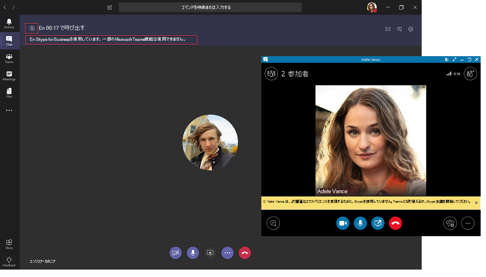

# Microsoft Teams と Skype for Business の共存と相互運用性を理解する

この記事は、お客様のアップグレード行程の「プロジェクトの定義」段階の一部です。プロジェクトの定義は、スポンサー連合とプロジェク チームを作成し、プロジェクトの適用範囲、目標、ビジョンを定義した後に実行するアクティビティです。 続行する前に、次の作業が完了していることを確認します。

- [プロジェクトの関係者をリスト化した](upgrade-enlist-stakeholders.md)
- [プロジェクトの対象範囲を定義した](https://aka.ms/SkypetoTeams-Scope)

組織で Skype for Business を使用していて、チームで Skype for business を使用している場合、または Teams へのアップグレードを開始する場合、2つのアプリケーションの共存方法、相互運用方法、管理方法を理解することが重要です。Skype for Business から Teams への最終的なアップグレードについては、ユーザーの移行をお客様にご利用ください。

> [!Tip]
> [共存と相互運用性](https://aka.ms/teams-upgrade-coexistence-interop)の詳細を説明するセッションをご視聴ください。
>
> また、アップグレード計画と実装を開始するために設計されたガイダンス、ベストプラクティス、およびリソースを共有するライブインタラクティブなワークショップに参加することもできます。
>
> アップグレードを開始するには、最初に「[アップグレードの計画](https://aka.ms/SkypeToTeamsPlanning)」セッションにご参加ください。

## Teams と Skype for Business の共存

Teams では、共同作業の機能だけでなく、チャット、通話、会議の機能も提供しています。 選択する Teams の展開方法によっては、これらの機能が、特定のユーザーに対して Skype for Business で提供される機能と重複する場合があります。 既定のモードでは、機能が重複するため、Skype for Business と共にチームを実行します。ただし、ユーザーには、これらの機能がユーザーに重複しないようにするために設計されたいくつかの共存モード (アップグレードモードとも呼ばれます) のいずれかを割り当てることができます (この場合、Teams と Skype for Business の間の相互運用性は利用可能です)。 たとえば、複雑なエンタープライズ VoIP の展開と共に、多くの Skype for Business Server のオンプレミスの資産を持ってい組織で、できるだけ早く最新の会議をユーザーが利用できるようにしたい場合には、代替パスとして [Meetings First](meetings-first.md) を評価することができます。

どのパスが組織に一番適しているかを判断するために、以下の共存モードを確認することをお勧めします。

> [!Important]
> 新たな優れたビジネス上のメリットを提供しつつ、新しいテクノロジを導入したり、既存の馴染みのある Skype for Business 環境を変更したりする場合、ユーザーが混乱する場合があります。 この記事で説明する変更を実行する前に、時間をかけてユーザーの準備状況を評価し、コミュニケーションおよびトレーニングの計画を実施するようにしてください。 また、計画は、組織全体に実装する前に、選択したユーザーのグループで実験運用することを強くお勧めします。

### アイランド モード

既定では、ユーザーは、プレゼンス、チャット、通話、会議などの類似した重なり合う機能を提供する 2 つの別個のソリューションとして、Teams と Skype for Business を並列で実行できます。 Teams ユーザーは、チームとチャネル、Office 365 のファイルへのアクセス、アプリケーションなどの新しい共同作業の機能を利用することもできます。

「**アイランド**」と呼ばれるこの共存モードでは、各クライアント アプリケーションが別個のアイランド (島) として動作します。 Skype for Business は Skype for Business とやり取りし、Teams は Teams とやり取りします。 ユーザーは、両方のクライアントを常時実行することが想定されており、コミュニケーションを開始したクライアントでネイティブにコミュニケーションできます。 このように、**孤島**モードでの相互運用性は不要です。

Skype for Business エクスペリエンスが複雑化または低下することを回避するため、外部 (フェデレーション) コミュニケーション、PSTN 音声サービスと音声アプリケーション、Office の統合、USB デバイスの HID 制御、その他のいくつかの統合は引き続き Skype for Business で処理され、[**アイランド**] モードの Teams では利用できません。 Teams では、電話システムは [**アイランド**] モードではサポートされません。このモードで使用できる唯一のエンタープライズ VoIP クライアントは、Skype for Business です。

> [!Important]
> [**アイランド**] モードでは、フェデレーション ユーザー (組織外のユーザー) からのすべてのメッセージと通話は、Skype for Business に配信されます。 [**Teams のみ**] モードにアップグレードすると、組織の外部からのすべてのメッセージと通話が Teams に配信されます。

> [!Tip]
> Skype for Business Online を使用中のお客様の場合、最初は既定の [**アイランド**] モードを使用し、組織内で Teams の導入完了を図り、その後、迅速に [**Teams のみ**] モードに移行することをお勧めします。 オンプレミスおよびハイブリッドのお客様は、その環境が複雑な場合は特に、出発点として [**アイランド**] モードではなく [**Skype for Business と Teams のコラボレーション**] モードを展開し、組織で Teams の導入準備が整い次第、(状況に応じて) [**Skype for Business と Teams のコラボレーションと会議**] モード (Meetings First のことです) および [**Teams のみ**] モードに進むという方法が有効な場合があります。

### Skype for Business のみ

この共存モードでは、ユーザーは、チャット、会議、通話機能のために、Teams ではなく、Skype for Business にとどまります。チームやチャネルには Teams は使用されません。 このモードは現在使用できます。ただし、現在の実装では、チームとチャネルはユーザーに対して自動的にオフになりません。 これを行うには、アプリのアクセス許可ポリシーを使用して、チームとチャネルを非表示にします。

このモードは、Teams の管理された展開を開始する前に使用することができます。これは、ユーザーが準備完了に先行して Teams の使用を開始することを防ぐため、または Skype for Business ユーザーの Teams 会議での認証された参加を可能にする方法として、ユーザーが Teams のライセンスを持っている場合に使用できます。

### Teams のみ

> [!IMPORTANT]
> ユーザーを [**Teams のみ**] モードに移動した後に Skype for Business クライアントをアンインストールすると、Outlook および Office アプリでプレゼンスが機能しなくなります。 プレゼンスは Teams では正常に機能します。 回避策: Outlook (および他の Office アプリ) でプレゼンスを表示させるには、Teams を [**Teams のみ**] モードで実行している場合であっても、Skype for Business をインストールする必要があります。 Microsoft はこの問題を把握しており、現在修正に向けて取り組んでいます。

「**Teams のみ**」ユーザー (*アップグレード済み*ユーザーとも呼ばれます) は、Teams のすべての機能にアクセスできます。 これらのユーザーは、アップグレード済みではないユーザーや外部関係者によって開催される Skype for Business の会議に参加するために Skype for Business クライアントを残しておくことができます。 アップグレード済みユーザーは、Skype for Business をまだ使用している組織内の他のユーザーと引き続きやり取りするために、(Skype for Business ユーザーが [**アイランド**] モードに設定されていない限り) Teams と Skype for Business との相互運用機能を使用することができます。 ただし、アップグレード済みユーザーは、Skype for Business のチャット、通話、会議を開始することはできません。

一部またはすべてのユーザーが Teams を唯一のコミュニケーションおよびコラボレーション ツールとして使用する準備が組織ででき次第、それらのユーザーを [**Teams のみ**] モードにアップグレードできます。 [**アイランド**] モードからアップグレードする場合は、最初に Teams の導入を組織全体に行き渡らせてからアップグレード プロセスを開始することをお勧めします。 これにより、相互運用性が [**アイランド**] モードで提供されないことによるコミュニケーションの中断という事態を避けられます。

[**Teams のみ**] モードへの移行に関するその他の考慮事項については、「[Teams のみモードの考慮事項](teams-only-mode-considerations.md)」を参照してください。

### Skype for Business と Teams のコラボレーション

このモードを使用すると、Skype for Business の既存の投資を継続して利用しつつ、Teams を組織の環境に導入できます。 このモードでは、Skype for Business のチャット、通話、および会議機能を変更せずに、Teams のコラボレーション機能 (チームとチャネル、Office 365 のファイルへのアクセス、アプリケーション) を追加します。 このモードでは、Teams のコミュニケーション機能 (プライベート チャット、通話、会議のスケジュール) は既定ではオフになります。

オンプレミスまたはハイブリッドの Skype for Business Server を開始点とする組織は、コミュニケーションの相互運用性と予測可能性をユーザーに提供する場合、または ([**アイランド**] モードでの導入の浸透に頼る代わりに) ユーザーの Teams へのアップグレードを予測可能なタイムラインに沿って行う場合は、このモードを [**アイランド**] モードの代わりに使用することを検討してください。

### Skype for Business と Teams のコラボレーションと会議 (Meetings First とも呼ばれます)

この共存モードを使用すると、Teams の共同作業機能に加え、Teams の会議機能の利用を組織で加速させられます。これにより、Teams の優れた会議エクスペリエンス、議事録、翻訳、背景のぼかしなどの高品質かつ画期的な機能、およびモバイル デバイスやブラウザーを含むすべてのプラットフォームにおける優れたユーザー エクスペリエンスをユーザーが活用できるようになります。

このモードでは、Teams はチームやチャネル ベースの会話に使用される他、ユーザーが会議のスケジュールを設定して実施するのにも Teams が使用されます。 プライベート チャットと通話は引き続き Skype for Business で行います。 チームと Skype for Business では、プレゼンスの調整、自動ホールド/unhold、および両方のアプリケーションの HID デバイスのサポートなど、さまざまな機能を利用できます。 必要な場合は、アプリのアクセス許可ポリシーを使用して、チームとチャネルを非表示にすることができます。

この共存モードは、エンタープライズ VoIP と共に Skype for Business オンプレミスの展開を使用している組織に特に適しています。このような組織では多くの場合、Teams へのアップグレードに時間を要し、より優れた Teams の会議をできるだけ早く活用できることを望んでいるためです。

> [!Note]
> [**アイランド**] 以外のいずれかの共存モードで展開すると、Teams と Skype for Business では[相互運用](#interoperability-of-teams-and-skype-for-business)が可能になります。これにより、アプリ間でのユーザー同士のチャットや通話がサポートされ、Teams へのアップグレードの行程期間中、円滑なコミュニケーションを組織全体で維持できます。 相互運用性は、共存モードにより制御されます。 受信者の共存モードにより、相互運用性を利用できるかどうかが決まります。 たとえば、受信者のモードが、チャットを 1 つのクライアントでのみ使用できるモード (Teams であるとします) である場合、発信者が別のクライアント (この場合は、Skype for Business) を使用してチャットを開始した場合に、チャットの相互運用性を利用できます。 一方、受信者が両方のクライアント (孤島モード) でチャットが利用できるモードになっている場合、チャットでは相互運用性を利用できません。 受信者がメッセージを受信する際は、発信者がチャットを開始した際に使用したものと同じクライアントを使用して受信されます。 したがって、[**アイランド**] モードでコミュニケーションを正常に行うには、Teams の導入が行き渡っている必要があります。つまり、すべてのユーザーが、両方のクライアントをアクティブに使用して監視している状態です。

> [!TIP]
> Skype for Business の使用が継続している場合に、 Teams で有効にしたい機能に基づき推奨されるアップグレード モードを特定するには、[Skype から Teams へのアップグレード ウィザード](https://aka.ms/SkypeToTeamsWizard)を使用します。

共存モード、前提条件、および管理の詳細については、「[Migration and interoperability guidance for organizations using Teams together with Skype for Business (Teams を Skype for Business と併用する組織向けの移行と相互運用に関するガイダンス)](https://aka.ms/SkypeToTeams-Interop)」および「[共存およびアップグレードの設定 (Setting your coexistence and upgrade settings)](https://aka.ms/SkypeToTeams-SetCoexistence)」を参照してください。

| | | |
|---|---|---|
||判断ポイント|<ul><li>組織とユーザーのニーズに最も適合する共存モード</li></ul>|
||次の手順|<ul><li>アップグレード行程での最適なアプローチを選択する。</li></ul>|

## Teams と Skype for Business の相互運用性

相互運用とは、同じ組織内の Teams ユーザーと Skype for Business ユーザーが Teams と Skype for Business の間で通信できるようにする機能です。

相互運用は、受信者の共存モード (アップグレード モードとも呼ばれます) によって制御されます。 受信者が [**アイランド**] モードの場合、相互運用性はありません。

### ネイティブ相互運用と相互運用エスカレーション

相互運用エクスペリエンスには、ネイティブ相互運用と相互運用エスカレーションの 2 種類があります。

- _ネイティブ相互運用_は、ユーザーがその時点で使用しているクライアントにおいて実行されます。 1 人のユーザーが Skype for Business クライアント内に存在し、もう 1 人は Teams 内にいる場合です。 ネイティブの相互運用機能によって、他のクライアントに伝達されることはありません。ユーザーは、現在使用しているクライアントで会話を行うことができます。 ネイティブ相互運用エクスペリエンスは、1 対 1 のチャットと通話です。
- _相互運用エスカレーション_ エクスペリエンスでは、ユーザー行う高度な操作 (デスクトップの共有など) のサポートの一環として、クライアントでの会議の作成が容易になります。ユーザーはこの会議に参加して、相互運用エスカレーション エクスペリエンスを会議内で継続させられます。 会議は、操作を開始したユーザーのプラットフォームに作成されます。 このプラットフォームを使っていないユーザーまたはユーザーが、会議の参加リンクを受信します。 このリンクをクリックすると、互換性のあるクライアント (構成に基づいて、ブラウザー、Web アプリ、フル クライアントのいずれか) で会議に参加できます。 Skype for Business からの相互運用エスカレーションには、最新のクライアントが必要です。 Teams から相互運用エスカレーションを利用できるようになりました。 いずれのエスカレーションも、テナント内の相互運用エクスペリエンス、およびテナント間のフェデレーション コミュニケーションでサポートされます。

### ネイティブ相互運用エクスペリエンス

前述のように、ユーザーに割り当てられている共存モードに基づいて、以下のネイティブ相互運用エクスペリエンスを使用できます。

Skype for Business ユーザーと Teams ユーザーは 1 対 1 のチャットを行えます。 相互運用機能のチャットは、Teams クラウドサービスの一部である相互運用ゲートウェイを通じて行う必要があります (そのため、オンラインである必要があります)。 相互運用機能のチャットはプレーンテキストです。リッチテキストと絵文字はサポートされていません。 Teams と Skype for Business のユーザーには、相互運用による会話であることが通知されます。

<!---->

Skype for Business ユーザーと Teams ユーザーは 1 対 1 の音声通話とビデオ通話を行えます。その逆も行えます。

<!---->

> [!Important]
> オンプレミス展開の Skype for Business を使用する相互運用エクスペリエンスでは、対象のオンプレミス展開が Office 365 Skype for Business のハイブリッド モードである必要があります。 詳細については、「[移行と相互運用に関するガイドライン](https://aka.ms/SkypeToTeams-Interop)」を参照してください。

これらの相互運用エクスペリエンスは、[**Skype for Business と Teams のコラボレーション**]、[**Skype for Business と Teams のコラボレーションと会議**]、[**Skype for Business Only のみ**]、および [**Teams のみ**] の共存モードが割り当てられているユーザーが利用でき、これらのユーザー間で使用できます。 [**アイランド**] モードのユーザーの場合、相互運用性はありません。

### ネイティブ相互運用エクスペリエンスの制限事項

プロトコルやテクノロジの違いにより、すべての機能をネイティブにサポートすることはできません。 具体的には、次の機能は使用できません。

- マークダウン、rich text、および完全な絵文字セットは、Teams または Skype for Business ではサポートされていません。 チームチャットの作成ボックスのその他のネイティブ機能はサポートされていません。
- Teams と Skype for Business の間の画面共有 (デスクトップまたはアプリの共有) は、ネイティブではサポートされません。 ただし、相互運用エスカレーションを使用する場合にはサポートされます。
- Teams のグループ チャット (複数による会話) には、Teams を使用している参加者のみが加わることができます。
- Skype for Business の複数による IM 会話 (グループ チャット) には、Skype for Business を使用している参加者のみが加わることができます。 ただし、Skype for Business からは複数での会話に相互運用エスカレーションを利用できます。
- 進行中のピアツーピアの音声通話またはビデオ通話を、Teams と Skype for Business の両方でサポートされていない複数の相手への通話にエスカレーションします。
- 2パーティのチャットのファイル転送、またはグループチャットの添付ファイル (Teams から Skype for Business、またはその逆) はサポートされません。
- Skype for Business 常設チャットには相互運用性はありません。

(常設チャットを除く) これらすべての制限事項に関しては、考えられる 1 つの回避策として、1 人のユーザーが会議を開始し、それに参加するよう他のユーザーを招待するという方法があります。

この回避策が、相互運用エスカレーションの基礎となっています。 特に、画面の共有および複数ユーザーへのエスカレーションはネイティブには実行できませんが、相互運用エスカレーションによってサポートされています。

### 相互運用エスカレーション エクスペリエンス

相互運用エスカレーションは、ネイティブ相互運用機能を、会議への管理されたエスカレーションを使用して補完したものです。 会議では、ユーザーが所有しているクライアントに関係なく、だれもが豊富な機能を利用できます。

Teams ユーザーにより相互運用エスカレーションがトリガーされると、Teams 会議が作成されます。 それをトリガーしたのが Skype for Business ユーザーであった場合は、Skype for Business 会議が作成されます。 どちらの場合も、作成された会議は now 会議に**なり**、ユーザーの予定表には反映されません。
 
相手のユーザーは、相互運用チャットで会議参加リンクを受け取り、そのリンクをクリックすると参加できます。 Skype for Business ユーザーが Teams アカウントを持っていて Teams ユーザーによって招待されると、認証された状態で会議に参加します。 それ以外の場合は、匿名の参加者として参加します。 反対に、ほとんどの Teams ユーザーには必ず Skype for Business アカウントと、Skype for Business 会議に認証された参加者として使用できる Skype for Business クライアントがありますが、Skype 会議アプリを使用する場合など匿名の参加者として参加することもできます。

会議に参加したユーザーは、デスクトップやコンテンツの共有、ファイルの共有や転送、他の参加者の追加など、会議でサポートされるすべてのアクティビティを実行できます。

#### Skype for Business からの相互運用エスカレーション

Skype for Business からの相互運用と相互運用エスカレーションは、月次 C2R の 2019 年 7 月ビルドで更新されました。 以前は、Skype for Business では、リモート ユーザーが Teams を使用していることを事前に認識できませんでした。 セッションが確立された後に受信した信号に基づいて推測されるだけでした。

応答が相互運用ゲートウェイから来たこと、またはゲートウェイを経由したことを信号が示している場合、そのユーザーが Skype for Business を使用していないことを示す黄色の ビジネス バー (バナー) が表示されます。 サービスの進化に伴い、実際の **Teams のみ**ユーザーに接続したときではなく、クラウド ボイスメール サービスや他のクラウド ボイス サービスに接続した場合にこのビジネス バーが Skype for Business ユーザーに表示されるようになり、誤検知が発生していました。
 
こうした誤検知を防ぐために、プレゼンス サービスでは、相手のユーザーが実際に **Teams のみ**ユーザーである場合に Skype for Business クライアントに通知するようになりました。 これにより、会話ウィンドウが作成されてしまう前に相互運用会話および相互運用専用の会話ウィンドウを作成する必要があることを Skype for Business に認識させられます。

Skype for Business ユーザーがデスクトップを共有しようとすると、会議が始まることが通知され、手順が案内されます。

それと同時に、Teams ユーザーには会議へのリンクが含まれたチャット メッセージが届き、参加するためのガイドが示されます。

Skype for Business 会議へのこのエスカレーションは、テナント内の相互運用と、テナント間のフェデレーション通話とチャットで利用できます。 これは既定で有効になっており、管理者がプロビジョニングする必要のある設定はありません。

#### Teams からの相互運用エスカレーション

Teams から Teams 会議への相互運用エスカレーションが、Skype for Business ユーザーとのテナント内相互運用スレッドにある、またはテナント間相互運用フェデレーション スレッドにあるデスクトップ共有ボタンを Teams ユーザーが選択すると利用できるようになりました。 相互運用エスカレーションは、1 対 1 のチャット会話または 1 対 1 の通話でサポートされています。

この機能は、Windows 用の Teams デスクトップ クライアント、Mac 用の Teams デスクトップ クライアント、コンテンツ共有がサポートされているブラウザー上の Teams Web クライアントでサポートされています。すべてのバージョンの Skype for Business クライアントと通信できます。

相互運用スレッドとフェデレーション相互運用スレッドで、Teams ユーザーにコンテンツ共有を開始するためのコントロール (ボタン) が表示されるようになりました。 Teams ユーザーがこのボタンを選択すると、コンテンツ共有や、Teams 会議を開始する必要があることを知らせる追加メニューが表示されます。

ユーザーが通話中の場合は、Teams と Skype for Business 間で行われている現在の通話が、Teams 会議に参加すると終了することも警告されます。 その場合、承諾前に Skype for Business ユーザーに警告できます。

承諾すると、Teams 会議に参加できます。会議の共有トレイから共有を開始する必要があります。
 
一方、Skype for Business ユーザーは、会議へのリンクを含む着信チャット メッセージを受信し、参加するためのガイドが示されます。

Teams 会議へのこのエスカレーションは、テナント内の相互運用と、テナント間のフェデレーション通話とチャットで利用できます。 これは既定で有効になっており、管理者がプロビジョニングする必要のある設定はありません。 ただし、管理者が ``CsTeamsMeetingPolicy`` の ``-AllowPrivateMeetNow`` を ``$false`` に設定すると、ユーザーに対して無効になります。

この記事の内容を確認し終わったら、実装の詳細について、「[アップグレードの行程を選択する](upgrade-and-coexistence-of-skypeforbusiness-and-teams.md)」、「[移行と相互運用に関するガイドライン](https://aka.ms/SkypeToTeams-Interop)」、「[Skype for Business と共存する](coexistence-chat-calls-presence.md)」、および「[共存およびアップグレードを設定する](https://aka.ms/SkypeToTeams-SetCoexistence)」を参照してください。

## 関連リンク

[ビデオ: SfB と Teams 間の共存と相互運用性を管理する](https://www.youtube.com/watch?v=wEc9u4S3GIA&list=PLaSOUojkSiGnKuE30ckcjnDVkMNqDv0Vl&index=11)
