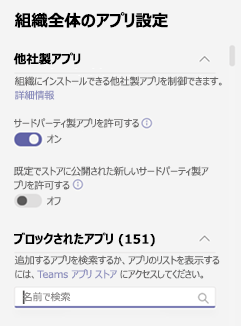

# Microsoft Teams のアプリのアクセス許可ポリシーを管理するManage app permission policies in Microsoft Teams

管理者であれば、アプリのアクセス許可ポリシーを使用して、組織の Microsoft Teams ユーザーが使用できるアプリを制御できます。As an admin, you can use app permission policies to control what apps are available to Microsoft Teams users in your organization. すべてのアプリ、または Microsoft、第三者、お客様の組織によって公開されている特定のアプリを許可またはブロックすることができます。You can allow or block all apps or specific apps published by Microsoft, third-parties, and your organization. アプリをブロックした場合、ポリシーを持つユーザーは、Teams アプリ ストアからアプリをインストールできません。When you block an app, users who have the policy are unable to install it from the Teams app store. これらのポリシーを管理するには、グローバル管理者または Teams サービス管理者である必要があります。You must be a global admin or Teams service admin to manage these policies.

Microsoft Teams 管理センターでアプリのアクセス許可ポリシーを管理します。You manage app permission policies in the Microsoft Teams admin center. グローバル (組織全体の既定) ポリシーを使用するか、カスタム ポリシーを作成して割り当てできます。You can use the global (Org-wide default) policy or create and assign custom policies. カスタム ポリシーを作成して割り当てていない場合、組織内のユーザーにはグローバル ポリシーが自動的に適用されます。Users in your organization will automatically get the global policy unless you create and assign a custom policy. ポリシーを編集または割り当てると、変更が有効なまで数時間かかる場合があります。After you edit or assign a policy, it can take a few hours for changes to take effect.

> [!NOTE]
> 組織全体のアプリ設定は、グローバル ポリシーと、ユーザーに作成して割り当てるカスタム ポリシーを上書きします。Org-wide app settings override the global policy and any custom policies that you create and assign to users.

組織が既に Teams を使用している場合、Microsoft  365 管理センターのテナント全体の設定で構成したアプリ設定は、[アプリの管理]ページの組織全体のアプリ設定に反映されます。If your organization is already on Teams, the app settings you configured in **Tenant-wide settings** in the Microsoft 365 admin center are reflected in org-wide app settings on the [Manage apps](manage-apps.md) page. Teams を使い始め始めたばかりの場合、既定では、すべてのアプリがグローバル ポリシーで許可されます。If you're new to Teams and just getting started, by default, all apps are allowed in the global policy. これには、Microsoft、サードパーティ、および組織によって公開されたアプリが含まれます。This includes apps published by Microsoft, third-parties, and your organization.

たとえば、すべてのサード パーティ製アプリをブロックし、組織内の人事チームに Microsoft の特定のアプリを許可するとします。Say, for example, you want to block all third-party apps and allow specific apps from Microsoft for the HR team in your organization. 最初に、[アプリの管理]ページに移動し、人事チームに許可するアプリが組織レベルで許可されている必要があります。First, you would go to the [Manage apps](manage-apps.md) page and make sure that the apps that you want to allow for the HR team are allowed at the org level. 次に、HR アプリのアクセス許可ポリシーというカスタム ポリシーを作成し、それをブロックし、必要なアプリを許可し、人事チームのユーザーに割り当てる設定を行います。Then, create a custom policy named HR App Permission Policy, set it to block and allow the apps that you want, and assign it to users on the HR team.

> [!NOTE]
> Microsoft 365 Government Community Cloud (GCC) 環境に Teams を展開した場合は [、「Microsoft 365 Government](#manage-org-wide-app-settings-for-microsoft-365-government) の組織全体のアプリ設定を管理する」を参照して、GCC 固有のサード パーティ製アプリ設定の詳細を確認してください。If you deployed Teams in a Microsoft 365 Government Community Cloud (GCC) environment, see [Manage org-wide app settings for Microsoft 365 Government](#manage-org-wide-app-settings-for-microsoft-365-government) to learn more about third-party app settings that are unique to GCC.

## カスタム アプリのアクセス許可ポリシーを作成するCreate a custom app permission policy

組織内のユーザーのグループごとに使用できるアプリを制御する場合は、1 つ以上のカスタム アプリのアクセス許可ポリシーを作成して割り当てる必要があります。If you want to control the apps that are available for different groups of users in your organization, create and assign one or more custom app permission policies. アプリが Microsoft、サードパーティ、または組織によって発行されたかどうかに基づいて、個別のカスタム ポリシーを作成して割り当てできます。You can create and assign separate custom policies based on whether apps are published by Microsoft, third-parties, or your organization. カスタム ポリシーを作成した後、組織全体のアプリ設定でサード パーティ製アプリが無効になっている場合、ポリシーを変更することはできません。It's important to know that after you create a custom policy, you can't change it if third-party apps are disabled in org-wide app settings.

1. Microsoft Teams 管理センターの左側のナビゲーションで **、Teams** アプリのアクセス許可ポリシー  >  **に移動します**。In the left navigation of the Microsoft Teams admin center, go to **Teams apps** > **Permission policies**.
2. **[追加]** をクリックします。Click **Add**.  
    
3. ポリシーの名前と説明を入力します。Enter a name and description for the policy.
4. **[Microsoft アプリ]、[\*\*\*\*サードパーティ 製アプリ**]、および [**カスタム** アプリ] で、次のいずれかを選択します。Under **Microsoft apps**, **Third-party apps**, and **Custom apps**, select one of the following:

    - **すべてのアプリを許可する****Allow all apps**
    - **特定のアプリを許可し、他のすべてのアプリをブロックする****Allow specific apps and block all others**
    - **特定のアプリをブロックし、他のすべてのアプリを許可する****Block specific apps and allow all others**
    - **すべてのアプリをブロックする****Block all apps**

5. [特定のアプリを **許可し、他** のアプリをブロックする] を選択した場合は、許可するアプリを追加します。If you selected **Allow specific apps and block others**, add the apps that you want to allow:

    1. [アプリ **の許可] を選択します**。Select **Allow apps**.
    1. 許可するアプリを検索し、[追加] をクリック **します**。Search for the apps that you want to allow, and then click **Add**. 検索結果は、アプリの発行元 **(Microsoft** アプリ、 **サードパーティ** 製アプリ、またはカスタム アプリ) に **フィルター処理されます**。The search results are filtered to the app publisher (**Microsoft apps**, **Third-party apps**, or **Custom apps**).
    1. アプリの一覧を選択したら、[許可] をクリック **します**。When you've chosen the list of apps, click **Allow**. 

6. 同様に、[特定のアプリをブロック] を選択し、他のすべてのアプリを許可した場合は、ブロックするアプリを検索して追加し、[ブロック] をクリック **します**。Similarly, if you selected **Block specific apps and allow all others**, search for and add the apps that you want to block, and then click **Block**.
7. **[保存]** をクリックします。Click **Save**.

## アプリのアクセス許可ポリシーを編集するEdit an app permission policy

Microsoft Teams 管理センターを使用して、作成したグローバル ポリシーやカスタム ポリシーなどのポリシーを編集できます。You can use the Microsoft Teams admin center to edit a policy, including the global policy and custom policies that you create.

1. Microsoft Teams 管理センターの左側のナビゲーションで **、Teams** アプリのアクセス許可ポリシー  >  **に移動します**。In the left navigation of the Microsoft Teams admin center, go to **Teams apps** > **Permission policies**.
2. ポリシー名の左側をクリックしてポリシーを選び、**[編集]** をクリックします。Select the policy by clicking to the left of the policy name, and then click **Edit**.
3. ここで、希望する変更を行います。From here, make the changes that you want. アプリの発行元に基づいて設定を管理し、許可/ブロック設定に基づいてアプリを追加および削除できます。You can manage settings based on the app publisher and add and remove apps based on the allow/block setting.
4. **[保存]** をクリックします。Click **Save**.

## カスタム アプリのアクセス許可ポリシーをユーザーに割り当てるAssign a custom app permission policy to users

[!INCLUDE [assign-policy](includes/assign-policy.md)]

## Microsoft 365 Government の組織全体のアプリ設定を管理するManage org-wide app settings for Microsoft 365 Government  

Microsoft 365 Government - GCC での Teams の展開では、GCC に固有のサード パーティ製アプリの設定について、次の点を知る必要があります。In a Microsoft 365 Government - GCC deployment of Teams, it's important to know the following about third-party app settings, which are unique to GCC.

GCC では、既定では、すべてのサード パーティ製アプリがブロックされます。In GCC, all third-party apps are blocked by default. また、Microsoft Teams 管理センターのアプリのアクセス許可ポリシー ページでサード パーティ製アプリを管理する場合は、次の注意が必要です。Additionally, you'll see the following note about managing third-party apps on the app permission policies page in the Microsoft Teams admin center.

組織全体のアプリ設定を使用して、ユーザーがサードパーティ製アプリをインストールできるかどうかを制御します。Use org-wide app settings to control whether users can install third-party apps. 組織全体のアプリ設定は、すべてのユーザーの動作を制御し、ユーザーに割り当てられている他のアプリのアクセス許可ポリシーを上書きします。Org-wide app settings govern the behavior for all users and override any other app permission policies assigned to users. これらのアプリを使用して、悪意のあるアプリや問題のあるアプリを制御できます。You can use them to control malicious or problematic apps.

1. [アクセス許可 **ポリシー] ページで** 、組織全体 **のアプリ設定を選択します**。On the **Permission policies** page, select **Org-wide app settings**. パネルで必要な設定を構成できます。You can then configure the settings you want in the panel.

    
    
2. サード **パーティ製アプリの下で**、これらの設定をオフまたはオンにし、サード パーティ製アプリへのアクセスを制御します。Under **Third-party apps**, turn off or turn on these settings to control access to third-party apps:

    - **サード パーティ製アプリを許可** する: これにより、ユーザーがサード パーティ製アプリを使用できるかどうかが制御されます。**Allow third-party apps**: This controls whether users can use third-party apps. この設定をオフにすると、ユーザーはサードパーティ製アプリをインストールしたり使用したりすることはできません。If you turn off this setting, your users won't be able to install or use any third-party apps. Microsoft 365 Government - GCC での Teams の展開では、この設定は既定ではオフになっています。In a Microsoft 365 Government - GCC deployment of Teams, this setting is off by default.
    - **既定で、** ストアに公開された新しいサード パーティ製アプリを許可する: これにより、Teams アプリ ストアに公開された新しいサード パーティ製アプリが Teams で自動的に利用できるかどうかが制御されます。**Allow any new third-party apps published to the store by default**: This controls whether new third-party apps that are published to the Teams app store become automatically available in Teams. このオプションは、サードパーティ製アプリを許可する場合にのみ設定できます。You can only set this option if you allow third-party apps.

3. [ **ブロックするアプリ] で**、組織全体でブロックするアプリを追加します。Under **Blocked apps**, add the apps you want to block across your organization. Microsoft 365 Government - GCC での Teams の展開では、既定では、すべてのサード パーティ製アプリがこのリストに追加されます。In a Microsoft 365 Government - GCC deployment of Teams, all third-party apps are added to this list by default. 組織内で許可するサード パーティ製アプリの場合は、このブロックするアプリの一覧からアプリを削除します。For any third-party app you want to allow in your organization, remove the app from this blocked apps list. 組織全体でアプリをブロックすると、アプリのアクセス許可ポリシーで許可されているかどうかに関係なく、すべてのユーザーに対してアプリが自動的にブロックされます。When you block an app org-wide, the app is automatically blocked for all your users, regardless of whether it's allowed in any app permission policies
4. 組織 **全体の** アプリ設定を有効にするには、[保存] をクリックします。Click **Save** for org-wide app settings to take effect.

前述のように、サード パーティ製アプリを許可するには、グローバル (組織全体の既定) ポリシーを編集して使用するか、カスタム ポリシーを作成して割り当てるかのいずれかです。As mentioned earlier, to allow third-party apps, you can either edit and use the global (Org-wide default) policy or create and assign custom policies.

## FAQFAQ

### アプリのアクセス許可ポリシーを使用するWorking with app permission policies

#### アクセス許可ポリシーが影響を与えるアプリの相互作用What app interactions do permission policies affect?
アクセス許可ポリシーは、エンド ユーザーのインストール、検出、操作を制御することで、アプリの使用状況を制御します。Permission policies govern app usage by controlling installation, discovery, and interaction for end users. 管理者は、割り当てられているアクセス許可ポリシーに関係なく、Microsoft Teams 管理センターでアプリを管理できます。Admins can still manage apps in the Microsoft Teams admin center regardless of the permission policies assigned to them.

#### 業務 (LOB) アプリを制御できますか?Can I control line of business (LOB) apps?
はい、アプリのアクセス許可ポリシーを使用して、カスタム (LOB) アプリの展開と配布を制御できます。Yes, you can use app permission policies to control the rollout and distribution of custom (LOB) apps. カスタム ポリシーを作成するか、グローバル ポリシーを編集して、組織のニーズに基づいてカスタム アプリを許可またはブロックすることができます。You can create a custom policy or edit the global policy to allow or block custom apps based on the needs of your organization.

#### アプリのアクセス許可ポリシーとピン留めされたアプリとアプリセットアップ ポリシーの関連付けHow do app permission policies relate to pinned apps and app setup policies?

アプリのセットアップ ポリシーとアプリのアクセス許可ポリシーを組み合わせて使用できます。You can use app setup policies together with app permission policies. 事前にピン留めされたアプリは、ユーザーに対して有効なアプリのセットから選択されます。Pre-pinned apps are selected from the set of enabled apps for a user. さらに、ユーザーがアプリのセットアップ ポリシーでアプリをブロックするアプリのアクセス許可ポリシーを持っている場合、そのアプリは Teams に表示されません。Additionally, if a user has an app permission policy that blocks an app in their app setup policy, that app won't appear in Teams.

#### アプリのアクセス許可ポリシーを使用してカスタム アプリのアップロードを制限できますか?Can I use app permission policies to restrict uploading custom apps?

組織全体の設定を [アプリの管理] ページまたはアプリ設定ポリシーで使用して、組織のカスタム アプリのアップロードを制限できます。You can use org-wide settings on the **Manage apps** page, or app setup policies to restrict uploading custom apps for your organization.  

特定のユーザーによるカスタム アプリのアップロードを制限するには、カスタム アプリ ポリシーを使用します。To restrict specific users from uploading custom apps, use custom app policies. 詳細については、「Teams でカスタム [アプリのポリシーと設定を管理する」を参照してください](teams-custom-app-policies-and-settings.md)。To learn more, see [Manage custom app policies and settings in Teams](teams-custom-app-policies-and-settings.md).

#### アプリのブロックは Teams モバイル クライアントに適用されますか?Does blocking an app apply to Teams mobile clients?

はい、アプリをブロックすると、そのアプリはすべての Teams クライアントでブロックされます。Yes, when you block an app, that app is blocked across all Teams clients.  

### ユーザー エクスペリエンスUser experience

#### アプリがブロックされた場合のユーザー エクスペリエンスWhat does a user experience when an app is blocked?

ブロックされたアプリや、ボット、タブ、メッセージング拡張機能などの機能をユーザーが操作できない。Users can't interact with a blocked app or its capabilities, such bots, tabs, and messaging extensions. チームチャットやグループ チャットなどの共有コンテキストでは、ボットは引き続きそのコンテキストのすべての参加者にメッセージを送信できます。In a shared context, such as a team or group chat, bots can still send messages to all participants of that context. Teams は、アプリがブロックされた場合にユーザーに示します。Teams indicates to the user when an app is blocked.

たとえば、アプリがブロックされた場合、ユーザーは次の操作を行えなされません。For example, when an app is blocked, users can't do any of the following:

- アプリを個人またはチャットまたはチームに追加するAdd the app personally or to a chat or team
- アプリのボットにメッセージを送信するSend messages to the app’s bot
- アクション可能なメッセージなど、アプリに情報を送り返すボタン アクションを実行するPerform button actions that send information back to the app, such as actionable messages  
- アプリのタブを表示するView the app’s tab
- 通知を受信するコネクタを設定するSet up connectors to receive notifications
- アプリのメッセージング拡張機能を使用するUse the app’s messaging extension

従来のポータルでは、組織レベルでアプリを制御する許可がありました。つまり、アプリがブロックされた場合、アプリは組織内のすべてのユーザーに対してブロックされます。The legacy portal allowed controlling apps at the organization level, which means when an app is blocked, it's blocked for all users in the organization. [アプリの管理] ページで [アプリをブロックする](manage-apps.md) 方法は、まったく同じです。Blocking an app on the [Manage apps](manage-apps.md) page works exactly the same way.

特定のユーザーに割り当てられたアプリのアクセス許可ポリシーの場合、ボットまたはコネクタ機能を持つアプリが許可され、その後ブロックされた場合、アプリが共有コンテキスト内の一部のユーザーに対してのみ許可されている場合、そのアプリへのアクセス許可を持つグループ チャットまたはチャネルのメンバーは、ボットまたはコネクタによって投稿されたメッセージ履歴とメッセージを表示できます。を選択します。ただし、対話操作は行えなFor app permission policies assigned to specific users, if an app with bot or connector capability was allowed and then blocked, and if the app is then allowed only for some users in a shared context, members of a group chat or channel that don't have permission to that app can see the message history and messages that were posted by the bot or connector, but can't interact with it.

## 関連項目Related topics

[Teams でのアプリの管理設定Admin settings for apps in Teams](admin-settings.md)

[ Teams でユーザーにポリシーを割り当てるAssign policies to your users in Teams](assign-policies.md)
