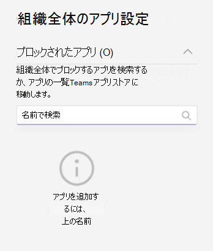

# Microsoft Teams のアプリのアクセス許可ポリシーを管理する

管理者であれば、アプリのアクセス許可ポリシーを使用して、組織の Microsoft Teams ユーザーが使用できるアプリを制御できます。 すべてのアプリ、または Microsoft、第三者、お客様の組織によって公開されている特定のアプリを許可またはブロックすることができます。 アプリをブロックした場合、ポリシーを持つユーザーは、Teams アプリ ストアからアプリをインストールできません。 これらのポリシーを管理するには、グローバル管理者または Teams サービス管理者である必要があります。

アプリのアクセス許可ポリシーは、Microsoft Teams 管理センターで管理します。 グローバル (組織全体の既定) ポリシーを使用ことも、カスタム ポリシーを作成して割り当てることもできます。 カスタム ポリシーを作成して割り当てていない場合、組織内のユーザーにはグローバル ポリシーが自動的に適用されます。 ポリシーを編集既するか割り当てた後、変更が反映されるまでに数時間かかる場合があります。

> [!NOTE]
> 組織全体のアプリ設定は、グローバル ポリシーや、お客様が作成してユーザーに割り当てるカスタム ポリシーを上書きします。

組織がすでに Teams に参加している場合、Microsoft 365 管理センターの **テナント全体の設定** で構成したアプリ設定は、[[アプリの管理]](manage-apps.md) ページの組織全体のアプリ設定に反映されます。 Teams を初めて使用し、始めたばかりの場合、既定では、すべてのアプリがグローバル ポリシーで許可されています。 これには、Microsoft によって公開されたアプリ、サードパーティのソフトウェア プロバイダー、および組織が含まれます。

たとえば、組織内の人事チームに対して、特定のアプリをいくつか許可するとします。 まず、[アプリの [管理](https://admin.teams.microsoft.com/policies/manage-apps) ] ページで、人事チームに許可するアプリが組織レベルで許可されていることを確認します。 次に、カスタム ポリシーを作成し、目的のアプリをブロックして許可するように設定し、人事チームのユーザーにポリシーを割り当てます。

> [!NOTE]
> Microsoft 365 Government Community Cloud High (GCCH) 環境と国防総省 (DoD) 環境に固有のサード パーティ製アプリ設定については、「[Microsoft 365 Government の組織全体のアプリ設定を管理する](#manage-org-wide-app-settings-for-microsoft-365-government)」を参照してください。

## カスタムアプリのアクセス許可ポリシーを作成する

異なるユーザー グループで使用できるアプリを制御する場合は、1 つ以上のカスタム アプリアクセス許可ポリシーを使用します。 アプリが Microsoft、サードパーティ、または組織のうちどこで公開されているかに基づいて、個別のカスタム ポリシーを作成し、割り当てることができます。 カスタム ポリシーを作成した後、組織全体のアプリ設定でサード パーティ製アプリが無効になっている場合、そのポリシーを変更することはできません。

1. [Teams管理センター](https://admin.teams.microsoft.com/dashboard)にサインインする
1. 左側のパネルで、**Teams アプリ** > **アクセス許可ポリシー** に移動します。
1. **[追加]** を選択します。

    

1. ポリシーの名前と説明を入力します。
1. **[Microsoft アプリ]**、**[サードパーティアプリ]**、および **[カスタムアプリ]** で、次のいずれかを選択します。

    * **すべてのアプリを許可する**
    * **特定のアプリを許可し、他のすべてのアプリを禁止する**
    * **特定のアプリをブロックし、他のすべてのアプリを許可する**
    * **[すべてのアプリをブロック]**

1. **[特定のアプリを許可し、他のアプリをブロックする]** を選択した場合は、以下の手順で許可するアプリを追加します。

    1. **[アプリを許可]** を選びます。
    1. 許可するアプリを検索し、[ **追加**] を選択します。 検索結果は、アプリの発行元 (**Microsoft アプリ**、**サードパーティ アプリ**、または **カスタム アプリ**) にフィルターされます。
    1. アプリの一覧を選択したら、[許可] を選択 **します**。

1. 同様に、**[特定のアプリをブロックして他のすべてのアプリを許可する]** を選択した場合は、ブロックするアプリを検索して追加し、**[ブロック]** を選択します。
1. **[保存]** を選択します。

## アプリのアクセス許可ポリシーを編集する

Teams 管理センターを使用して、作成したグローバル ポリシーやカスタム ポリシーなどのポリシーを編集できます。

1. Microsoft Teams 管理センターの左側のウィンドウで、**[Teams アプリ]** > **[アクセス許可ポリシー]** の順に移動します。
1. ポリシー名の左側をクリックしてポリシーを選び、**[編集]** を選択します。
1. ここで、希望する変更を行います。アプリの発行元に基づいて設定を管理し、許可/ブロック設定に基づいてアプリの追加や削除を行うことができます。
1. **[保存]** を選択します。

## カスタム アプリのアクセス許可ポリシーをユーザーに割り当てる

[!INCLUDE [assign-policy](includes/assign-policy.md)]

## Microsoft 365 Government の組織全体のアプリ設定を管理する  

Microsoft 365 Government - GCC、GCCH、および DoD Teams の展開では、すべてのサード パーティアプリが既定でブロックされます。 GCCH クラウドと DOD クラウドでは、サード パーティのアプリは使用できません。 さらに、GCC では、Microsoft Teams の管理センターのアプリ許可ポリシーページで、サードパーティ アプリの管理について以下のような注意事項が表示されます。

:::image type="content" source="media/app-permission-policies-gcc.png" alt-text="GCCH および DoD 内のアプリのアクセス許可ポリシーのスクリーンショット。":::

組織全体のアプリ設定を使用して、ユーザーがサード パーティのアプリをインストールできるかどうかを制御します。 組織全体のアプリ設定は、すべてのユーザーの動作を管理し、ユーザーに割り当てられた他のアプリ権限ポリシーを上書きします。 それらを使用して、悪意のあるアプリや問題のあるアプリを制御できます。

<!---
1. On the **Permission policies** page, select **Org-wide app settings**. You can then configure the settings you want in the panel. --->

### GCC クラウドの場合

1. [ **アプリの管理** ] ページ **で、[組織全体のアプリ設定**] を選択します。 次に、パネルで必要な設定を構成できます。

  

1. **[サードパーティ アプリ]** で、次の設定をオフまたはオンにして、サードパーティ アプリへのアクセスを制御します。

    * **サード パーティ製アプリを許可** する: このオプションは、ユーザーがサード パーティアプリを使用できるかどうかを制御します。 この設定をオフにすると、ユーザーはサードパーティ アプリをインストールしたり使用したりできなくなります。 Microsoft 365 Governmentの場合 - Teams の GCCH および DoD 展開では、この設定は既定でオフになっています。
    * **既定でストアに発行されたすべての新しいサード パーティアプリを許可** する: このオプションは、Teams アプリ ストアに発行される新しいサード パーティアプリをTeamsで自動的に使用できるかどうかを制御します。 このオプションは、サードパーティのアプリを許可する場合にのみ設定できます。

1. **[ブロック済みのアプリ]** で、組織全体でブロックするアプリを追加します。 Microsoft 365 Government の場合 - Teams の GCCH および DoD 展開では、すべてのサードパーティ アプリが既定でこのリストに追加されます。 組織で許可するサードパーティのアプリについては、このブロック済みのアプリのリストからアプリを削除します。 組織全体でアプリをブロックすると、アプリのアクセス許可ポリシーで許可されているかどうかに関係なく、すべてのユーザーに対してアプリが自動的にブロックされます。

1. 組織全体のアプリ設定を有効にするには、**[保存]** を選択します。

サード パーティ製アプリを許可するには、グローバル (組織全体の既定) ポリシーを編集して使用するか、カスタム ポリシーを作成して割り当てます。

### GCCH および DoD クラウドの場合

1. **[権限ポリシー]** ページで、**[組織全体のアプリ設定]** を選択します。 次に、パネルで必要な設定を構成できます。

  

1. **[ブロック済みのアプリ]** で、組織全体でブロックするアプリを追加します。 Microsoft 365 Government の場合 - Teams の GCCH および DoD 展開では、すべてのサードパーティ アプリが既定でこのリストに追加されます。 組織全体でアプリをブロックすると、アプリのアクセス許可ポリシーで許可されているかどうかに関係なく、すべてのユーザーに対してアプリが自動的にブロックされます。
1. 組織全体のアプリ設定を有効にするには、**[保存]** を選択します。

## よくあるご質問 (FAQ)

### アプリのアクセス許可ポリシーを操作する

#### アクセス許可ポリシーはどのアプリの相互作用に影響しますか?

アクセス許可ポリシーは、エンド ユーザーのインストール、検出、操作を制御することでアプリの使用を管理します。 管理者は、割り当てられたアクセス許可ポリシーに関係なく、Microsoft Teams 管理センターでアプリを管理できます。

#### 基幹業務 (LOB) アプリを制御できますか?

はい。アプリのアクセス許可ポリシーを使用して、カスタム (LOB) アプリのロールアウトと配布を制御できます。 カスタム ポリシーを作成するか、グローバル ポリシーを編集して、組織のニーズに基づいてカスタム アプリを許可またはブロックできます。

#### アプリのアクセス許可ポリシーは、固定されたアプリおよびアプリの設定ポリシーにどのように関連していますか?

アプリの設定ポリシーは、アプリのアクセス許可ポリシーと一緒に使用できます。 事前に固定されたアプリは、ユーザーに対して有効になっているアプリのセットから選択されます。 さらに、ユーザーがアプリの設定ポリシーでアプリをブロックするアプリのアクセス許可ポリシーを持っている場合、そのアプリは Teams に表示されません。

#### アプリのアクセス許可ポリシーを使用して、カスタム アプリのアップロードを制限できますか?

**[アプリの管理]** ページの組織全体の設定、またはアプリの設定ポリシーを使用して、組織のカスタム アプリのアップロードを制限できます。  

特定のユーザーによるカスタム アプリのアップロードを制限するには、カスタムアプリ ポリシーを使用します。 詳細については、「[Teams のカスタム アプリのポリシーと設定を管理する](teams-custom-app-policies-and-settings.md)」をご覧ください。

#### アプリのブロックは Teams モバイル クライアントに適用されますか?

はい、アプリをブロックすると、そのアプリはすべての Teams クライアントでブロックされます。  

### ユーザー エクスペリエンス

#### アプリがブロックされたとき、ユーザー エクスペリエンスはどうなりますか?

ユーザーは、ブロックされたアプリや、ボット、タブ、メッセージング拡張機能といった機能を操作できません。 チーム チャットやグループ チャットなどの共有コンテキストでは、ボットはそのコンテキストのすべての参加者に引き続きメッセージを送信できます。 Teams は、アプリがブロックされたことをユーザーに知らせます。

たとえば、アプリがブロックされている場合、ユーザーは次のタスクを実行できません。

* アプリの個人的な、またはチャットやチームへの追加
* アプリのボットへのメッセージの送信
* アクション可能なメッセージなど、情報をアプリに送り返すボタン アクションの実行  
* アプリのタブを表示する
* 通知を受信するためのコネクタの設定
* アプリのメッセージング拡張機能の使用

従来のポータルでは、組織レベルでアプリを制御できました。これはアプリがブロックされると、組織内のすべてのユーザーに対してブロックされることを意味します。 [[アプリの管理]](manage-apps.md) ページでアプリをブロックするのとまったく同じように機能します。

特定のユーザーに割り当てられたアプリのアクセス許可ポリシーで、ボットまたはコネクタ機能を備えたアプリを許可してからブロックした場合、およびアプリが共有コンテキスト内の一部のユーザーに対してのみ許可した場合、グループ チャットまたはチャネルのメンバーは許可されません そのアプリへのアクセス許可を持っている場合、ボットまたはコネクタによって投稿されたメッセージ履歴とメッセージを表示できますが、そのボットやコネクタと対話することはできません。

## 関連項目

* [Teams でのアプリの管理設定](admin-settings.md)
* [ Teams でユーザーにポリシーを割り当てる](policy-assignment-overview.md)
* [Teams機能の可用性の比較](/office365/servicedescriptions/teams-service-description#feature-availability)
