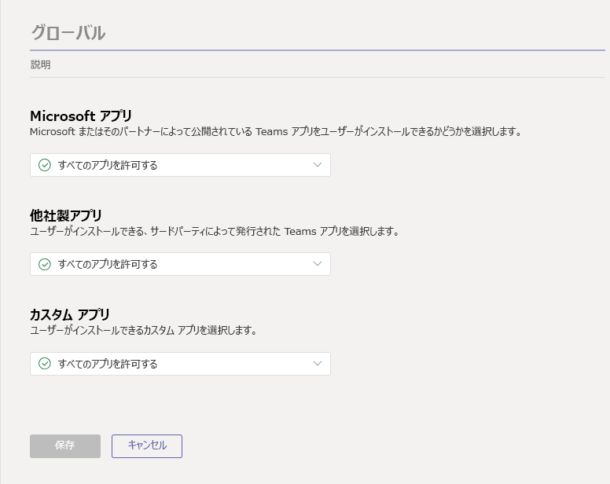
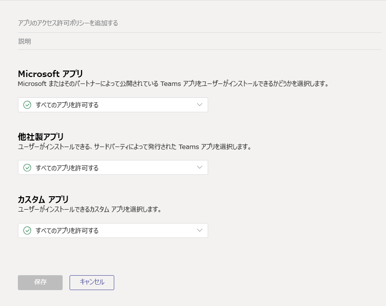

# <a name="manage-app-permission-policies-in-microsoft-teams"></a><span data-ttu-id="a93ad-103">Microsoft Teams のアプリのアクセス許可ポリシーを管理する</span><span class="sxs-lookup"><span data-stu-id="a93ad-103">Manage app permission policies in Microsoft Teams</span></span>

<span data-ttu-id="a93ad-104">管理者は、アプリのアクセス許可ポリシーを使って、組織内の Microsoft Teams ユーザーが利用できるアプリを制御することができます。</span><span class="sxs-lookup"><span data-stu-id="a93ad-104">As an admin, you can use app permission policies to control what apps are available to Microsoft Teams users in your organization.</span></span> <span data-ttu-id="a93ad-105">Microsoft、サードパーティ、組織によって公開されたすべてのアプリまたは特定のアプリを許可またはブロックすることができます。</span><span class="sxs-lookup"><span data-stu-id="a93ad-105">You can allow or block all apps or specific apps published by Microsoft, third-parties, and your organization.</span></span> <span data-ttu-id="a93ad-106">アプリをブロックすると、ユーザーは Teams app store からアプリをインストールできなくなります。</span><span class="sxs-lookup"><span data-stu-id="a93ad-106">When you block an app, users are unable to install it from the Teams app store.</span></span>

<span data-ttu-id="a93ad-107">アプリのアクセス許可ポリシーは、Microsoft Teams 管理センターで管理します。</span><span class="sxs-lookup"><span data-stu-id="a93ad-107">You manage app permission policies in the Microsoft Teams admin center.</span></span> <span data-ttu-id="a93ad-108">組織全体の設定を適用したり、グローバル (組織全体の既定) ポリシーを使用したり、個々のユーザーまたはグループ内のユーザーにカスタムポリシーを作成して割り当てることができます。</span><span class="sxs-lookup"><span data-stu-id="a93ad-108">You can apply settings org-wide, use the global (Org-wide default) policy, and create and assign custom policies to individual users or users in a group.</span></span>  



> [!NOTE]
> <span data-ttu-id="a93ad-110">組織内のユーザーは、カスタムポリシーを作成して割り当てる場合を除き、自動的にグローバルポリシーを取得します。</span><span class="sxs-lookup"><span data-stu-id="a93ad-110">Users in your organization will automatically get the global policy unless you create and assign a custom policy.</span></span> <span data-ttu-id="a93ad-111">組織全体のアプリ設定は、グローバルポリシーや、作成してユーザーに割り当てるカスタムポリシーを上書きします。</span><span class="sxs-lookup"><span data-stu-id="a93ad-111">Org-wide app settings override the global policy and any custom policies that you create and assign to users.</span></span>

<span data-ttu-id="a93ad-112">組織が既に Teams に登録されている場合は、Microsoft 365 管理センターの**テナント全体の設定**で構成したアプリ設定が、組織全体のアプリの設定に反映されます。</span><span class="sxs-lookup"><span data-stu-id="a93ad-112">If your organization is already on Teams, the app settings you configured in **Tenant-wide settings** in the Microsoft 365 admin center are reflected in org-wide app settings.</span></span> <span data-ttu-id="a93ad-113">チームを初めて使い始めたばかりの場合は、既定ではすべてのアプリがグローバルポリシーで許可されています。</span><span class="sxs-lookup"><span data-stu-id="a93ad-113">If you're new to Teams and just getting started, by default, all apps are allowed in the global policy.</span></span> <span data-ttu-id="a93ad-114">これには、Microsoft、サードパーティ、組織によって公開されたアプリが含まれます。</span><span class="sxs-lookup"><span data-stu-id="a93ad-114">This includes apps published by Microsoft, third-parties, and your organization.</span></span>

<span data-ttu-id="a93ad-115">たとえば、すべてのサードパーティ製のアプリをブロックして、組織内の HR チーム向けに Microsoft が提供する特定のアプリを許可する必要があるとします。</span><span class="sxs-lookup"><span data-stu-id="a93ad-115">Say, for example, you want to block all third-party apps and allow specific apps from Microsoft for the HR team in your organization.</span></span> <span data-ttu-id="a93ad-116">HR アプリのアクセス許可ポリシーという名前のカスタムポリシーを作成し、必要なアプリをブロックおよび許可するように設定し、人事チームのユーザーに割り当てます。</span><span class="sxs-lookup"><span data-stu-id="a93ad-116">You would create a custom policy named HR App Permission Policy, set it to block and allow the apps that you want, and then assign it to users on the HR team.</span></span>

## <a name="manage-org-wide-app-settings"></a><span data-ttu-id="a93ad-117">組織全体のアプリ設定を管理する</span><span class="sxs-lookup"><span data-stu-id="a93ad-117">Manage org-wide app settings</span></span>

<span data-ttu-id="a93ad-118">組織全体で利用可能なアプリを管理するには、組織全体のアプリ設定を使います。</span><span class="sxs-lookup"><span data-stu-id="a93ad-118">Use org-wide app settings to control which apps are available across your organization.</span></span> <span data-ttu-id="a93ad-119">組織全体のアプリの設定では、すべてのユーザーに対する動作が管理され、ユーザーに割り当てられている他のアプリのアクセス許可ポリシーは上書きされます。</span><span class="sxs-lookup"><span data-stu-id="a93ad-119">Org-wide app settings govern the behavior for all users and override any other app permission policies assigned to users.</span></span> <span data-ttu-id="a93ad-120">これらを使って、悪意のあるアプリや問題のあるアプリを制御することができます。</span><span class="sxs-lookup"><span data-stu-id="a93ad-120">You can use them to control malicious or problematic apps.</span></span>

1. <span data-ttu-id="a93ad-121">Microsoft Teams 管理センターの左のナビゲーションで、[**チームアプリ** > の**アクセス許可ポリシー**] に移動します。</span><span class="sxs-lookup"><span data-stu-id="a93ad-121">In the left navigation of the Microsoft Teams admin center, go to **Teams apps** > **Permission policies**.</span></span>
2. <span data-ttu-id="a93ad-122">[**組織全体の設定**] を選択します。</span><span class="sxs-lookup"><span data-stu-id="a93ad-122">Select **Org-wide settings**.</span></span> <span data-ttu-id="a93ad-123">次に、パネルで設定を構成することができます。</span><span class="sxs-lookup"><span data-stu-id="a93ad-123">You can then configure the settings you want in the panel.</span></span> 
    <span data-ttu-id="a93ad-124"></span><span class="sxs-lookup"><span data-stu-id="a93ad-124"></span></span>
3. <span data-ttu-id="a93ad-125">サード**パーティ**製のアプリで、次の設定を有効または無効にして、サードパーティ製のアプリへのアクセスを制御します。</span><span class="sxs-lookup"><span data-stu-id="a93ad-125">Under **Third-party apps**, turn off or turn on these settings to control access to third-party apps:</span></span>

    - <span data-ttu-id="a93ad-126">**Teams でサードパーティまたはカスタムアプリを許可する**: ユーザーがサードパーティアプリを使うことができるか、カスタムアプリを使用できるかを制御します。</span><span class="sxs-lookup"><span data-stu-id="a93ad-126">**Allow third-party or custom apps in Teams**: This controls whether users can use third-party or custom apps.</span></span>
    - <span data-ttu-id="a93ad-127">**既定でストアに公開**されている新しいサードパーティのアプリを許可します。これは、teams app store に公開された新しいサードパーティアプリが teams で自動的に使用できるようになるかどうかを制御します。</span><span class="sxs-lookup"><span data-stu-id="a93ad-127">**Allow any new third-party apps published to the store by default**: This controls whether new third-party apps that are published to the Teams app store become automatically available in Teams.</span></span> <span data-ttu-id="a93ad-128">このオプションを設定するには、サードパーティ製のアプリを許可する必要があります。</span><span class="sxs-lookup"><span data-stu-id="a93ad-128">You can only set this option if you allow third-party apps.</span></span>

4. <span data-ttu-id="a93ad-129">[**カスタムアプリ**] の下で、[**カスタムアプリとの対話を許可する**] をオンまたはオフにします。</span><span class="sxs-lookup"><span data-stu-id="a93ad-129">Under **Custom apps**, turn off or turn on **Allow interaction with custom apps**.</span></span> <span data-ttu-id="a93ad-130">この設定は、ユーザーがカスタム (サイドローディング) アプリを操作できるかどうかを制御します。</span><span class="sxs-lookup"><span data-stu-id="a93ad-130">This setting controls whether users can interact with custom (sideloaded) apps.</span></span> <span data-ttu-id="a93ad-131">これは、ユーザーがカスタムアプリを*アップロード*することを許可することとは異なります。</span><span class="sxs-lookup"><span data-stu-id="a93ad-131">Keep in mind that this is different from allowing users to *upload* custom apps.</span></span>
5. <span data-ttu-id="a93ad-132">[**ブロックするアプリ**] で、組織全体でブロックするアプリを検索して追加します。</span><span class="sxs-lookup"><span data-stu-id="a93ad-132">Under **Blocked apps**, search for and add the apps that you want to block across your organization.</span></span> <span data-ttu-id="a93ad-133">テナントアプリカタログまたは Teams app store からアプリを選ぶことができます。</span><span class="sxs-lookup"><span data-stu-id="a93ad-133">You can choose apps from the tenant app catalog or the Teams app store.</span></span>
6. <span data-ttu-id="a93ad-134">組織全体のアプリ設定を有効にするには、[**保存**] をクリックします。</span><span class="sxs-lookup"><span data-stu-id="a93ad-134">Click **Save** for org-wide app settings to take effect.</span></span>

## <a name="create-a-custom-app-permission-policy"></a><span data-ttu-id="a93ad-135">カスタムアプリのアクセス許可ポリシーを作成する</span><span class="sxs-lookup"><span data-stu-id="a93ad-135">Create a custom app permission policy</span></span>

<span data-ttu-id="a93ad-136">組織内のユーザーグループごとに使用できるアプリを制御する場合は、1つ以上のカスタムアプリのアクセス許可ポリシーを作成して割り当てます。</span><span class="sxs-lookup"><span data-stu-id="a93ad-136">If you want to control the apps that are available for different groups of users in your organization, create and assign one or more custom app permission policies.</span></span> <span data-ttu-id="a93ad-137">Microsoft、サードパーティ、または組織によってアプリが公開されるかどうかに基づいて、個別のカスタムポリシーを作成して割り当てることができます。</span><span class="sxs-lookup"><span data-stu-id="a93ad-137">You can create and assign separate custom policies based on whether apps are published by Microsoft, third-parties, or your organization.</span></span> <span data-ttu-id="a93ad-138">組織全体の設定でサードパーティ製のアプリが無効になっている場合は、カスタムポリシーを作成した後に変更することはできないことを知っておくことが重要です。</span><span class="sxs-lookup"><span data-stu-id="a93ad-138">It's important to know that after you create a custom policy, you can't change it if third-party apps are disabled in org-wide settings.</span></span> 

1. <span data-ttu-id="a93ad-139">Microsoft Teams 管理センターの左のナビゲーションで、[**チームアプリ** > の**アクセス許可ポリシー**] に移動します。</span><span class="sxs-lookup"><span data-stu-id="a93ad-139">In the left navigation of the Microsoft Teams admin center, go to **Teams apps** > **Permission policies**.</span></span>
2. <span data-ttu-id="a93ad-140">[**追加**] をクリックします。</span><span class="sxs-lookup"><span data-stu-id="a93ad-140">Click **Add**.</span></span>
    <span data-ttu-id="a93ad-141"></span><span class="sxs-lookup"><span data-stu-id="a93ad-141"></span></span>
3. <span data-ttu-id="a93ad-142">ポリシーの名前と説明を入力します。</span><span class="sxs-lookup"><span data-stu-id="a93ad-142">Enter a name and description for the policy.</span></span>
4. <span data-ttu-id="a93ad-143">[ **Microsoft アプリ**]、[**サードパーティ製アプリ**]、[**テナントアプリ**] の下で、次のいずれかを選択します。</span><span class="sxs-lookup"><span data-stu-id="a93ad-143">Under **Microsoft apps**, **Third-party apps**, and **Tenant apps**, select one of the following:</span></span>

    - <span data-ttu-id="a93ad-144">**すべてのアプリを許可する**</span><span class="sxs-lookup"><span data-stu-id="a93ad-144">**Allow all apps**</span></span>
    - <span data-ttu-id="a93ad-145">**特定のアプリを許可し、他のユーザーをブロックする**</span><span class="sxs-lookup"><span data-stu-id="a93ad-145">**Allow specific apps and block all others**</span></span>
    - <span data-ttu-id="a93ad-146">**特定のアプリをブロックし、他のユーザーをすべて許可する**</span><span class="sxs-lookup"><span data-stu-id="a93ad-146">**Block specific apps and allow all others**</span></span>
    - <span data-ttu-id="a93ad-147">**すべてのアプリをブロックする**</span><span class="sxs-lookup"><span data-stu-id="a93ad-147">**Block all apps**</span></span>

5. <span data-ttu-id="a93ad-148">**[特定のアプリを許可**する] を選んで他のアプリをブロックする場合は、許可するアプリを追加します。</span><span class="sxs-lookup"><span data-stu-id="a93ad-148">If you selected **Allow specific apps and block others**, add the apps that you want to allow:</span></span>

    1. <span data-ttu-id="a93ad-149">[**アプリの許可**] を選びます。</span><span class="sxs-lookup"><span data-stu-id="a93ad-149">Select **Allow apps**.</span></span>
    1. <span data-ttu-id="a93ad-150">許可するアプリを検索し、[**追加**] をクリックします。</span><span class="sxs-lookup"><span data-stu-id="a93ad-150">Search for the apps that you want to allow, and then click **Add**.</span></span> <span data-ttu-id="a93ad-151">検索結果は、アプリの発行元 (**Microsoft アプリ**、**サードパーティ製のアプリ**、**テナントアプリ**) にフィルター処理されます。</span><span class="sxs-lookup"><span data-stu-id="a93ad-151">The search results are filtered to the app publisher (**Microsoft apps**, **Third-party apps**, or **Tenant apps**).</span></span>
    1. <span data-ttu-id="a93ad-152">アプリの一覧を選択したら、[**許可**] をクリックします。</span><span class="sxs-lookup"><span data-stu-id="a93ad-152">When you've chosen the list of apps, click **Allow**.</span></span>

6. <span data-ttu-id="a93ad-153">同様に、[**特定のアプリをブロック**する] を選択した場合は、ブロックするアプリを検索して追加します。</span><span class="sxs-lookup"><span data-stu-id="a93ad-153">Similarly, if you selected **Block specific apps and allow all others**, search for and add the apps that you want to block.</span></span>
7. <span data-ttu-id="a93ad-154">[**保存**] をクリックします。</span><span class="sxs-lookup"><span data-stu-id="a93ad-154">Click **Save**.</span></span>

## <a name="edit-an-app-permission-policy"></a><span data-ttu-id="a93ad-155">アプリのアクセス許可ポリシーを編集する</span><span class="sxs-lookup"><span data-stu-id="a93ad-155">Edit an app permission policy</span></span>

<span data-ttu-id="a93ad-156">Microsoft Teams 管理センターを使用して、作成するグローバルポリシーやカスタムポリシーなどのポリシーを編集できます。</span><span class="sxs-lookup"><span data-stu-id="a93ad-156">You can use the Microsoft Teams admin center to edit a policy, including the global policy and custom policies that you create.</span></span>

1. <span data-ttu-id="a93ad-157">Microsoft Teams 管理センターの左のナビゲーションで、[**チームアプリ** > の**アクセス許可ポリシー**] に移動します。</span><span class="sxs-lookup"><span data-stu-id="a93ad-157">In the left navigation of the Microsoft Teams admin center, go to **Teams apps** > **Permission policies**.</span></span>
2. <span data-ttu-id="a93ad-158">ポリシー名の左側をクリックしてポリシーを選択し、[**編集**] をクリックします。</span><span class="sxs-lookup"><span data-stu-id="a93ad-158">Select the policy by clicking to the left of the policy name, and then click **Edit**.</span></span>
3. <span data-ttu-id="a93ad-159">ここで、必要な変更を行います。</span><span class="sxs-lookup"><span data-stu-id="a93ad-159">From here, make the changes that you want.</span></span> <span data-ttu-id="a93ad-160">アプリの発行元に基づいて設定を管理し、許可/禁止の設定に基づいてアプリを追加および削除することができます。</span><span class="sxs-lookup"><span data-stu-id="a93ad-160">You can manage settings based on the app publisher and add and remove apps based on the allow/block setting.</span></span>
4. <span data-ttu-id="a93ad-161">[**保存**] をクリックします。</span><span class="sxs-lookup"><span data-stu-id="a93ad-161">Click **Save**.</span></span>

## <a name="assign-a-custom-app-permission-policy-to-users"></a><span data-ttu-id="a93ad-162">ユーザーにカスタムアプリのアクセス許可ポリシーを割り当てる</span><span class="sxs-lookup"><span data-stu-id="a93ad-162">Assign a custom app permission policy to users</span></span>

<span data-ttu-id="a93ad-163">Microsoft Teams 管理センターを使用して、ユーザー設定のポリシーを1人または複数のユーザーに割り当てたり、Skype for Business PowerShell モジュールを使って、セキュリティグループまたは配布グループ内のすべてのユーザーなど、カスタムポリシーをユーザーのグループに割り当てることができます。</span><span class="sxs-lookup"><span data-stu-id="a93ad-163">You can use the Microsoft Teams admin center to assign a custom policy to one or more users or the Skype for Business PowerShell module to assign a custom policy to groups of users, such as all users in a security group or distribution group.</span></span>

### <a name="assign-a-custom-app-permission-policy-to-a-user"></a><span data-ttu-id="a93ad-164">ユーザーにカスタムアプリのアクセス許可ポリシーを割り当てる</span><span class="sxs-lookup"><span data-stu-id="a93ad-164">Assign a custom app permission policy to a user</span></span>

1. <span data-ttu-id="a93ad-165">Microsoft Teams 管理センターの左のナビゲーションで、[**ユーザー**] に移動します。</span><span class="sxs-lookup"><span data-stu-id="a93ad-165">In the left navigation of the Microsoft Teams admin center, go to **Users**.</span></span>
2. <span data-ttu-id="a93ad-166">ユーザー名の左側をクリックしてユーザーを選び、[**設定の編集**] をクリックします。</span><span class="sxs-lookup"><span data-stu-id="a93ad-166">Select the user by clicking to the left of the user name, and then click **Edit settings**.</span></span>
3. <span data-ttu-id="a93ad-167">[**アプリのアクセス許可ポリシー**] で、割り当てるアプリのアクセス許可ポリシーを選択し、[**適用**] をクリックします。</span><span class="sxs-lookup"><span data-stu-id="a93ad-167">Under **App permission policy**, select the app permission policy you want to assign, and then click **Apply**.</span></span>

<span data-ttu-id="a93ad-168">一度に複数のユーザーにポリシーを割り当てるには、「[チームのユーザー設定を一括](edit-user-settings-in-bulk.md)して編集する」を参照してください。</span><span class="sxs-lookup"><span data-stu-id="a93ad-168">To assign a policy to multiple users at a time, see [Edit Teams user settings in bulk](edit-user-settings-in-bulk.md).</span></span>

<span data-ttu-id="a93ad-169">または、次の操作も行うことができます。</span><span class="sxs-lookup"><span data-stu-id="a93ad-169">Or, you can also do the following:</span></span>

1. <span data-ttu-id="a93ad-170">Microsoft Teams 管理センターの左のナビゲーションで、[**チームアプリ** > の**アクセス許可ポリシー**] に移動します。</span><span class="sxs-lookup"><span data-stu-id="a93ad-170">In the left navigation of the Microsoft Teams admin center, go to **Teams apps** > **Permission policies**.</span></span>
2. <span data-ttu-id="a93ad-171">ポリシー名の左側をクリックして、ポリシーを選択します。</span><span class="sxs-lookup"><span data-stu-id="a93ad-171">Select the policy by clicking to the left of the policy name.</span></span>
3. <span data-ttu-id="a93ad-172">[**ユーザーの管理**] を選びます。</span><span class="sxs-lookup"><span data-stu-id="a93ad-172">Select **Manage users**.</span></span>
4. <span data-ttu-id="a93ad-173">[**ユーザーの管理**] ウィンドウで、[表示名] または [ユーザー名] でユーザーを検索し、名前を選択して [**追加**] をクリックします。</span><span class="sxs-lookup"><span data-stu-id="a93ad-173">In the **Manage users** pane, search for the user by display name or by user name, select the name, and then click **Add**.</span></span> <span data-ttu-id="a93ad-174">追加するユーザーごとに、この手順を繰り返します。</span><span class="sxs-lookup"><span data-stu-id="a93ad-174">Repeat this step for each user that you want to add.</span></span>
5. <span data-ttu-id="a93ad-175">ユーザーの追加が完了したら、[**保存**] をクリックします。</span><span class="sxs-lookup"><span data-stu-id="a93ad-175">When you're finished adding users, click **Save**.</span></span>

### <a name="assign-a-custom-app-permission-policy-to-users-in-a-group"></a><span data-ttu-id="a93ad-176">カスタムアプリのアクセス許可ポリシーをグループ内のユーザーに割り当てる</span><span class="sxs-lookup"><span data-stu-id="a93ad-176">Assign a custom app permission policy to users in a group</span></span>

<span data-ttu-id="a93ad-177">カスタムアプリのアクセス許可ポリシーは、既に指定した複数のユーザーに割り当てることができます。</span><span class="sxs-lookup"><span data-stu-id="a93ad-177">You may want to assign a custom app permission policy to multiple users that you’ve already identified.</span></span> <span data-ttu-id="a93ad-178">たとえば、セキュリティグループ内のすべてのユーザーにポリシーを割り当てることができます。</span><span class="sxs-lookup"><span data-stu-id="a93ad-178">For example, you may want to assign a policy to all users in a security group.</span></span> <span data-ttu-id="a93ad-179">これを行うには、Azure Active Directory PowerShell for Graph モジュールと Skype for Business PowerShell モジュールに接続します。</span><span class="sxs-lookup"><span data-stu-id="a93ad-179">You can do this by connecting to the Azure Active Directory PowerShell for Graph module and the Skype for Business PowerShell module.</span></span> <span data-ttu-id="a93ad-180">PowerShell を使用して Teams を管理する方法の詳細については、「[Teams での PowerShell の概要](teams-powershell-overview.md)」を参照してください。</span><span class="sxs-lookup"><span data-stu-id="a93ad-180">For more information about using PowerShell to manage Teams, see [Teams PowerShell Overview](teams-powershell-overview.md).</span></span>

<span data-ttu-id="a93ad-181">この例では、Contoso 製薬 HR プロジェクトグループ内のすべてのユーザーに HR アプリのアクセス許可ポリシーと呼ばれるカスタムアプリのアクセス許可ポリシーを割り当てます。</span><span class="sxs-lookup"><span data-stu-id="a93ad-181">In this example, we assign a custom app permission policy called HR App Permission Policy to all users in the Contoso Pharmaceuticals HR Project group.</span></span>  

> [!NOTE]
> <span data-ttu-id="a93ad-182">「[単一の Windows PowerShell ウィンドウですべての Office 365 サービスに接続する](https://docs.microsoft.com/office365/enterprise/powershell/connect-to-all-office-365-services-in-a-single-windows-powershell-window)」の手順に従って、必ず最初に Azure Active Directory PowerShell for Graph モジュールと Skype for Business PowerShell モジュールに接続してください。</span><span class="sxs-lookup"><span data-stu-id="a93ad-182">Make sure you first connect to the Azure Active Directory PowerShell for Graph module and Skype for Business PowerShell module by following the steps in [Connect to all Office 365 services in a single Windows PowerShell window](https://docs.microsoft.com/office365/enterprise/powershell/connect-to-all-office-365-services-in-a-single-windows-powershell-window).</span></span>

<span data-ttu-id="a93ad-183">特定のグループの GroupObjectId を取得します。</span><span class="sxs-lookup"><span data-stu-id="a93ad-183">Get the GroupObjectId of the particular group.</span></span>
```
$group = Get-AzureADGroup -SearchString "Contoso Pharmaceuticals HR Project"
```
<span data-ttu-id="a93ad-184">指定したグループのメンバーを取得します。</span><span class="sxs-lookup"><span data-stu-id="a93ad-184">Get the members of the specified group.</span></span>
```
$members = Get-AzureADGroupMember -ObjectId $group.ObjectId -All $true | Where-Object {$_.ObjectType -eq "User"}
```
<span data-ttu-id="a93ad-185">グループ内のすべてのユーザーに特定のアプリのアクセス許可ポリシーを割り当てます。</span><span class="sxs-lookup"><span data-stu-id="a93ad-185">Assign all users in the group to a particular app permission policy.</span></span> <span data-ttu-id="a93ad-186">この例では、HR アプリのアクセス許可ポリシーです。</span><span class="sxs-lookup"><span data-stu-id="a93ad-186">In this example, it's HR App Permission Policy.</span></span>
```
$members | ForEach-Object { Grant-CsTeamsAppPermissionPolicy -PolicyName "HR App Permission Policy" -Identity $_.EmailAddress}
``` 
<span data-ttu-id="a93ad-187">グループ内のメンバー数によっては、このコマンドの実行に数分かかる場合があります。</span><span class="sxs-lookup"><span data-stu-id="a93ad-187">Depending on the number of members in the group, this command may take several minutes to execute.</span></span>

## <a name="faq"></a><span data-ttu-id="a93ad-188">FAQ</span><span class="sxs-lookup"><span data-stu-id="a93ad-188">FAQ</span></span>

### <a name="working-with-app-permission-policies"></a><span data-ttu-id="a93ad-189">アプリのアクセス許可ポリシーを使用する</span><span class="sxs-lookup"><span data-stu-id="a93ad-189">Working with app permission policies</span></span>

#### <a name="can-i-control-line-of-business-lob-apps"></a><span data-ttu-id="a93ad-190">基幹業務 (LOB) アプリを制御することはできますか?</span><span class="sxs-lookup"><span data-stu-id="a93ad-190">Can I control line of business (LOB) apps?</span></span>
<span data-ttu-id="a93ad-191">はい、アプリのアクセス許可ポリシーを使って、カスタム (LOB) アプリのロールアウトと配布を制御することができます。</span><span class="sxs-lookup"><span data-stu-id="a93ad-191">Yes, you can use app permission policies to control the rollout and distribution of custom (LOB) apps.</span></span> <span data-ttu-id="a93ad-192">ユーザー設定のポリシーを作成するか、またはグローバルポリシーを編集して、組織のニーズに基づいてカスタムアプリを許可またはブロックすることができます。</span><span class="sxs-lookup"><span data-stu-id="a93ad-192">You can create a custom policy or edit the global policy to allow or block custom apps based on the needs of your organization.</span></span>

#### <a name="how-do-app-permission-policies-relate-to-pinned-apps-and-app-setup-policies"></a><span data-ttu-id="a93ad-193">アプリのアクセス許可ポリシーは、固定されたアプリとアプリのセットアップポリシーにどのように関連していますか?</span><span class="sxs-lookup"><span data-stu-id="a93ad-193">How do app permission policies relate to pinned apps and app setup policies?</span></span>

<span data-ttu-id="a93ad-194">アプリのセットアップポリシーは、アプリのアクセス許可ポリシーと一緒に使うことができます。</span><span class="sxs-lookup"><span data-stu-id="a93ad-194">You can use app setup policies together with app permission policies.</span></span> <span data-ttu-id="a93ad-195">事前にピン留めされたアプリは、ユーザーに対して有効になっているアプリのセットから選択されます。</span><span class="sxs-lookup"><span data-stu-id="a93ad-195">Pre-pinned apps are selected from the set of enabled apps for a user.</span></span> <span data-ttu-id="a93ad-196">さらに、ユーザーがアプリのセットアップポリシーでアプリをブロックするアプリのアクセス許可ポリシーを持っている場合、そのアプリは Teams に表示されません。</span><span class="sxs-lookup"><span data-stu-id="a93ad-196">Additionally, if a user has an app permission policy that blocks an app in their app setup policy, that app won't appear in Teams.</span></span>

#### <a name="can-i-use-app-permission-policies-to-restrict-uploading-custom-apps-also-known-as-sideloading"></a><span data-ttu-id="a93ad-197">アプリのアクセス許可ポリシーを使って、(サイドローディングとも呼ばれる) カスタムアプリのアップロードを制限することはできますか?</span><span class="sxs-lookup"><span data-stu-id="a93ad-197">Can I use app permission policies to restrict uploading custom apps (also known as sideloading)?</span></span>

<span data-ttu-id="a93ad-198">アプリのアクセス許可ポリシーで組織全体の設定を使用して、組織のカスタムアプリのアップロードを制限します。</span><span class="sxs-lookup"><span data-stu-id="a93ad-198">Use org-wide settings in app permission policies to restrict uploading custom apps for your organization.</span></span>  

<span data-ttu-id="a93ad-199">特定のユーザーに対してカスタムアプリのアップロードを制限するには、カスタムアプリポリシーを使います (近日公開)。</span><span class="sxs-lookup"><span data-stu-id="a93ad-199">To restrict specific users from uploading custom apps, use custom app policies (coming soon).</span></span> <span data-ttu-id="a93ad-200">詳細については、「 [Teams でカスタムアプリポリシーと設定を管理](teams-custom-app-policies-and-settings.md)する」を参照してください。</span><span class="sxs-lookup"><span data-stu-id="a93ad-200">To learn more, see [Manage custom app policies and settings in Teams](teams-custom-app-policies-and-settings.md).</span></span>

#### <a name="does-blocking-an-app-apply-to-teams-mobile-clients"></a><span data-ttu-id="a93ad-201">アプリのブロックは Teams のモバイルクライアントに適用されますか?</span><span class="sxs-lookup"><span data-stu-id="a93ad-201">Does blocking an app apply to Teams mobile clients?</span></span>

<span data-ttu-id="a93ad-202">はい。アプリをブロックすると、そのアプリはすべてのチームクライアントでブロックされます。</span><span class="sxs-lookup"><span data-stu-id="a93ad-202">Yes, when you block an app, that app is blocked across all Teams clients.</span></span>  

### <a name="user-experience"></a><span data-ttu-id="a93ad-203">ユーザー エクスペリエンス</span><span class="sxs-lookup"><span data-stu-id="a93ad-203">User experience</span></span>

#### <a name="what-does-a-user-experience-when-an-app-is-blocked"></a><span data-ttu-id="a93ad-204">アプリがブロックされると、ユーザーエクスペリエンスはどうなりますか?</span><span class="sxs-lookup"><span data-stu-id="a93ad-204">What does a user experience when an app is blocked?</span></span>

<span data-ttu-id="a93ad-205">ブロックされたアプリやその機能 (ボット、タブ、メッセージング拡張機能など) をユーザーが操作することはできません。</span><span class="sxs-lookup"><span data-stu-id="a93ad-205">Users can't interact with a blocked app or its capabilities, such bots, tabs, and messaging extensions.</span></span> <span data-ttu-id="a93ad-206">チームやグループチャットなどの共有コンテキストでも、ボットはそのコンテキストの参加者全員にメッセージを送信できます。</span><span class="sxs-lookup"><span data-stu-id="a93ad-206">In a shared context, such as a team or group chat, bots can still send messages to all participants of that context.</span></span> <span data-ttu-id="a93ad-207">アプリがブロックされると、Teams によってユーザーにユーザーが示されます。</span><span class="sxs-lookup"><span data-stu-id="a93ad-207">Teams indicates to the user when an app is blocked.</span></span>

<span data-ttu-id="a93ad-208">たとえば、アプリがブロックされると、ユーザーは次のいずれも実行できません。</span><span class="sxs-lookup"><span data-stu-id="a93ad-208">For example, when an app is blocked, users can't do any of the following:</span></span>

- <span data-ttu-id="a93ad-209">アプリを個人的に、またはチャットやチームに追加する</span><span class="sxs-lookup"><span data-stu-id="a93ad-209">Add the app personally or to a chat or team</span></span>
- <span data-ttu-id="a93ad-210">アプリのボットにメッセージを送信する</span><span class="sxs-lookup"><span data-stu-id="a93ad-210">Send messages to the app’s bot</span></span>
- <span data-ttu-id="a93ad-211">操作可能なメッセージなど、情報をアプリに送り戻すボタンアクションを実行します。</span><span class="sxs-lookup"><span data-stu-id="a93ad-211">Perform button actions that send information back to the app, such as actionable messages</span></span>  
- <span data-ttu-id="a93ad-212">アプリのタブを表示する</span><span class="sxs-lookup"><span data-stu-id="a93ad-212">View the app’s tab</span></span>
- <span data-ttu-id="a93ad-213">通知を受信するためのコネクタを設定する</span><span class="sxs-lookup"><span data-stu-id="a93ad-213">Set up connectors to receive notifications</span></span>
- <span data-ttu-id="a93ad-214">アプリのメッセージング拡張機能を使用する</span><span class="sxs-lookup"><span data-stu-id="a93ad-214">Use the app’s messaging extension</span></span>

<span data-ttu-id="a93ad-215">従来のポータルでは、組織レベルでのアプリの制御が許可されています。つまり、アプリがブロックされると、組織内のすべてのユーザーに対してブロックされます。</span><span class="sxs-lookup"><span data-stu-id="a93ad-215">The legacy portal allowed controlling apps at the organization level, which means when an app is blocked, it's blocked for all users in the organization.</span></span> <span data-ttu-id="a93ad-216">アプリのアクセス許可ポリシーでは、組織全体のアプリの設定はまったく同じように動作します。</span><span class="sxs-lookup"><span data-stu-id="a93ad-216">The org-wide app setting in app permission policies works exactly the same way.</span></span>

<span data-ttu-id="a93ad-217">特定のユーザーに割り当てられているアプリのアクセス許可ポリシーについては、ボットまたはコネクタ機能を備えたアプリが許可され、その後ブロックされた場合に、共有コンテキストの一部のユーザーのみがアプリを許可した場合、そのアプリに対するアクセス許可を持たないグループチャットまたはチャネルのメンバー ボットまたはコネクタによって投稿されたが、操作できないメッセージ履歴とメッセージを表示できます。</span><span class="sxs-lookup"><span data-stu-id="a93ad-217">For app permission policies assigned to specific users, if an app with bot or connector capability was allowed and then blocked, and if the app is then allowed only for some users in a shared context, members of a group chat or channel that don't have permission to that app can see the message history and messages that were posted by the bot or connector, but can't interact with it.</span></span>

 ## <a name="related-topics"></a><span data-ttu-id="a93ad-218">関連トピック</span><span class="sxs-lookup"><span data-stu-id="a93ad-218">Related topics</span></span>
- [<span data-ttu-id="a93ad-219">Teams でのアプリの管理設定</span><span class="sxs-lookup"><span data-stu-id="a93ad-219">Admin settings for apps in Teams</span></span>](admin-settings.md)
